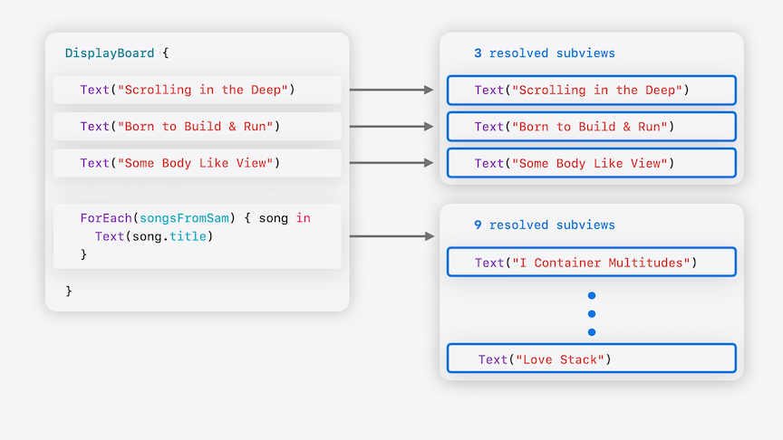
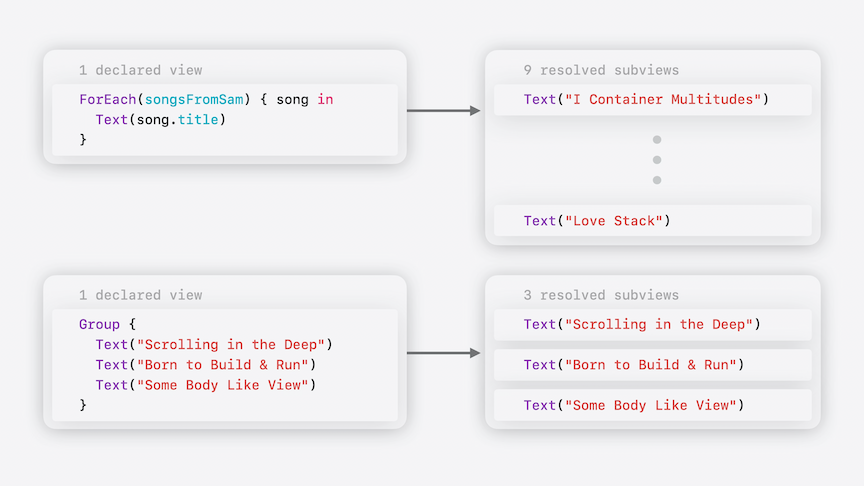
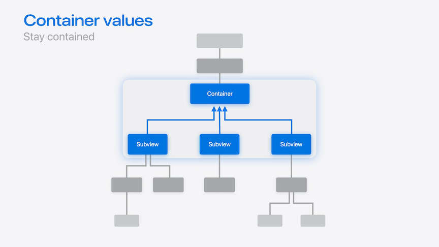

# [**Demystify SwiftUI containers**](https://developer.apple.com/videos/play/wwdc2024-10146)

---

* Container views use a trailing view builder closure to wrap their content
    * View builders allow content to be defined statically
    * Can define content statically, like placing Text views in a List
    * Can define content dynamically, like `ForEach`
    * Some containers support grouping content into sections like headers and footers
    * Some containers have container-specific modifiers, like `.listRowSeparator(.hidden)`

* The talk will use a DisplayBoard app, that starts like this:

```swift
@State private var songs: [Song] = [
  Song("Scrolling in the Deep"),
  Song("Born to Build & Run"),
  Song("Some Body Like View"),
]

var body: some View {
  DisplayBoard(songs) { song in
    Text(song.title)
  }
}

// Insert code snvar data: Data
@ViewBuilder var content: (Data.Element) -> Content

var body: some View {
  DisplayBoardCardLayout {
    ForEach(data) { item in
      CardView {
        content(item)
      }
    }
  }
  .background { BoardBackgroundView() }
}
```

### **Compositions**

* A list can be data driven or manually created

```swift
List {
  Text("Scrolling in the Deep")
  Text("Born to Build & Run")
  Text("Some Body Like View")
}

List(songsFromSam) { song in
  Text(song.title)
}
```

* `List` can also be re-written to use a `ForEach` view

```swift
List {
  Text("Scrolling in the Deep")
  Text("Born to Build & Run")
  Text("Some Body Like View")
}

List {
  ForEach(songsFromSam) { song in
    Text(song.title)
  }
}
```

* By defining the content for both Lists using only views, they can be unified

```swift
List {
  Text("Scrolling in the Deep")
  Text("Born to Build & Run")
  Text("Some Body Like View")

  ForEach(songsFromSam) { song in
    Text(song.title)
  }
}
```

* The DisplayBoard app can be updated to be more flexible by changing the data-driven properties to a single generic view property
    * Use the new `ForEach(subviewOf:)` API to iterate over the subviews of the `content` property
        * Accepts a single view value as input, passes back each of its subviews into the trailing view builder

```swift
// DisplayBoard implementation
// var data: Data <-- replaced
// @ViewBuilder var content: (Data.Element) -> Content <-- replaced
@ViewBuilder var content: Content

var body: some View {
  DisplayBoardCardLayout {
    ForEach(subviewOf: content) { subview in
      CardView {
        subview
      }
    }
  }
  .background { BoardBackgroundView() }
}

DisplayBoard {
  Text("Scrolling in the Deep")
  Text("Born to Build & Run")
  Text("Some Body Like View")

  ForEach(songsFromSam) { song in
    Text(song.title)
  }
}
```

* A subview is a view that is contained within another view
    * Looking at the code above, `DisplayBoard` has four top level subviews - but one of these is a `ForEach`
    * The `ForEach` represents a collection of views generated for data - in this case, nine subviews
    * This gives a total of 12 subviews: three static and nine dynamic



* The four top level subviews (including the `ForEach`) are **Declared subviews**
* The 12 total subviews (3 static, 9 dynamic) are the **Resolved subviews**
    * `Group` is another example of a built-in container that contains resolved subviews
    * `EmptyView()` results in zero resolved subviews
    * When using `if`, depending on the branch, a declared view can result in zero resolved subviews if the condition is not met



* New `Group(subviewsOf:)` API
    * Takes a view as input like `ForEach(subview:)` does
    * Passed back a collection of all the resolved subviews
    * Can reference the `count` property on the returned collection

```swift
@ViewBuilder var content: Content

var body: some View {
  DisplayBoardCardLayout {
    Group(subviewsOf: content) { subviews in
      ForEach(subviews) { subview in
        CardView(
          scale: subviews.count > 15 ? .small : .normal
        ) {
          subview
        }
      }
    }
  }
  .background { BoardBackgroundView() }
}
```

### **Sections**

* `List` supports `Section` (not all containers do)
    * `Section` behaves like a `Group` view, but with extra section-specific metadata
        * Optional headers and footers, for example

```swift
DisplayBoard {
  Section("Matt's Favorites") {
    Text("Scrolling in the Deep")
    Text("Born to Build & Run")
    Text("Some Body Like View")
  }
  Section("Sam's Favorites") {
    ForEach(songsFromSam) { song in
      Text(song.title)
    }
  }
  Section("Sommer's Favorites") {
    ForEach(songsFromSommer) { song in
      Text(song.title)
    }
  }
}
```

* Custom containers require extra support to support sections
    * Start by refactoring the card layout into its own view
    * Reuse the view for each section
    * Use the new `ForEach(sectionOf:)` API to access information for each section
        * Iterates over each section, vending a section configuration into its view builder
        * Each section has a property for its content view, which can be passed to other views
    * With the code below, sections are now displayed next to each other

```swift
@ViewBuilder var content: Content

var body: some View {
  HStack(spacing: 80) {
    ForEach(sectionOf: content) { section in
      DisplayBoardSectionContent {
        section.content
      }
    }
  }
  .background { BoardBackgroundView() }
}

struct DisplayBoardSectionContent<Content: View>: View {
  @ViewBuilder var content: Content
  ...
}
```

* Displaying section headers
    * Can use the `section.header.isEmpty` property to see if a section has a header

```swift
@ViewBuilder var content: Content

var body: some View {
  HStack(spacing: 80) {
    ForEach(sectionOf: content) { section in
      VStack(spacing: 20) {
        if !section.header.isEmpty {
          DisplayBoardSectionHeaderCard { section.header }
        } 
        DisplayBoardSectionContent {
          section.content
        }
        .background { BoardSectionBackgroundView() }
      }
    }
  }
  .background { BoardBackgroundView() }
}
```

### **Customization**

* Container Values
    * New API for building container-specific modifiers
    * New kind of keyed storage, similar to concepts like `Environment` and `Preferences`
    * Unlike Environment values which flow down, and Preferences which flow up, Container values can only be accessed by their direct container



* Defining a container value requires:
    * Creating an extension on `ContainerValues`
        * `@Entry` macro provides syntax for adding new values to SwiftUI keyed storage types
            * Includes Environment values, Focus value, and more
    * Declare a custom view modifier as a convenience for setting the property
        * Passes the property's key path and the new value to set

```swift
extension ContainerValues {
  @Entry var isDisplayBoardCardRejected: Bool = false
}

extension View {
  func displayBoardCardRejected(_ isRejected: Bool) -> some View {
    containerValue(\.isDisplayBoardCardRejected, isRejected)
  }
}
```

* In the section implementation, we can use the `.containerValues` property
    * Can be read from both resolved subviews and the sections
    * Pass the custom value to the `isRejected` parameter on the `CardView`
    * Setting the modifier on an entire section will set it on all of its subviews

```swift
struct DisplayBoardSectionContent<Content: View>: View {
  @ViewBuilder var content: Content

  var body: some View {
    DisplayBoardCardLayout {
      Group(subviewsOf: content) { subviews in
        ForEach(subviews) { subview in
          let values = subview.containerValues
          CardView(
            scale: (subviews.count > 15) ? .small : .normal,
            isRejected: values.isDisplayBoardCardRejected
          ) {
            subview
          }
        }
      }
    }
  }
}

DisplayBoard {
  Section("Matt's Favorites") {
    Text("Scrolling in the Deep")
      .displayBoardCardRejected(true)
    Text("Born to Build & Run")
    Text("Some Body Like View")
  }
  Section("Sam's Favorites") {
    ForEach(songsFromSam) { song in
      Text(song.title)
        .displayBoardCardRejected(song.samHasDibs)
    }
  }
  Section("Sommer's Favorites") {
    ForEach(songsFromSommer) { Text($0.title) }
  }
  .displayBoardCardRejected(true)
}
```
