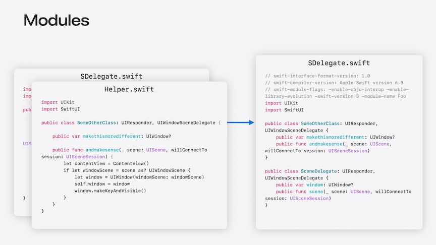
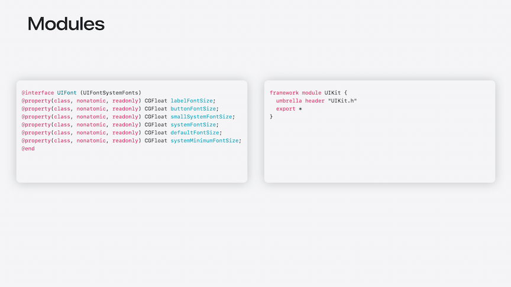
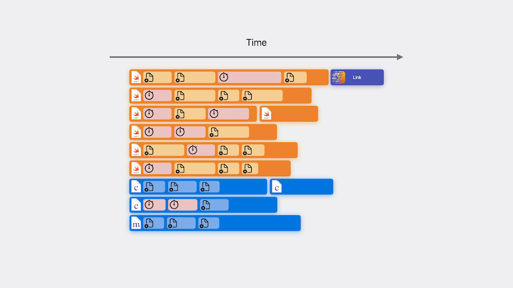
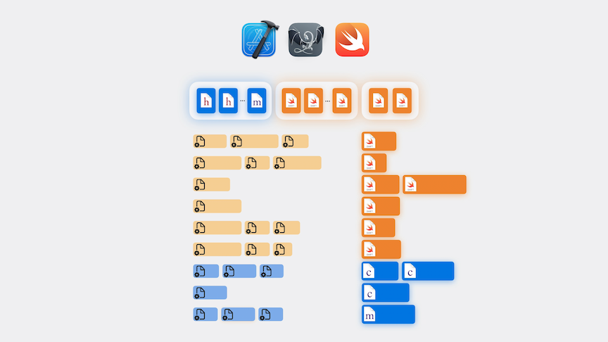
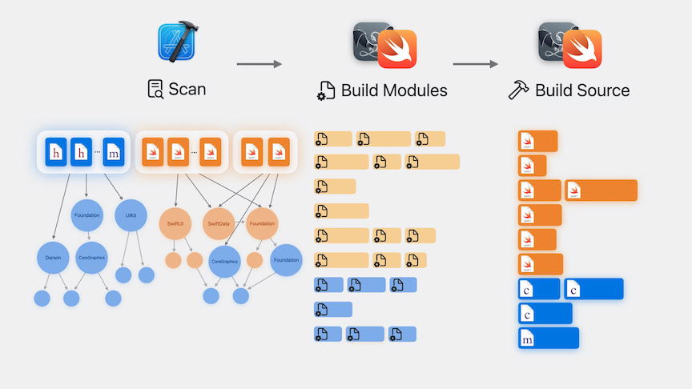
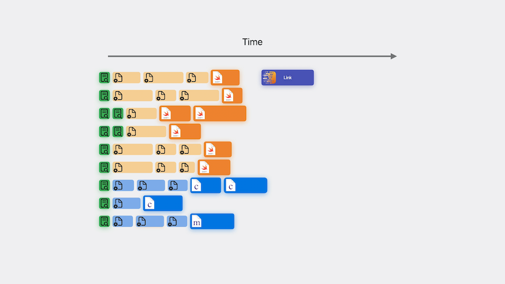
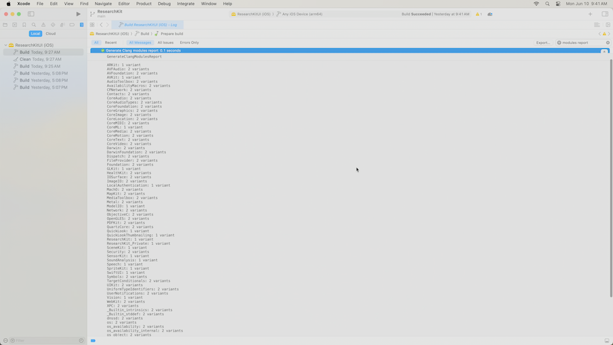
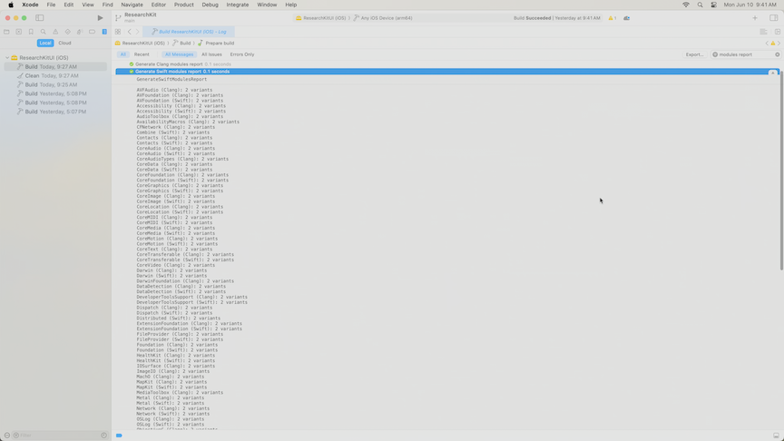

# [**Demystify explicitly built modules**](https://developer.apple.com/videos/play/wwdc2024-10171)

---

### **Modules**

* Modules are units of code distribution describing the interface of a library or a framework
    * All the Swift source files in a single target or framework are part of the same module
    * Modules can also import other modules
    * The Swift compiler takes the external interface you wrote and summarizes it into a textual .swiftinterface file that contains just the interface.

* In Obj-C, the moduels are hand-authored
    * Below is the header file and the module map
        * The module map notes that it is a framework module, and that it is named `UIKit`

* Modules are used whenever your code contains an import of a named module, or the inclusion of a header that belongs to a module
    * Works with Swift `import`
    * In Obj-C, works with `#import`, `@import`
        * Clang transforms `#include` into module imports
* Modules share the parsing of interfaces between source files
    * This is done by compiling each module in isolation into a binary file to be read by the compiler when compiling project sources, then importing the public interface of that module whenever it is referenced
    * In Swift, this is represented by a `*.swiftmodule` file
    * In Clang it's represented as a `*.pcm` (precompiled module file)

### **Using modules**

* When the compiler encounters an import, it first discovers which module that import refers to
    * It then obtains the compiled representation of that module
    * When the compiler encounters @import UIKit, it first finds UIKit’s module map in the SDK
    * It then needs to find the compiled .pcm file for UIKit
* When the `.pcm` file doesn't exist, that brings us to the two high-level ways to build modules
    * Implicitly built modules
    * Explicitly built modules

#### Implicitly built modules

* Compilers coordinate among themselves to manage building modules without the rest of Xcode being aware of their existence
* This is how Swift and Clang have built modules since their introduction
* With implicitly built modules, you can end up with one compilation task implicitly building a module, while another task that also needs that module is blocked, waiting for it to be built
    * This cna happen across many parts of the build

#### Explicitly built modules

* Xcode coordinates with the compilers to discover and build modules.
* Explicitly built modules takes the implicit work of building modules and lifts it up into explicit build system tasks

* Xcode splits up the compilation of each source file into three separate phases
    * Scanning
        * Builds a module graph for the entire project, sharing modules across targets
    * Building modules
        * As it constructs the module graph, it can also start dispatching module compilation tasks
        * Explicit tasks in the build log that are directly provided with the compiled modules they depend on
    * Building the original code
        * The final step is the execution of the original compilation tasks after they have been modified to add the compiled modules they depend on

| Implicit Build Timeline | Explicit Build Timeline |
| ----------------------- | ----------------------- |
|  |  |

* Reliable builds with precise and deterministic sharing of modules
    * The compiler is built the same way every time
    * Build failures can be reproduced just by running the failing task again in isolation
    * No implicit state is maintained elsewhere
    * A Clean Build now rebuilds modules
* More efficient builds as the build system is responsible for scheduling
* Build system cna now pass modules to the debugger speeding up startup
* Debugging Swift
    * Build system can now pass modules to the debugger, speeding up startup
        * Avoids building modules again when the debugger needs to know about Swift types (evaluating `p` or `po`)

### **Module build log**

* In Xcode 16, explicitly built modules are used for all C and Obj-C code
* Can be enabled as a preview for Swift
    * Set`Explicitly Built Modules` to `Yes` in build settings for the project
* The build log will contain main scan tasks
    * Run once for each source file in your project and produce a module import graph for the build system
    * Does not spawn a new process
    * Allows the build system to cache information between source files being scanned
* Second type of task is the compile module task
    * These tasks attached to any specific project or target
    * Instead these are top-level tasks, as they can be shared between targets
    * The build system spawns a separate compiler process for each one, and builds the specified module into a compiled module file
    * This happened during normal compilation in implicitly built modules and has been split out
    * Diagnostics encountered while building modules will be attached here
    * Some modules will be built multiple times, because targets may require different variants of a module to be built
        * The compiler optimizes this list of arguments during scanning to remove those that do not impact how a module is built, including things like unused header search paths

### **Optimize your build**

* After a `Clean Build`, you can run `Product -> Perform Action -> Build with Timing Summary` to collect additional information about build performance
* Multiple module variants are caused by different source files having incompatible build settings
    * For example, a C source file and an Objective-C source file parse some modules very differently
    * Unnecessary module variants create additional work that must be performed by the build
* Common sources of module variants:
    * Additional preprocessor macros
    * Additional language modes (having a single C file mixed with Obj-C)
    * Disabling ARC
* When the Build with Timing Summary is complete, filter the build logs by `modules report`
    * Can view the Clang and Swift modules report

| Clang Modules Report | Swift Modules Report |
| -------------------- | -------------------- |
|  |  |

* To reduce the number of variants, check the build settings that commonly cause them
    * Show the settings (like macros) with `Levels` instead of `Combined` to view the target and project level settings at the same time
    * Move macros from the target level to the project level to reduce variants
    * In general, move build settings as broadly as reasonable in a project
        * Set language standards at the project or workspace level instead of the target level
