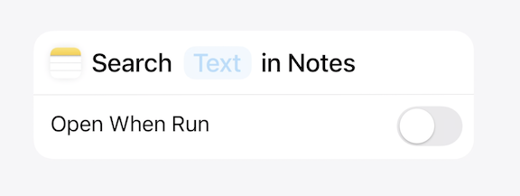

# [**Design App Intents for system experiences**](https://developer.apple.com/videos/play/wwdc2024/10176/)

---

* App Intents surface app functionality to the system outside of your app
    * Spotlight
    * Action button
    * Apple Pencil Squeeze
    * Widgets
    * Controls
    * Siri
    * Shortcuts in the Shortcuts app
* An App Intent consists of a summary of what it does
    * Starts with the app
    * Followed by a verb
    * Includes parameters that users need to fill out before the intent is run
* App Intents can be combined with other Intents into shortcuts

### **Which App Intents to make**

* Previously, app intents were meant to be the most habitual tasks in your app that could be useful outside your app
* Now, anything that your app does should be an app intent
    * Can still prioritize the most common habitual functionality of your app
* Keep in mind the balance between flexible app intents and unclear brittle app intents
* Avoid making several different intents for the same task
    * Instead, make a flexible intent that can be customized via a parameter
* Avoid making App Intents that represent the underlying task of specific UI elements
    * e.g. tapping a cancel button or swiping down on a platter
    * Instead, make app intents that represent the underlying task people normally access using these UI elements
* If your app supports live activities, audio playback, or recording, create app intents that make it possible to do these things from the background

### **Structuring App Intents**

#### Parameter types

* Parameters make an Intent able to do different actions of the same type
* When using parameters, it's important to make sure the summary is always readable as a sentence, regardless of the parameter used
    * Essential for people to understand what your app intent does when exploring in a shortcut store
    * Also maintains readability when they configure the parameter
* If an Intent needs input, such as picking a number or entering text, choose from the library of built-in parameters
    * Best for simple tasks, such as adding a date to a reminder
* Use static parameters to contain a series of options that are not covered by the basics
* If you have an intent that has options that change over time, create an App Entity as a dynamic parameter to ensure it's updated with new options over time

#### Optional/required parameters

* When a parameter is optional, the intent will not ask follow up questions if you don't specify them up front
    * This is the preferred behavior
    * For instance, if you have a notes intent that opens a folder, if you don't specify a folder, the intent will just open the Notes app
* If you feel the app intent is not helpful unless the parameter is asked for every time, you can set it as required
    * Whenever this intent is run, a follow up question that you write is asked every time
    * Keep these questions concise and clear

#### Toggles

* Used for intents that toggle a state between two states
    * The intent should also support `toggle` as the default parameter
    * If you don't support `toggle`, the user will be asked to choose between states every time they run the intent

#### Open Intents

* Previously, app intents avoided opening apps into the foreground unless necessary
    * In iOS 18, opening the app is now a common behavior to show the user that the intent has made a change in the app
* Two ways to open your app as part of using an app intent
    * If your app inherently functions to open to a particular view
        * You should conform your app intent to open intent as it inherently functions to open your app
    * If your app intent completes with a change in the app UI or shows search results
        * Intent should finish running by opening the ap to the result of the intent's action
        * This behavior appears in the intent as an `Open When Run` toggle (defaults to on)
            * Gives users the ability to toggle off this behavior if they want to use the intent as part of a shortcut that does several things where they might want several intents to run without opening each app in the flow

