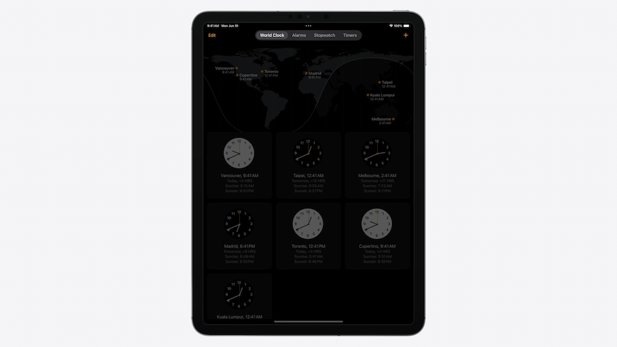
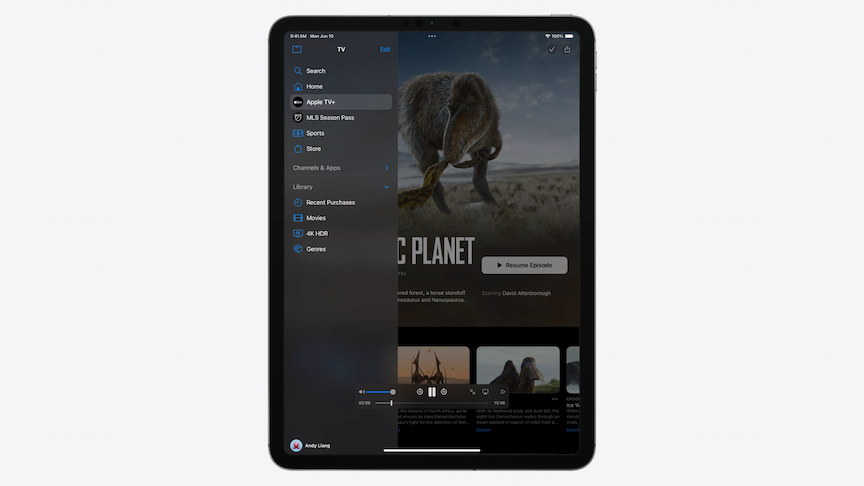
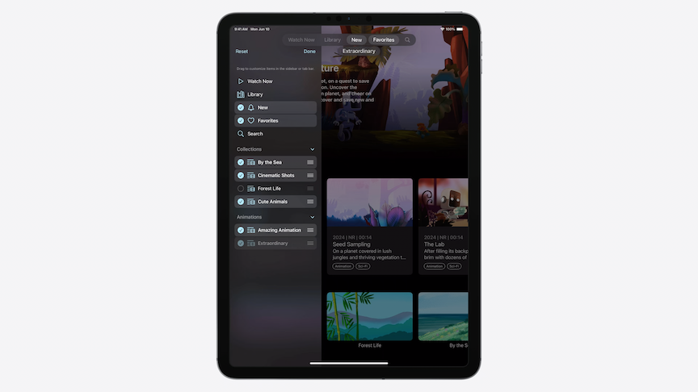
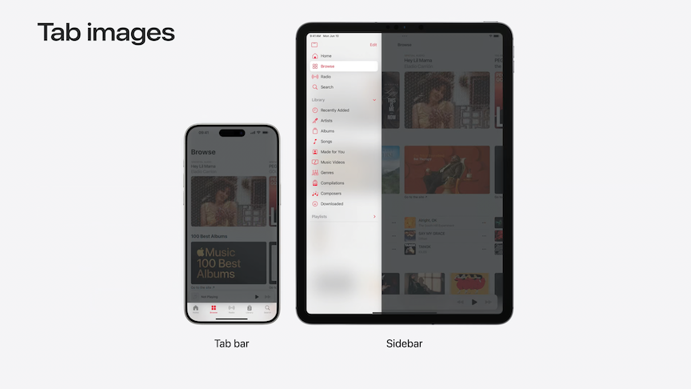
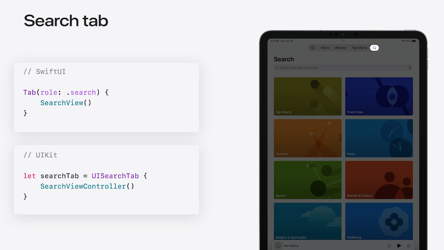

# [**Elevate your tab and sidebar experience in iPadOS**](https://developer.apple.com/videos/play/wwdc2024-10147)

---

### **Overview**

* New tab bar look on iPadOS
    * Can optionally be shown as sidebar

| Tab Bar | Sidebar |
| ------- | -------- |
|  |  |

* Represent the same hierarchy
* Great for Content-focused apps
* [**Explore navigation and design for iOS**](../2022/Explore%20navigation%20design%20for%20iOS.md) session from WWDC 2022
* [**Designed for iPad**](https://developer.apple.com/videos/play/wwdc2020/10206/) session from WWDC 2021

* The new sidebar supports customization features
    * Show/hide individual tabs
    * Reorder items in the sidebar
    * Add items to the tab bar via drag and drop



### **Tab bars and sidebars**

* Tab bars updated automatically without any code changes in iOS 18
* Integration with toolbar items
    * Appear inline with the tab bar
    * Overflow support
* SwiftUI updates
    * Improved `TabView syntax`
        * Declare a `Tab` struct with a title, image, and content view
    * Type-safe selection
    * Can optionally provide a `selection` value in the Tab to enable programmatic selection

```swift
TabView {
    Tab("Watch Now", systemImage: "play") {
        WatchNowView()
    }
    Tab("Library", systemImage: "books.vertical") {
        LibraryView()
    }
    // ...
}

// With a selection value
TabView(selection: $model.selection) {
    Tab("Watch Now", systemImage: "play", value: .watchNow) {
        WatchNowView()
    }
    Tab("Library", systemImage: "books.vertical", value: .library) {
        LibraryView()
    }
    // ...
}
```

* UIKit updates
    * Describe tabs using `UITab`
    * Updates reflected automatically

```swift
tabBarController.tabs = [
    UITab(title: "Watch Now", image: UIImage(systemName: "play"), identifier: "Tabs.watchNow") { _ in
       WatchNowViewController()
    },
    UITab(title: "Library", image: UIImage(systemName: "books.vertical"), identifier: "Tabs.library") { _ in
       LibraryViewController()
    },
    // ...
]
```

* Tab images
    * Tab bars prefer filled glyphs
    * Sidebars prefer outlined glyphs
    * When using symbol images for tabs, use the outline variant
        * System will automatically select the filled variant when displayed in the tab bar



* Search tab
    * Uses the magnifying glass symbol
    * Automatically configures the Tab with a default title, image, and pinned placement
        * With pinned placement, the tab is always available in the trailing edge of the tab bar



* TabSection
    * For iPad apps that have rich hierarchies to surface additional collections of content
    * Set the `tabViewStyle` to be `.sidebarAdaptable`
    * Use `TabSection` to represent a group
        * Tabs appear in the declared order in the tab bar
        * In the sidebar, sections are sorted after individual tabs (including Search)

```swift
TabView {
    Tab("Watch Now", systemImage: "play") {
        // ...
    }
    Tab("Library", systemImage: "books.vertical") {
        // ...
    }
    // ...
    TabSection("Collections") {
        Tab("Cinematic Shots", systemImage: "list.and.film") {
            // ...
        }
        Tab("Forest Life", systemImage: "list.and.film") {
            // ...
        }
        // ...
    }
    TabSection("Animations") {
        // ...
    }
    Tab(role: .search) {
        // ...
    }
}
.tabViewStyle(.sidebarAdaptable)
```

* Sections In UIKit
    * Set the tabBarController's mode to `tabSidebar`
    * Use `UITabGroup` to represent a group
    * Groups with dynamic content are updated by changing the group's children directly

```swift
let collectionsGroup = UITabGroup(
    title: "Collections",
    image: UIImage(systemName: "folder"),
    identifier: "Tabs.CollectionsGroup"
    children: self.collectionsTabs()) { _ in
        // ...
}

tabBarController.mode = .tabSidebar
tabBarController.tabs = [
    UITab(title: "Watch Now", ...) { _ in
        // ...
    },
    UITab(title: "Library", ...) { _ in
        // ...
    },
    // ...
    collectionsGroup,
    UITabGroup(title: "Animations", ...) { _ in
        // ...
    },
    UISearchTab { _ in
        // ...
    },
]

let collectionsGroup = UITabGroup(
    title: "Collections",
    image: UIImage(systemName: "folder"),
    identifier: "Tabs.CollectionsGroup"
    children: self.collectionsTabs()) { _ in
        // ...
}


let newCollection = UITab(...)
collectionsGroup.children.append(newCollection)
```

* Sidebar actions
    * Can add actions to sections in the sidebar to provide conveniences for common tasks

```swift
TabSection(...) {
    // ...
}
.sectionActions {
    Button("New Station", ...) {
        // action
    }
}

// UIKit

let tabGroup = UITabGroup(...)
tabGroup.sidebarActions = [
    UIAction(title: "New Station", ...) { _ in
        // action
    },
]
```

* Drop destinations
    * Tabs are also drop destinations
        * Allows direct additions into tabs int eh sidebar or tab bar through drag and drop

```swift
// SwiftUI
Tab(collection.name, image: collection.image) {
    CollectionDetailView(collection)
}
.dropDestination(for: Photo.self) { photos in
    // Add 'photos' to the specified collection
}

// UIKit
func tabBarController(
    _ tabBarController: UITabBarController,
    tab: UITab, operationForAcceptingItemsFrom dropSession: any UIDropSession
) -> UIDropOperation {
    session.canLoadObjects(ofClass: Photo.self) ? .copy : .cancel
}

func tabBarController(
    _ tabBarController: UITabBarController,
    tab: UITab, acceptItemsFrom dropSession: any UIDropSession) {
    session.loadObjects(ofClass: Photo.self) { photos in
        // Add 'photos' to the specified collection
    }
}
```

* Also supported
    * Header and footer
    * Swipe actions
    * Context menus
    * Popover source item

### **User customization**

* Sidebar customization
    * Allow hiding nonessential tabs
    * Support reordering of groups
    * Persisted automatically
* Tab bar customization
    * Drag and drop tabs
    * Tab placements
        * Tabs have a preferred placement to determine its customization and visibility preferences
    * Tab bar sections
        * Fixed section is designed for important destinations in an app
            * Appear first and disallow customization
        * Customizable section
            * Can be rearranged, and additional items cna be added from the sidebar via drag and drop
        * Pinned section
            * Items here, like search, are always available on the trailing edge
    * You can use a `sidebarOnly` placement to disallow a tab from being added to the tab bar
        * Makes it only accessible through the sidebar
* Customization in SwiftUI
    * Attach a `TabViewCustomization` to the `TabView`
        * Opts tabs within the TabView into various customization features
    * Use AppStorage onto the `TabViewCustomization` to ensure customization persistence
    * Add a `.customizationID` to allow a tab to participate in customization
    * To disable customization, use the `.customizationBehavior` modifier
        * Allows you to decide how tabs behave in both the sidebar and tab bar
    * Use the `.defaultVisibility` modifier to hide tabs in the sidebar or tab bar

```swift
@AppStorage("MyTabViewCustomization")
private var customization: TabViewCustomization

TabView {
    Tab("Watch Now", systemImage: "play", value: .watchNow) { ... }
    .customizationID("Tab.watchNow")
    // ...
    TabSection("Collections") {
        ForEach(MyCollectionsTab.allCases) { tab in
            Tab(...) { ... }
            .customizationID(tab.customizationID)
        }
    }
    .customizationID("Tab.collections")
    // ...
}
.tabViewCustomization($customization)
```

```swift
Tab("Watch Now", systemImage: "play", value: .watchNow) {
    // ...
}
.customizationBehavior(.disabled, for: .sidebar, .tabBar)


Tab("Optional Tab", ...) {
    // ...
}
.customizationID("Tab.example.optional")
.defaultVisibility(.hidden, for: .tabBar)
```

* Customization in UIKit
    * Set `allowsHiding` to true to allow non-essential tabs to be hidden
        * The current visibility can be determined by the `isHidden` property on `UITab`
    * Use the `preferredPlacement` property to control the tab's customization behavior and visibility in the tab bar
    * To allow rearrangement in groups, set `allowsReordering` to true
        * The customized order is determined by the `displayOrderIdentifiers` property

```swift
let myTab = UITab(...)
myTab.allowsHiding = true
print(myTab.isHidden)


// .default, .optional, .movable, .pinned, .fixed, .sidebarOnly
myTab.preferredPlacement = .fixed


let myTabGroup = UITabGroup(...)
myTabGroup.allowsReordering = true
myTabGroup.displayOrderIdentifiers = [...]
```

* Observing customization changes in UIKit
    * UIKit will call the two `UITabBarControllerDelegate` methods below to notify of customization changes to the visibility and order of the tabs

```swift
func tabBarController(_ tabBarController: UITabBarController, visibilityDidChangeFor tabs: [UITab]) {
    // Read 'tab.isHidden' for the updated visibility.
}

func tabBarController(_ tabBarController: UITabBarController, displayOrderDidChangeFor group: UITabGroup) {
    // Read 'group.displayOrderIdentifiers' for the updated order.
}
```

### **Platform considerations**

* In macOS, if your TabView or TabBarController supports a sidebar, then it will adopt the standard Mac sidebar appearance
    * Tabs in the sidebar can be reordered through drag and drop, just like on iPad
* On visionOS 2, the tab bar displays in an ornament on the leading edge of the window for root tabs
    * With the new Tab and UITab API, the system will automatically select the filled variant for symbols when displayed in tab bar, just like on iOS
    * With TabSection or UITabGroup, a sidebar will also be added to display alongside the group's content for secondary navigation within the group
* on tvOS 18, SwiftUI apps can use the TAbView and TAbSection API to adopt the new collapsible sidebar
