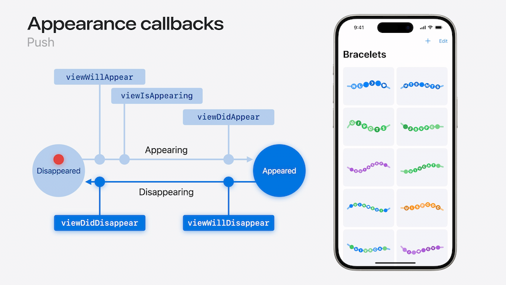

# [**Enhance your UI animations and transitions**](https://developer.apple.com/videos/play/wwdc2024-10145)

---

### **Transitions**

* New zoom transition in iOS 18
    * The cell you tap morphs into the incoming view
    * Continuously interactive, can be grabbed and dragged around from the beginning or during the transition
    * SwiftUI
        * Use `.navigationTransitionStyle(.zoom(...))`
        * Connect the modifier to a source view using `.matchedTransitionSource(...)`
    * UIKit
        * Use `.preferredTransition = .zoom { ... }`
        * Provide the cell/view to be used as the source of the transition in the body of `.zoom { ... }`
    * Works on both zoom in and out
    * Work with sheet/fullScreenCover

```swift
// SwiftUI
NavigationLink {
    BraceletEditor(bracelet)
        .navigationTransitionStyle(
            .zoom(
                sourceID: bracelet.id,
                in: braceletList
            )
        )
} label: {
    BraceletPreview(bracelet)
}
.matchedTransitionSource(
    id: bracelet.id,
    in: braceletList
)


// UIKit
func showEditor(for bracelet: Bracelet) {
    let braceletEditor = BraceletEditor(bracelet)
    braceletEditor.preferredTransition = .zoom { context in
        let editor = context.zoomedViewController
            as! BraceletEditor
        return cell(for: editor.bracelet)
    }
    navigationController?.pushViewController(braceletEditor, animated: true)
}
```

#### Transitions

* UIKit appearance callbacks
    * Normal push
        * Starts in `Disappeared` state
        * Moves through `Appearing` state, calling `viewWillAppear`, `isAppearing`, and `didAppear`
        * Ends in the `Appeared` state
    * Normal pop
        * Moves through `Disappearing` during the transition and ends in the `Disappeared` state
        * True for using both the back button and an interactive swipe
    * Cancelled pop
        * Moves to `Disappearing` state
        * On cancel, the animation runs to completion, then moves straight to the `Appearing` state and finally the `Appeared` state in one turn of the run loop
    * Cancelled push
        * Moves into `Appearing` state
        * When the user cancels the push (either with teh back button or a back swipe), the transition is not cancelled
        * Instead it completes immediately and goes into the `Appeared` state, then in the same turn of the run loop, the pop transition starts
            * Enters the `Disappearing` state in a normal pop transition that can be completed or cancelled



* Tips for UIKit apps
    * Be ready for a new transition to start anytime
        * Don't try to handle being in a transition differently from not being in one - just call push, regardless of if a transition is running or not
    * Keep temporary transition state to a minimum
        * Avoid making other code dependant on transition state
        * If you do need to keep track of transition state, reset it in `viewDidAppear` and `viewDidDisappear`
            * Guaranteed to be called at the end of the transition
    * Incorporate more SwiftUI into the app

### **SwiftUI animation**

* Can use SwiftUI animations to animate UIKit and AppKit views
    * Including SWiftUI `CustomAnimation`
* CALayer implications
    * The existing UIKit API generates a `CAAnimation`, which is then added to the view's layer
    * However, the SwiftUI animation does not create a CAAnimation, but animates the view's layer presentation values directly
        * These presentation values are still reflected in the presentation layer


```swift
UIView.animate(.spring(duration: 0.5)) {
    bead.center = endOfBracelet
}
```

### **Animating representables**

* Use the `.animate { ... }` method on teh context
    * Allows application of any animation on the Transaction associated with the update, to any UIView changes made in teh `updateUIView` method
    * Runs animation across SwiftUI View and UIViews in sync

```swift
struct BeadBoxWrapper: UIViewRepresentable {
    @Binding var isOpen: Bool

    func updateUIView(_ box: BeadBox, context: Context) {
        context.animate {
            box.lid.center.y = isOpen ? -100 : 100
        }
    }
}

struct BraceletEditor: View {
    @State private var isBeadBoxOpen = false
    var body: some View {
        BeadBoxWrapper($isBeadBoxOpen.animated())
            .onTapGesture {
                isBeadBoxOpen.toggle()
            }
    }
}
```

### **Gesture-driven animations**

* SwiftUI techniques can be applied to gesture based animations
    * Don't have to compute the initial velocity of the spring anymore
    * Preserves the velocity at the end of the gesture
    * While dragging across the screen, the gesture continuously fires change events, each creating a new `.interactiveSpring` animation
    * When the gesture ends, a final non-interactive spring animation is created

```swift
switch gesture.state {
case .changed:
    UIView.animate(.interactiveSpring) {
        bead.center = gesture.translation
    }

case .ended:
    UIView.animate(.spring) {
        bead.center = endOfBracelet
    }
}
```

* [**Explore SwiftUI animation**](https://developer.apple.com/videos/play/wwdc2023/10156/) session from WWDC 2023
* [**Animate with springs**](https://developer.apple.com/videos/play/wwdc2023/10158) session from WWDC 2023