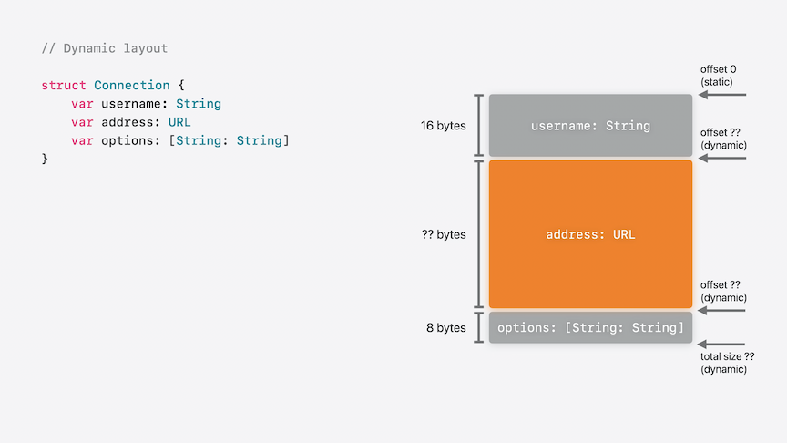
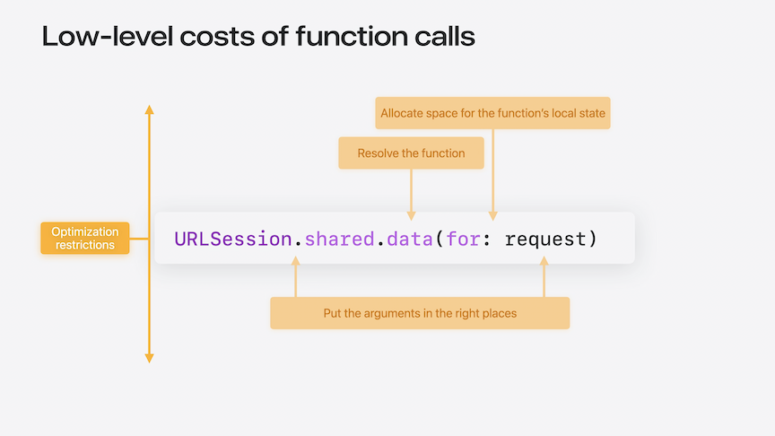
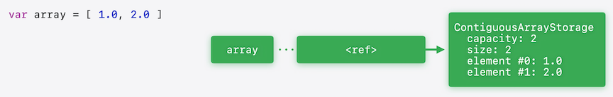
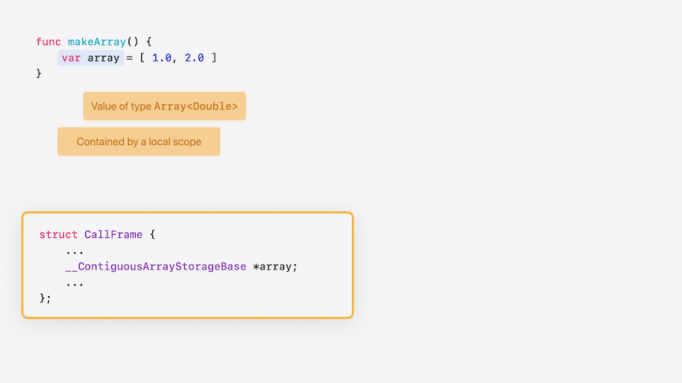

# [**- Explore Swift performance**](https://developer.apple.com/videos/play/wwdc2024-10217)

---

### **What is performance**

* Performance evaluation
    * Macroscopic goals
        * Reduce latency
        * Reduce power consumption
        * Stay within memory limits
* Top-down performance evaluation
    * Start from these macroscopic goals:
        * Measure, measure, measure
        * Identify hot spots
    * Often fixed with algorithmic improvements
        * Better asymptotic performance
        * Avoiding unnecessary or redundant code
* Bottom-up performance evaluation
    * Focus on microscopic costs:
        * Why are we spending so long in this function?
        * Why does this do an allocation, and what can we do about it
* Principles of microscopic performance
    * Doing a lot of function calls that aren't being optimized effectively
    * Wasting a lot of time/memory because of how data is represented
    * Spending too much time allocating memory
    * Spending a lot of time unnecessarily copying and destroying values
* Compiler optimization
    * Swift comes with a fairly powerful optimizer
    * Removes a lot of costs you may not even be aware of
* Optimization potential
    * Optimization can only do so much
    * What optimizations are possible?
    * What blocks those optimizations
* Trust the optimizer (but verify)
    * Monitor your performance
        * Automated benchmarks
        * Regular profiling
    * Catch regressions, no matter where they came from


### **Low-level principles**

#### Function calls

* Four costs associated with function calls:
    * Set up the arguments for the call
    * Resolve the address of the function we're calling
    * Allocate space for the function's local state
    * We don't do this, but the entire thing might inhibit optimization, both in the caller and in the function it calls



* Argument passing: Calling convention
    * At the lowest level, when we make a call, we have to put arguments in the right place for the calling convention
        * These costs are usually hidden by register renaming, so they don't make much difference in practice
    * At a higher level, the compiler may have to add copies of values to match the ownership conventions of the function
        * Often shows up in profiles as extra retains/releases
* Function resolution and optimization impact both come down to the whether we know at compile time exactly which function is being called
    * If so, this is static dispatch, otherwise it's dynamic dispatch
    * Static dispatch is more efficient, but more importantly it allows for more optimization at compile time
        * Inlining and generic specialization
    * Dynamic dispatch enables polymorphism and other powerful tools for abstraction
    * Only specific kinds of calls use dynamic dispatch in Swift (everything else is static):
        * Calls to opaque function values
        * Calls to overridable class methods
        * Calls to protocol requirements
        * Calls to Obj-C or virtual C++ methods
* In the code below, the `model.update(from: source)` call is different depending on where the method is declared
    * If it's declared in the main body of the protocol, it's a protocol requirement, and the call uses dynamic dispatch
    * If it's declared in a protocol extension, the call uses static dispatch

```swift
protocol DataModel {
    func update(from source: DataSource, quickly: Bool)
}

extension DataModel {
    func update(from source: DataSource) {
        self.update(from: source, quickly: true)
    }
}

func updateAll(models: [any DataModel], from source: DataSource) {
    for model in models {
        model.update(from: source)
    }
}
```

* Local Allocation
    * If you compile the `updateAll(models:from source:)` function above, you get the assembly code below
    * It manipulates the stack pointer at the start and end of the function
        * When we enter the function, the stack pointer is pointing into the C stack
        * Start by subtracting some number from the stack pointer in assembly (208 bytes)
        * Allocates what's traditionally called the CallFrame, and gives the function space to execute so the body of the function can be called
        * Right before returning, add the 208 bytes back to the stack pointer, deallocating the previously allocated memory
    * The CallFrame has a layout like a C struct (see below)
        * Ideally, the local state of the function just becomes fields in the CallFrame
            * When done, the compiler is always going to emit that subtraction at the start of the function to make space to save critical things like the return address
            * Subtracting a larger constant doesn't take any longer, so if we need memory in the function, allocating it as part of the CallFrame is the most optimal


```swift
_$s4main9updateAll6models4fromySayAA9DataModel_pG_AA0F6SourceCtF:
    sub   sp, sp, #208
    stp   x29, x30, [sp, #192]
    …
    ldp   x29, x30, [sp, #192]
    add   sp, sp, #208
    ret
```

```swift
// sizeof(CallFrame) == 208
struct CallFrame {
    Array<AnyDataModel> models;
    DataSource source;
    AnyDataModel model;
    ArrayIterator iterator;
    ...
    void *savedX29;
    void *savedX30;
};
```

#### Memory allocation

* Three kinds of memory
    * Global
        * Allocated and initialized during program load
        * Almost free
        * Only used for a fixed amount of memory that will never be freed
        * Used for:
            * `lets` and `vars` declared at global scope
            * `static` stored properties
    * Stack
        * Allocated and freed by adjusting the C stack pointer
        * Almost free
        * Only usable for memory that does not need to outlive current scope
            * Local `lets` and `vars`
            * Parameters
            * Other temporary values
    * Heap
        * Allocated and freed with `malloc` and `free`
        * Substantially more expensive
        * Used for:
            * Class and actor instances
            * Whenever we can't prove a scope restriction is ok
* Reference counting
    * Heap memory often has shared ownership
    * Managed with reference-counting
    * `retain` means incrementing the reference count
    * `release` means decrementing the reference count

#### Memory layout

* High-level values and low-level representations
    * "value" is a high-level concept of information content
        * `var array = [ 1.0, 2.0 ]` would have a value described as an array of two doubles
    * "representation" is how a value looks in memory
        * "array" is a name for memory that holds a reference to a buffer object that's currently initialized with the representations of two double values
        * "inline representation" is the inline portion of the representation - the portion of the representation without following any pointers (`array ... <ref>`)
        * The `MemoryLayout` type in the standard library just measures inline representation

```swift
MemoryLayout.size(ofValue: array) == 8
```

* Every value in Swift is logically contained in some context
    * A local scope (e.g. local variables, intermediate results of expressions)
    * An instance context (e.g. non-static stored properties)
    * A global context (e.g. global variables, static stored properties)
    * A dynamic context (e.g. buffers managed by Array and Dictionary)
* Every value in Swift has a static type
    * The rules of the type dictate the representation of the value
    * The rules of the context provide the memory to hold the inline representation





* Inline vs. out-of-line storage
    * Structs, enums, and tuples use inline storage
        * Inline representation includes the inline representations of all stored properties
    * Classes and actors use out-of-line storage
        * Inline representation is just a pointer to an object
        * Stored properties are contained by that object
            * This has major performance implications, which comes down to value copying

#### Value copying

* The ownership of using a value
    * Using a value can:
        * Consume it
        * Mutate it
        * Borrow it
* Consuming values
    * Takes ownership of the representation
        * Assigning a value into storage
        * Passing a value to a `consuming` parameter
    * Initializing a value requires transferring ownership of the initial value into the variable
    * Initializing a second variable with the value of the first variable, we again need to transfer ownership of a value into the new variable
        * Done by copying the value
        * If the compiler can see that there aren't any more uses of the original variable, it should be able to transfer the value without a copy
        * Can use the `consume` operator to request transfer explicitly
            * If you try to use the original value after this, Swift will tell you there isn't a value there anymore

```swift
func makeArray() {
    var array = [ 1.0, 2.0 ]
    var array2 = consume array
}
```

* Mutating values
    * Temporarily takes ownership of the value of a mutable variable
        * Passing storage to an `inout` parameter
        * Mutating a stored property of a struct (recursively)
        * Swift will prevent you from simultaneously using the variable in any other way during the call
        * When the method is done, it transfers ownership of the new value bac to the variable
        * `array.append(3.0)` is an example of this
* Borrowing values
    * Asserts that nothing else has ownership of the value
        * Calling a normal method on a value or class reference
        * Passing a value to a normal or `borrowing` parameter
        * Reading the value of a property
        * What you want when you just want to read a value
            * Nothing else is changing or destroying the value while it's being read
        * `print(array)` is an example of this
    * There are some situations where Swift needs to defensively copy arguments instead of borrowing them
        * In order to borrow a value, Swift has to prove that there aren't any simultaneous attempts to mutate or consume it
        * In the example below, because the storage is in a class property, it can be hard for Swift to prove that the property isn't modified at the same time, so it may need to add a defensive copy

```swift
func makeArray(object: MyClass) {
    object.array = [ 1.0, 2.0 ]
    print(object.array)
}
```

* Mechanics of copying
    * Copying a value means copying the inline representation
    * For types using out-of-line storage (e.g. classes):
        * Copies (retains) the object reference
    * For types using inline storage (e.g. structs):
        * Recursively copies the inline representation of all stored properties
* Trade-offs of inline versus out-of-line storage
    * Inline storage:
        * Avoids heap allocations
        * Great for small types
        * Copies get more expensive the more properties you have
    * No hard-and-fast rules for optimal performance
* Large structs
    * When copying value types, we're often not just copying bits
        * In the struct below, `name`, `address`, and `relationships` are all represented using object references that will have to be retained when the enclosing struct is copied
            * If this were a class, copying it would have to do a retain of the class object
            * Copying it as a struct still does three retains of the individual fields
    * Each copy involves separate storage for all stored properties
        * Copying the value around a lot will end up using a lot of memory
            * If this type used out-of-line storage instead, each copy would refer to the same object, so memory would be reused

```swift
struct Person {
    var name: String
    var birthday: Date
    var address: String
    var relationships: [Relationship]
    ...
}
```

* Value and reference semantics
    * Out-of-line mutable storage naturally has reference semantics
        * Mutations to one value are visible in copies of it
        * Challenging in multi-threaded environments
    * You can still get value semantics using copy-on-write
        * Wrap a class reference with a struct
        * In mutations, copy the object if the reference isn't unique
        * The standard library uses this technique in Swift's fundamental data structures, like Array, Dictionary, and String

### **Putting it together**

#### Dynamically-sized types

* Structs in C are always constant-size, but Swift types can have a size determined at runtime
    * Many value types in the SDK reserve the right to add and change their stored properties in a future OS update
        * Includes types like Foundation's `URL`
        * This means that everything about their layout has to be treated as unknown at compile time
    * A type parameter of a generic type can usually be replaced by any type with any possible representation
        * Its layout also has to be treated as unknown
        * An exception is when the type parameter is constrained to be a class
            * It has to have the representation of a class type, which is always a pointer
            * Leads to more efficient code even when generic substitution doesn't kick in, if you're able to accept the constraint

```swift
struct GenericConnection<T> where T: AnyObject {
    var username: String
    var address: T
    var options: [String: String]
}
```

* Dynamically-sized types in variably-sized containers
    * Most containers can adapt dynamically
        * e.g. when the value is a stored property of a struct or class
    * Layout is deferred to runtime
    * Sizes and offsets have to be loaded from memory
    * In the code below, because the layout of `URL` can't be known statically, the layout of `Connection` cannot be either



* Dynamically-sized types in fixed-size containers
    * Some containers must have constant size:
        * Global memory
        * Call frames
    * Memory for value must be allocated separately
    * Container stores a pointer to the allocation
    * If you make a global variable of type `URL`, the compiler will create a global variable of pointer type
        * When you access the global variable for the first time, as part of lazily running its initializer, Swift will lazily allocate space for it on the heap
    * CallFrames have a similar process
        * The CallFrame contains a pointer to the URL
        * When the variable comes into scope, the function will allocate it dynamically, then free it when it goes out of scope
        * Because local variables are scoped, the allocation can still be done on the C stack
            * When we enter the function, the CallFrame is allocated as normal
            * When the variable comes into scope, we subtract from the stack pointer for the size of the variable
            * When it goes out of scope, we reset the stack pointer

#### Async functions

* Designed to be able to abandon a C thread when they need to suspend
    * Keep local state on a special stack
    * Split functions into partial functions that run between suspensions
    * The code below has one suspension point (`await task.value`)
        * Local functions that cross that suspension point can't be saved on the C stack
        * Async functions conceptually work the same as sync functions, by allocating their local memory on the C stack by subtracting from the stack pointer
            * The difference is that async functions don't allocate out a large, contiguous stack, but instead hold on to one or more slabs of memory
            * When an async function wants to allocate memory on the async stack, it asks the task for memory
                * If the task can satisfy that from the current slab, then it will
                * If it can't, it allocates a new slab with malloc
            * De-allocation just hands the memory back to the task, where it becomes marked as unused

```swift
func awaitAll(tasks: [Task<Int, Never>]) async -> [Int] {
    var results = [Int]()
    for task in tasks {
        results.append(await task.value)
    }
    return results
}
```

* Async function splitting
    * The code above is split into two partial functions, before and after the `await` call
    * The second partial function picks up after the await, trying to add the result of the awaited task, then tries to continue the loop
        * If there are no more tasks, it returns to the async call, otherwise loops back and awaits the next task
    * The key idea is that there's only at most one partial function on the C stack
        * We enter one partial function and run like an ordinary C function until the next potential suspension oint
        * If the partial function needs some local state that doesn't have to cross a suspension point, it can allocate that into its C CallFrame
        * The partial function tail-calls the next partial function
            * Its CallFrame disappears from the C stack and the frame for the next is allocated
        * If a task ever needs to actually suspend, it just returns normally on the C stack, which will go directly to the concurrency runtime so the thread can be re-used for something else

#### Closures

* Closures are always passed around as values of function type
    * The function takes an argument that's a non-escaping function
    * Function values in Swift are always a pair of function pointer and a context pointer (function and C representation below)
    * A call to the function value in Swift simply calls the function pointer, passing the context as an implicit extra argument

```swift
func sumTwice(f: () -> Int) -> Int {
  return f() + f()
}

// C representation
Int sumTwice(Int (*fFunction)(void *),
             void *fContext) {
  return fFunction(fContext)
       + fFunction(fContext);
}
```

* A closure expression that captures values form the enclosing scope has to package those values up into the context
    * How this works depends on the kind of function value it has to produce
    * In the code below, the function is a non-escaping function
        * The function value will not be used after the call completes, so it does not need to be memory managed
        * The context will be a simple structure containing the captured value
        * The context can be allocated on the stack, and the address of that will be passed to `sumTwice`
        * In the closure function, we know the type of the paired context and can just pull the data we need out of it

```swift
func sumTwice(f: () -> Int) -> Int {
  return f() + f()
}

func puzzle(n: Int) -> Int {
  return sumTwice { n + 1 }
}

// Context of the closure
struct puzzle_context {
  Int n;
};

Int puzzle(Int n) {
  struct puzzle_context context = { n };
  return sumTwice(&puzzle_closure, &context);
}

Int puzzle_closure(void *_context) {
  struct puzzle_context *context =
    (struct puzzle_context *) _context;
  return _context->n + 1;
}
```

* For escaping closures, we no longer know that the closure will only be used within the duration of the call
    * The context object must be heap-allocated and managed with retains/releases
    * The context behaves like an instance of an anonymous Swift class

```swift
func sumTwice(f: @escaping () -> Int) -> Int {
  return f() + f()
}

func puzzle(n: Int) -> Int {
  return sumTwice { n + 1 }
}
```

* When referring to a local `var` in a closure, the variable is captured by reference
    * Allows you to make changes to the variable that will be observed in the original scope and vice-versa
    * If the var is only captured by non-escaping closures, this doesn't change the lifetime of the variable
        * The closures can handle this by just capturing a pointer to the variable's allocation
    * But if the var is capture by an escaping closure (if `sumTwice` function below was `sumTwice(f: @escaping () -> Int) -> Int`), the lifetime of the var can be extended as long as the closure is alive
        * The var must also be heap allocated, and the closure context has to retain a reference to that object

```swift
func sumTwice(f: () -> Int) -> Int {
  return f() + f()
}

func puzzle(n: Int) -> Int {
  var addend = 0
  return sumTwice {
    addend += 1
    return n + addend
  }
}

// Closure context
class Box<T> {
  let value: T
}

class puzzle_context {
  let n: Int
  let addend: Box<Int>
}
```

#### Generics

* `updateAll` is generic over its data model, a type that is statically unknown
    * The `model.update` call uses a protocol requirement

```swift
protocol DataModel {
    func update(from source: DataSource)
}

func updateAll<Model: DataModel>(models: [Model], from source: DataSource) {
    for model in models {
        model.update(from: source)
    }
}
```

* Swift protocols are represented at runtime with a table of function pointers, one for each requirement in the protocol
    * Any time we have a protocol constraint, we're passing around a pointer to the appropriate table
    * In a function like `updateAll` below, the type and witness tables become hidden extra parameters
        * Everything in this signature at runtime corresponds straightforwardly to something from the original Swift signature

```swift
void updateAll(Array<Model> models,
               DataSource source,
               TypeMetadata *Model,
               DataModelWitnessTable *Model_is_DataModel);
```

* Working with values of protocol type is different
    * In the case below, each element of the array is now allowed to be a different type of data model, which has trade-offs for how efficiently it will run

```swift
protocol DataModel {
    func update(from source: DataSource)
}

func updateAll(models: [any DataModel], from source: DataSource)
```

* The inline representation of a protocol like `AnyDataModel` looks like the code below in C
    * Has storage for the value and fields to record the value's type and any conformances we know it has
    * AnyDataModel must be a fixed size type, it's representation can't change sizes to support different types of data model
        * No matter how large we make the value storage, there's potentially going to be a data model that won't fit
    * Swift uses an arbitrary buffer size of 3 pointers
        * If a value stored in a protocol type can fit into that buffer, Swift will put it there, inline
            * Otherwise, it allocates space for the value on the heap and just stores that pointer in the buffer

```swift
struct AnyDataModel {
    OpaqueValueStorage value;
    TypeMetadata *valueType;
    DataModelWitnessTable *value_is_DataModel;
};

struct OpaqueValueStorage {
    void *storage[3];
};
```

* The `updateAll` functions below look similar, but have very different characteristics
    * The first function takes a homogeneous array of data models, that will be efficiently packed in the array
        * The type information will be passed once to the function, as top-level arguments
        * The function can also be specialized if the caller knows what type it's being called with (`MyDataModel`)
            * The optimizer can easily either inline this call or produce a specialized version of the function that works with this exact argument type
            * Removes any abstraction cost associated with generics, making the update call go directly to its implementation in MyDataModel's conformance
    * The second function take a heterogenous array of data models
        * What you need if you've got data models of different types
        * But each element of the array now has its own dynamic type, and the values won't be densely packed in the array
        * Very difficult to de-virtualize/optimize

```swift
protocol DataModel {
    func update(from source: DataSource)
}

func updateAll<Model: DataModel>(models: [Model], from source: DataSource) {
    for model in models {
        model.update(from: source)
    }
}

func updateAll(models: [any DataModel], from source: DataSource) {
    for model in models {
        model.update(from: source)
    }
}

// Calling with a known type
var myModels: [MyDataModel]
updateAll(models: myModels, from: source)

// Implicitly generated by the optimizer
func updateAll_specialized(models: [MyDataModel],
                           from source: DataSource) {
    for model in models {
        model.update(from: source)
    }
}
```

* [**Getting Started with Instruments**](https://developer.apple.com/videos/play/wwdc2019/411/) session from WWDC 2019
* [**Understanding Swift Performance**](https://developer.apple.com/videos/play/wwdc2016/416/) session from WWDC 2016
