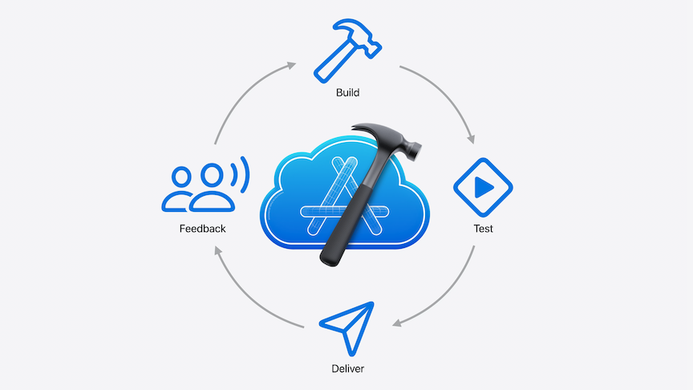
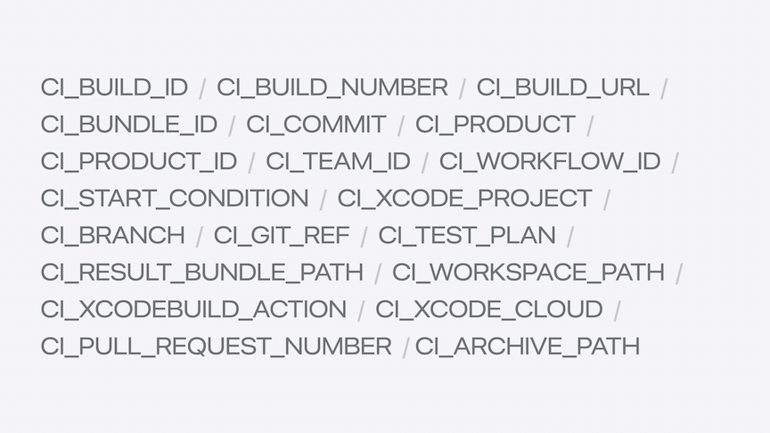
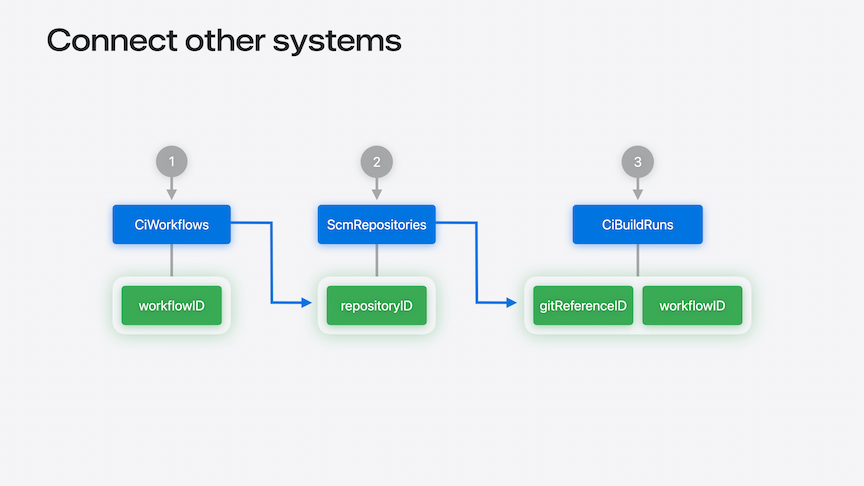

# [**Extend your Xcode Cloud workflows**](https://developer.apple.com/videos/play/wwdc2024-10200)

---

### **Essential workflow concepts**



* A workflow is made of four elements
    * Environment
        * Define environment variables
        * Define which Xcode and macOS versions to use when the workflow runs
    * Start Conditions
        * Define when a workflow runs
        * Respond to source control events like Branch, PR, git Tag updates
        * Can choose to set up a schedule
        * Opt for manual start condition
    * Build Actions
        * Describe what you want Xcode Cloud to do with your source code
        * Build app, run Tests, Analyze, or Archive to prepare for distribution
    * Post Actions
        * Define what happens after build actions complete
        * Notify over Slack, notarize, distribute to TestFlight

### **Scale your workflows**

* In Xcode 15.1, can now configure workflows to be started manually with manual start conditions
* Custom aliases are new in Xcode 15.3
    * Similar to the aliases like `latest release` that already existed in Xcode Cloud
    * Specify a specific version of Xcode or macOS
    * Can now define your own aliases that can be shared amongst workflows
    * When an alias changes, all workflows that use it are automatically updated
    * Can create/manage custom aliases form the version selector dropdown menu within a workflow, or from the Integrations menu item
    * [**Custom Aliases**](https://developer.apple.com/documentation/xcode/sharing-build-configurations-across-xcode-cloud-workflows) documentation
* Custom Scripts are scripts that run inside the repository at specific points in a build
    * After repository is cloned (`ci_post_clone.sh`)
    * Before xcodebuild is run (`ci_pre_xcodebuild.sh`)
    * After xcodebuild is run (`ci_post_xcodebuild.sh`)
    * [**Customize your advanced Xcode Cloud workflows**](https://developer.apple.com/videos/play/wwdc2021/10269/) session from WWDC 2021
    * All environment variables defined in your workflow, as well as environment variables provided by Xcode Cloud, are available in these scripts
    * [**Environment Variable Reference**](https://developer.apple.com/documentation/xcode/environment-variable-reference)
    * All scripts must be in a `ci_scripts` folder



* If you only want to run a script for specific workflows, you can add logic to check the environment variables for the build action and workflowID
    * To get a workflowID, navigate to the iCloud reports navigator, right click on the workflow and select `Copy Workflow ID
    * Specifying the `set -e` shell option will cause the script to exit immediately if it encounters an error, and the workflow will stop there

```swift
#!/bin/sh

set -e

if [[ $CI_XCODEBUILD_ACTION == "test-without-building" && $CI_WORKFLOW_ID == "82D89C93-B69C-46B5-A794-A2BCFD3EE487" ]]
then
    curl https://example.com/health --fail
fi
```

### **Connect other systems**

* Can use the App Store Connect API to automatically start a build whenever a test server has new changes
    * [**Xcode Cloud Workflows and Builds**](https://developer.apple.com/documentation/appstoreconnectapi/xcode_cloud_workflows_and_builds) documentation
* Process
    * The `CIBuildRuns` endpoint lets us create new Xcode Cloud builds
        * When calling it, need to specify identifiers for the workflow to be run, and the gitReference to build
    * Use the `ScmRepositories` endpoint using a repositoryID to fetch all the branches, tags, and PRs associated with the repo
    * The `CiWorkflows` resource helps us know what repositoryID the workflow is using



* The App Store Connect API is specified using OpenAPI, so a code generator can be used to create strongly typed Swift code for each endpoint
    * [**Meet Swift OpenAPI Generator**](https://developer.apple.com/videos/play/wwdc2023/10171/) session from WWDC 2023
    * Three functions created below for our three endpoints called
        * First function takes a workflowID as a parameter, fetches the associated `CiWorkflows` resource, and returns the `repositoryID`
        * Second function translates that `repositoryID` into the `gitReferenceID` that we want to build
            * Uses the `SCMRepositories` endpoint by fetching all the gitReferences associated with the repo, and returns the `gitReferenceID` for the branch with a specified name
        * Third function starts a new build
            * Uses the `workflowID` and `gitReferenceID`, and passes those to the `ciBuildRuns` endpoint

```swift
extension Client {
    func repoID(workflowID: String) async throws -> String {
        return try await ciWorkflowsGetInstance(
            path: .init(id: workflowID),
            query: .init(include: [.repository])
        ).ok.body.json.data.relationships!.repository!.data!.id
    }
    
    func branchID(repoID: String, name: String) async throws -> String {
        return try await scmRepositoriesGitReferencesGetToManyRelated(
            path: .init(id: repoID)
        )
        .ok.body.json.data
        .filter { $0.attributes!.kind == .BRANCH && $0.attributes!.name == name }
        .first!.id
    }
    
    func startBuild(workflowID: String, gitReferenceID: String) async throws {
        _ = try await ciBuildRunsCreateInstance(
            body: .json(.init(
                data: .init(
                    _type: .ciBuildRuns,
                    relationships: .init(
                        workflow: .init(data: .init(
                            _type: .ciWorkflows,
                            id: workflowID
                        )),
                        sourceBranchOrTag: .init(data: .init(
                            _type: .scmGitReferences,
                            id: gitReferenceID
                        ))
                    )
                )
            ))
        ).created
    }
}
```

* To run the functions above, we use the code below
    * Get the `repoID`, then the `branchID`, and call `startBuild` all with in our `main()` function

```swift
static func main() async throws {
    let client = try Client(
        serverURL: Servers.server1(),
        configuration: .init(dateTranscoder: .iso8601WithFractionalSeconds),
        transport: URLSessionTransport(),
        middlewares: [AuthMiddleware(token: ProcessInfo.processInfo.environment["TOKEN"]!)]
    )
    
    let workflowID = "82D89C93-B69C-46B5-A794-A2BCFD3EE487"
    let repoID = try await client.repoID(workflowID: workflowID)
    
    let branchName = "main"
    let branchID = try await client.branchID(repoID: repoID, name: branchName)
    
    try await client.startBuild(workflowID: workflowID, gitReferenceID: branchID)
}
```

* Builds started by the App Store Connect API are considered manual, so you must ensure you have a manual start condition setup that matches the reference you're building
* The Xcode Cloud webhooks feature can be used to connect test results to a deployment service
    * [**Configuring webhooks in Xcode Cloud**](https://developer.apple.com/documentation/xcode/configuring-webhooks-in-xcode-cloud) documentation
    * You only need an HTTP server to listen and respond to webhooks
    * Example below of webhook payload struct and a routes function for a Server running Swift

```swift
struct WebhookPayload: Content {
    let ciWorkflow: CiWorkflow
    let ciBuildRun: CiBuildRun
    
    struct CiWorkflow: Content {
        let id: String
    }
    
    struct CiBuildRun: Content {
        let id: String
        let executionProgress: String
        let completionStatus: String
    }
}

func routes(_ app: Application) throws {
    let deploymentService = ExampleDeploymentClient()
    let workflowID = "82D89C93-B69C-46B5-A794-A2BCFD3EE487"
    
    app.post("webhook") { req async throws -> HTTPStatus in
        let payload = try req.content.decode(WebhookPayload.self)

        if (payload.ciWorkflow.id == workflowID &&
            payload.ciBuildRun.executionProgress == "COMPLETE" &&
            payload.ciBuildRun.completionStatus == "SUCCESS") {
            await deploymentService.deploy(buildID: payload.ciBuildRun.id)
        }

        return HTTPStatus.ok
    }
}
```

* Webhooks can be managed in App Store Connect
    * Workflow -> Settings -> Webhooks
