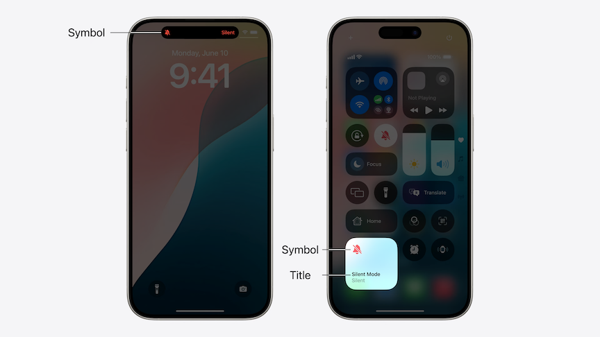
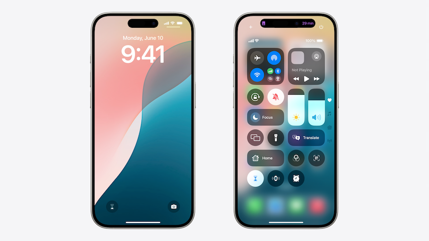
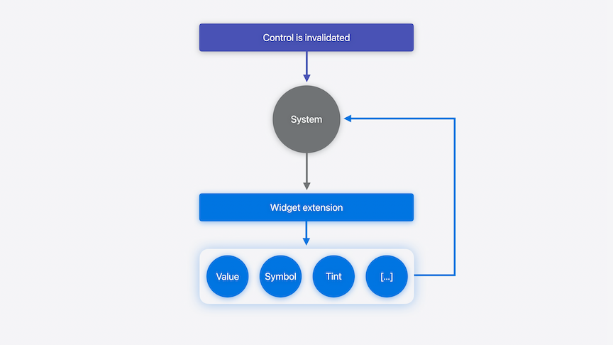
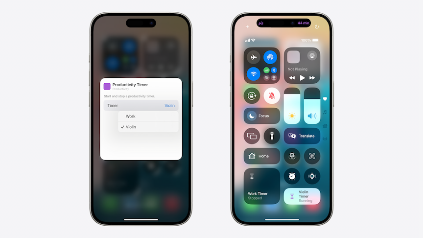

# [**Extend your app's controls across the system**](https://developer.apple.com/videos/play/wwdc2024-10157)

---

### **Introduction**

* Controls are a new way to extend app functionality to Control Center, the Lock Screen, and the Action button
* Created using WidgetKit
* Two types of controls:
    * Buttons perform discrete actions (which can include launching the app)
    * Toggles change a piece of boolean state, like turning something on or off
* Use an app intent to perform an action
* App provides a symbol, title, tint color, and additional content to the system
    * System displays the content contextually depending on where it is shown (lock screen, control center, dynamic island, etc.)
    * Control Center can display a control at any of three different sizes, so the title and value text won't always be visible.



### **Build a control**

* Building a timer control
    * When running, will show as a live activity
    * Can start the timer from the Lock Screen
    * Can stop the timer in Control Center
    * Can use the action button to start/stop the timer
    * Will be built from the ground up, starting with a basic toggle
* Start by adding `TimerToggle()` entry into the `WidgetBundle`

```swift
@main
struct ProductivityExtensionBundle: WidgetBundle {
    
    var body: some Widget {
        ChecklistWidget()
        TaskCounterWidget()
        TimerToggle()
    }
    
}
```

* Define the control by conforming to `ControlWidget`
    * Starting with a `StaticControlConfiguration`, meaning that the control is not configurable
    * Control takes a `kind` as it's unique identifier and a definition for the type of control: `ControlWidgetToggle`
    * Give the Control a title ("Work Timer") and provide its state (`TimerManager.shared.isRunning`)
    * Provide the action to perform when the control is interacted with (`ToggleTimerIntent()`)
        * Just like widgets, the control executes actions using an app intent
    * Provide a symbol image defining the control in the body of `ControlWidgetToggle`
        * Can use `isOn` to define different images based on state

```swift
struct TimerToggle: ControlWidget {
    var body: some ControlWidgetConfiguration {
        StaticControlConfiguration(
            kind: "com.apple.Productivity.TimerToggle"
        ) {
            ControlWidgetToggle(
                "Work Timer",
                isOn: TimerManager.shared.isRunning,
                action: ToggleTimerIntent()
            ) { isOn in
                Image(systemName: isOn
                      ? "hourglass"
                      : "hourglass.bottomhalf.filled")
            }
        }
    }
}
```

* Can further customize the control by changing `Image` to a `Label` and defining the text based on the state
    * The value text won't be displayed on the Lock Screen or when the control is in the small size in Control Center, only the symbol is shown

```swift
struct TimerToggle: ControlWidget {
    var body: some ControlWidgetConfiguration {
        StaticControlConfiguration(
            kind: "com.apple.Productivity.TimerToggle"
        ) {
            ControlWidgetToggle(
                "Work Timer",
                isOn: TimerManager.shared.isRunning,
                action: ToggleTimerIntent()
            ) { isOn in
                Label(isOn ? "Running" : "Stopped",
                      systemImage: isOn
                      ? "hourglass"
                      : "hourglass.bottomhalf.filled")
            }
            .tint(.purple)
        }
    }
}
```

| Full Timer Presentation | Small Timer Presentations |
| ----------------------- | ------------------------- |
|  |  |

* The Control can be given a custom color instead of the default systemBlue by giving it a tint color
    * Will only tint the symbol when the toggle is on

```swift
ControlWidgetToggle(
    "Work Timer",
    isOn: TimerManager.shared.isRunning,
    action: ToggleTimerIntent()
) { isOn in
    Label(isOn ? "Running" : "Stopped", systemImage: isOn ? "hourglass" : "hourglass.bottomhalf.filled")
}
.tint(.purple)
```

### **Update state**

* Control flow
    * System runs the body of the control in the widget extension process to ask for the control's current value and generate the content when the system needs to reload the control
    * The control's value and content are passed back to the system to display the control



* Control invalidation happens with three kinds of events
    * Action performed
    * App requests reload
    * Push notification invalidates the control
* When an action is performed, the system reloads it when the app intent's `perform()` function returns
    * Make sure to finish all updates before it returns
    * The timer's action is `ToggleTimerIntent`
        * Sets the "Running" state of the timer and starts/stops the live activity

```swift
struct ToggleTimerIntent: SetValueIntent, LiveActivityIntent {
    static let title: LocalizedStringResource = "Productivity Timer"
    
    @Parameter(title: "Running")
    var value: Bool  // The timer’s running state
    
    func perform() throws -> some IntentResult {
        TimerManager.shared.setTimerRunning(value)
        return .result()
    }
}
```

* From inside the app, the app can use the `ControlCenter` API to refresh the control
    * Specify the kind of the timer control as the control to reload
    * The same refresh tools for widgets/live activities are available for controls
    * Turn on `WidgetKit Developer Mode` in `Developer Settings` to remove system policies from controls in development

```swift
func timerManager(_ manager: TimerManager,
                  timerDidChange timer: ProductivityTimer) {
    ControlCenter.shared.reloadControls(
        ofKind: "com.apple.Productivity.TimerToggle"
    )
}
```

* When a control reflects state from a server that is not available on the device, state needs to be fetched asynchronously
    * Use a `ValueProvider` for this
        * Two requirements: `currentValue()` and `previewValue`
            * `currentValue()` is asynchronous to allow data fetching
                * Can also throw an error to let the system know that state couldn't be computed, indicating that the control needs to be reloaded at a later time
            * `previewValue` is used to choose the value to show when the control is being previewed
                * Before they add the control (in the controls gallery)
                * When they customize their lock screen
                * Action button settings
                * Should be predetermined and quick to return, and should correspond to the off state

```swift
struct TimerValueProvider: ControlValueProvider {
    
    func currentValue() async throws -> Bool {
        try await TimerManager.shared.fetchRunningState()
    }
    
    let previewValue: Bool = false
}
```

* To use the `ValueProvider` in the control, a different control initializer is used that has a `provider` parameter
    * The provided value is passed into the closure where the toggle is defined, and is used as the `isOn` state of the control

```swift
struct TimerToggle: ControlWidget {
    var body: some ControlWidgetConfiguration {
        StaticControlConfiguration(
            kind: "com.apple.Productivity.TimerToggle",
            provider: TimerValueProvider()
        ) { isRunning in
            ControlWidgetToggle(
                "Work Timer",
                isOn: isRunning,
                action: ToggleTimerIntent()
            ) { isOn in
                Label(isOn ? "Running" : "Stopped",
                      systemImage: isOn
                      ? "hourglass"
                      : "hourglass.bottomhalf.filled")
            }
            .tint(.purple)
        }
    }
}
```

* Update controls with push notifications when state can be changed from other devices
    * Use the Push Notification API
    * Define a `ControlPushHandler` in your control
    * The push handling documentation goes into more detail and best practices

### **Support configuration**

* Can create a single control with multiple functionality, you can make it user-configurable
    * Update `ValueProvider` to conform to the `AppIntentControlValueProvider` protocol
        * Makes the value dependent on the configuration of an intent
    * The app intent that determines the configure is the `SelectTimerIntent`
        * Allows the user to choose which timer they want the control to interact with
    * Fetch the running state of the configuration's particular timer
        * The return value is a struct containing both the timer and its running state

```swift
struct ConfigurableTimerValueProvider: AppIntentControlValueProvider {
    func currentValue(configuration: SelectTimerIntent) async throws -> TimerState {
        let timer = configuration.timer
        let isRunning = try await TimerManager.shared.fetchTimerRunning(timer: timer)
        return TimerState(timer: timer, isRunning: isRunning)
    }
    
    func previewValue(configuration: SelectTimerIntent) -> TimerState {
        return TimerState(timer: configuration.timer, isRunning: false)
    }
}
```

* Use the configurable `ValueProvider` with an `AppIntentControlConfiguration()` to make the Control configurable
    * The value passed to the closure is now the `timerState` struct, and the timer and running state is used to complete the toggle

```swift
struct TimerToggle: ControlWidget {
    var body: some ControlWidgetConfiguration {
        AppIntentControlConfiguration(
            kind: "com.apple.Productivity.TimerToggle",
            provider: ConfigurableTimerValueProvider()
        ) { timerState in
            ControlWidgetToggle(
                timerState.timer.name,
                isOn: timerState.isRunning,
                action: ToggleTimerIntent(timer: timerState.timer)
            ) { isOn in
                Label(isOn ? "Running" : "Stopped",
                      systemImage: isOn
                      ? "hourglass"
                      : "hourglass.bottomhalf.filled")
            }
            .tint(.purple)
        }
    }
}
```



* Use the `promptsForUserConfiguration()` modifier if your control requires customization to be functional
    * The system automatically prompts the user to configure the control when it's added to the system space

```swift
struct SomeControl: ControlWidget {
    var body: some ControlWidgetConfiguration {
        AppIntentControlConfiguration(
            // ...
        )
        .promptsForUserConfiguration()
    }
}
```

### **Add refinements**

* Can add action hints for if the user interacts with the Action button before the action is performed
    * Use `.controlWidgetActionHint(...)` for this
    * Will use the Label text value if this is not provided

```swift
struct TimerToggle: ControlWidget {
    var body: some ControlWidgetConfiguration {
        AppIntentControlConfiguration(
            kind: "com.apple.Productivity.TimerToggle",
            provider: ConfigurableTimerValueProvider()
        ) { timerState in
            ControlWidgetToggle(
                timerState.timer.name,
                isOn: timerState.isRunning,
                action: ToggleTimerIntent(timer: timerState.timer)
            ) { isOn in
                Label(isOn ? "Running" : "Stopped",
                      systemImage: isOn
                      ? "hourglass"
                      : "hourglass.bottomhalf.filled")
                .controlWidgetActionHint(isOn ?
                                         "Start" : "Stop")
            }
            .tint(.purple)
        }
    }
}
```

* Control status text
    * Controls can display momentary status when the action is performed
    * Use the `controlWidgetStatus` modifier to display a status
    * Describe additional information about the action or state by providing a status
        * Use sparingly, and only to call attention to pertinent info that isn't already conveyed by the control
* A control's app's name is the default display name for the control
    * Change this with the `.displayName` modifier
* The `.description` modifier is shown when the control is being configured

```swift
struct TimerToggle: ControlWidget {
    var body: some ControlWidgetConfiguration {
        AppIntentControlConfiguration(
            kind: "com.apple.Productivity.TimerToggle",
            provider: ConfigurableTimerValueProvider()
        ) { timerState in
            ControlWidgetToggle(
                timerState.timer.name,
                isOn: timerState.isRunning,
                action: ToggleTimerIntent(timer: timerState.timer)
            ) { isOn in
                Label(isOn ? "Running" : "Stopped",
                      systemImage: isOn
                      ? "hourglass"
                      : "hourglass.bottomhalf.filled")
                .controlWidgetActionHint(isOn ?
                                         "Start" : "Stop")
            }
            .tint(.purple)
        }
        .displayName("Productivity Timer")
        .description("Start and stop a productivity timer.")
    }
}
```

* When building a control that lets users capture content with the camera, consider building a capture extension
    * [**Build a great Lock Screen camera capture experience**](https://developer.apple.com/videos/play/wwdc2024-10204) session