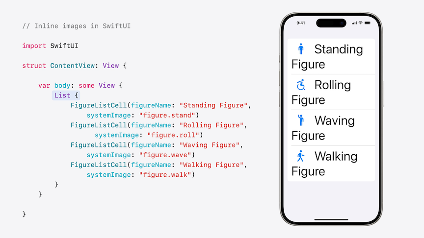

# [**Get started with Dynamic Type**](https://developer.apple.com/videos/play/wwdc2024/10074/)

---

* By default, there are 7 available text sizes for Dynamic Type
    * If larger accessibility sizes is enabled, five more text sizes become available
    * The default text size is Large

### **Scaled text**

* Use the `.font()` modifier to use a built-in text style with SwiftUI

```swift
// Use built-in text styles with SwiftUI

import SwiftUI

struct ContentView: View {

    var body: some View {
        Text("Hello, World!")
            .font(.title)
    }

}
```

* For UIKit, set `.adjustsFontForContentSizeCategory` to `true`, along with setting the font to `.preferredFont(forTextStyle:)`
    * Set `.numberOfLines` to `0` to allow the text to take up as many lines as it needs

```swift
// Built-in text styles in UIKit

import UIKit

class ViewController: UIViewController {
    
    override func viewDidLoad() {
        super.viewDidLoad()
        
        let label = UILabel(frame: .zero)
        setupConstraints()
        label.text = "Hello, World!"
        label.adjustsFontForContentSizeCategory = true
        label.font = .preferredFont(forTextStyle: .title1)
        label.numberOfLines = 0
        
        self.view.addSubview(label)
    }
}
```

* Possible issues
    * Large text might become truncated
    * Text might appear clipped, because its container has a fixed frame
* Testing
    * In SwiftUI, navigate to the `Preview` canvas, and click the `Variants` button to select Dynamic Type Variants to test views
    * You can also use the `Environment Overrides` in the Xcode Debugger to override accessibility settings
    * Use the Accessibility Inspector to perform an audit of the app

### **Dynamic layouts**

* Use dynamic layouts to change the layout of a view based on the Dynamic Type size
    * Use the `\.dynamicTypeSize` environment variable to determine the type size used

```swift
// Dynamic layout in SwiftUI

import SwiftUI

struct FigureCell: View {
    @Environment(\.dynamicTypeSize) 
    private var dynamicTypeSize: DynamicTypeSize
    
    var dynamicLayout: AnyLayout { 
        dynamicTypeSize.isAccessibilitySize ?
        AnyLayout(HStackLayout()) : AnyLayout(VStackLayout())
    }
    
    let systemImageName: String
    let imageTitle: String
    
    var body: some View {
        dynamicLayout {
            FigureImage(systemImageName: systemImageName)
            FigureTitle(imageTitle: imageTitle)
        }
    }
}

struct FigureContentView: View {
    @Environment(\.dynamicTypeSize) 
    private var dynamicTypeSize: DynamicTypeSize
    
    var dynamicLayout: AnyLayout {
        dynamicTypeSize.isAccessibilitySize ?
        AnyLayout(VStackLayout(alignment: .leading)) : AnyLayout(HStackLayout(alignment: .top))
    }
    
    var body: some View {
        dynamicLayout {
            FigureCell(systemImageName: "figure.stand", imageTitle: "Standing Figure")
            FigureCell(systemImageName: "figure.wave", imageTitle: "Waving Figure")
            FigureCell(systemImageName: "figure.walk", imageTitle: "Walking Figure")
            FigureCell(systemImageName: "figure.roll", imageTitle: "Rolling Figure")
        }
    }
}
```

* To do this with UIKit, consider using `UIStackView`
    * To determine the axis, use the `isAccessibilityCategory` property on the preferred content size category in the traitCollection of the view controller
    * To respond to changes in text size while the app is running, subscribe to the UI content size category `didChangeNotification` and update the stack view

```swift
// Dynamic layout in UIKit

import UIKit

class ViewController: UIViewController {
    private var mainStackView: UIStackView = UIStackView()
    
    required init?(coder: NSCoder) {
        super.init(coder: coder)
        NotificationCenter.default.addObserver(self, selector: #selector(textSizeDidChange(_:)), name: UIContentSizeCategory.didChangeNotification, object: nil)
    }
    
    override func viewDidLoad() {
        super.viewDidLoad()
        setupStackView()
    }

    @objc private func textSizeDidChange(_ notification: Notification?) {
        let isAccessibilityCategory = self.traitCollection.preferredContentSizeCategory.isAccessibilityCategory
        mainStackView.axis = isAccessibilityCategory ? .vertical : .horizontal
        setupConstraints()
    }
}
```

### **Images and symbols**

* Prioritize scaling essential content (text) over decorative views (images)
* Wrap text to avoid unused whitespace, under unscaled images
* In rare cases, remove decorative views with larger text sizes
* Including views in a list will wrap the text under icons without any additional work



* In UIKit, you can achieve the same wrapping behavior that SwiftUI has by using `NSAttributedSTring` with the image as an `NSTextAttachment`

```swift
// Inline images in UIKit

func attributedStringWithImage(systemImageName: String, imageTitle: String) ->  
    NSAttributedString {
    let attachment = NSTextAttachment()
    attachment.image = UIImage(systemName: systemImageName)
    
    let attachmentAttributedString = NSMutableAttributedString(attachment: attachment)
    attachmentAttributedString.append(NSAttributedString(string: imageTitle))
    
    return attachmentAttributedString
}
```

* In cases where you do want the image to scale with text
    * If you are using SF Symbols, the symbol will resize automatically
    * If you are using an image/PDF in your assets, use the ScaledMetric API to let the image resize based on the selected text size

```swift
// Scaling images in SwiftUI

import SwiftUI

struct ContentView: View {
    @ScaledMetric var imageWidth = 125.0
    var body: some View {
        VStack {
            Image("Spatula")
                .resizable()
                .aspectRatio(contentMode: .fit)
                .frame(width: imageWidth)
            Text("Grill Party!")
                .frame(alignment: .center)
        }
    }
}
```

* To do the same thing in UIKit, use UIImage `SymbolConfiguration`
    * Create the a configuration with a specific text style using `SymbolConfiguration` with `textStyle`
    * Then create the UIImage with that symbol configuration

```swift
// Symbol configuration in UIKit

import UIKit

func imageWithBodyConfiguration(systemImageName: String) -> UIImage? {
  let imageConfiguration = UIImage.SymbolConfiguration(textStyle: .body)
  let configuredImage = UIImage(systemName: systemImageName, withConfiguration: imageConfiguration)
  return configuredImage
}
```

### **Large content viewer**

* The Large Content Viewer allows you to explore controls that may not be able to grow with larger text sizes
    * Appears in the center of the view with the label and icon for the item you are inspecting
    * Automatically supported by:
        * Tab bars
        * Status bar
        * Navigation bars
        * Toolbars
    * Can add support to custom controls with `accessibilityShowsLargeContentViewer`

```swift
// Large content viewer support in SwiftUI

import SwiftUI

struct FigureBar: View {
    @Binding var selectedFigure: Figure
    
    var body: some View {
       HStack {
            ForEach(Figure.allCases) { figure in
                FigureButton(figure: figure, isSelected: selectedFigure == figure)
                    .onTapGesture {
                        selectedFigure = figure
                    }
                    .accessibilityShowsLargeContentViewer {
                        Label(figure.imageTitle, systemImage: figure.systemImage)
                    }
            }
        }
    }
}
```

* For UIKit, conform the view to the `UILargeContentViewerItem` protocol
    * Provide a title and image
    * Add an instance of `UILargeContentViewerInteraction` to the view
    * Resolve ambiguous gestures using `gestureRecognizerForExclusionRelationship` on `UILargeContentViewerInteraction`

```swift
// Large content viewer support in UIKit

import UIKit

class FigureCell: UIStackView {
    var systemImageName: String!
    var imageTitle: String!
    var imageLabel: UILabel!
    var titleImageView: UIImageView!
    
    required init(coder: NSCoder) {
        super.init(coder: coder)
        setupFigureCell()
    }
    
    init(systemImageName: String, imageTitle: String) {
        super.init(frame: .zero)
        
        self.systemImageName = systemImageName
        self.imageTitle = imageTitle
        
        setupFigureCell()

        self.addInteraction(UILargeContentViewerInteraction())
        self.showsLargeContentViewer = true
        self.largeContentImage = UIImage(systemName: systemImageName)
        self.scalesLargeContentImage = true
        self.largeContentTitle = imageTitle
    }
}
```
