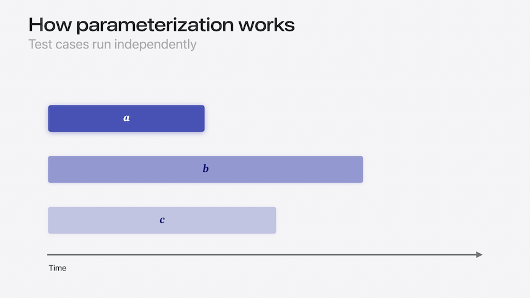

# [**Go further with Swift Testing**](https://developer.apple.com/videos/play/wwdc2024-10195)

---

* [**Meet Swift Testing**](./Meet%20Swift%20Testing.md) session

### **Expressive code**


#### Expectations

* Expectations are how you validate that your code is behaving as expected in Swift Testing
* When you're testing and expecting a throwing function to return successfully, just call it inside your test

```swift
import Testing

@Test func brewTeaSuccessfully() throws {
    let teaLeaves = TeaLeaves(name: "EarlGrey", optimalBrewTime: 4)
    let cupOfTea = try teaLeaves.brew(forMinutes: 3)
    #expect(cupOfTea.quality == .perfect)
}
```

* To verify failure cases, you need to catch and examine the error thrown by the function
    * Could do a catch statement and examine the error
    * Better to use the `#expect(throws:)` macro
        * Can pass `(any Error).self` to catch any error
        * Can also pass a specific error like below (below will fail with any other error that is not `BrewingError`)
        * Can even test for specific case of an error, such as `BrewingError.oversteeped`

```swift
import Testing

@Test func brewTeaError() throws {
    let teaLeaves = TeaLeaves(name: "EarlGrey", optimalBrewTime: 4)
    // #expect(throws: (any Error).self) {}
    // #expect(throws: BrewingError.self) {
    #expect(throws: BrewingError.oversteeped) {
        try teaLeaves.brew(forMinutes: 200) // We don't want this to fail the test!
    }
}
```

* Can customize error validation to check for:
    * Specific types or cases of errors
    * Whether associated values or properties are correct
    * Anything else to ensure the error your code threw was correct

```swift
import Testing

@Test func brewTea() {
    let teaLeaves = TeaLeaves(name: "EarlGrey", optimalBrewTime: 4)
    #expect {
        try teaLeaves.brew(forMinutes: 3)
    } throws: { error in
        guard let error = error as? BrewingError,
              case let .needsMoreTime(optimalBrewTime) = error else {
            return false
        }
        return optimalBrewTime == 4
    }
}
```

#### Required expectations

* Any regular expectation (including throwing ones) can be made into a required expectation

```swift
import Testing

@Test func brewAllGreenTeas() throws {
  try #require(throws: BrewingError.self) {
    brewMultipleTeas(teaLeaves: ["Sencha", "EarlGrey", "Jasmine"], time: 2)
  }
}
```

* In cases where you're validating an optional value, you can use a required expectation to document control flow

```swift
import Testing

struct TeaLeaves {symbols
    let name: String
    let optimalBrewTime: Int

    func brew(forMinutes minutes: Int) throws -> Tea { ... }
}

@Test func brewTea() throws {
    let teaLeaves = TeaLeaves(name: "Sencha", optimalBrewTime: 2)
    let brewedTea = try teaLeaves.brew(forMinutes: 100)
    /* guard let color = brewedTea.color else {
        Issue.record("Tea color was not available!")
    }*/
    let color = try #require(brewedTea.color)
    #expect(color == .green)
}
```

#### Known issues

* When you have tests that are failing that cannot be fixed immediately, there are several ways to deal with this
    * Could use `@Test(.disabled)` to force a test not to run for now, but...
    * Better to use `withKnownIssue` to let the test still run, and still notify of any compilation errors
        * If the function returns an error, the test's results will not count towards a test failure, as the failure is expected
        * Instead, the test will be surfaces as an expected failure

```swift
import Testing

// @Test(.disabled) func softServeIceCreamInCone() throws {
@Test func softServeIceCreamInCone() throws {
    withKnownIssue {
        try softServeMachine.makeSoftServe(in: .cone)
    }
}
```

* If a test performs multiple checks, just wrap the failing portion in `withKnownIssue` and allow the rest of the validations to run

```swift
import Testing

@Test func softServeIceCreamInCone() throws {
    let iceCreamBatter = IceCreamBatter(flavor: .chocolate)
    try #require(iceCreamBatter != nil)
    #expect(iceCreamBatter.flavor == .chocolate)

    withKnownIssue {
        try softServeMachine.makeSoftServe(in: .cone)
    }
}
```

#### Custom test descriptions

* Structs and classes produce a lot of noise in test results because their description contains a lot of data that may not be useful during testing
* The `CustomTestStringConvertible` protocol contains a `testDescription` parameter that can be used to provide a test-specific description

```swift
import Testing

struct SoftServe: CustomTestStringConvertible {
    let flavor: Flavor
    let container: Container
    let toppings: [Topping]

    var testDescription: String {
        "\(flavor) in a \(container)"
    }
}

@Test(arguments: [
    SoftServe(flavor: .vanilla, container: .cone, toppings: [.sprinkles]),
    SoftServe(flavor: .chocolate, container: .cone, toppings: [.sprinkles]),
    SoftServe(flavor: .pineapple, container: .cup, toppings: [.whippedCream])
])
func softServeFlavors(_ softServe: SoftServe) { /*...*/ }
```

### **Parameterized testing**

* Parameterized testing provides a way to provide test coverage for every case in an enumeration
* Much simpler than writing a test for each case in the enumeration
* Xcode supports re-running individual test cases of a test function, when the type of input conforms to Codable
    * Allows retrying of individual failing test cases without needing to re-run other test cases that ran successfully

```swift
extension IceCream {
    enum Flavor {
        case vanilla, chocolate, strawberry, mintChip, rockyRoad, pistachio

        var containsNuts: Bool {
            switch self {
            case .rockyRoad, .pistachio:
                return true
            default:
                return false
            }
        }
    }
}

import Testing

@Test func doesVanillaContainNuts() throws {
    try #require(!IceCream.Flavor.vanilla.containsNuts)
}
```



* Don't loop over arguments within the test function
    * The entire test will fail if any argument fails within the loop
* Instead, pass the arguments to the test attribute
    * The test function will pass each argument as its own separate test
    * Each argument gets its own run button
    * Get a rich information view for failed parameterized tests

```swift
import Testing

extension IceCream {
    enum Flavor {
        case vanilla, chocolate, strawberry, mintChip, rockyRoad, pistachio
    }
}

// This will fail if any of the arguments fail
// @Test
// func doesNotContainNuts() throws {
//     for flavor in [IceCream.Flavor.vanilla, .chocolate, .strawberry, .mintChip] {
//         try #require(!flavor.containsNuts)
//     }
// }

@Test(arguments: [IceCream.Flavor.vanilla, .chocolate, .strawberry, .mintChip])
func doesNotContainNuts(flavor: IceCream.Flavor) throws {
    try #require(!flavor.containsNuts)
}

@Test(arguments: [IceCream.Flavor.rockyRoad, .pistachio])
func containNuts(flavor: IceCream.Flavor) {
   #expect(flavor.containsNuts)
}
```

* Parameter input types also accept:
    * Array
    * Set
    * OptionSet
    * Dictionary
    * Range
* Can also create tests that take multiple parameters
    * All combinations from each parameter are automatically tested
    * Test functions accept a maximum of two collections
    * Can use the `.zip` function to match up pairs of inputs that should go together

```swift
import Testing

enum Ingredient: CaseIterable {
    case rice, potato, lettuce, egg
}

enum Dish: CaseIterable {
    case onigiri, fries, salad, omelette
}

@Test(arguments: Ingredient.allCases, Dish.allCases)
func cook(_ ingredient: Ingredient, into dish: Dish) async throws {
    #expect(ingredient.isFresh)
    let result = try cook(ingredient)
    try #require(result.isDelicious)
    try #require(result == dish)
}

// Test pairs instead of all combinations
@Test(arguments: zip(Ingredient.allCases, Dish.allCases))
func cook(_ ingredient: Ingredient, into dish: Dish) async throws {
    #expect(ingredient.isFresh)
    let result = try cook(ingredient)
    try #require(result.isDelicious)
    try #require(result == dish)
}
```

### **Organizing tests**

* Suites are types containing test functions
    * Can be documented with traits, such as a display name
    * Suites can also contain other suites

```swift
import Testing

@Suite("Various desserts")
struct DessertTests {
    @Suite struct WarmDesserts {
        @Test func applePieCrustLayers() { /* ... */ }
        @Test func lavaCakeBakingTime() { /* ... */ }
        @Test func eggWaffleFlavors() { /* ... */ }
    }

    @Suite struct ColdDesserts {
        @Test func cheesecakeBakingStrategy() { /* ... */ }
        @Test func mangoSagoToppings() { /* ... */ }
        @Test func bananaSplitMinimumScoop() { /* ... */ }
    }
}
```

* Tag traits
    * Associate tests across files, suites, and targets
    * Tags can be added to suites or individual tests
    * Tags and suites can have multiple tags
    * Helps run tests across groups
    * Run a subset of tests in your test plan
    * Analyze results across entire test targets

```swift
import Testing 

extension Tag {
    @Tag static var caffeinated: Self
    @Tag static var chocolatey: Self
}

@Suite(.tags(.caffeinated)) struct DrinkTests {
    @Test func espressoExtractionTime() { /* ... */ }
    @Test func greenTeaBrewTime() { /* ... */ }
    @Test(.tags(.chocolatey)) func mochaIngredientProportion() { /* ... */ }
}

@Suite struct DessertTests {
    @Test(.tags(.caffeinated, .chocolatey)) func espressoBrownieTexture() { /* ... */ }
    @Test func bungeoppangFilling() { /* ... */ }
    @Test func fruitMochiFlavors() { /* ... */ }
}
```

### **Testing in parallel**

#### Parallel testing basics

* XCTest runs tests serially by default
* Swift Testing runs tests in parallel by default
    * Regardless of whether they are synchronous or asynchronous
* Test functions can be isolated to a global actor like MainActor when needed
* Tests run in random order
    * Helps surface hidden dependencies between tests, like the tests below

```swift
import Testing

// ❌ This code is not concurrency-safe.

var cupcake: Cupcake? = nil

@Test func bakeCupcake() async {
    cupcake = await Cupcake.bake(toppedWith: .frosting)
    // ...
}

@Test func eatCupcake() async {
    await eat(cupcake!)
    // ...
}
```

* The `.serialized` trait can be added to a test suite to indicate that its tests need to be run serially
    * Can also be applied to a parameterized test function to assure that its test cases run one at a time
    * If applied to a suite that contains another suite, it's automatically inherited
    * Other tests from other suites can still be run in parallel

```swift
import Testing

@Suite("Cupcake tests", .serialized)
struct CupcakeTests {
    var cupcake: Cupcake?

    @Suite("Mini birthday cupcake tests")
    struct MiniBirthdayCupcakeTests {
        // ...
    }

    @Test(arguments: [...]) func mixing(ingredient: Food) { /* ... */ }
    @Test func baking() { /* ... */ }
    @Test func decorating() { /* ... */ }
    @Test func eating() { /* ... */ }
}
```

#### Asynchronous conditions

* Use the same concurrency features in Swift Testing that would be used in production code
    * `await` works the same way and will suspend a test allowing other test code to run while work is pending

```swift
import Testing

@Test func bakeCookies() async throws {
    let cookies = await Cookie.bake(count: 10)
    try await eat(cookies, with: .milk)
}
```

* Code using completion handlers will not work properly by default, because the completion handler will run after the function returns
    * For most completion code, Swift provides an async overload automatically that can be used instead

```swift
import Testing

@Test func bakeCookies() async throws {
    let cookies = await Cookie.bake(count: 10)
    // ❌ This code will run after the test function returns.
    eat(cookies, with: .milk) { result, error in
        #expect(result != nil)
    }
}

import Testing

@Test func bakeCookies() async throws {
    let cookies = await Cookie.bake(count: 10)
    try await eat(cookies, with: .milk)
}
```

* If an async overload is *not* available, you can use `withCheckedContinuation` or `withCheckedThrowingContinuation` to convert it to an expression that can be awaited
    * [**Meet async/await in Swift**](https://developer.apple.com/videos/play/wwdc2021/10132/) session from WWDC 2021

```swift
import Testing

@Test func bakeCookies() async throws {
    let cookies = await Cookie.bake(count: 10)
    try await withCheckedThrowingContinuation { continuation in
        eat(cookies, with: .milk) { result, error in
            if let result {
                continuation.resume(returning: result)
            } else {
                continuation.resume(throwing: error)
            }
        }
    }
}
```

* Code with event handlers that may fire more than once is also not concurrency safe
    * Trying to count the number of items with a variable will result in a concurrency error

```swift
import Testing

@Test func bakeCookies() async throws {
    let cookies = await Cookie.bake(count: 10)
    // ❌ This code is not concurrency-safe.
    var cookiesEaten = 0
    try await eat(cookies, with: .milk) { cookie, crumbs in
        #expect(!crumbs.in(.milk))
        cookiesEaten += 1
    }
    #expect(cookiesEaten == 10)
}
```

* Instead, use a `confirmation` to handle this situation
    * A confirmation is expected to occur exactly once, but you can specify a different expected count
    * Can also specify an `expectedCount` of `0` if the confirmation should never occur during testing

```swift
import Testing

@Test func bakeCookies() async throws {
    let cookies = await Cookie.bake(count: 10)
    try await confirmation("Ate cookies", expectedCount: 10) { ateCookie in
        try await eat(cookies, with: .milk) { cookie, crumbs in
            #expect(!crumbs.in(.milk))
            ateCookie()
        }
    }
}
```
