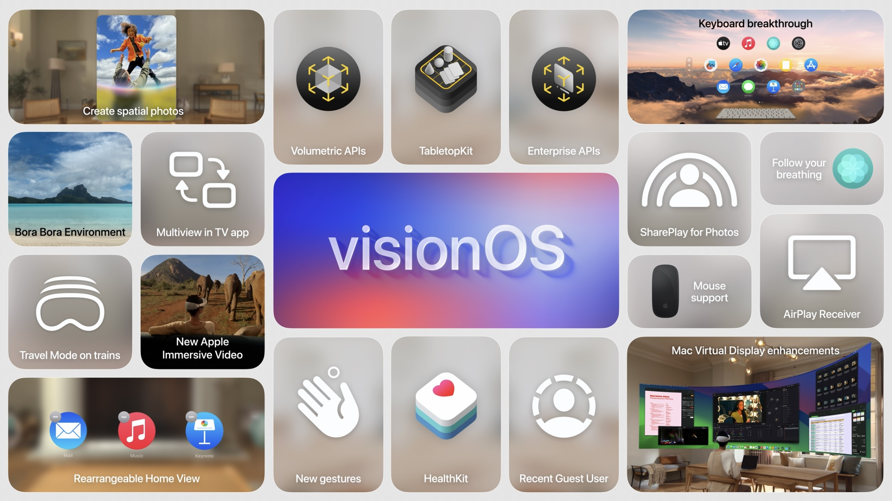
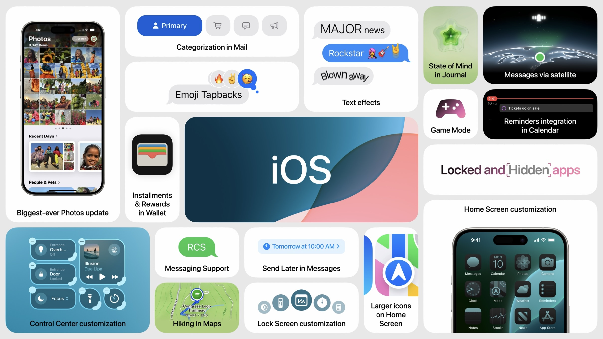
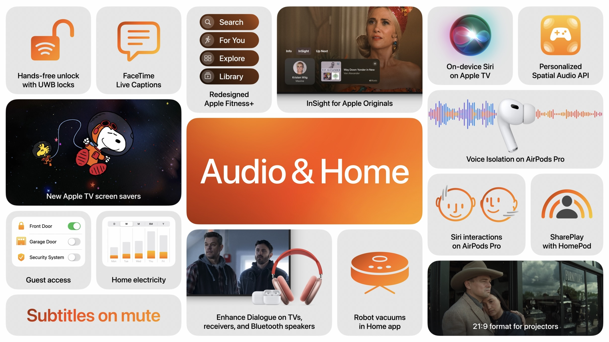
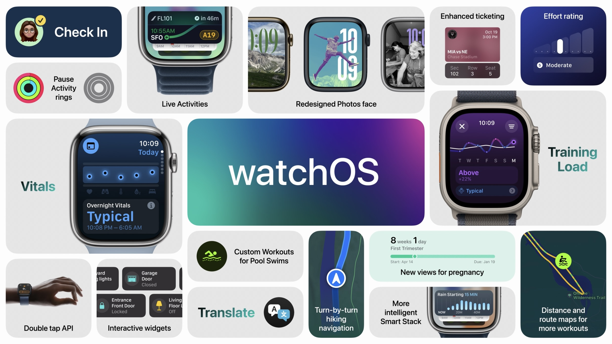

# [**Keynote**](https://developer.apple.com/videos/play/wwdc2024/101/)

---

### **visionOS**

* Photos
    * Spatial photos created from existing library
    * Shareplay added
* New gestures
* Higher display resolutions/sizes coming later this year for Mac display
* Train support added to travel mode
* TabletopKit
    * Easier to create apps that sit flat on a 2D surface
* New Volumetric APIs
* New Enterprise APIs
* New professional video workflow available in the fall
* Apple Immersive Video
    * Partnered with Blackmagicdesign to build a new production workflow to create these
    * Availalbe later this year
* Coming to 8 new countries this summer

### **iOS**

* Home Screen
    * App icons and widgets can now be arranged more freely
    * Dark mode now changes how app icons look
    * New customization to tint icons with color
* Control Center
    * Can swipe vertically to new groups of controls on separate screens
    * Continuous swipe brings up paging indicators
    * New controls gallery
    * Controls API for developers
        * Also available on the lock screen
        * Can invoke with teh action button
* Privacy
    * Can now lock apps with Face ID/Touch ID/Password
    * Can hide apps that appear in a hidden apps folder that is locked
    * New fine-grained control over which contacts an app can see
    * New way for developers to pair devices to an app
* Messages
    * Tapbacks now include all emojis (**FINALLY**)
    * Schedule messages to send later
    * New formatting options for text (bold, italics, etc.)
    * New text effects to give specific words special effects
    * Can now use satellite capabilities to send messages
        * supports SMS over satellite as well
    * RCS support
* Mail
    * On-device categorization
        * Primary, transactions, marketing, etc.
        * Can bring together groups of messages (like flight info)
        * Can re-categorize senders/messages
* Maps
    * New topographic maps with trail/hiking maps
        * Available offline
        * Can create own maps
* Wallet
    * Tap-to-cash - pay by bringing phones together
    * New web apple pay updates
    * Event tickets updated
* Journal
    * New insights view showing streak, stats, calendar
    * Search added
* Gaming
    * Game mode coming to iPhone to minimize background activity to achieve better game performance
* Photos
    * New single view with photo grid at the top and libraries at the bottom
    * Filter button to narrow down to specific types of content
    * Below the grid has collections (recents, people, memories, etc.)
        * Can now create groups of people
        * Can pin collections and organize them
    * Swiping right from the grid which highlights top content (favorites, featured, surfaced by the app) in a slideshow

### **Audio/Home**

* AirPods
    * Can nod your head yes or no to respond to Siri
    * Voice Isolation coming to AirPods Pro
    * Personalized spatial audio includes gaming
        * New API for developers
* tvOS
    * InSight
        * Swipe down on remote to see actors/character names in real time
        * Shows names of songs playing as well
    * Enhanced dialog for more speakers
        * Uses machine learning to make sure dialog comes through
    * Subtitles more convenient
        * When you mute or go back, subtitles will come on automatically
    * 21:9 format for projectors added
    * New way to switch between screensavers
        * New screensavers - scenes from AppleTV shows and a snoopy screensaver

### **watchOS**

* Activity
    * New training mode
        * See how workouts are impacting your body over time
            * Estimates effort rating
            * Add own ratings to help adjust the estimates
        * See how your workouts compare to your average and change over time
    * Newly customizable activity screen
    * Can finally pause for rest days
* Vitals App
    * Can check on daily health metrics
    * Outliers highlighted with details
    * Notifications when multiple metrics are out of range
* Cycle tracking now shows gestational trends
* New widgets added to widget smart stack automatically based on ML models
* Translation added
* Check-In now on Apple Watch, integrates with workouts as well
* Developers can now show live activities in the smart stacks
* New double-tap API

### **iPadOS**

* Same updates as iOS with customizable home screen and control center updates
* New floating tab bar (similar to top of tv app)
* Several apps updated for iPadOS
    * New animations
        * APIs available for developers to do the same
* New ability to control someone else's device
* Calculator added
    * History, unit conversion
* Math Notes
    * Can use pencil to write equations to solve problems
    * Update in real time as you update equations
    * Can be saved and revisited
    * Works with collaborations as well
    * Supports variables
        * changing variables update results in realtime
        * Can hover over variables to get a slider to adjust values
    * Works in Calculator and Notes app
* Notes
    * New smart script that improves handwriting support in notes
    * Learns your handwriting, and then cleans up your handwriting as you write
    * Can paste text in and it will appear in your handwriting
    * Scribble out text to erase it

### **macOS**

* macOS Sequoia
* Gets Math Notes feature
* iPhone Mirroring
    * Mirrors phone screen on computer
    * Can use mac keyboard/trackpad to control device
    * iPhone notifications can now appear on mac
        * Clicking on one opens the app on your computer with mirroring
    * Audio comes through the mac as well
    * Phone stays locked so nobody else can use it
        * Works with standby mode as well
* New updates to window organization
    * Suggests tiling
    * New keyboard shortcuts as well
* New presenter preview to see what you will share before you share your screen on a video call
    * Can now supply background replacements via the system
* Passwords
    * New standalone app
    * Organizes passwords, verifications codes, security alerts
    * On all platforms, including Windows with new iCloud app
* Safari
    * Highlights
        * Detects relevant info on websites as you browse
        * Summaries generated
    * Redesigned reader mode with summaries and Table of Contents
    * Viewer
        * Puts video in its own window with easily accessible controls
* Gaming
    * Game Porting Toolkit 2
        * Improved Windows compatiblity and shader debugging
        * Easier to bring mac games to iPhone/iPad

### **Apple Intelligence**

* Generative models using personal context
* Protective of privacy
* macOS, iPadOS, iOS

#### **Capabilities**

* Use language and images to take action across apps
* Language
    * Powers new writing tools to rewrite, proof, or summarize text
    * Available automatically in apps
* Images
    * Can create new images using profile photos and text
    * Sketch, illustration, and animation styles
    * Included in notes, freeform, keynote, pages, and others
* Action
    * Can use natural language to create actions
* Context
    * Uses data in other apps, as well as what is currently present on screen

#### **Architecture**

* On-device processing
* On-device semantic index to organize and cross-reference information on device
* Most models run entirely on device
* Private Cloud Compute allows server-based models to be used for more complex models in a privacy-focused way
    * Runs on Apple hardware, with Apple code, on Apple servers
    * Sends only data relevant
    * Data is never stored
    * Used only for your requests
    * Verifiable privacy promises that can be verified by third parties

#### **Experiences**

* Siri
    * More natural, contextually relevant, personal
    * New look
    * Richer language understanding capabilities
    * Maintains context for consecutive queries/responses
    * Can now type to Siri with a double tap at the bottom of the screen
    * Can switch between text and voice
    * Can now answer more questions about how to do things on your iPhone, iPad, and Mac (Knowledge base)
    * Future features
        * On-screen awareness that uses what is on the screen as part of the context
        * Actions in and across apps, such as adding a photo to a note from the photos app
            * Made possible by enhancements to app intents
            * App Intents API makes this available to developers
    * Will be able to ask Siri to find something that you can't remember where something existed (message thread, document, etc.)
* Writing Tools/Text
    * Rewrite
        * Gives you different versions of what you've written so you can choose what you prefer
        * Suggestions shown inline
        * Can change the tone of text to make it more friendly, professionaly, or concise
        * Can even rewrite as poetry
    * Proofread
        * Helps with grammar, word choice, and sentence structure
        * Can review individually or all at once
        * Can summarize
    * Smart Reply
        * Helps craft replies by detecting questions in an email you are responding to
    * Mail
        * Summaries of emails and email threads
        * Identifies priority messages
* Notifications
    * Priority notifications appear at the top
    * Reduce interruptions focus to selectively surface ones that need immediate attention
* Images
    * Genmoji
        * Generated "emoji" based on text input
        * Responds with several choices
        * Can generate an emoji of someone with a picture
    * Image Playground
        * Starts with themes (accessory, places, etc.)
        * Can create images that are saved in your playground
        * Can use in messages and other apps
        * Provides suggestions based on context
        * Also an Image Playground app
        * Image Playground API
    * Image Wand
        * Can turn a rough sketch in Notes into an image via the Image Playground
        * Can use on empty space to get suggestions as well
    * Photos
        * Clean Up tools removes items from images
        * Can use natural language phrases when searching
        * Search in videos
        * Better memory movie creation
* Notes
    * Can record and transcribe audio
* Phone
    * Can record a live call, notifying participants
* ChatGPT
    * Chat CPT 4o support built into Siri
        * Prompts you to share your query with ChatGPT when Siri determines they might have info
        * Can also share a photo with a question
    * Integrated into system-wide writign tools with Compose
        * Can also be used for image generation
    * Requests and info will not be logged
    * Can be used for free, or an account can be used for paid features
    * Available later in the year
    * Other AI models will be added later
* Developers
    * SDKs updated
        * Image Playground
        * Writing Tools for free when using standard text views
    * SiriKit
        * Many enhancements with no changes
        * App Intents updates
    * Generative AI for Xcode
        * Code completion
        * Code assistance
* Available on iPhone 15 Pro models, and all M-series iPad/Mac devices
