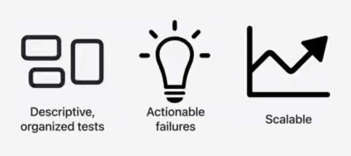
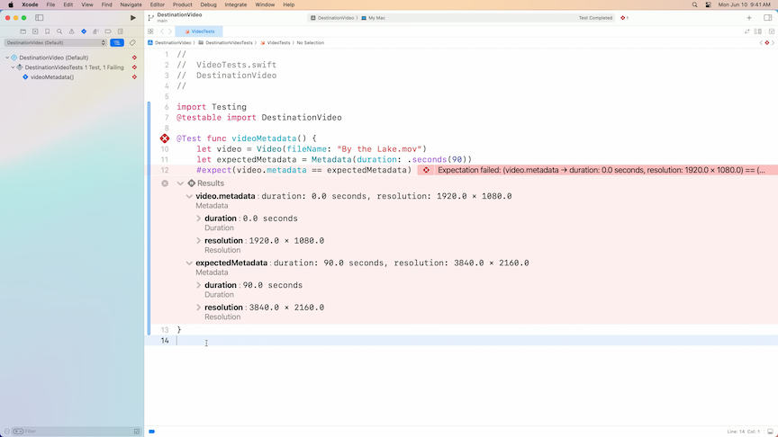
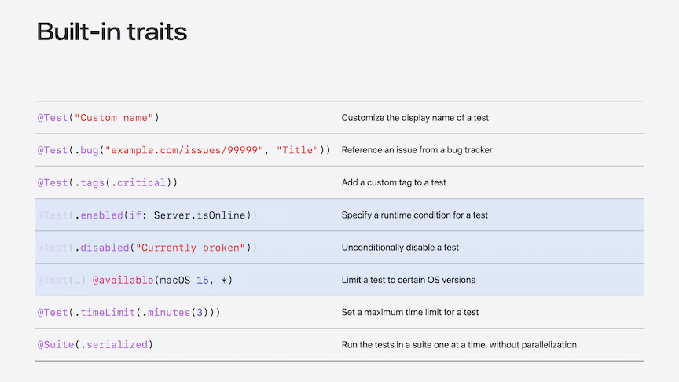
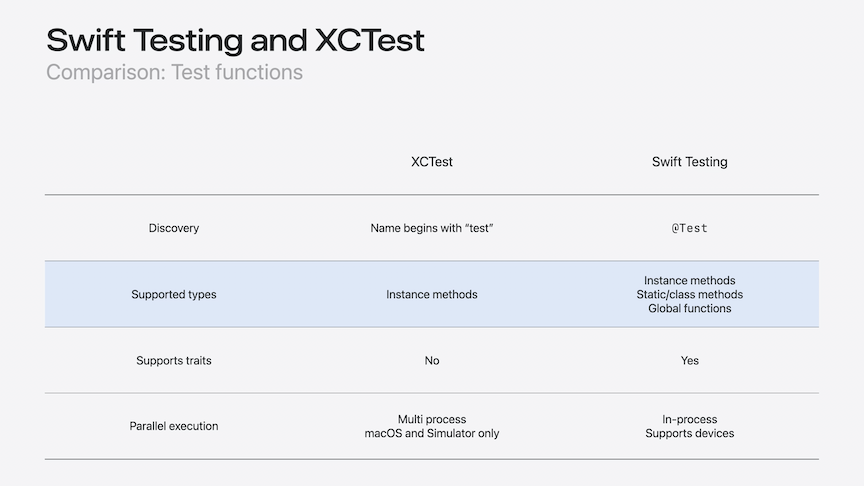
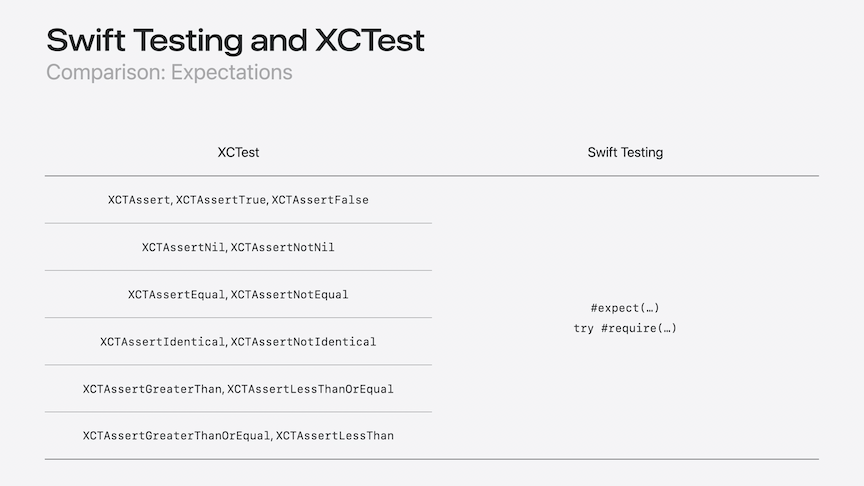
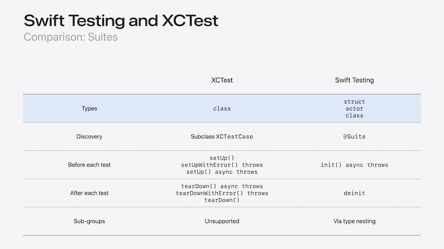

# [**Meet Swift Testing**](https://developer.apple.com/videos/play/wwdc2024-10179)

---



* Designed for Swift
    * Embraces modern features like concurrency and macros
    * Supports all major platforms, including Linux and Windows
    * Open development process

### **Building blocks**

* Start by adding a Test Bundle target `File -> New Target -> Unit Testing Bundle`
    * Swift Testing is the new default Testing System
    * import the Testing bundle
    * Write a global function and add the `@Test` attribute

```swift
import Testing

@Test func videoMetadata() {
    // ...
}
```

* Test functions
    * Annotated using `@Test`
    * Can be global functions or methods in a type
    * May be `async` or `throws`
    * May be global actor-isolated (such as `@MainActor`)
    * When importing other modules, use the `@testing` attribute
        * Not part of Swift Testing, but a language feature allowing us to reference types whose access level is internal

```swift
import Testing
@testable import DestinationVideo

@Test func videoMetadata() {
    let video = Video(fileName: "By the Lake.mov")
    let expectedMetadata = Metadata(duration: .seconds(90))
    #expect(video.metadata == expectedMetadata)
}
```

* Expectations
    * Use `#expect` macro to validate that an expected condition is true
    * Accepts ordinary expressions and operators
    * Captures source code and sub-expression values upon failure
    * For failed tests, click on the failure message and choose `Show` to see more about what went wrong



* Required expectations
    * Can use `try #require` macro to stop a test early if an expectation fails
        * `try #require(session.isValid)`
    * Can be used to unwrap optional values and stop a test when nil
        * `let method = try #require(paymentMethods.first)`

* Custom display names
    * Names can be passed to a test attribute to make its purpose more clear
    * Will be shown in the test navigator

```swift
@Test("Check video metadata") func videoMetadata() {
    let video = Video(fileName: "By the Lake.mov")
    let expectedMetadata = Metadata(duration: .seconds(90))
    #expect(video.metadata == expectedMetadata)
}
```

* Traits
    * Add descriptive information about a test
    * Customize whether a test runs
    * Modify how a test behaves



* Test Suite
    * Group related test functions and suites (in a struct)
    * Annotate using `@Suite`
        * Implicit for types containing `@Test` functions or suites
    * May have stored instance properties
    * Use `init` and `deinit` for set-up and tear-down logic
    * Initialized once per instance `@Test` method to avoid accidental state sharing

```swift
struct VideoTests {

    @Test("Check video metadata") func videoMetadata() {
        let video = Video(fileName: "By the Lake.mov")
        let expectedMetadata = Metadata(duration: .seconds(90))
        #expect(video.metadata == expectedMetadata)
    }

    @Test func rating() async throws {
        let video = Video(fileName: "By the Lake.mov")
        #expect(video.contentRating == "G")
    }

}
```

* Stored properties can remove repetition within a Test Suite

```swift
struct VideoTests {
    let video = Video(fileName: "By the Lake.mov")

    @Test("Check video metadata") func videoMetadata() {
        let expectedMetadata = Metadata(duration: .seconds(90))
        #expect(video.metadata == expectedMetadata)
    }

    @Test func rating() async throws {
        #expect(video.contentRating == "G")
    }
}
```

### **Common workflows**

#### Tests with conditions

* Some tests should only be run under certain circumstances
    * Specify a runtime-evaluated condition for a test using `.enabled(if:)`
        * Tests will be skipped if condition is false
    * Unconditionally disable a test using `.disabled()`
        * Comment describing reason is included in the results
    * Pair any trait with `.bug()` to reference a known issue
    * Use `@available()` to specify an OS availability condition
        * Use instead of checking at runtime with `#available()`

```swift
@Test(.enabled(if: AppFeatures.isCommentingEnabled))
func videoCommenting() {
    // ...
}

@Test(.disabled("Due to a known crash"))
func example() {
    // ...
}

@Test(.disabled("Due to a known crash"),
      .bug("example.org/bugs/1234", "Program crashes at <symbol>"))
func example() {
    // ...
}

// ❌ Avoid checking availability at runtime using #available
@Test func hasRuntimeVersionCheck() {
    guard #available(macOS 15, *) else { return }

    // ...
}

// ✅ Prefer @available attribute on test function
@Test
@available(macOS 15, *)
func usesNewAPIs() {
    // ...
}
```

#### Tests with common characteristics

* Tags
    * The Test Navigator shows all tags at the bottom
    * We can view tests grouped by tag as well by using Group By: Tag mode
    * Tags can be on a single test or a suite
    * Associate tests which have things in common to:
        * Run all tests wth a specific tag
        * Filter by a tag or see insights in Test Report
    * Shared among tests anywhere in a project
    * Tags can be local to a project or shared

```swift
@Test(.tags(.formatting)) func rating() async throws {
    #expect(video.contentRating == "G")
}

@Suite(.tags(.formatting))
struct MetadataPresentation {
    let video = Video(fileName: "By the Lake.mov")

    @Test func rating() async throws {
        #expect(video.contentRating == "G")
    }

    @Test func formattedDuration() async throws {
        let videoLibrary = try await VideoLibrary()
        let video = try #require(await videoLibrary.video(named: "By the Lake"))
        #expect(video.formattedDuration == "0m 19s")
    }
}
```

* Recommended practices
    * Prefer tags over test names when including/excluding in a Test Plan
    * Use the most appropriate trait type
        * Example: `.enabled(if:)` instead of `.tags()` to represent a condition
    * [**Go further with Swift Testing**](./Go%20further%20with%20Swift%20Testing.md) session

#### Repeating tests with different arguments

* Example of writing many tests to check the same thing with different arguments:

```swift
struct VideoContinentsTests {

    @Test func mentionsFor_A_Beach() async throws {
        let videoLibrary = try await VideoLibrary()
        let video = try #require(await videoLibrary.video(named: "A Beach"))
        #expect(!video.mentionedContinents.isEmpty)
        #expect(video.mentionedContinents.count <= 3)
    }

    @Test func mentionsFor_By_the_Lake() async throws {
        let videoLibrary = try await VideoLibrary()
        let video = try #require(await videoLibrary.video(named: "By the Lake"))
        #expect(!video.mentionedContinents.isEmpty)
        #expect(video.mentionedContinents.count <= 3)
    }

    @Test func mentionsFor_Camping_in_the_Woods() async throws {
        let videoLibrary = try await VideoLibrary()
        let video = try #require(await videoLibrary.video(named: "Camping in the Woods"))
        #expect(!video.mentionedContinents.isEmpty)
        #expect(video.mentionedContinents.count <= 3)
    }

    // ...and more, similar test functions
}
```

* Instead of multiple tests, we can use Parameterized Testing to write a single test
    * Add a parameter to the signature
        * Requires the arguments to be passed to the test
    * Update the test to use the parameter
    * Can still give other traits like a display name
    * Can run an individual argument by simply running that argument in the Test Navigator
    * Better than running tests with a for...in loop to test multiple arguments
        * View details of each argument in results
        * Re-run individual arguments to debug
        * Run arguments in parallel
    * [**Go further with Swift Testing**](./Go%20further%20with%20Swift%20Testing.md) session

```swift
struct VideoContinentsTests {

    @Test("Number of mentioned continents", arguments: [
        "A Beach",
        "By the Lake",
        "Camping in the Woods",
        "The Rolling Hills",
        "Ocean Breeze",
        "Patagonia Lake",
        "Scotland Coast",
        "China Paddy Field",
    ])
    func mentionedContinentCounts(videoName: String) async throws {
        let videoLibrary = try await VideoLibrary()
        let video = try #require(await videoLibrary.video(named: videoName))
        #expect(!video.mentionedContinents.isEmpty)
        #expect(video.mentionedContinents.count <= 3)
    }

}
```


### **Swift Testing and XCTest**





* Halting tests
    * XCTest has a single `continueAfterFailure` property that halts on the first fail
    * Swift Testing allows you to halt on specific tests, and alternate between `#require` and `#expect` as the test progresses

```swift
// Halting after test failures

// XCTest
func testExample) {
    self.continueAfterFailure = false
    XCTAssertEqual(x, y)
    XCTAssertTrue (z. isEnabled)
}

// Swift Testing
@Test func example throws {
    try #require(x == y)
    #expect (z.isEnabled)
}
```



* Migrating from XCTest
    * Share a single unit test target
        * Swift Testing tests can coexist with XCTests
    * Consolidate similar XCTests into a parameterized test
    * Migrate each XCTest class with only one test method to a global `@Test` function
    * Remove redundant "test" prefix from method names
* Supported functionality
    * Continue using XCTest for tests which:
        * Use UI automation APIs (such as `XCUIApplication`)
        * Use performance testing APIs (such as `XCTMetric`)
        * Can only be written in Obj-C
    * Avoid calling `XCTAssert()` from Swift Testing tests, or `#expect()` from XCTests
* View [documentation](https://developer.apple.com/documentation/testing/migratingfromxctest) for migrating tests

### **Open source**

* Will soon transition to the recently announced swiftlang organization on GitHub
* Works on all Apple OS's which support Swift Concurrency
    * Also on Linux and Windows
    * Common codebase on all platforms
* Integrated into command:
    * Swift Package Manager command line
        * Use `swift test` to run on the command line
    * Xcode
    * VS Code with Swift Extension
