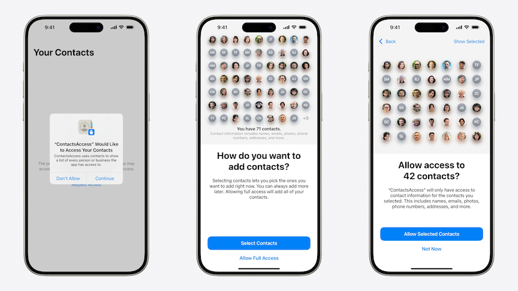
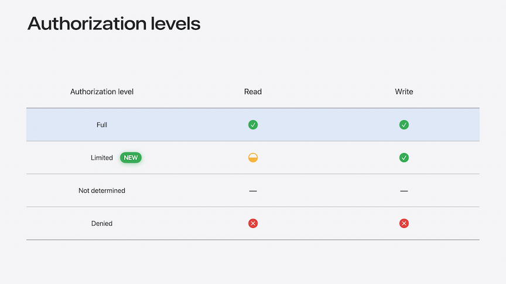
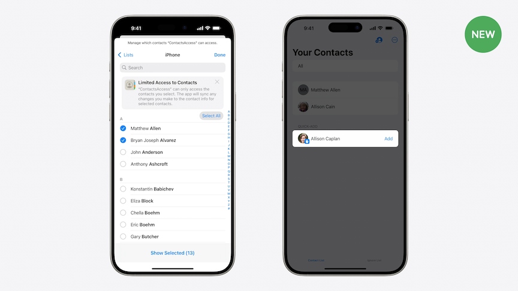
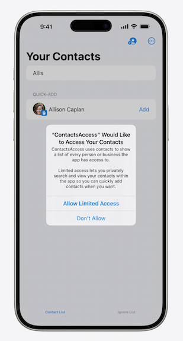
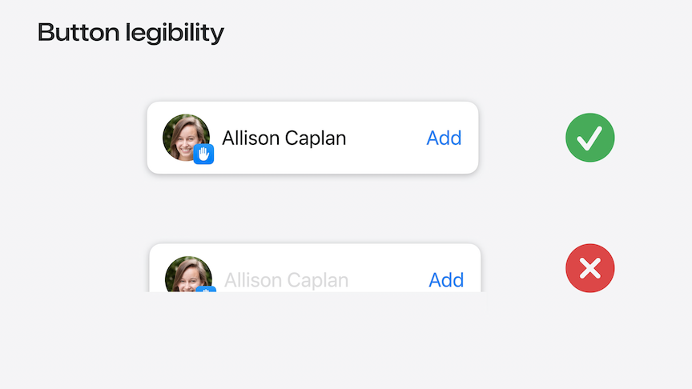
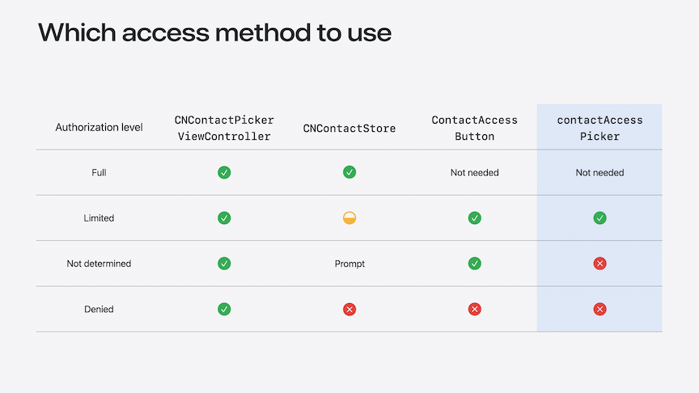

# [**Meet the Contact Access Button**](https://developer.apple.com/videos/play/wwdc2024-10121)

---

### **Limited access**

* Contacts authorization now has the option to only share a portion of the contacts database
* Two stage flow
    * Step one is the alert to ask whether the user wants to share contacts or not
    * If `Continue` is tapped, the user is prompted to give either full access or select contacts
        * Not a final choice, contact list can be extended later



* Now four authorization levels
    * App *always* starts in the `Not Determined` status



* Two new APIs to grant the app access to additional contacts
    * The contact access picker allows changes to which contact the app has access to, without leaving the app
    * The contact access button provides a way to manage access to contacts with a single tap



### **Contact Access Button**

* Shows contact search result for search results that the app doesn't yet have content for
* Seamlessly blends into your UI
* Only requires on tap
* Incremental access
    * App gets access to the contacts it needs right when it needs them
* Request access when required
    * Intuitive and obvious need
* Shows intuitive benefit
* Easier than upfront request
* If the Contact Access Button is tapped *before* the app has authorization, it automatically shows a simplified prompt that requests limited access
    * Makes it easier to understand why the app wants access to the data



```swift
// Using ContactAccessButton

@Binding var searchText: String
@State var authorizationStatus: CNAuthorizationStatus = .notDetermined

var body: some View {
    List {
        ForEach(searchResults(for: searchText)) { person in
            ResultRow(person)
        }
        if authorizationStatus == .limited || authorizationStatus == .notDetermined {
            ContactAccessButton(queryString: searchText) { identifiers in
                let contacts = await fetchContacts(withIdentifiers: identifiers)
                dismissSearch(withResult: contacts)
            }
        }
    }
}
```

* Button uses standard SwiftUI modifiers to be customizable to fit the app

```swift
ContactAccessButton(queryString: searchText)
  .font(.system(weight: .bold))
  .foregroundStyle(.gray)
  .tint(.green)
  .contactAccessButtonCaption(.phone)
  .contactAccessButtonStyle(ContactAccessButton.Style(imageWidth: 30))
```

* Private by design
    * Contents are private, but visible in the app
    * Taps are securely verified
    * Contents always legible
* Button legibility
    * Must be legible and unobstructed, or it will not grant the app access to additional contacts



### **Accessing contacts**

#### CNContactStore

* Primary gateway to contact data
* Presents access prompt on use
* Report authorization status
* Read/write requires authorization
* Notifies when data changes
* Limited access
    * `Limited` status changes which contacts are accessible
    * Use `CNAuthorizationStatus.limited` to determine whether full or partial access was granted
    * Useful for showing alternative UI
    * Use with `ContactAccessButton` return identifiers

```swift
// Fetching contacts with CNContactStore

func fetchContacts(withIdentifiers identifiers: [String]) async -> [CNContact] {
    return await Task {
        let keys = [CNContactFormatter.descriptorForRequiredKeys(for: .fullName)]
        let fetchRequest = CNContactFetchRequest(keysToFetch: keys)
        fetchRequest.predicate = CNContact.predicateForContacts(withIdentifiers: identifiers)
        var contacts: [CNContact] = []
        do {
            try CNContactStore().enumerateContacts(with: fetchRequest) { contact, _ in
                contacts.append(contact)
            }
        } catch {
            // ...
        }
        return contacts
    }.value
}
```

#### Contact picker view controller

* System UI contact picker
* Delivers snapshot of data
* No authorization required
* Implicit permission via interaction
* Good for one-off tasks

#### Contact access picker

* Manage limited access set
* Best for bulk access changes
* Reports newly shared contacts
* **Access** picker, not **contact** picker

```swift
// Using contactAccessPicker

@State private var isPresented = false

var body: some View {
    Button("Show picker") {
        isPresented.toggle()
    }.contactAccessPicker(isPresented: $isPresented) { identifiers in
        let contacts = await fetchContacts(withIdentifiers: identifiers)
        // use the new contacts!
    }
}
```

### **Which access method to use**


