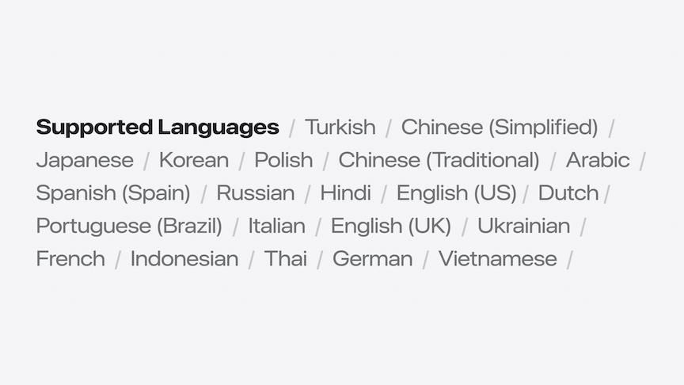

# [**Meet the Translation API**](https://developer.apple.com/videos/play/wwdc2024/10117/)

---

* Translation API
    * Translation.framework
    * Bring translation to your app
    * Works on iOS, iPadOS, and macOS

### **Simple overlay**

* Use `translationPresentation()` modifier
    * `MyContentView.translationPresentation(isPresented: $showsTranslation, text: inputText)`
    * Shows the translation view in an overlay
    * Can change the target language, just like in the system app
* Further flexibility
    * Can show multiple translations
    * Change content over time
    * Integrate with your app's UI

### **Flexible translation**

* `TranslationSession`
    * Translate a single string or batches of strings
    * Get results back using Swift async syntax

```swift
let session: TranslationSession
let inputStrings: [String] = ...

let requests: [TranslationSession.Request] = inputStrings.map { init(sourceText: $0) }
for response in try? await session.translations(from: requests) {
    handle(response: response)
}
```

* You don't make an instance of `TranslationSession` yourself
    * Sometimes it needs to show UI to the user
    * Attach a `.translationTask` to your view, which will call the closure to provide you a `TranslationSession` instance to use
    * If you want more control over when translation occurs, you can provide a `TranslationSession.Configuration`
        * The closure will then only run when the configuration changes
        * Set to a non-nil value to trigger it initially, then change it any time you want to run the closure again
            * Can call `.invalidate()` on the configuration to translate new text

```swift
// Using TranslationSession
import SwiftUI
import Translation

struct MyView: View {
    var sourceText: String
    @State private var targetText: String?
    @State private var configuration: TranslationSession.Configuration?

    var body: some View {
        Text(targetText ?? sourceText)
            .translationTask(configuration) { session in
                do {
                    let response = try await session.translate(sourceText)
                    targetText = response.targetText
                } catch { /* Handle error */ }
            }
    }
}
```

* On-device translation
    * Uses on-device ML models
    * Shared with all apps, including the Translate app
    * If they system, or any app, has downloaded a language, your app can also use it
    * API takes care of:
        * Download permission - will only ask for permission if the language is not already installed
        * Download progress
        * Continuing downloads in background
* Specifying languages
    * Optionally specify source and target languages
        * `translationTask(source:target:)
        * `TranslationSession.Configuration.init(source:target:)
    * `nil` source will attempt to identify language
        * If the framework can't identify the language, it will ask the user to pick
    * `nil` for the target language will pick a good language to translate into, based on whatever is used for the source language and the user's preferred languages
* Expected forms
    * `Locale` and `Locale.Language` can take many forms
        * Depending on which API returns a language, it could be just a language (`en`), a language with a variant (`zh-Hans`), a language with a region (`zh_CN`), or even a language with a seemingly unrelated region (`fr_JP` for a French speaking user living in Japan)
    * For best results, use values from `LanguageAvailability.supportedLanguages`
        * `en_US`, `zh_CN`, `fr_FR`
* Identifying languages
    * If possible, use `nil` source language
    * If you do need to identify the language of text, you can use `NLLanguageRecognizer`, and then convert to a `Locale.Language` that `TranslationSession` can use

```swift
import NaturalLanguage

func identifyLanguage(of sample: String) -> Locale. Language? {
    /// 'sample' = "Die schnelle braune Kiste sprang über den faulen Hund"
    let recognizer = NLLanguageRecognizer()
    recognizer.processString(sample)
    guard let language = recognizer.dominantLanguage else { return nil }
    /// 'language' = 'de'
    return Locale.Language(identifier: language.rawValue)
}
```

* Batch translation
    * Most efficient for multiple strings
    * Two batch functions
        * The first returns all results at once, after they are all ready, and in the original order
        * The second streams results as they become available, like `AsyncSequence`
            * Use `clientIdentifier` for ordering

```swift
public func translations(from batch: [Request]) async throws →> [Response]
public func translate(batch: [Request]) -> BatchResponse
```

### **Language support**



* `LanguageAvailability`
    * Query for supported languages
    * Optionally check for supported language pairings
        * Not all language combinations are supported
        * Every attempt to translate text with an unsupported pairing will return an error
        * Can also check the status with a snippet of source text instead of a source language

```swift
// Checking language pairing status
import Translation

let englishUS = Locale.Language (identifier: "en_US")
let englishUK = Locale.Language (identifier: "en_GB")
let hindi = Locale.Language(identifier: "hi_IN")
let availability = LanguageAvailability()

// supported or installed
let usToHi = await availability status(from: englishUS, to: hindi)
let ukToHi = await availability status(from: englishUk, to: hindi)

// . unsupported
let usToUk = await availability.status(from: englishUS, to: englishUK)
let hiToHi = await availability.status(from: hindi, to: hindi)

// Check status without a source language
let snippet = "The quick brown box jumped over the lazy dog"
let statusForSnippet = try? await availability.status(for: snippet, to: hindi)
```

### **Best practices**

* Develop with device, not the simulator
    * Translation APIs don't function in the simulator
* Attach view modifiers to the content itself
    * Since it's a popover on the iPad and Mac, this will attach it to the content or container, so it won't block the content being translated
* Any batch of requests should have all the source text in the same language
    * Mixing different languages in the same batch will produce incorrect results
    * Make separate calls to translate each language in a separate batch using the same session
        * The session's source language must be nil when doing this, so that the session will first identify the language of each batch

```swift
// Multiple calls to translate(batch:)

import SwiftUI
import Translation

func translate(using session: TranslationSession) async {
    // Requires 'session sourceLanguage to be 'nil'
    do {
        for try await response in session.translate(batch: self.germanRequests) {
            handle (response: response)
        }

        for try await response in session.translate(batch: self.spanishRequests) {
            handle (response: response)
        }
     } catch {
        // Handle error.
    }
}
```

* Only specify languages that are supported, otherwise all translations with this session will produce an error
* Use a `nil` source language when unsure
* If you know what languages the user is likely to need ahead of time, you can ask the user for download approval without translating
    * Use `TranslationSession.prepareTranslation()`
    * User if the user may be offline when translation is needed, or if you need to translate content that changes over time
* Session lifetime
    * `TranslationSession` requires visibility
        * Since it's anchored to a view, a session won't work if the view disappears
    * Don't store the instance elsewhere, outside the lifetime of its view
* There is a new SF Symbol (`translate`) for translation
    * Can use it anywhere in the UI where translation APIs are triggered, or refer to the translation features
