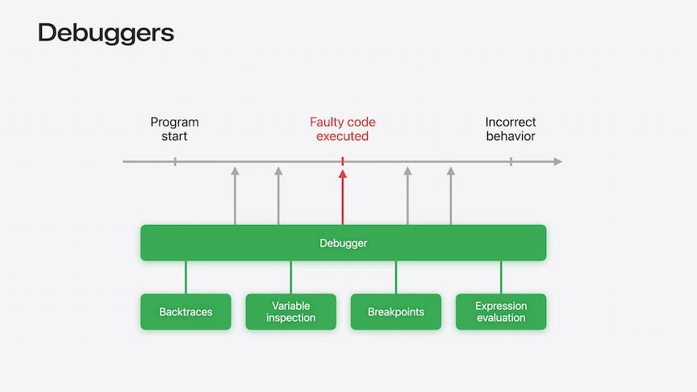

# [**Run, Break, Inspect: Explore effective debugging in LLDB**](https://developer.apple.com/videos/play/wwdc2024/10198/)

---

### **Debugging model**

* Main tools of debugging provided by LLDB:
    * Backtraces
    * Variable inspection
    * Breakpoints
    * Expression evaluation



* LLDB can help investigate issues without even running a program


### **Starting the debug session**

* Starting the session can be done by:
    * The start button in Xcode
    * Using the Terminal: `lldb -- <executable> <arguments...>`
* Crashlogs
    * LLDB can consume crashlogs and present them in a form that resembles a debugging session
    * Control-Click on a file and open it with Xcode
        * Select a project to open the crashlog in
        * Xcode will create a debugging session with the state of the program at the time of the crash, with the line of the crash highlighted


* Backtrace
    * The backtrace describes the sequence of function calls, or stack frames, that led to a program state
    * Provides a view into what each function was doing, where they were called, adn also where each of them was going to return to
    * The current backtrace is available in the Debug Navigator of Xcode
* Crashlogs work best when:
    * Repository is on the same commit as the version of the app that created the crashlog
    * The dSYM bundle for that build is available
    * [**Symbolication: beyond the basics**](https://developer.apple.com/videos/play/wwdc2021/10211/) session from WWDC 2021

### **Breaking**

* Breakpoint set on the first line of the code below
    * Before running, the Breakpoint Navigator shows one breakpoint
    * After running, LLDB resolves the line breakpoint into three separate locations
        * Indicates that we may stop at this breakpoint through different code paths

```swift
Button(action: { watchLater.toggle(video: video) }) {
  let inList = watchLater.isInList(video: video)
  Label(inList ? "In Watch Later" : "Add to Watch Later",
  systemImage: inList ? "checkmark" : "plus")
}
```

* Using the `break list` command in LLDB gives us more information about breakpoints
    * Describes the breakpoint on line 70
    * Also describes the three locations associated with that breakpoint using line and column numbers
    * LLDB assigns an ID to each breakpoint location (e.g. `1.1`)
        * 1.1 refers to the Button's constructor
        * 1.2 refers to the first argument of the constructor
        * 1.3 refers to the trailing closure
        * 1.1 and 1.3 are triggered when the View is rendered, 1.2 is triggered when the button is tapped


* When breaking, we can inspect the state of things using the `p` command (e.g. `p watchLater.count`)
    * Can get the value of specific items
    * Can also Control-click on a breakpoint and choosing `Edit Breakpoint`
        * Can add an action to print a debugger command, like in the image below
        * Can optionally automatically continue execution after hitting the breakpoint


#### On the command line

* To get access to the Debugger Command line, you must pause the application
    * Can set a breakpoint on a specific line with `b DetailView.swift:70`
    * Can also set breakpoint actions via tha command line with the steps below (this will overwrite any actions set through Xcode)
        * Creates the same action as the image above
        * Affects the most recent breakpoint, but it can modify a different breakpoint if provided with the optional breakpoint identifier argument

```swift
break command add
p "last video is \(watchLater.last?.name)"
continue
DONE
```

* LLDB provides detailed description of all its commands with `help <command>`
    * Can also get help for an option of a specific command with `help <command> <option>`
    * Use `apropros <keyword>` to search LLDB for a keyword
        * Returns any commands or options that are described by that keyword

#### High-firing breakpoints

* We can have a situation where we have a breakpoint that is triggered many times, but we are only interested in a subset of them. Three ways to handle this:
    * Breakpoint conditions define a rule for whether the debugger should stop the program or not
        * On the command line, we would use `break modify <breakpoint ID> -- condition "video.length > 60"`
        * In Xcode, we can edit the breakpoint and populate the `Condition` field with our condition
    * Use a breakpoint action
        * If, for instance, we only want to break on a line if a previous line was called, we can create a temporary breakpoint
        * Put an auto-continue breakpoint on the initial line we want called, and use `tbreak` for our action to create a temporary breakpoint (e.g. `tbreak Importer.swift:67`)
    * Set a breakpoint ignore count
        * On the command line, use `break modify <breakpoint ID> --ignore-count 10`
        * Same option is available on the Edit Breakpoint interface
    * For situations where a line of code is executed millions of times, the previous techniques can slow down program execution
        * The debugger still needs to stop every time to decide whether to continue or not
        * Instead, can set a breakpoint inside a condition, and use `raise(SIGSTOP)`
            * Instructs the application to stop and, if running through Xcode or LLDB, the debugger will take over as if a breakpoint had been reached

```swift
for video in videos {
    if (/*break_condition*/) {
        raise(SIGSTOP)
    }
    if (video.hasRemoteMedia) {
        video.loadRemoteMedia()
    }
    processVideo(video)
}
```

### **Inspecting program state**

* LLDB provides many commands to look at variables and evaluate expressions, but most of the time, `p` is the right command to use
    * In Xcode 15, it was reworked as an alias to the "do what I mean" print command
    * Combines many different tools under a single command
    * [**Debug with structured logging**](../2023/Debug%20with%20structured%20logging.md) session from WWDC 2023
* In the LLDB debugger, you can Control-Click on a printed line and select `Jump To Source` to go tot eh corresponding source code location
* If no source code is changed, you can Control-Click on the start button to relaunch without recompiling
* A Swift Error breakpoint instructs LLDB to stop the application as soon as a Swift Error is thrown
* The `p` command:
    * Is able to print variables and evaluate expressions
    * Works in any frame of the backtrace
    * Can iteratively build complex expressions
        * Prints intermediate results every step of the way without having to recompile any code
    * Helps identify information that could be logged

#### Custom type summaries

* Type summaries
    * With Swift 6, the output of `p` can be customized from source code
    * Annotate the type with `@DebugDescription`
    * Provide a `debugDescription` string property using:
        * String interpolation
        * Stored properties
    * `@DebugDescription` can replace `CustomDebugStringConvertible`
        * If the protocol is implemented with string interpolation and computer properties, you can use the macro instead of the protocol

```swift
// Type summaries

@DebugDescription
struct WatchLaterItem {
    let video: Video
    let name: String
    let addedOn: Date

    var debugDescription: String {
        "\(name) - \(addedOn)"
    }
}
```
