# [**State of the Union**](https://developer.apple.com/videos/play/wwdc2024/102/)

---

### **Apple Intelligence**

* Apple did a lot of things, like compression, to get models local on device
* Private Cloud Compute runs models in the cloud
    * Specifically made to run privately
    * Runs on a new os based on iOS
    * Omitted features like persistent data storage
    * Open to third party verification and part of the bug bounty program

| Server Stack |  |
| --------------- | ---------------------- |
| 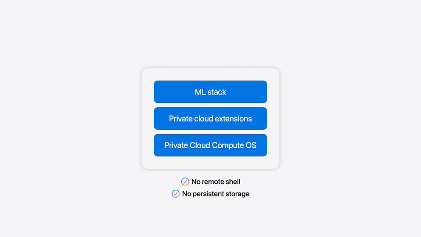 | 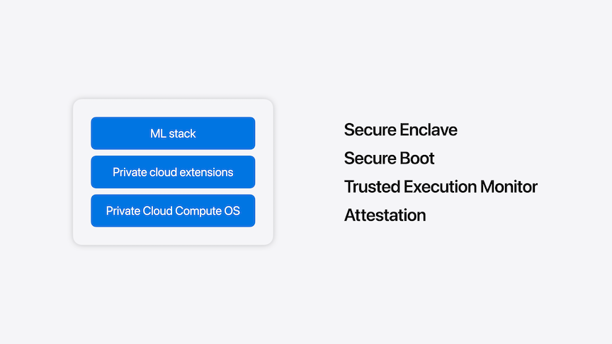 |

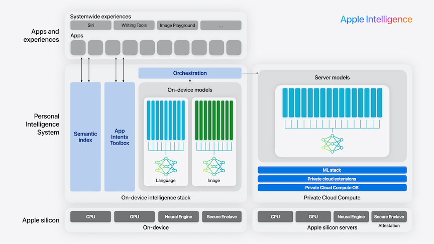

* Writing tools
    * Standard UI frameworks for textfields get these for free
    * New delegate for more customization
    * `textfield.supportsAdaptiveImageGlyph == true`
* New Image Playground API
    * Gives same experience as Messages and Image Playground app
    * SwiftUI uses `imagePlaygroundSheet()` modifier
* Siri
    * Significant updates to App Intents
    * New domains starting with those in the image below
    * Siri will be able to use any text in standard text views as context
    * New spotlight API

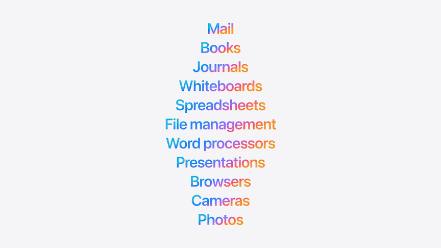

* **New Vision Frameworks**
    * Can combine CoreML with other frameworks, like Stable Diffusion or Mistral
    * Quantization can optimize speed of models
    * Apple Silicon optimized for several model training methods

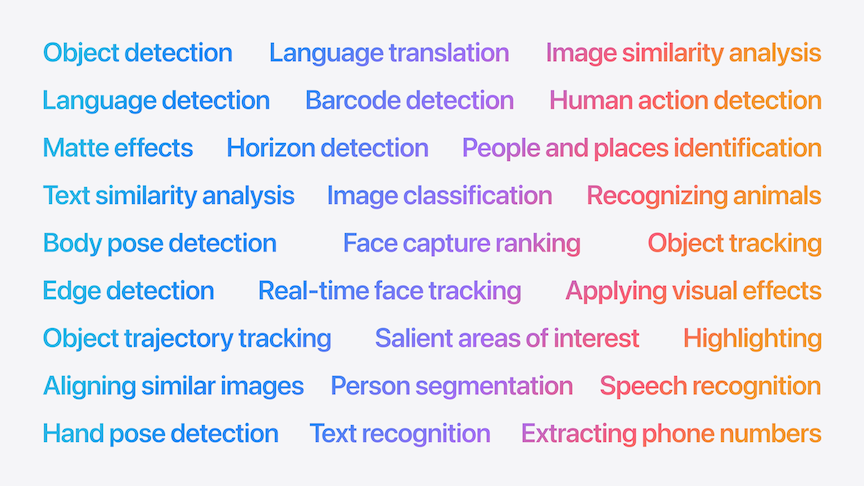

### **Xcode**

* Predictive Code Completion
    * Trained specifically for Swift and Apple Frameworks
    * Uses user's code for naming and generation
    * Can hold option to display multiple lines of suggested code
    * All locally on machine
    * Auto updates model with latest sdk and model changes
* Swift Assist
    * Cloud based code assistance
    * Build right into Xcode
    * Creates both code and previews for visualization
    * Can reference resources in the codebase
    * Code is not stored by Apple nor used for training
    * Available later this year
* Many more features

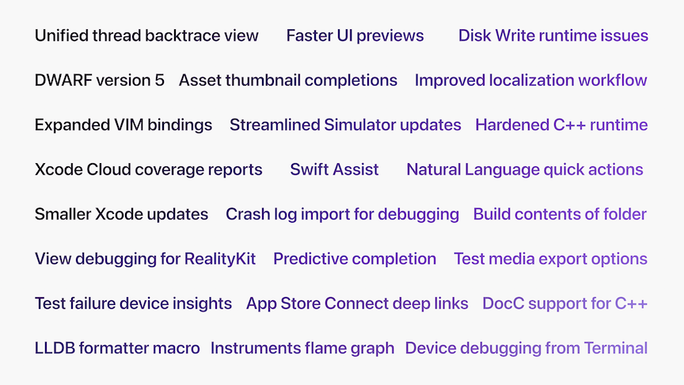

### **Swift**

* Expanding support for Swift for other editors and platforms
* New SwiftLang organization to host critical swift projects like Compiler and Foundation
* Swift 6 release
    * Concurrent programming made simpler with data race safety
        * Diagnoses race conditions at compile time
    * Can migrate to Swift 6 one module at a time
    * Swift Package Index can be used to track Swift 6 adoption

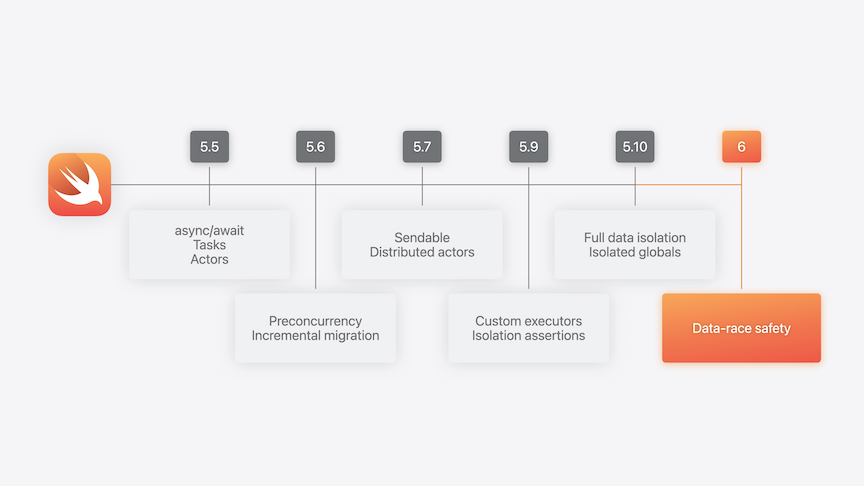
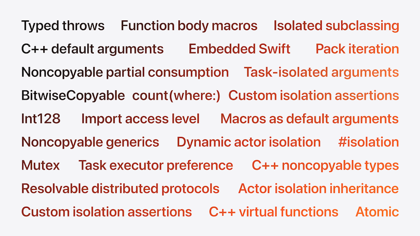

### **Swift Testing**

* Build with Swift
* Expressive APIs
* Cross platform and open source

```swift
@Test
func continent() async throws {
    let videoLibrary = try await VideoLibrary()
    let video = try #require(await videoLibrary.video(named: "Scotland Coast"))
}


@Test ("Continents mentioned in videos",
    .tags(.location) ,
    arguments: [
        ("A Beach",                 [Continent.oceania]),
        ("By the Lake",             [.europe]),
        ("Camping in the Woods",    [.northAmerica, .asia]),
        ("Ocean Breeze",            [.oceania]),
        ("Patagonia Lake",          [.southAmerica]),
        ("China Paddy Field",       [.asia]),
        ("Scotland Coast",          [.europe]),
        ("Grand Canyon Evening",    [.northAmerica]),
        ("Liwa Horizon",            [.asia]),
    ])

func continent (videoName: String, expectedContinents: [Continent]) async throws {
    let videoLibrary = try await VideoLibrary()
    let video = try #require(await videoLibrary.video(named: videoName))
    #expect(video.mentionedContinents == expectedContinents)
}
```

* Xcode 16 has full support
    * Tests are run in parallel
    * Works in Xcode and VSCode

### **SwiftUI**

* Previews
    * Running previews no longer requires rebuilding your app
    * State can be used directly in a preview
* Customizations
    * Hover effects
    * Window behavior and styling in macOS
    * Text renderer API
* Interoperability
    * Gesture recognition has been factored out of UIKit so it can be used in SwiftUI now
    * Animations have been factored out of SwiftUI to be shared between UIKit and SwiftUI

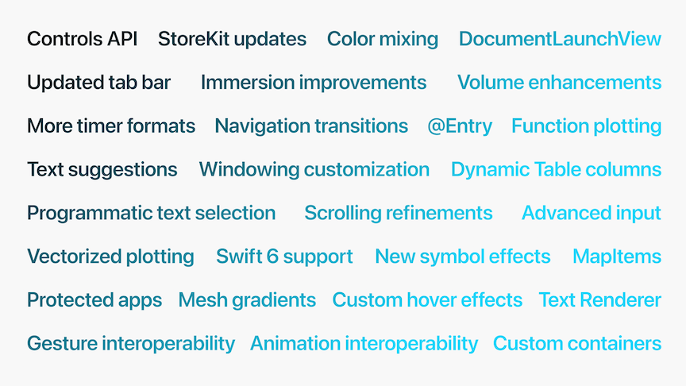

### **SwiftData**

* Added `Index` and `Unique`
* `@Previewable` macro added
* Custom data stores
    * Uses CoreData by default
    * Can use sqlite, json files, remote server
* Data History

### **RealityKit**

* Reality Composer and RealityKit 4 now align along iOS, macOS, visionOS, and iPadOS
* New APIs brought to all four platforms as well

### **iOS**

* Controls
    * Can toggle a setting, execute an action, or deep link to an experience
    * Available in Controls Gallery to be added to Control Center
    * Can be used with action button
    * Can be added to home screen as one of the bottom actions
* App icons and widgets can now be tinted/colored
    * By default, a tinted version of the icon is created
    * You can customize each version (HIG has guidance)
    * Can drop dark and tinted versions right into asset catalog
* Security
    * New registration API to create passkeys

### **iPadOS**

* All features above for iOS
* New floating tab bar that expands into a sidebar

```swift
var customization: TabViewCustomization

TabView(selection: $selection) {
    Tab(value: .search, role: .search) { ... } 
    Tab ("Home", image: "house", value: .home) { ... } 
    Tab ("New", image: "sparkles", value: .new) { ... }
        .customizationID("new")
    TabSection ("Library") {
        Tab ("Purchases", image: "purchased", value: •purchases) { ... }
            .customizationID( "purchases")
        Tab ("Downloads", image: "arrow.down", value: •downloads) { ... }
            .customizationID( "downloads")
    }
    .tabViewStyle(.sidebarAdaptable)
    .tabViewCustomization ($customization)
}
```

* Interruptible animations with navigation

```swift
NavigationStack {
    NavigationLink {
        DetailView()
            .navigationTransitionStyle(.zoom(sourceID: "note", in: namespace))
    } label: {
        ThumbnailView()
    }
    .matchedTransitionSource (id: "note", in: namespace)
}
```

### **watchOS**

* Live activities come over from iOS

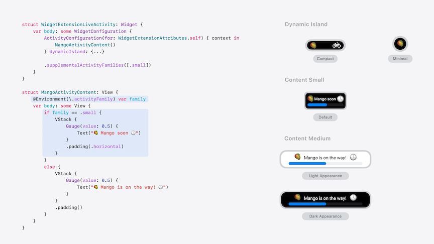

* Interactive widgets can now be brought over from iOS as well
    * New accessory widget group layout is one way to do this
    * Can use buttons, toggles, and deep links
    * Can specify relevant contexts to decide when widgets should appear in the smart stack
* `.handGestureShortcut` for double-tap support

### **macOS**

* Gaming
    * Still trying to make fetch happen
    * Game Porting Toolkit 2
        * Brings more advanced games to Mac
            * Improved compatability with other technology
            * Better raytracing
            * Metal updates
            * Xcode allows debugging and profiling of original shaders (either with Windows binary or ported project)

### **visionOS**

* New Volumetric APIs
    * Easy to resize a volume, and user's can resize them
    * Can choose on a fixed or dynamic scale when moved in relation to the user
    * More freedom when placing ornaments in a volume
* TableTopKit
    * Framework for collaborative expriences around a flat horizontal surface
    * Works with spatial personas in SharePlay
    * Works with Group Activities, RealityKit, and SwiftUI
* New Enterprise APIs
    * Barcode scanning and others
* New choices for user hand placement (see image below)
* Planes can be detected in all orientations
* Can detect user movement across rooms
* Can attach virtual objects to physical objects

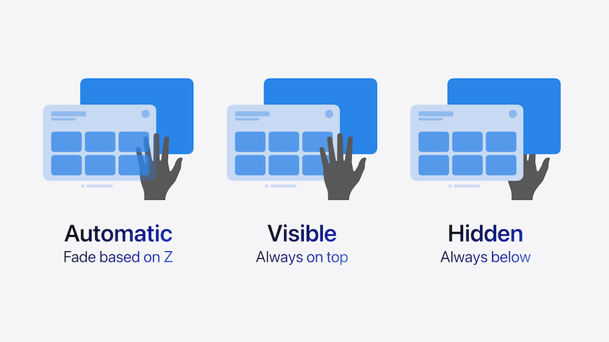
