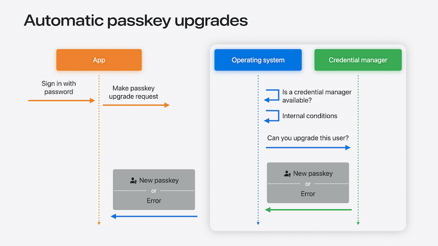

# [**Streamline sign-in with passkey upgrades and credential managers**](https://developer.apple.com/videos/play/wwdc2024/10125/)

---

### **Automatic passkey upgrades**

* Passkeys can replace MFA
* App can automatically upgrade a password to a passkey and notify the user via a push notification
* Passkeys don't have phishable factors
* The current period is a transition period, away from phishable (password) sign-in
    * Adding an unphishable sign-in method as an alternative sign-in method, allowing passkeys to be phased in gradually
* Automatic passkey upgrade is a progressive enhancement
    * Won't lead to a passkey 100% of the time (see image below), but when it does it doesn't require any screens to get in the way of the app



* Example of a password-based sign-in flow offering to create a passkey
    * After signing in with a password, it checks whether the account has a passkey, and prompts the user with an offer to create one if not

```swift
// Offering a passkey upsell

func signIn() async throws {
    let userInfo = try await signInWithPassword()
    guard !userInfo.hasPasskey else { return }
    let provider = ASAuthorizationPlatformPublicKeyCredentialProvider(
        relyingPartyIdentifier: "example.com")

    guard try offerPasskeyUpsell() else { return }
    let request = provider.createCredentialRegistrationRequest(
        challenge: try await fetchChallenge(),
        name: userInfo.user,
        userID: userInfo.accountID)

    do {
        let passkey = try await authorizationController.performRequest(request)
        // Save new passkey to the backend
    } catch { … }
}
```

* Example of an automatic passkey upgrade
    * `requestStyle: .conditional` is passed to the request
    * If all the preconditions of the system and passkey manager are met, you get a passkey back, and the device shows a notification to the user that the passkey has been created
        * Done without interrupting the user in the app
    * If any preconditions weren't met, an error is returned, and no UI is shown
        * Can choose to show UI at this point

```swift
// Automatic passkey upgrade

func signIn() async throws {
    let userInfo = try await signInWithPassword()
    guard !userInfo.hasPasskey else { return }
    let provider = ASAuthorizationPlatformPublicKeyCredentialProvider(
        relyingPartyIdentifier: "example.com")

    let request = provider.createCredentialRegistrationRequest(
        challenge: try await fetchChallenge(),
        name: userInfo.user,
        userID: userInfo.accountID,
        requestStyle: .conditional)

    do {
        let passkey = try await authorizationController.performRequest(request)
        // Save new passkey to the backend
    } catch { … }
}
```

* On the web, you can use a modal passkey creation

```swift
// Modal passkey creation

const options = {
    "publicKey": {
        "rp": { … },
        "user": {
            "name": userInfo.user,
            …
        },
        "challenge": …,
        "pubKeyCredParams": [ … ]
    },
};

await navigator.credentials.create(options);
```

* Or, you can add the `"mediation": "conditional"` parameter to perform an automatic upgrade style request
    * Use `getClientCapabilities` first to check that the browser supports this style of request

```swift
// Automatic passkey creation

let capabilities = await PublicKeyCredential.getClientCapabilities();
if (!capabilities.conditionalCreate) { return; }

const options = {
    "publicKey": {
        "rp": { … },
        "user": {
            "name": userInfo.user,
            …
        },
        "challenge": …,
        "pubKeyCredParams": [ … ]
    },
    "mediation": "conditional"
};

await navigator.credentials.create(options);
```

### **Improvements for credential managers**

* Credential managers can participate in automatic passkey upgrades
* Can now fill time-based verification codes
* Can fill in usernames, passwords, or one-time codes into any text field
* These are all additions to the existing credential manager API
    * To add support for these features, add the keys below to Info.plist
* Can now select up to three apps to use with AutoFill

```swift
<dict>
    <key>NSExtensionAttributes</key>
    <dict>
        <key>ASCredentialProviderExtensionCapabilities</key>
        <dict>
            <key>ProvidesPasswords</key>
            <true/>
            <key>ProvidesPasskeys</key>
            <true/>
            <key>SupportsConditionalPasskeyRegistration</key>
            <true/>
            <key>ProvidesOneTimeCodes</key>
            <true/>
            <key>ProvidesTextToInsert</key>
            <true/>
        </dict>
    </dict>
</dict>
```

### **Passwords app**

* New in macOS Sequoia, iOS 18, and visionOS 2 (moved to separate app out of Settings)
* The top level has sections for Passkeys and verification codes
* The Security section lists saved passwords that are weak, reused, or have appeared in a data leak
    * The Change Password button can open your change password web page if you adopt the well-known URL for changing passwords
* On macOS, there is a menu bar item to allow quick access to passwords and verification codes
    * Can also import/export passwords with another credential manager
* Updating website appearance
    * When a passkey and password are saved for the same app or website, with the same username, the Passwords app combines them into a single entry
    * Add an OpenGraph site name
        * `<meta name="og:sitename" content="Shiny">`
        * Serve metadata to all user agents, from all user-reachable subdomains
    * Use high-resolution website icons
* Verification code setup
    * Add one-tap verification code setup
        * Use a button or link to an `otpauth:` URL
    * When suggesting apps for verification code setup, consider adding "Apple Passwords" to the list
    * [**Secure login with iCloud Keychain verification codes**](https://developer.apple.com/videos/play/wwdc2021/10105/) session from WWDC 2021
