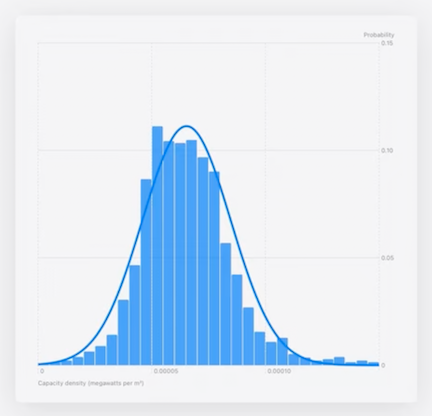
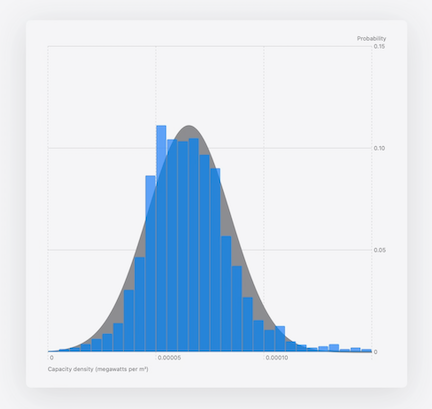
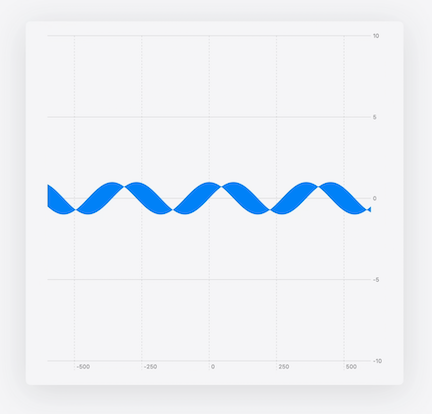
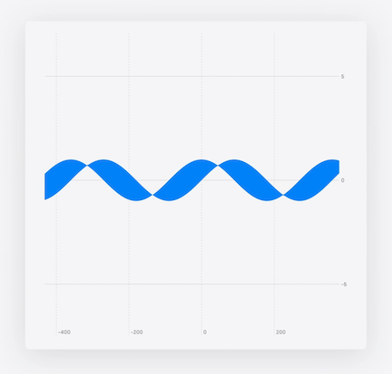
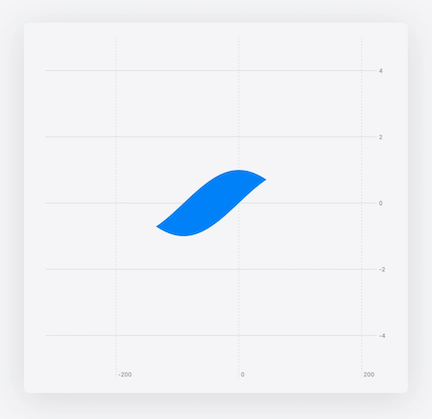
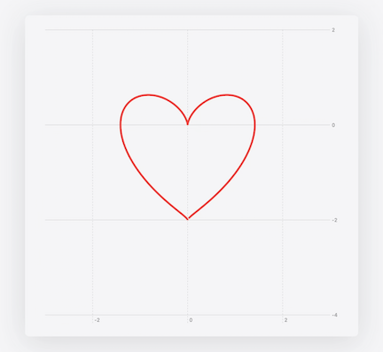
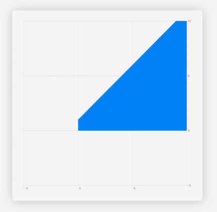
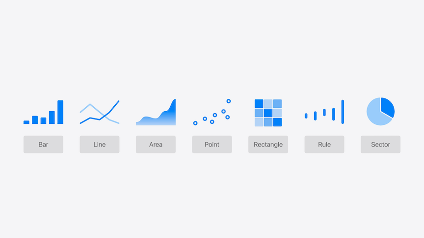
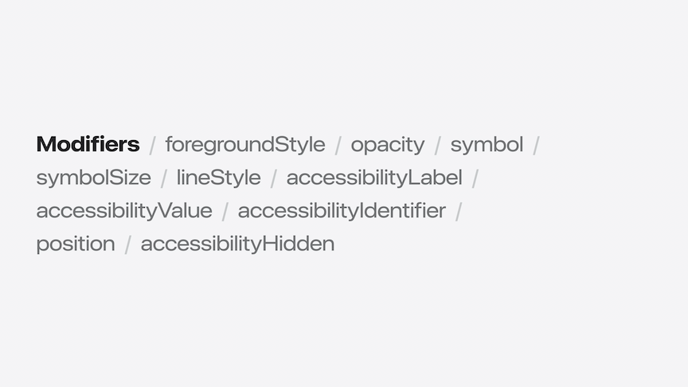
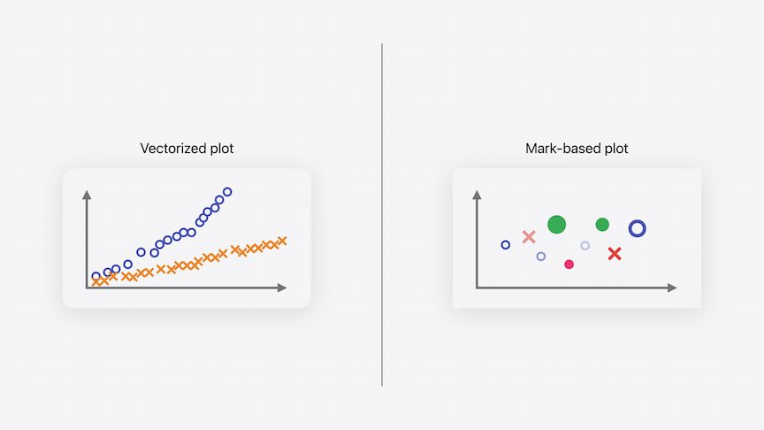

# [**Swift Charts: Vectorized and function plots**](https://developer.apple.com/videos/play/wwdc2024-10155)

---

* Swift Charts now allows plotting of mathematical functions
* Now also has vectorized plotting APIs that support visualizing larger data sets more efficiently
* Function Plots - two new APIs
    * `LinePlot`, for visualizing a single function
    * `AreaPlot`, to fill in the area between two functions
* This code builds a histogram, and then uses LinePlot to show the normal distribution curve
    * Accessibility works by default
        * Voice Over properly describes the chart
        * Audio Graph works on function plots as well
    * Modifiers like `.foregroundStyle(...)` also work

```swift
Chart {
    LinePlot(
        x: "Capacity density", y: "Probability"
    ) { x in // (Double) -> Double
        normalDistribution(
          x,
          mean: mean, 
          standardDeviation: standardDeviation
        )
        .foregroundStyle(.gray)
    }

    ForEach(bins) { bin in
        BarMark(
            x: .value("Capacity density", bin.range),
            y: .value("Probability", bin.probability)
        )
    }
}
```



* AreaPlot will fill in areas beneath curves

```swift
Chart {
  AreaPlot(
    x: "Capacity density", y: "Probability"
  ) { x in
    normalDistribution(x, ...)
  }
  .foregroundStyle(.gray)
  .opacity(0.2)
}
```



* AreaPlot can also visualize the area between two functions
    * REturn a tuple of `yStart` and `yEnd` for a given input `x`

```swift
Chart {
  AreaPlot(
    x: "x", yStart: "cos(x)", yEnd: "sin(x)"
  ) { x in
    (yStart: cos(x / 180 * .pi),
     yEnd: sin(x / 180 * .pi))
  }
}
```



* Specifying domain for function plots
    * Unlike visualizing data, a function can accept an unbounded range of x values
    * Swift Charts automatically infers the domain by sampling the function
    * You can customize the overall bounds of the chart by setting the `.chartXScale(domain:)` and `.chartYScale(domain:)` to only include parts of the function
    * The domain of the function plot can also be limited by setting the `domain` of the `AreaPlot`

```swift
Chart {
  AreaPlot(
    x: "x", yStart: "cos(x)", yEnd: "sin(x)",
    domain: -135...45
  ) { x in
    (yStart: cos(x / 180 * .pi),
     yEnd: sin(x / 180 * .pi))
  }
}
.chartXScale(domain: -315...225)
.chartYScale(domain: -5...5)
```

| Chart Domain | Chart and Function Domain |
| ------------ | ------------------------- |
|  |  |

* Swift Charts also supports parametric functions
    * Functions where `x` and `y` are defined in terms of a third variable

```swift
Chart {
  LinePlot(
    x: "x", y: "y", t: "t", domain: -.pi ... .pi
  ) { t in
    let x = sqrt(2) * pow(sin(t), 3)
    let y = cos(t) * (2 - cos(t) - pow(cos(t), 2))
    return (x, y)
  }
}
.chartXScale(domain: -3...3)
.chartYScale(domain: -4...2)
```



* Piece-wise functions can also be graphed
    * return `.nan` to inform Swift Charts that there's not a number for an input value

```swift
Chart {
  LinePlot(x: "x", y: "1 / x") { x in
    guard x != 0 else {
      return .nan
    }
    return 1 / x
  }
}
.chartXScale(domain: -10...10)
.chartYScale(domain: -10...10)
```



* Vectorized plot APIs added for other mark types as well



* Mark API
    * Existed previously
    * Flexible, allowing styling of each individual data point differently

```swift
// Highly customized Chart
Chart {
  ForEach(model.data) {
    if $0.capacityDensity > 0.0001 {
      RectangleMark(
        x: .value("Longitude", $0.x),
        y: .value("Latitude", $0.y)
      )
      .foregroundStyle(by: .value("Axis type", $0.axisType))
    } else {
      PointMark(
        x: .value("Longitude", $0.x),
        y: .value("Latitude", $0.y)
      )
      .opacity(0.5)
    }
  }
}

// Homogeneously styled Chart
Chart {
  ForEach(model.data) {
    RectangleMark(
      x: .value("Longitude", $0.x),
      y: .value("Latitude", $0.y)
    )
    .foregroundStyle(by: .value("Axis type", $0.panelAxisType))
    .opacity($0.capacityDensity)
  }
}
```

* New Vectorized plot for homogeneously styled chart
    * Allows processing of larger collections of data more efficiently

```swift
Chart {
  RectanglePlot(
    model.data,
    x: .value("Longitude", \.x),
    y: .value("Latitude", \.y)
  )
  .foregroundStyle(by: .value("Axis type", \.panelAxisType))
  .opacity(\.capacityDensity)
}
```

* Vectorized Plot API example
    * Use stored properties instead of computed properties
        * Allows Swift Charts to access the x and y values for all data points with a constant memory offset instead of calling the getter for every data point
    * The new `PointPlot` API takes an entire collection of data to plot
        * Use the same `.value` syntax with a label, and a KeyPath to the stored properties
            * KeyPaths let Swift Charts style all points without iterating over the dataset
    * Modifiers can also use KeyPaths (like `.symbolSize(by:...)` below)

```swift
struct DataPoint: Identifiable {
    let id: Int

    let capacity: Double
    let panelAxisType: String

    let Longitude: Double
    let yLatitude: Double

    // Albers projection
    var x: Double
    var y: Double
}

Chart {
  PointPlot(
    model.data,
    x: .value("Longitude", \.x),
    y: .value("Latitude", \.y)
  )
  .symbolSize(by: .value("Capacity", \.capacity))
  .foregroundStyle(
    by: .value("Axis type", \.panelAxisType)
  )
}
```

* All modifiers that are often used for homogenous modification support a KeyPath parameter



* Vectorized Plots vs. Marks
    * Use Vectorized plots for larger datasets where the entire plot is customized with the same modifiers and properties
    * Use Marks when you have fewer data points, but need to customize each elements
        * Or if you need complex layering with `zIndex`



* Performant vectorized plots
    * Group data by style
    * Avoid computed properties
    * Specify scale domains if known
    * Avoid unnecessary styling

