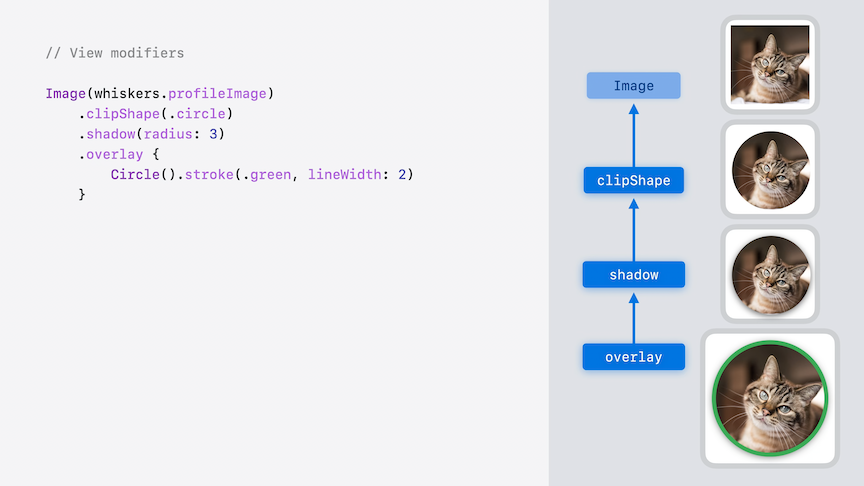
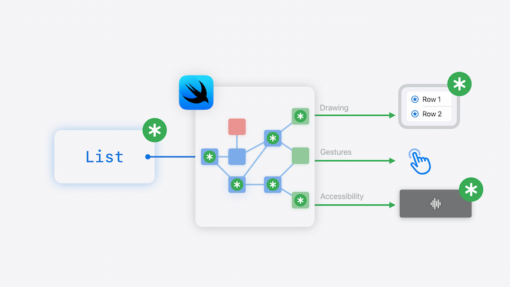
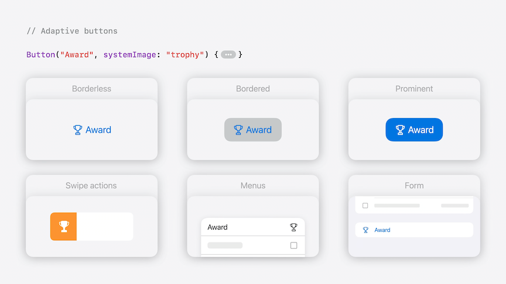
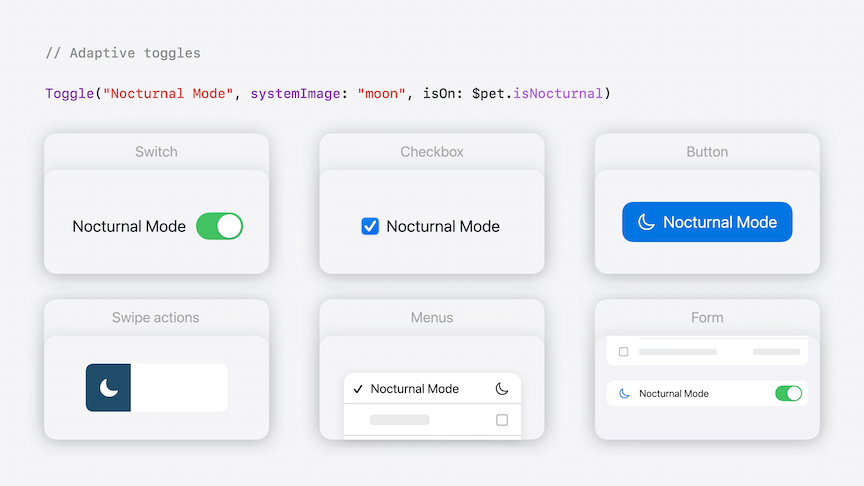
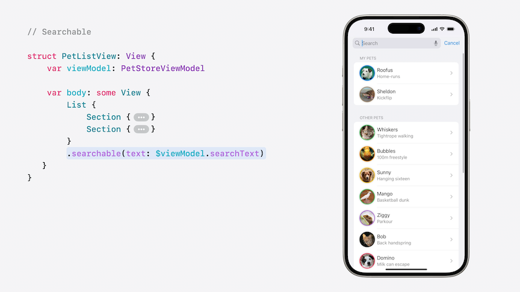

# [**SwiftUI Essentials**](https://developer.apple.com/videos/play/wwdc2024-10150)

---

### **Fundamentals of views**

#### Declarative

* Views are the basic building block of user interface
* Views are declarative
    * Do not need to describe the actions to produce UI, such as adding or removing rows to a list

```swift
struct ContentView: View {
    @State private var pets = Pet.samplePets

    var body: some View {
        List(pets) { pet in
            HStack {
                Label(pet.name, systemImage: pet.kind.systemImage)

                Spacer()

                Text(pet.trick)
            }
        }
    }
}
```

* Declarative vs. Imperative
    * Imperative programming requires outlining each step of the process, from start to beginning
    * Declarative programming only requires what you want to see
        * Can customize certain aspects
    * These types of code are not mutually exclusive:
        * Declarative code enables you to focus on the expected result, instead of the steps to get there
        * Imperative code is great when making a change to state, or when there might not be an existing declarative component
        * Button is an example of both
            * Buttons are added declaratively
            * The action of the button is imperative code to make a change

```swift
struct ContentView: View {
    @State private var pets = Pet.samplePets

    var body: some View {
        Button("Add Pet") {
            pets.append(Pet("Toby", kind: .dog, trick: "WWDC Presenter"))
        }

        List(pets) { pet in
            HStack {
                Label(pet.name, systemImage: pet.kind.systemImage)

                Spacer()

                Text(pet.trick)
            }
        }
    }
}
```

* SwiftUI views are descriptions of the current state of the UI
    * Not long lived instances that receive imperative commands over time
    * This is why SwiftUI views are value types defined using structs, not classes

#### Compositional

* `HStack` is a container view for the purposes of layout
    * The code itself resembles the hierarchy of the container

```swift
struct ContentView: View {
    var body: some View {
        HStack {
            Image(whiskers.profileImage)

            VStack(alignment: .leading) {
                Label("Whiskers", systemImage: "cat.fill")
                Text("Tightrope walking")
            }

            Spacer()
        }
    }
}
```

* Composition is also used for view modifiers
    * The hierarchy and order of effect is defined based on the exact order of the modifiers



* View hierarchies can be encapsulated into custom views and view modifiers
    * A custom view conforms to the `View` protocol and has a `body` property to return the view
    * Additional view properties can be created to keep code organized
    * Views can have inputs that change how the body is created, like the `pet` property below

```swift
struct PetRowView: View {
    var pet: Pet
    var body: some View {
        HStack {
            profileImage

            VStack(alignment: .leading) {
                Text(pet.name)
                Text(pet.trick)
                    .font(.subheadline)
                    .foregroundStyle(.secondary)
            }

            Spacer()
        }
    }

    private var profileImage: some View {
        Image(pet.profileImage)
            .clipShape(.circle)
            .shadow(radius: 3)
            .overlay {
                Circle().stroke(pet.favoriteColor, lineWidth: 2)
            }
    }
}
```

* Custom views can be used like any other view, such as in a List
    * Lists can just have rows, or can be divided into sections

```swift
struct ContentView: View {
    var model: PetStore
    var body: some View {
        List {
            ForEach(model.allPets) { pet in
                PetRowView(pet: pet)
            }
        }
    }
}

struct ContentView: View {
    var model: PetStore
    var body: some View {
        List {
            Section("My Pets") {
                ForEach(model.myPets) { pet in
                    PetRowView(pet: pet)
                }
            }
            Section("Other Pets") {
                ForEach(model.otherPets) { pet in
                    PetRowView(pet: pet)
                }
            }
        }
    }
}
```

* Lists can be customized through the use of view modifiers, like to add swipe actions to each row

```swift
PetRowView(pet: pet)
    .swipeActions(edge: .leading) {
        Button("Award", systemImage: "trophy") {
            // Give pet award
        }
        .tint(.orange)

        ShareLink(item: pet, preview: SharePreview("Pet", image: Image(pet.name)))
    }
```

#### State-driven

* When a views' state changes over time, SwiftUI automatically keeps the UI up to date eliminating both boilerplate and update bugs
    * SwiftUI is maintaining a representation of the user interface behind the scenes
    * As data changes, new view values are created and given to SwiftUI
    * SwiftUI uses those values to determine how to update its outputs



* In the code below, view updates are triggered when the "Award" button is tapped and the `pet.giveAward()` function is called
    * The associated pet object is updated, and `hasAward` becomes true
    * The `PetRowView` view depends on the pet, so SwiftUI will call this view's body again
    * Any piece of data that a view uses in its body is a dependency of that view

```swift
struct ContentView: View {
    var model: PetStore
    var body: some View {
        List {
            Section("My Pets") {
                ForEach(model.myPets) { pet in
                    row(pet: pet)
                }
            }
            Section("Other Pets") {
                ForEach(model.otherPets) { pet in
                    row(pet: pet)
                }
            }
        }
    }

    private func row(pet: Pet) -> some View {
        PetRowView(pet: pet)
            .swipeActions(edge: .leading) {
                Button("Award", systemImage: "trophy") {
                    pet.giveAward()
                }
                .tint(.orange)

                ShareLink(item: pet, preview: SharePreview("Pet", image: Image(pet.name)))
            }
    }
}

struct PetRowView: View {
    var pet: Pet
    var body: some View {
        HStack {
            profileImage

            VStack(alignment: .leading) {
                HStack(alignment: .firstTextBaseline) {
                    Text(pet.name)

                    if pet.hasAward {
                        Image(systemName: "trophy.fill")
                            .foregroundStyle(.orange)
                    }
                }
                Text(pet.trick)
                    .font(.subheadline)
                    .foregroundStyle(.secondary)
            }

            Spacer()
        }
    }

    private var profileImage: some View {
        Image(pet.profileImage)
            .clipShape(.circle)
            .shadow(radius: 3)
            .overlay {
                Circle().stroke(pet.favoriteColor, lineWidth: 2)
            }
    }
}
```

* State Management
    * `@State` creates a new internal source of data for a view
        * When you mark a view property as @State, SwiftUI manages its storage and provides it back for the view to read and write
    * `@Binding` creates a two way reference to the state of some other view

* Animations
    * Wrapping `withAnimation` around a state change provides a default animation
    * Custom animations can also be provided
        * `.contentTransition(.numericText(value:))` is an example of this

```swift
struct RatingView: View {
    @State var rating: Int = 5

    var body: some View {
        HStack {
            Button("Decrease", systemImage: "minus.circle") {
                withAnimation {
                    rating -= 1
                }
            }
            .disabled(rating == 0)
            .labelStyle(.iconOnly)

            Text(rating, format: .number.precision(.integerLength(2)))
                .contentTransition(.numericText(value: Double(rating)))
                .font(.title.bold())

            Button("Increase", systemImage: "plus.circle") {
                withAnimation {
                    rating += 1
                }
            }
            .disabled(rating == 10)
            .labelStyle(.iconOnly)
        }
    }
}
```

* When we want to use `RatingView` in a container view, we can share that state by using `@Binding`
    * Values will update in sync, and the animated state change can apply anywhere it's updated


```swift
struct RatingContainerView: View {
    @State private var rating: Int = 5

    var body: some View {
        Gauge(value: Double(rating), in: 0...10) {
            Text("Rating")
        }
        RatingView(rating: $rating)
    }
}

struct RatingView: View {
    @Binding var rating: Int

    ...
}
```

### **Built-in capability**

* Dark mode
* Dynamic type
* Ready to be localized
* Previews can be used to view apps quickly to see how they react to all the above modes
* Because SwiftUI is declarative, they are adaptive
    * Button is an example of an adaptive view
        * Buttons have two properties: an action and a label
        * Adapt to different styles, such as borderless, bordered, or prominent
        * Adapt to different contexts, such as swipe actions, menus, and forms
    Toggles also are adaptive

| Buttons | Toggles |
| ------- | ------- |
|  |  |

* Modifiers can also be adaptive
    * `.searchable` is an example, defining that a view is capable of being searched



* Declarative view types
    * Controls like `Button`, `Toggle`, `Picker`
    * Containers like `NavigationSplitView`, `TabView`, `Table`
    * Presentations like `sheet`, `confirmationDialog`, `inspector`
    * Many others, like `searchable`, `draggable`, `focusable`
* SwiftUI also has a deeper layer to provide low level control for custom experiences
    * Examples are `ButtonStyle`, `Canvas`, `Layout`, and `Shader`
* The entire app definition is built on the same principles that Views follow
    * An `App` is a declarative structure defined by scenes
    * A `WindowGroup` is a kind of scene, created with a content view to show on screen

```swift
@main
struct SwiftUIEssentialsApp: App {
    var body: some Scene {
        WindowGroup {
            ContentView()
        }

        WindowGroup("Training History", id: "history", for: TrainingHistory.ID.self) { $id in
            TrainingHistoryView(historyID: id)
        }

        WindowGroup("Pet Detail", id: "detail", for: Pet.ID.self) { $id in
            PetDetailView(petID: id)
        }
   }
}
```

* The same pattern applies to widgets
    * Views used within the app (such as `ScoreCard` below) can be reused in widgets

```swift
struct ScoreboardWidget: Widget {
    var body: some WidgetConfiguration {
        // ...
    }
}

struct ScoreboardWidgetView: View {
    var petTrick: PetTrick
    
    var body: some View {
        ScoreCard(rating: petTrick.rating)
            .overlay(alignment: .bottom) {
                Text(petTrick.pet.name)
                    .padding()
            }
            .widgetURL(petTrick.pet.url)
    }
}
```

### **Across all platforms**

* SwiftUI runs on all Apple platforms
    * Creating a view for one platform, you have a solid start for building on another platform
    * Enables code sharing
        * Not "write once, run everywhere" - instead "learn once, use in any context"
* SwiftUI has a common set of high and low level components across platforms
    * Also has specialized APIs for each platform
    * Every platform is unique in how it is used and how it is designed
    * Can make changes specific to a single platform, like below for watchOS

```swift
ScoreCardStack(rating: $rating)
   .focusable()
   #if os(watchOS)
   .digitalCrownRotation($rating, from: 0, through: 10)
   #endif
```

### **SDK interoperability**

* A cornerstone of SwiftUI is it's interoperability with UIKit and AppKit
    * `UIViewRepresentable` and `NSViewRepresentable` are used to embed UIKit/AppKit inside SwiftUI
    * `UIHostingController` is used to embed SwiftUI inside UIKit/AppKit
* SwiftData and SwiftCharts are example of other frameworks that work alongside and with SwiftUI
