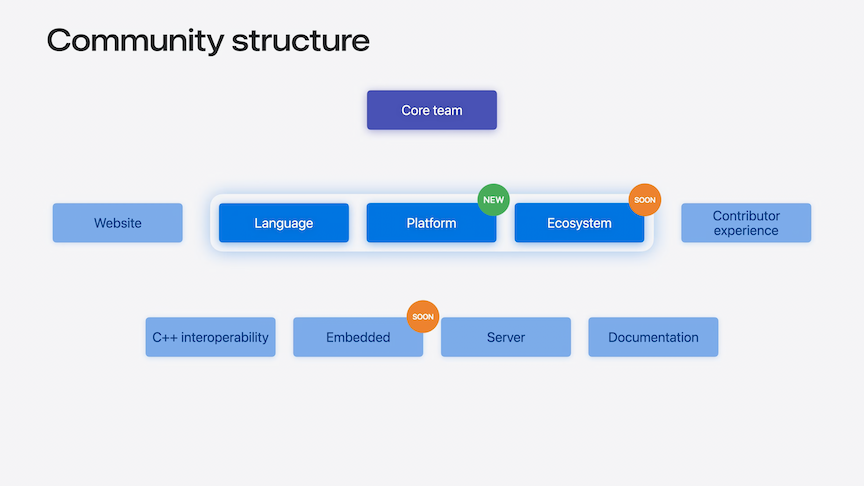

# [**What's New in Swift**](https://developer.apple.com/videos/play/wwdc2024/10136/)

---


### **Swift project update**



[Swift community](https://swift.org/community)

* The website workgroup has made major improvements to the homepage and getting started guides. These guides now contain a variety of new tutorials including cross-platform library and web services to help explore different technologies in Swift.
* To explore Swift packages, visit swift.org/packages which is integrated with [swiftPackageIndex.com](https://swiftPackageIndex.com)
    * Builds all of the packages for multiple Swift versions and platforms to help pick the right package for an application.
* Swift.org blog highlights developments across the Swift community


### **Swift everywhere**

* Officially supported platforms:
    * Apple platforms
    * Linux
        * Ubuntu
        * Amazon Linux
        * CentOS
        * Red Hat UBI
        * Fedora (New)
        * Debian (New)
    * Windows
    * Support for WebAssembly being brought up by the Swift community
* IDE Support
    * Xcode is still the primary IDE
    * SourceKit LSP
        * A language server implementation for Swift that enables IDEs and editors to integrate Swift Support
        * VSCode, Neovim, Emacs, and more have adopted SourceKit LSP
* Cross compilation
    * Already used for apps that support multiple Apple platforms
    * Coming to Linux with Static Linux SDK for Swift
        * Builds Linux binaries on macOS
        * No need to install additional packages
        * Build on Swift Package Manager support for SDK
        * Install with `swift sdk install ~/preview-static-swift-linux-0.0.1.tar.gz`
        * To cross-compile use `swift build --swift-sdk aarch64-swift-linux-musl`
        * View the [Meet Swift OpenAPI Generator](https://developer.apple.com/videos/play/wwdc2023/10171/) session from WWDC 2023
        * [Static Linux SDK for Swift](https://swift.org/install)
* Foundation
    * Originally Swift for Apple platforms (written in C and Obj-C) was separate from Swift for other platforms
    * As the language has evolved, been rewritten in Swift, and is a single unified implementation across all platforms
    * Better performance, even for Obj-C applications


* Swift Testing
    * Open source
    * Cross platform
    * Modern Swift features
    * Works in Xcode and VSCode
    * Declare a test by adding an `@Test` attribute to a function
        * Can be given a custom display name
        * Can be organized with tags
        * Parameterize tests with arguments
    * [**Meet Swift Testing**](./Meet%20Swift%20Testing.md) session
    * [**Go further with Swift Testing**](./Go%20further%20with%20Swift%20Testing.md) session

```swift
// Swift Testing 

import Testing

@Test("Recognized rating",
       .tags(.critical),
       arguments: [
           (1, "A Beach",       "⭐️⭐️⭐️⭐️⭐️"),
           (2, "Mystery Creek", "⭐️⭐️⭐️⭐️"),
       ])
func rating(videoId: Int, videoName: String, expectedRating: String) {
    let video = Video(id: videoId, name: videoName)
    #expect(video.rating == expectedRating)
}
```

* Building
    * Previously, modules were built implicitly
        * Modules and their dependencies were build sequentially
        * Modules would reuse built module dependencies already created, but would have to wait for them to be ready
        * The debugger might also have to build its own versions of the same binary modules, leading to long pauses when printing variables in the debugger
    * Explicitly built modules turn those implicit steps into explicit build steps
        * More parallelism in builds
        * Better visibility into build steps
        * Improved reliability of builds
        * Faster debugger start-up as the debugger can share binary modules with the build
        * Can be enabled in Xcode build settings under `Explicitly Built Modules`
        * [**Demystify explicitly built modules**](./) session
* Swift project moving to a new github location at [github.com/swiftlang](https://github.com/swiftlang)

### **Language updates**

#### Noncopyable types

* By default, all Swift types (value and reference) are copyable
* Noncopyable types suppress this default
    * Appropriate for scenarios where you want to express unique ownership
    * Can prevent runtime issues like multiple writers to the same file, or resource leaks
    * Swift 5.10 limited noncopyable types to concrete types
    * Swift 6 supports noncopyable types in all generic contexts
        * Standard library support for `Optional`, `Result`, `Unsafe Pointers`
    * [**Consume noncopyable types in Swift**](./) session
    * Express unique ownership
    * Fine-grained performance control

```swift
// Code example where multiple writers are prevented but a resource leak exists because deinit never gets called
struct File: ~Copyable {
    private let fd: CInt
  
    init(descriptor: CInt) {
        self.fd = descriptor
    }

    func write(buffer: [UInt8]) {
        // ...
    }

    deinit {
        close(fd)
    }
}

guard let fd = open(name) else {
    return
}
let file = File(descriptor: fd)
file.write(buffer: data)
```

```swift
// Changing to a failable initializer that takes a string instead of the id resolves this issue
struct File: ~Copyable {
    private let fd: CInt
  
    init?(name: String) {
        guard let fd = open(name) else {
            return nil
        }
        self.fd = fd
    }

    func write(buffer: [UInt8]) {
        // ...
    }

    deinit {
        close(fd)
    }
}
```

#### Embedded Swift

* New language subset
* New compilation model
* Small and standalone binaries
    * Disables features that need a runtime: reflection, "any" types
    * Special compiler techniques: full generics specialization, static linking
    * Embedded Swift is close to full Swift
* Can run on compact gaming console like the Playdate
* Can run on systems with limited memory
    * ARM an RISC-V microcontrollers
        * Raspberry Pi Pico
        * Espressif ESP32
        * STMicroelectronics STM32
        * Nordic Semiconductor nRF52
    * Used on the Apple Secure Enclave
* Brings memory safety to embedded systems
* Incremental adoption with Swift's interoperability
* [**Go small with Embedded Swift**](https://developer.apple.com/videos/play/wwdc2024-10197) session

#### C++ interoperablity

* Swift 6 allows new parts of C++ to be directly imported into Swift
* Virtual methods
* Default arguments
* C++ move-only types
    * mapped to a noncopyable type in Swift
* `std::map`, `std::set`, `std::optional`, `std::chrono:duration`

```c++
// C++
struct Person {
  Person(const Person&) = delete;
  Person(Person &&) = default;
  // ...
};
```

```swift
// Swift
struct Developer: ~Copyable {
    let person: Person
    init(person: consuming Person) {
      self.person = person
    }
}

let person = Person()
let developer = Developer(person: person)
person.printInfo() // <-- Shows a "'person' used after consume" error
```

* Incrementally adopt Swift in C++ projects
* Improved security and productivity
* [**Mix Swift and C++**](https://developer.apple.com/videos/play/wwdc2023/10172) session from WWDC 2023

#### Typed throws

* Errors conform to the `Error` protocol
* Functions can throw with the `throws` keyword
* Type erasure losses the error's concrete information, requiring insertion of dynamic type checks
    * Involves boxing and unboxing, which presents a challenge in highly constrained systems

```swift
enum IntegerParseError: Error {
  case nonDigitCharacter(String, index: String.Index)
}

func parse(string: String) throws -> Int {
  for index in string.indices {
    // ...
    throw IntegerParseError.nonDigitCharacter(string, index: index)
  }
}

do {
  let value = try parse(string: "1+234")
}
catch let error as IntegerParseError {
  // ...
}
catch {
   // error is 'any Error'
}
```

* Swift 6 introduces typed throes to overcome this
    * Allows specification of the error type along with the `throws` keyword
    * No type erasure involved and the error appears in teh catch block with its concrete type

```swift
enum IntegerParseError: Error {
  case nonDigitCharacter(String, index: String.Index)
}

func parse(string: String) throws(IntegerParseError) -> Int {
  for index in string.indices {
    // ...
    throw IntegerParseError.nonDigitCharacter(string, index: index)
  }
}

do {
  let value = try parse(string: "1+234")
}
catch {
   // error is 'IntegerParseError'
}
```

* Typed throws is a generalization of the error handling system
    * Untyped throws are the same as typed throws with an any Error type
    * A non-throwing function is the same as a function with a typed throw of the `Never` type.

```swift
func parse(string: String) throws -> Int {
  //...
}

func parse(string: String) throws(any Error) -> Int {
  //...
}

func parse(string: String) -> Int {
  //...
}

func parse(string: String) throws(Never) -> Int {
  //...
}
```

* If you want to maintain flexibility to change the thrown error type, continue using untyped throws
* Use typed throws when:
    * Working with internal functions
    * Functions that propagate the error from its arguments
    * Constrained environments


#### Data-race safety


* Complete concurrency checking can be introduced module-by-module
* Can interoperate with dependencies that may or may not have migrated to the Swift 6 language mode
* Data-race safety is the only update governed by enabling the Swift 6 language mode
    * All other updates are available by default when updating to the Swift 6 compiler
* Swift 5.10 banned passing all non-Sendable values across actor isolation boundaries
    * Swift 6 can recognize that it is safe to pass non-Sendable values, in scenarios where they can no longer be referenced from their original isolation boundary

```swift
class Client {
    init(name: String, balance: Double) {}
}

actor ClientStore {
    static let shared = ClientStore()
    private var clients: [Client] = []
    func addClient(_ client: Client) {
        clients.append(client)
    }
}

@MainActor
func openAccount(name: String, balance: Double) async {
    let client = Client(name: name, balance: balance)
    await ClientStore.shared.addClient(client) // <-- Shows a compiler warning in Swift 5.10, but not in Swift 6
}
```

* The Synchronization module introduces `Atomic`
    * Generic over any type that provides an efficient lock-free implementation on the platform
    * Should always be stored in `let` properties for safe concurrent access
    * All operations are explicit

```swift
import Dispatch
import Synchronization 

let counter = Atomic<Int>(0)

DispatchQueue.concurrentPerform(iterations: 10) { _ in
    for _ in 0 ..< 1_000_000 {
        counter.wrappingAdd(1, ordering: .relaxed)
    }
}

print(counter.load(ordering: .relaxed))
```

* The Synchronization module also introduces `Mutex`
    * Should be stored in a `let` property, and can be safely accessed concurrently
    * All accesses to the storage protected by the mutex is via the closure passed to the `withLock` method
        * Ensures mutually exclusive access

```swift
import Synchronization

final class LockingResourceManager: Sendable {
    let cache = Mutex<[String: Resource]>([:])
  
    func save(_ resource: Resource, as key: String) {
        cache.withLock {
            $0[key] = resource
        }
    }
}
```

* [**Migrate your app to Swift 6**](./) session