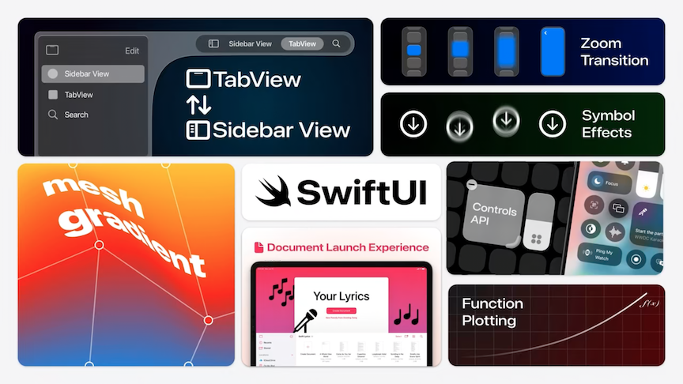
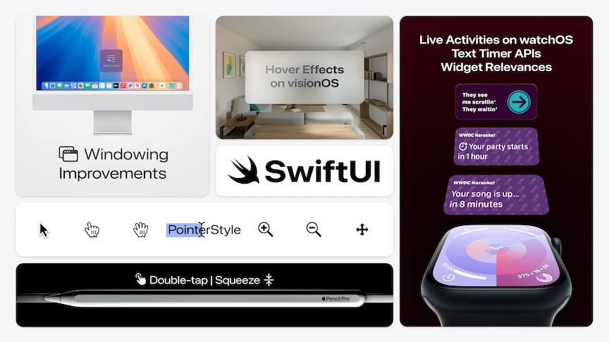
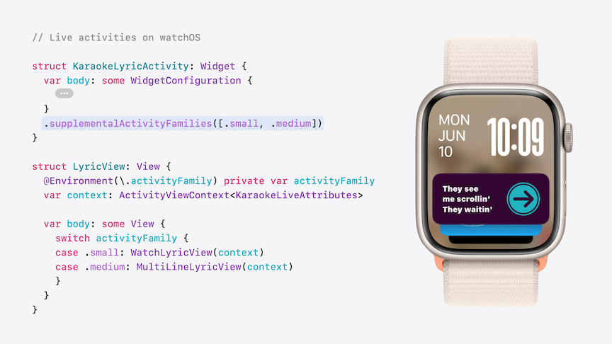
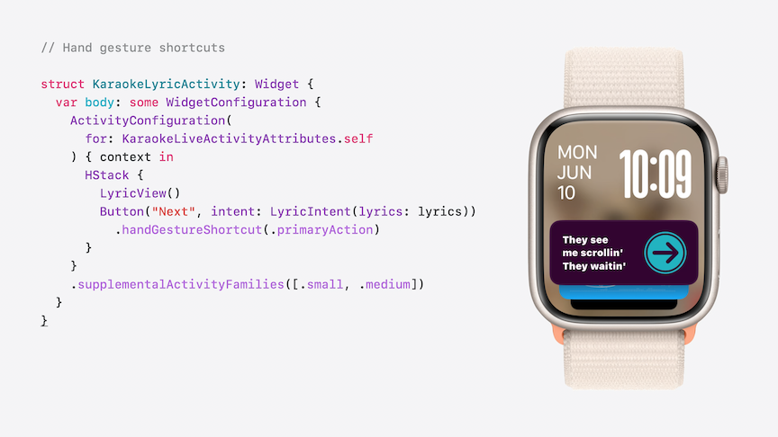
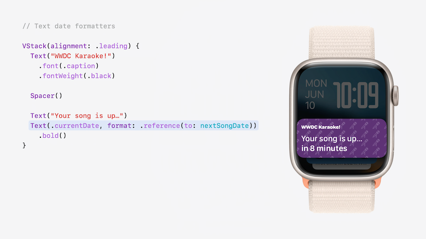
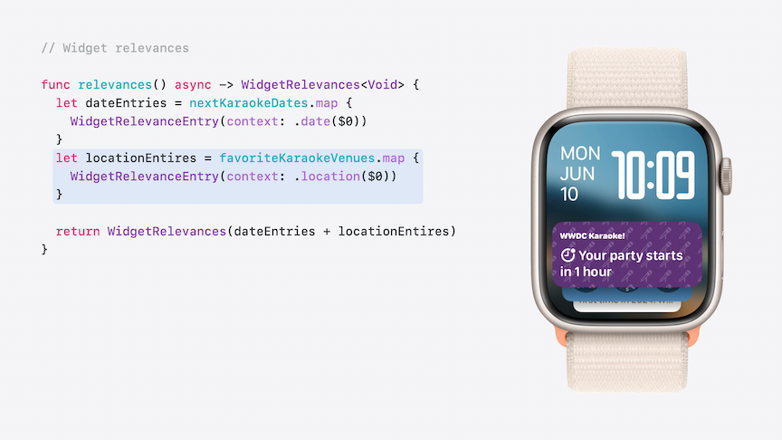
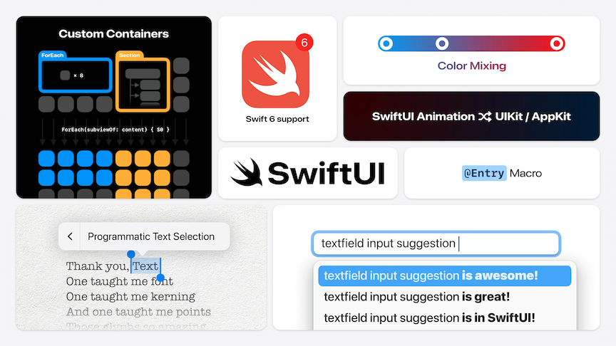
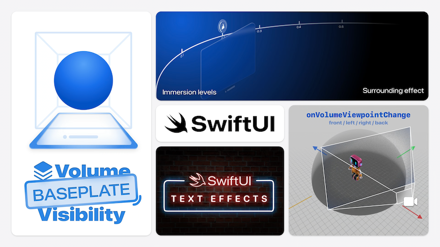

# [**Keynote**](https://developer.apple.com/videos/play/wwdc2024-10144)

---

### **Fresh apps**



* In iOS 18.0, the sidebar is more flexible
    * The main view changes to a tab bar representation for showing more UI
    * The tab bar floats above the content
    * Users can reorder the items and hide infrequently used options
    * `.tabViewStyle(.sidebarAdaptable)` allows switching between sidebar and tab bar
    * [**Elevate your tab and sidebar experience in iPadOS**](./) session

```swift
import SwiftUI

struct KaraokeTabView: View {
    @State var customization = TabViewCustomization()
    
    var body: some View {
        TabView {
            Tab("Parties", image: "party.popper") {
                PartiesView(parties: Party.all)
            }
            .customizationID("karaoke.tab.parties")
            
            Tab("Planning", image: "pencil.and.list.clipboard") {
                PlanningView()
            }
            .customizationID("karaoke.tab.planning")

            Tab("Attendance", image: "person.3") {
                AttendanceView()
            }
            .customizationID("karaoke.tab.attendance")

            Tab("Song List", image: "music.note.list") {
                SongListView()
            }
            .customizationID("karaoke.tab.songlist")
        }
        .tabViewStyle(.sidebarAdaptable)
        .tabViewCustomization($customization)
    }
}

struct PartiesView: View {
    var parties: [Party]
    var body: some View { Text("PartiesView") }
}

struct PlanningView: View {
    var body: some View { Text("PlanningView") }
}

struct AttendanceView: View {
    var body: some View { Text("AttendanceView") }
}

struct SongListView: View {
    var body: some View { Text("SongListView") }
}

struct Party {
    static var all: [Party] = []
}

#Preview {
    KaraokeTabView()
}
```

* New `.presentationSizing(.form)` modifier for presenting sheets
    * Also works with `.page`

```swift
import SwiftUI

struct AllPartiesView: View {
    @State var showAddSheet: Bool = true
    var parties: [Party] = []
    
    var body: some View {
        PartiesGridView(parties: parties, showAddSheet: $showAddSheet)
            .sheet(isPresented: $showAddSheet) {
                AddPartyView()
                    .presentationSizing(.form)
            }
    }
}

struct PartiesGridView: View {
    var parties: [Party]
    @Binding var showAddSheet: Bool
    
    var body: some View {
        Text("PartiesGridView")
    }
}

struct AddPartyView: View {
    var body: some View {
        Text("AddPartyView")
    }
}

struct Party {
    static var all: [Party] = []
}

#Preview {
    AllPartiesView()
}
```

* New Zoom navigation transition
    * Uses `.matchedTransitionSource()`
    * [**Enhance your UI animations and transitions**](./) session

```swift
import SwiftUI

struct PartyView: View {
    var party: Party
    @Namespace() var namespace
    
    var body: some View {
        NavigationLink {
            PartyDetailView(party: party)
                .navigationTransition(.zoom(
                    sourceID: party.id, in: namespace))
        } label: {
            Text("Party!")
        }
        .matchedTransitionSource(id: party.id, in: namespace)
    }
}

struct PartyDetailView: View {
    var party: Party
    
    var body: some View {
        Text("PartyDetailView")
    }
}

struct Party: Identifiable {
    var id = UUID()
    static var all: [Party] = []
}

#Preview {
    @Previewable var party: Party = Party()
    NavigationStack {
        PartyView(party: party)
    }
}
```

#### Controls

* Can create custom resizable controls such as buttons/toggles that live in control center or the lock screen
    * A new kind of widget built with App Intents
    * [**Extend your app's controls across the system**](https://developer.apple.com/videos/play/wwdc2024-10157) session

```swift
import WidgetKit
import SwiftUI

struct StartPartyControl: ControlWidget {
    var body: some ControlWidgetConfiguration {
        StaticControlConfiguration(
            kind: "com.apple.karaoke_start_party"
        ) {
            ControlWidgetButton(action: StartPartyIntent()) {
                Label("Start the Party!", systemImage: "music.mic")
                Text(PartyManager.shared.nextParty.name)
            }
        }
    }
}

// Model code

class PartyManager {
    static let shared = PartyManager()
    var nextParty: Party = Party(name: "WWDC Karaoke")
}

struct Party {
    var name: String
}

// AppIntent

import AppIntents

struct StartPartyIntent: AppIntent {
    static let title: LocalizedStringResource = "Start the Party"
    
    func perform() async throws -> some IntentResult {
        return .result()
    }
}
```

* Charts
    * Function plotting
    * Vectorized plots
    * [**Swift Charts: Vectorized and function plots**](./) session

```swift
import SwiftUI
import Charts

struct AttendanceView: View {
    var body: some View {
        Chart {
          LinePlot(x: "Parties", y: "Guests") { x in
            pow(x, 2)
          }
          .foregroundStyle(.purple)
        }
        .chartXScale(domain: 1...10)
        .chartYScale(domain: 1...100)
    }
}

#Preview {
    AttendanceView()
        .padding(40)
}
```

* Tables
    * `TableColumnForEach` allows for a dynamic number of table columns

```swift
import SwiftUI

struct SongCountsTable: View {

    var body: some View {
        Table(Self.guestData) {
            // A static column for the name
            TableColumn("Name", value: \.name)
            
            TableColumnForEach(Self.partyData) { party in
                TableColumn(party.name) { guest in
                    Text(guest.songsSung[party.id] ?? 0, format: .number)
                }
            }
        }
    }
    
    private static func randSongsSung(low: Bool = false) -> [Int : Int] {
        var songs: [Int : Int] = [:]
        for party in partyData {
            songs[party.id] = low ? Int.random(in: 0...3) : Int.random(in: 3...12)
        }
        return songs
    }
    
    private static let guestData: [GuestData] = [
        GuestData(name: "Sommer", songsSung: randSongsSung()),
        GuestData(name: "Sam", songsSung: randSongsSung()),
        GuestData(name: "Max", songsSung: randSongsSung()),
        GuestData(name: "Kyle", songsSung: randSongsSung(low: true)),
        GuestData(name: "Matt", songsSung: randSongsSung(low: true)),
        GuestData(name: "Apollo", songsSung: randSongsSung()),
        GuestData(name: "Anna", songsSung: randSongsSung()),
        GuestData(name: "Raj", songsSung: randSongsSung()),
        GuestData(name: "John", songsSung: randSongsSung(low: true)),
        GuestData(name: "Harry", songsSung: randSongsSung()),
        GuestData(name: "Luca", songsSung: randSongsSung()),
        GuestData(name: "Curt", songsSung: randSongsSung()),
        GuestData(name: "Betsy", songsSung: randSongsSung())
    ]

    private static let partyData: [PartyData] = [
        PartyData(partyNumber: 1, numberGuests: 5),
        PartyData(partyNumber: 2, numberGuests: 6),
        PartyData(partyNumber: 3, numberGuests: 7),
        PartyData(partyNumber: 4, numberGuests: 9),
        PartyData(partyNumber: 5, numberGuests: 9),
        PartyData(partyNumber: 6, numberGuests: 10),
        PartyData(partyNumber: 7, numberGuests: 11),
        PartyData(partyNumber: 8, numberGuests: 12),
        PartyData(partyNumber: 9, numberGuests: 11),
        PartyData(partyNumber: 10, numberGuests: 13),
    ]
}

struct GuestData: Identifiable {
    let name: String
    let songsSung: [Int : Int]
    
    let id = UUID()
}

struct PartyData: Identifiable {
    let partyNumber: Int
    let numberGuests: Int
    let symbolSize = 100
    
    var id: Int {
        partyNumber
    }
    
    var name: String {
        "\(partyNumber)"
    }
}

#Preview {
    SongCountsTable()
        .padding(40)
}
```

* Mesh Gradients
    * Support added for mesh gradients

```swift
import SwiftUI

struct MyMesh: View {
    var body: some View {
        MeshGradient(
            width: 3,
            height: 3,
            points: [
                .init(0, 0), .init(0.5, 0), .init(1, 0),
                .init(0, 0.5), .init(0.3, 0.5), .init(1, 0.5),
                .init(0, 1), .init(0.5, 1), .init(1, 1)
            ],
            colors: [
                .red, .purple, .indigo,
                .orange, .cyan, .blue,
                .yellow, .green, .mint
            ]
        )
    }
}

#Preview {
    MyMesh()
        .statusBarHidden()
}
```

* Document based apps
    * New `DocumentGroupLaunchScene`
    * Custom document icons and templates
    * [**Evolve your document launch experience**](https://developer.apple.com/videos/play/wwdc2024-10132) session

```swift
DocumentGroupLaunchScene("Your Lyrics") {
    NewDocumentButton()
    Button("New Parody from Existing Song") {
        // Do something!
    }
} background: {
    PinkPurpleGradient()
} backgroundAccessoryView: { geometry in
    MusicNotesAccessoryView(geometry: geometry)
         .symbolEffect(.wiggle(.rotational.continuous()))
} overlayAccessoryView: { geometry in
    MicrophoneAccessoryView(geometry: geometry)
}
```

* SF Symbol Effects
    * Three new animation presets
        * `.wiggle`, `.breathe`, and `.rotate`
    * `.replace` animation prefers a new "magic replace` behavior
    * [**What's new in SF Symbols**](./) session

### **Harnessing the platform**



#### Windowing

* New `.plain` window style removes default window chrome
* `.windowLevel(.floating)` makes the window show on top of other windows
* `.defaultWindowPlacement` can be used to place a window at a specific location

```swift
Window("Lyric Preview", id: "lyricPreview") {
    LyricPreview()
}
    .windowStyle(.plain)
    .windowLevel(.floating)
    .defaultWindowPlacement { content, context in
        let displayBounds = context.defaultDisplay.visibleRect
        let contentSize = content.sizeThatFits(.unspecified)
        return topPreviewPlacement(size: contentSize, bounds: displayBounds)
    }
```

* `WindowDragGesture()` allows a window to be dragged

```swift
Text(currentLyric)
    .background(.thinMaterial, in: .capsule)
    .gesture(WindowDragGesture())
```

* New scene types like utility window
* [**Tailor macOS windows with SwiftUI**](./) session
* New `.pushWindow` environment action
    * Used to open a window and hide the originating window
    * [**Work with windows in SwiftUI**](https://developer.apple.com/videos/play/wwdc2024-10149) session

```swift
struct EditorView: View {
    @Environment(\.pushWindow) private var pushWindow
    
    var body: some View {
        Button("Play", systemImage: "play.fill") {
            pushWindow(id: "lyric-preview")
        }
    }
}
```

#### Input methods

* In visionOS, views can react when people look at them, place a finger near them, or move a pointer over them
    * New `.hoverEffect {... }` modifier for controlling how a view looks as it transitions between active and inactive states
    * Coordinate multiple effects
    * Control timing of an effect
    * Responding to accessibility settings
    * [**Create custom hover effects in visionOS**](./) session

```swift
struct ProfileButtonStyle: ButtonStyle {
    func makeBody(configuration: Configuration) -> some View {
        configuration.label
            .background(.thinMaterial)
            .hoverEffect(.highlight)
            .clipShape(.capsule)
            .hoverEffect { effect, isActive, _ in
                effect.scaleEffect(isActive ? 1.05 : 1.0)
            }
    }
}
```

* Keyboard support
    * `.modifierKeyAlternate` modifier reveals alternate modifier keys in menus by pressing keys like `option`
    * Any view can respond to modifier key press state changes

```swift
Button("Preview Lyrics in Window") {
    // show preview in window
}
.modifierKeyAlternate(.option) {
    Button("Preview Lyrics in Full Screen") {
        // show preview in full screen
    }
}
.keyboardShortcut("p", modifiers: [.shift, .command])
```

```swift
var body: some View {
        LyricLine()
            .overlay(alignment: .top) {
                if showBouncingBallAlignment {
                    // Show bouncing ball alignment guide
                }
            }
            .onModifierKeysChanged(mask: .option) {
                showBouncingBallAlignment = !$1.isEmpty
            }
    }
```

* Pointer customization
    * `.pointerStyle` modifier allows customization of appearance and visibility of the system pointer

```swift
ForEach(resizeAnchors) { anchor in
    ResizeHandle(anchor: anchor)
         .pointerStyle(.frameResize(position: anchor.position))
}
```

* Pencil gestures
    * New support for double-tap and squeeze gestures
    * `.preferredPencilSqueezeAction` and `.onPencilSqueeze` modifier
        * Gather info from the gesture and see what action is preferred
    * [**Squeeze the most out of Apple Pencil**](https://developer.apple.com/videos/play/wwdc2024-10214) session

```swift
@Environment(\.preferredPencilSqueezeAction) var preferredAction
    
var body: some View {
    LyricsEditorView()
        .onPencilSqueeze { phase in
            if preferredAction == .showContextualPalette, case let .ended(value) = phase {
                if let anchorPoint = value.hoverPose?.anchor {
                    lyricDoodlePaletteAnchor = .point(anchorPoint)
                }
                lyricDoodlePalettePresented = true
            }
       }
    ...
}
```

#### Widgets and Live Activities

* iOS based Live Activities now show up on Apple Watch without any additional work
    * Can use `supplementalActivityFamilies()` modifier to tailor content for watchOS
    * `.handGestureShortcut()` modifier added for double-tap support

| Live Activities | Double Tap |
| --------------- | ---------------------- |
|  |  |

* `Text(.currentDate, format: .reference(to: nextDate))` useful for showing relative dates
    * Text has additional formats for the display of live times and dates
    * Date references, offsets, and timers
    * Customizable components, can adapt to size of container



* Widgets can specify relevant contexts so the system can more intelligently surface them
    * Uses `WidgetRelevanceEntry` and `Widget Relevances`



### **Framework foundations**



#### Custom containers

* New `ForEach(subviewOf:)` lets you iterate over subviews of a given view
    * Can mix static and dynamic content
    * Supports sections
    * Can add container specific modifiers
    * [**Demystify SwiftUI containers**](./) session

```swift
struct DisplayBoard<Content: View>: View {
  @ViewBuilder var content: Content

  var body: some View {
    DisplayBoardCardLayout {
      ForEach(subviewOf: content) { subview in
        CardView {
          subview
        }
      }
    }
    .background { BoardBackgroundView() }
  }
}

DisplayBoard {
  Section("Matt's Favorites") {
    Text("Scrolling in the Deep")
    Text("Born to Build & Run")
    Text("Some Body Like View")
      .displayBoardCardRejected(true)
  }
	Section("Sam's Favorites") {
    ForEach(songsFromSam) { song in
      Text(song.title)
    }
  }
}
```

#### Ease of use

* `@Entry macro`
    * Can be used instead of writing out a full conformance to `EnvironmentKey` and an extension on environment values
    * Also works with `FocusValues`, `Transaction`, and `ContainerValues`

```swift
extension EnvironmentValues {
  @Entry var karaokePartyColor: Color = .purple
}

extension FocusValues {
  @Entry var lyricNote: String? = nil
}

extension Transaction {
  @Entry var animatePartyIcons: Bool = false
}

extension ContainerValues {
  @Entry var displayBoardCardStyle: DisplayBoardCardStyle = .bordered
}
```

* Can attach additional information to SwiftUI accessibility labels
    * Can add additional accessibility info without overriding the framework provided label
    * [**Catchup on accessibility in SwiftUI**](./) session

```swift
SongView(song)
  .accessibilityElement(children: .combine)
  .accessibilityLabel { label in
    if let rating = song.rating {
      Text(rating)
    }
    label
  }
```

* New dynamic linking architecture
    * Allows switching between Preview and build-and-run without needing to re-build the project
    * Can use State directly in preview with `@Previewable` macro
        * No need to wrap preview content in a view

```swift
#Preview {
   @Previewable @State var showAllSongs = true
   Toggle("Show All songs", isOn: $showAllSongs)
}
```

* Programmatic access to and control of text selection

```swift
struct LyricView: View {
  @State private var selection: TextSelection?
  
  var body: some View {
    TextField("Line \(line.number)", text: $line.text, selection: $selection)
    // ...
  }
}

InspectorContent(text: line.text, ranges: selection?.ranges)
```

* `.searchFocused` allows programmatic drive of the focus state of a search field
    * Can check if a search field is focused on, move focus to/from search field

```swift
// Binding to search field focus state

struct SongSearchView: View {
  @FocusState private var isSearchFieldFocused: Bool
  
  @State private var searchText = ""
  @State private var isPresented = false

  var body: some View {
    NavigationSplitView {
      Text("Power Ballads")
      Text("Show Tunes")
    } detail: {
      // ...
      if !isSearchFieldFocused {
        Button("Find another song") {
          isSearchFieldFocused = true
        }
      }
    }
    .searchable(text: $searchText, isPresented: $isPresented)
    .searchFocused($isSearchFieldFocused)
  }
}
```

* Can add text suggestions to any text field
    * Suggestions appear as a drop down menu

```swift
TextField("Line \(line.number)", text: $line.text)
  .textInputSuggestions {
    ForEach(lyricCompletions) {
      Text($0.attributedCompletion)
        .textInputCompletion($0.text)
    }
  }
```

* Can mix colors together blends colors together

```swift
Color.red.mix(with: .purple, by: 0.2)
Color.red.mix(with: .purple, by: 0.5)
Color.red.mix(with: .purple, by: 0.8)
```

* Shaders can be precompiled before their first use

```swift
ContentView()
  .task {
    let slimShader = ShaderLibrary.slim()
    try! await slimShader.compile(as: .layerEffect)
  }
```

#### Scrolling enhancements

* `.onScrollGeometryChange` modifier
    * React to changes of content offsets, size and more

```swift
struct ContentView: View {
  @State private var showBackButton = false

  ScrollView {
    // ...
  }
  .onScrollGeometryChange(for: Bool.self) { geometry in
    geometry.contentOffset.y < geometry.contentInsets.top
  } action: { wasScrolledToTop, isScrolledToTop in
    withAnimation {
      showBackButton = !isScrolledToTop
    }
  }
}
```

* `.onScrollVisibilityChange` modifier
    * React to content scrolling on or off the screen

```swift
struct AutoPlayingVideo: View {
  @State private var player: AVPlayer = makePlayer()

  var body: some View {
    VideoPlayer(player: player)
      .onScrollVisibilityChange(threshold: 0.2) { visible in
        if visible {
          player.play()
        } else {
          player.pause()
        }
      }
  }
}
```

* New scroll positions to scroll to, like `.top`

```swift
struct ContentView: View {
  @State private var position: ScrollPosition =
    .init(idType: Int.self)

  var body: some View {
    ScrollView {
      // ... 
    }
    .scrollPosition($position)
    .overlay {
      FloatingButton("Back to Invitation") {
        position.scrollTo(edge: .top)
      }
    }
  }
}
```

#### Swift 6 language mode support

* View protocol is now marked with `@MainActor`, no need to explicitly mark Views this way anymore
* [**Migrate your app to Swift 6**](./) session

#### Improved interoperability

* Can now take any build-in or custom UIGestureRecognizer and use it in a SwiftUI view hierarchy
    * Works even on SwiftUI views that are not backed by UIKit

```swift
struct VideoThumbnailScrubGesture: UIGestureRecognizerRepresentable {
  @Binding var progress: Double

  func makeUIGestureRecognizer(context: Context) -> VideoThumbnailScrubGestureRecognizer {
    VideoThumbnailScrubGestureRecognizer()
  }

  func handleUIGestureRecognizerAction(
    _ recognizer: VideoThumbnailScrubGestureRecognizer, context: Context
  ) {
    progress = recognizer.progress
  }
}

struct VideoThumbnailTile: View {
  var body: some View {
    VideoThumbnail()
      .gesture(VideoThumbnailScrubGesture(progress: $progress))
  }
}
```

* UIKit and AppKit can now use SwiftUI animations
    * `.animate()` function on `UIView` and `NSAnimationContext`
    * Velocity is preserved for gesture animations

```swift
let animation = SwiftUI.Animation.spring(duration: 0.8)

// UIKit
UIView.animate(animation) {
    view.center = endOfBracelet
}

// AppKit
NSAnimationContext.animate(animation) {
    view.center = endOfBracelet
}
```

* `UIViewRepresentable` and `NSViewRepresentable` context provide new API for bridging animations started in SwiftUI into UIKit/AppKit
    * Ensures animations run in sync
    * [**Enhance your UI animations and transitions**](./) session

```swift
struct BeadBoxWrapper: UIViewRepresentable {
    @Binding var isOpen: Bool

    func updateUIView(_ box: BeadBox, context: Context) {
        context.animate {
            box.lid.center.y = isOpen ? -100 : 100
        }
    }
}
```

### **Crafting experiences**



#### visionOS 2

* Volumes can show a baseplate
    * Gives a sense of the Volume
    * Guides user to window controls, including the new resize handler

```swift
struct KaraokePracticeApp: App {
  var body: some Scene {
    WindowGroup {
      ContentView()
    }
    .windowStyle(.volumetric)
    .defaultWorldScaling(.trueScale)
    .volumeBaseplateVisibility(.hidden)
  }
}
```

* `.onVolumeViewpointChange { ... }` modifier
    * Any time a user moves to a new side of a Volume, views can react to changes (like keeping a view rotated towards the user)


```swift
struct MicrophoneView: View {
 @State var micRotation: Rotation3D = .identity
    
  var body: some View {
    Model3D(named: "microphone")
      .onVolumeViewpointChange { _, new in
        micRotation = rotateToFace(new)
      }
      .rotation3DEffect(micRotation)
      .animation(.easeInOut, value: micRotation)
  } 
}
```

* Can now control allowed immersion levels
    * Can specify initial, maximum, and minimum immersion levels

```swift
struct KaraokeApp: App {
  @State private var immersion: ImmersionStyle = .progressive(
    0.4...1.0, initialAmount: 0.5)
  
  var body: some Scene {
    ImmersiveSpace(id: "Karaoke") {
      LoungeView()
    }
    .immersionStyle(selection: $immersion, in: immersion)
   }
}
```

* Can apply effects to the passthrough video around a progressive immersive space

```swift
struct LoungeView: View {
  var body: some View {
    StageView()
      .preferredSurroundingsEffect(.colorMultiply(.purple))
  }
}
```

* Volume and immersive spaces
    * Ornaments
    * Supported viewpoints
    * World alignment
    * [**Dive deep into volumes and immersive spaces**](https://developer.apple.com/videos/play/wwdc2024-10153) session

#### Custom Text and Interactive Behaviors

* Can set custom effects on individual words within Text
    * [**Create custom visual effects with SwiftUI**](./) session

```swift
struct KaraokeRenderer: TextRenderer {
  func draw(
    layout: Text.Layout,
    in context: inout GraphicsContext
  ) {
    for line in layout {
      for run in line {
        var glow = context

        glow.addFilter(.blur(radius: 8))
        glow.addFilter(purpleColorFilter)

        glow.draw(run)
        context.draw(run)
      }
    }
  }
}

struct LyricsView: View {
  var body: some View {
    Text("A Whole View World")
      .textRenderer(KaraokeRenderer())
  }
}

#Preview {
  LyricsView()
}
```
