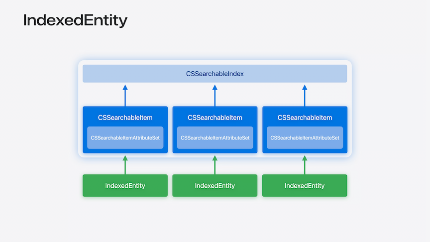
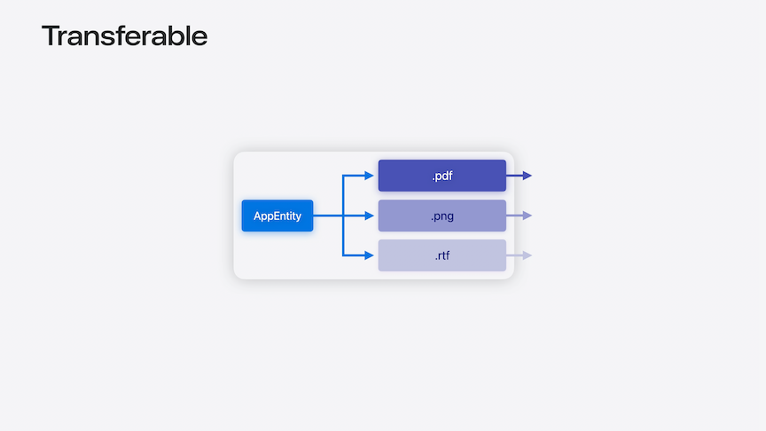

# [**What's new in App Intents**](https://developer.apple.com/videos/play/wwdc2024-10134)

---

* [**Bring your app's core features to users with App Intents**](https://developer.apple.com/videos/play/wwdc2024/10210/) session

### **Spotlight Integration**

* `IndexedEntity` protocol
    * `CSSearchableINdex` allows you to index information about your app to Spotlight using `CSSearchableItem`
    * Any `CSSearchableItem` has an attribute set to extend the information you provide
    * `IndexedEntity` provides a way to index your app entities to `CSSearchableIndex`, while still giving you the ability to customize the attribute set
        * Allows your entities to show in Spotlight search results and helps Siri understand and find them
    * For any struct/class in the app, conform to `IndexedEntity`
    * In the app's init method, index all the entities by calling `indexAppEntities` on `CSSearchableIndex`



```swift
extension TrailEntity: IndexedEntity {}

try await CSSearchableIndex.default.indexAppEntities(trailDataManager.trails.map(TrailEntity.init(trail:)))
```

* The default implementation of `IndexedEntity` only uses the `DisplayRepresentation` to populate the attribute set
    * The attribute set allows you to specify information that could be useful to Spotlight like location info or keywords

```swift
extension TrailEntity: IndexedEntity {
    var attributeSet: CSSearchableItemAttributeSet {
        let attributes = CSSearchableItemAttributeSet()
        attributes.city = self.city
        attributes.stateOrProvince = self.state
        attributes.keywords = activities.map(\.rawValue)
        return attributes
    }
}
```

* If your app is already indexing content in Spotlight via the CSSearchableItem API, you can use `associateAppEntity` to associate an `AppEntity` with your searchable item before you index it
    * Allows the new semantic search to find information about your `AppEntity`
    * Can also set a priority with any of the `IndexedEntity` indexing APIs
        * The larger the value, the more important the item

```swift
public extension CSSearchableItem {
    func associateAppEntity(_ appEntity: some IndexedEntity, priority: Int)
}
```

### **Entities and files**

#### Transferable AppEntity

* An `AppEntity` allows you to define and expose concepts from your app
* Other apps can't understand these concepts
    * Instead, could represent the entity in a standardized format like a PDF, image, or rtf/plain text
    * Use Uniform Type Identifiers to label the file or data with a type
* The Transferable AppEntity API helps with this
* The order that transferable representations are defined is important
    * Provide them from highest to lowest fidelity



```swift
// Transferable
extension ActivityStatisticsSummary: Transferable {
    static var transferRepresentation: some TransferRepresentation {
         DataRepresentation(exportedContentType: .rtf) { summary in
            try summary. asRTFData
         }

        FileRepresentation (exportedContentType: .png) { summary in
            SentTransferredFile(try summary.asImageFile)
        }
    }
}
```

* Transferable restrictions
    * Xcode tools need to be able to read transferable representations at compile time
    * Xcode will provide feedback if it is unable to do so
    * `ProxyRepresentation` can only be used if it references properties of your `AppEntity` with the `@Property` attribute

```swift
// Transferable extraction considerations
struct SomeAppEntity: AppEntity {
    var id: String

    @Property(title: "Name")
    var name: String

    var description: String { "\(id): ((name)" }
}

extension SomeAppEntity: Transferable {
    static var transferRepresentation: some TransferRepresentation {
        ProxyRepresentation(exporting: \.name)
        // ProxyRepresentation(exporting: \.description) <-- will not work because description is not annotated with @Property
    }
}
```

* [**Meet Transferable**](../2022/Meet%20Transferable.md) session from WWDC 2022

#### IntentFile

* When an `AppIntent` like `AppendToNote` receives an `IntentFile` parameter, it can check what content types are available and request whichever types it needs
    * App Intents will use the `Transferable` representation to convert the Entity into the requested content type
    * Use `supportedContentTypes` in your `@Parameter` annotation
        * Allows Siri and Shortcuts to automatically convert content when possible
    * To access the content of the IntentFile, use one of the new APIs for extracting content
        * Check what type of content the `IntentFile` represents
        * Get access to the URL to do conversion

```swift
// IntentFile
struct AppendToNote: AppIntent {
    @Parameter var note: NoteEntity

    @Parameter (title: "Content to append", supportedContentTypes: [.jpeg, •rtf])
    var attachment: IntentFile
    // ...

    public func perform() async throws → some IntentResult {
        if attachment.availableContentTypes.contains(.png) {
            let png = try await attachment
                .withFile(contentType: •png) { url, openedInPlace in
                    guard let image = UIImage(contentsOfFile: url.absolutePath) else {
                        throw Error.unableToLoadImage
                    }
                    return image
                }
        }
        return result()
    }
}
```

#### FileEntity

* Great for document based apps or apps that manage files
* Transferable is great for converting an `AppEntity` into a file or data, but if the entity is itself a file, then the file is the canonical version of the entity
* By using FileEntity, Siri and Shortcuts can facilitate secure access to a file in other apps, allowing them to directly access the file
    * For example, a `RotateImageIntent` in another app could securely access the file backing a `PhotoEntity` in my app and rotate it in place
* `FileEntity` works like any other `AppEntity`, but with the additional requirement that you provide `supportedContentTypes`, and the id be a `FileEntityIdentifier`
    * `FileEntityIdentifier` can be created with a URL, or if the file doesn't exist yet, as a draft identifier
    * The `FileEntityIdentifier` uses the URL's bookmark data, so if the file is moved or renamed the entity will still be valid

```swift
struct PhotoEntity: FileEntity {
    static var typeDisplayRepresentation: TypeDisplayRepresentation = "My Photo Entity"

    static var supportedContentTypes: [UTType] = [.png]

    var id: FileEntityIdentifier

    @Property(title: "Width")
    var width: Double

    @Property(title: "Height")
    var height: Double
}

let id = try FileEntityIdentifier.file(url: urlOfTheFile)
let id = FileEntityIdentifier.draft(identifier: "Untitled")
```

### **Universal links**

* Allow users to access content, regardless of whether they have the app installed
* You can now express your `AppEntity`, `AppEnum`, and `AppIntent` as having a `URLRepresentation`
    * `URLRepresentableEntity`
    * `URLRepresentableEnum`
    * `URLRepresentableIntent`
* Allows Siri and Shortcuts to treat them like they are a link to specific content, allowing actions to open the URL or make them sharable

```swift
// Universal links
extension TrailEntity: URLRepresentableEntity {
    static var urRepresentation: URLRepresentation {
        "https://trailsapp.example/trail/\(.id)/details"
    }
}

struct OpenTrailIntent: OpenIntent {
    static var title: LocalizedStringResource = "Open Trail"
    
    static var parameterSummary: some ParameterSummary {
        Summary ("Open \(\.$target)")
    }
    
    @Parameter (title: "Trail")
    var target: TrailEntity
}
```

* Can also use URLs with App Intents by returning the new `OpenURLIntent` from your `perform` function
    * When the AppIntent is performed by Siri/Shortcuts they can open the provided URL to link to relevant content
    * Can also initialize an `OpenURLIntent` with a newly created entity allowing Shortcuts to open the app and navigate directly to the newly created entity

```swift
// OpensIntent

func perform() async throws -> some OpensIntent {
    .result(
        opensIntent: OpenURLIntent(
            "https://developer.apple.com"
        )
    )
}

func perform() async throws -> some OpensIntent {
    let newTrail = TrailEntity(name: name)
    return .result(
        opensIntent: OpenURLIntent(urlRepresentable: newTrail)
    )
}
```

### **Developer improvements**

#### UnionValue

* Allows you to have a parameter or property that can be represented by one of a set of types
    * Each case in the enumeration must have exactly one associated value
    * A case with no associated value is not valid
    * Each associated value must be distinct
        * e.g. cannot have a second case below with a `TrailEntity`

```swift
// UnionValue

@UnionValue
enum DayPassType {
    case park(ParkEntity)
    case trail(TrailEntity)
}

struct BuyDayPass: AppIntent {
    // ...
    @Parameter var trail: DayPassType
    // ...
    func perform() async throws -> some IntentResult {
        switch passType {
        case let .park(park):
            // purchase for park
        case let .trail(trail):
            // purchase for trail
        }
    }
}
```

#### Generated titles

* With Xcode 16, you no longer have to provide a title for your AppEntity Properties or AppIntent Parameters
    * Xcode will intelligently generate a title string for you based on the name of the struct's property
    * Can still include a `title` parameter like before if you want to override this behavior

```swift
// Generated titles
struct SuggestTrails: AppIntent {
    // Old code
    // @Parameter(title: "Activity")
    // var activity: ActivityStyle
    @Parameter var activity: ActivityStyle

    ...
}
```

#### Framework improvements

* Previously, all App Intent types had to be in the same module
    * In Xcode 16, that limitation is gone
    * Only frameworks are supported at this time, libraries outside of a framework are not


* [**Bring your app to Siri**](https://developer.apple.com/videos/play/wwdc2024/10133/) session
* [**Build a great Lock Screen camera capture experience**](https://developer.apple.com/videos/play/wwdc2024/10204/) session
* [**Extend your app's controls across the system**](./Extend%20your%20app's%20controls%20across%20the%20system.md) session
