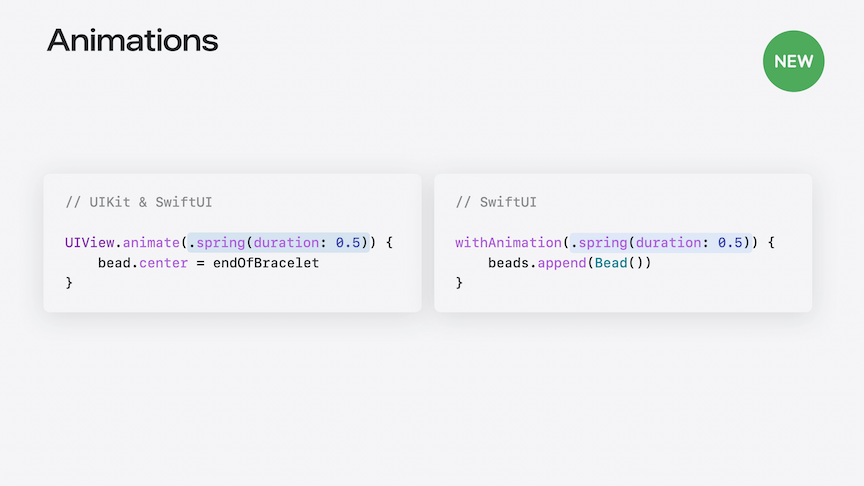
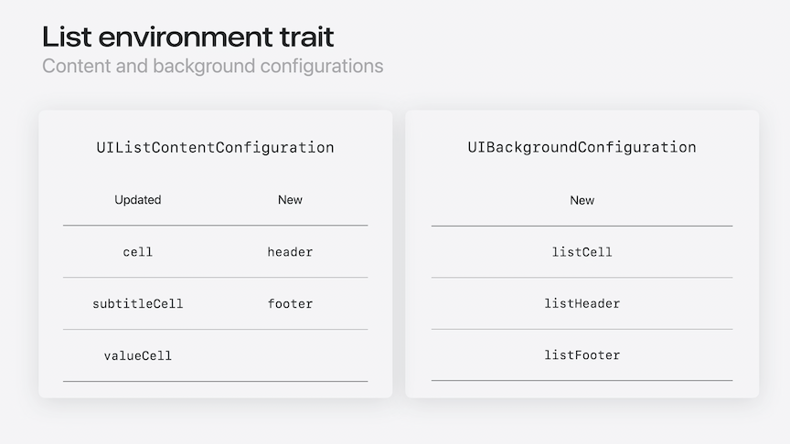

# [**What's new in UIKit**](https://developer.apple.com/videos/play/wwdc2024-10118)

---

### **Key features**

#### Document launch experience

* Redesigned launch experience for document-based apps
    * Full control over launch view's design
    * Support for template document creation
    * [**Evolve your document launch experience**](https://developer.apple.com/videos/play/wwdc2024-10132) session

#### Updated tab and sidebar

* On iPadOS 18, there is a new compact look of a floating bar at the top
    * Existing sidebar apps can adopt new UITabBarController APIs to get a combined tab and sidebar experience
    * When minimized, the tab bar animates back into the tab bar
    * Include customization features to allow allow personalization the sidebar tab bar through drag and drop
    * [**Elevate your tab and sidebar experience in iPadOS**](./) session

#### Fluid transitions

* New zoom transition
    * Works with navigation and presentation
    * Continuously interactive and interruptible

### **UIKit and SwiftUI interoperability**

#### Animations

* Can use SwiftUI animation types to animate UIKit views
    * Includes CustomAnimations
    * Can build gesture-driven animations using the SwiftUI spring animation
    * [**Enhance your UI animations and transitions**](./) session



```swift
switch gesture.state {
case .changed:
    UIView.animate(.interactiveSpring) {
        bead.center = gesture.translation
    }

case .ended:
    UIView.animate(.spring) {
        bead.center = endOfBracelet
    }
}
```

#### Gesture recognizers

* UIKit and SwiftUI gestures are unified
    * Can specify dependencies between them
    * Use `name` to reference SwiftUI gesture from UIKit
    * Can specify a failure requirement between two gestures, even if one is UIKit and the other is SwiftUI

```swift
// Inner SwiftUI double tap gesture

Circle()
    .gesture(doubleTap, name: "SwiftUIDoubleTap")


// Outer UIKit single tap gesture

func gestureRecognizer(
    _ gestureRecognizer: UIGestureRecognizer, 
    shouldRequireFailureOf other: UIGestureRecognizer
) -> Bool {
    other.name == "SwiftUIDoubleTap"
}
```

* Add UIKit gesture recognizers to SwiftUI with `UIGestureRecognizerRepresentable`
* [**What's new in SwiftUI**](./What's%20New%20in%20SwiftUI.md) session

### **General enhancements**

#### Automatic trait tracking

* Supported in common view and view controller update methods
    * Examples are `layoutSubviews` and `drawRect`
* Tracks which traits are used
* Automatically invalidates on trait changes
    * Works with methods like `setNeedsLayout` or `setNeedsDisplay`

```swift
// Old Code
class MyView: UIView {
    override init(frame: CGRect) {
        super.init(frame: frame)
        registerForTraitChanges([UITraitHorizontalSizeClass.self], action: #selector(UIView.setNeedsLayout))
    }

    override func layoutSubviews() {
        super.layoutSubviews()
        
        if traitCollection.horizontalSizeClass == .compact {
            // apply compact layout
        } else {
            // apply regular layout
        }
    }
}

// Updated code, no longer need to register for trait changes
class MyView: UIView {
    override func layoutSubviews() {
        super.layoutSubviews()
        
        if traitCollection.horizontalSizeClass == .compact {
            // apply compact layout
        } else {
            // apply regular layout
        }
    }
}
```

* Maximum performance with minimal dependencies
* Always active with supported methods
* [**Automatic trait tracking**](https://developer.apple.com/documentation/uikit/app_and_environment/automatic_trait_tracking) documentation

#### List improvements

* All views in UICollectionView list sections and UITableViews now have `UITraitCollection.listEnvironment`
* Describes style of the list
* Used by:
    * `UIListContentConfiguration`
    * `UIBackgroundConfiguration`
* `updatedConfiguration(for:)` uses `listEnvironment`
* Removes the need to know the style for a list when configuring a cell

```swift
// iOS 17 Code
func configurations(for location: FileLocation,
                    listAppearance: UICollectionLayoutListConfiguration.Appearance) ->
    (UIListContentConfiguration, UIBackgroundConfiguration) {
    
    let isSidebar = listAppearance == .sidebar

    var contentConfiguration: UIListContentConfiguration
    let backgroundConfiguration: UIBackgroundConfiguration

    contentConfiguration = isSidebar ? .sidebarCell() : .cell()
    backgroundConfiguration = isSidebar ? .listSidebarCell() : .listGroupedCell()

    contentConfiguration.text = location.title
    contentConfiguration.image = location.thumbnailImage

    return (contentConfiguration, backgroundConfiguration)
}

// iOS 18 Code
func configurations(for location: FileLocation) ->
    (UIListContentConfiguration, UIBackgroundConfiguration) {

    var contentConfiguration = UIListContentConfiguration.cell()
    let backgroundConfiguration = UIBackgroundConfiguration.listCell()

    contentConfiguration.text = location.title
    contentConfiguration.image = location.thumbnailImage

    return (contentConfiguration, backgroundConfiguration)
}
```



#### Update link

* Easier way to implement complex animations that require periodic UI updates
* Similar to `CADisplayLink`
* More features
    * Automatic view tracking
    * Low latency applications
    * Better performance

```swift
let updateLink = UIUpdateLink(
    view: view,
    actionTarget: self,
    selector: #selector(update)
)
updateLink.requiresContinuousUpdates = true
updateLink.isEnabled = true

@objc func update(updateLink: UIUpdateLink,
                  updateInfo: UIUpdateInfo) {
    view.center.y = sin(updateInfo.modelTime)
        * 100 + view.bounds.midY
}
```

* [**UIUpdateLink**](https://developer.apple.com/documentation/uikit/uiupdatelink) documentation

#### Symbol animations

* New SF Symbol effects
    * `.wiggle`
    * `.breathe`
    * `.rotate`
* Repeat options
    * `.repeat(.periodic(3, delay: 0.25))`
    * `.repeate(.continuous)`
* Updates
    * Default `.replace` effect now prefers the new magic replace behavior
        * Smoothly animates badges and slashes
        * Automatically falls back to a standard replace style if needed (`.downUp`)
        * New API to specify an explicit fallback style
            * `.replace.magic(fallback: .upUp)`
* SF Symbols 6
    * Updated SF Symbols app
    * Variable color looping annotations
    * Continuous bounce effects
    * [**What's new in SF Symbols 6**](./) session
    * [**Animate symbols in your app**](../2023/Animate%20symbols%20in%20your%20app.md) session from WWDC 2023

#### Sensory feedback

* Attach feedback generators to view
* Pass location of each feedback
* New `UICanvasFeedbackGenerator`
* Not just for haptics, can also provide audio

```swift
@ViewLoading var feedbackGenerator: UICanvasFeedbackGenerator

override func viewDidLoad() {
    super.viewDidLoad()
    feedbackGenerator = UICanvasFeedbackGenerator(view: view)
}

func dragAligned(_ sender: UIPanGestureRecognizer) {
    feedbackGenerator.alignmentOccurred(at: sender.location(in: view))
}
```

#### Text improvements

* New edit menu action that brings up the new formatting panel
    * `textView.allowsEditingTextAttributes = true` to enable
* Also supports new text highlight feature
    * `.textHighlightsStyle` for the range of text that should be highlighted
    * `.textHighlightColorScheme` for the color used to render the highlight
    * Five predefined color schemes, in addition to the default, which uses tint color

```swift
var attributes = [NSAttributedString.Key: Any]()

// Highlight style
attributes[.textHighlightStyle] = 
NSAttributedString.TextHighlightStyle.default

// Highlight color scheme
attributes[.textHighlightColorScheme] =
NSAttributedString.TextHighlightColorScheme.default
```

* Customize available controls and layout fo the formatting panel by setting a custom configuration
    * `.textFormattingConfiguration` property
        * Set to `nil` to opt out

```swift
textView.textFormattingConfiguration = .init(groups: [
    .group([
        .component(.fontAttributes, .mini),
        .component(.fontPicker, .regular),
        .component(.textColor, .mini)
    ]),
    .group([
        .component(.fontPointSize, .mini),
        .component(.listStyles, .regular),
        .component(.highlight, .mini)
    ])
])
```

* Writing Tools support
    * `UITextView` built-in support
        * Editable text views get full inline-editing proofreading and composition support
        * Non-editable text views get the overlay panel
    * New APIs to customize behavior

#### Menu actions

* Add menu actions to iPhone app
* Invokable by the system
    * `UICommand`
    * `UIKeyCommand`
    * `UIAction`
* Performable through iPhone mirroring on the Mac keyboard
* [**Take your iPad apps to the next level**](https://developer.apple.com/videos/play/wwdc2021/10057/) session from WWDC 2021

#### Apple Pencil

* Support for new gestures of Apple Pencil Pro
    * Squeeze gesture
    * Haptics
    * Barrel roll angle
    * Undo slider
* New configurable `PKToolPicker`
    * Add custom tools
    * Support Apple Pencil Pro
* [**Squeeze the most out of Apple Pencil**](https://developer.apple.com/videos/play/wwdc2024-10214) session
