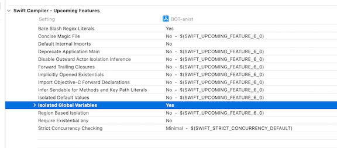
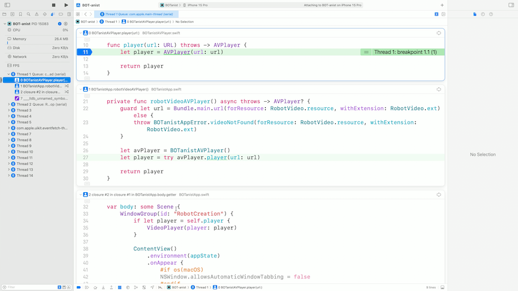
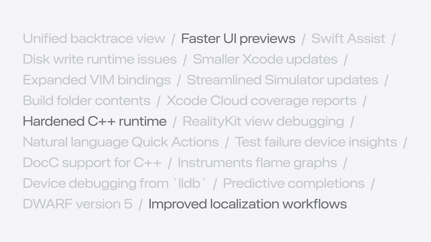

# [**What's new in Xcode 16**](https://developer.apple.com/videos/play/wwdc2024-10135)

---

### **Edit**

* Code completion
    * More thorough code completion due to on-device models trained on Swift and Apple SDKs
        * Uses surrounding code context like function names and comments
* Swift 6
    * New language mode that provides concurrency guarantees
        * Can turn on upcoming language features in the `Swift Compiler - Upcoming Features` section in Build Settings
    * Allows you to catch future errors as warnings now before they are marked as errors in the Swift 6
    * [**Migrate your app to Swift 6**](./Migrate%20your%20app%20to%20Swift%206.md) session



* Previews
    * `@Previewable` macro
        * Can be attached to property wrappers like `@State`, allowing them to be used directly within a preview block
    * `PreviewModifier`
        * Makes it easier to share environment or data for previews
        * Enables the preview system to cache data
        * Use `#Preview(traits)` to create Preview ViewTraits
    * New execution engine and compiler/build advances, previews are faster and don't require rebuilds to work

```swift
#Preview {
    @Previewable @State var currentFace = RobotFace.heart
    
    RobotFaceSelectorView(currentFace: $currentFace)
}
```

```swift
struct SampleRobotNamer: PreviewModifier {
    typealias Context = RobotNamer

    static func makeSharedContext() async throws -> Context {
        let url = URL(fileURLWithPath: "/tmp/local_names.txt")
        return try await RobotNamer(url: url)
    }
    
    func body(content: Content, context: Context) -> some View {
        content.environment(context)
    }
}

extension PreviewTrait where T == Preview.ViewTraits {
    @MainActor static var sampleNamer: Self = .modifier(SampleRobotNamer())
}

#Preview(traits: .sampleNamer) {
    RobotNameSelectorView()
}
```

### **Build**

* Explicit modules
    * Provides improved parallelism, better diagnostics, and faster debugging
    * C and Obj-C are explicitly opted in
    * For Swift, you have to enable `Explicitly Built Modules` in Build Settings
    * Can queue up a build without waiting for package resolution first
    * Xcode splits pu the processing of each compilation unit into three phases: scanning, building modules, and building the original code
    * Reflected in the build timeline
    * [**Demystify explicitly built modules**](./) session

### **Debug**

* Faster debugging with explicit modules
    * LLDB can re-use the build outputs when evaluating expressions
* DWARF5 is now the default debug symbol format when building against macOS Sequoia or iOS 18
    * Smaller, faster debug symbol lookups
* Thread performance checker
    * Now diagnoses excessive disk writes and slow app launch diagnostics
    * New `Launches` report in the Xcode Organizer
        * Shows the slowest code path signatures
    * Disk Writes report now show trends over app versions
    * When debugging code, will surface the worst of these as runtime issues, pinpointing exact lines of code to focus on (even if it's not reproducing locally)
    * New `Unified Backtrace View` in the debug bar shows a visualization to follow the call stack and view code in each frame by scrolling down



* RealityKit debugger
    * Capture a snapshot of an app's entity hierarchy, and explore it in 3D
    * Can view entities and their components
    * Inspect both built-in and custom properties
    * [**Break into the RealityKit debugger**](https://developer.apple.com/videos/play/wwdc2024-10172) session
    * [**Run, break, and inspect: explore effective debugging in LLDB**](./) session

### **Test**

#### Swift Testing

* Work alongside XCTests
* `@Test` macro indicates a function is a test
* `#expect` macro can take any boolean expression
* Can view additional information about each value in a failed test by clicking on `Show Details` in the error

```swift
import Testing
@testable import BOTanist


// When using the default init Plant(type:) make sure the planting style is graft
@Test
func plantingRoses() {
    // First create the two Plant structs
    let plant = Plant(type: .rose)
    let expected = Plant(type: .rose, style: .graft)

    // Verify with #expect
    #expect(plant == expected)
}
```

* Can provide a display name and arguments for a test
* Can provide tags and add them to tests to group tests across different suites
    * Tag view can be used on left sidebar to show tagged groups
    * Tags can be used to include/exclude tests from test plans

```swift
extension Tag {
    @Tag static var planting: Self
}

@Test(.tags(.planting))
func plantingRoses() {
    // First create the two Plant structs
    let plant = Plant(type: .rose)
    let expected = Plant(type: .rose, style: .graft)

    // Verify with #expect
    #expect(plant == expected)
}
```

* [**Meet Swift Testing**](./Meet%20Swift%20Testing.md) session
* [**Go further with Swift Testing**](./Go%20further%20with%20Swift%20Testing.md) session

### **Profile**

* Use Instruments, which can be accessed from the `Profile` action in Xcode
    * Flame Graph added in Xcode 16, which provides a high level overview of the trace execution
    * Can go straight to code that is causing heavy load in the timeline

