# [**Build a SwiftUI app with the new design**](https://developer.apple.com/videos/play/wwdc2025/323)

---

* Before this session, watch:
    * [Meet Liquid Glass](./Meet%20Liquid%20Glass.md)
    * [Get to know the new design system](./Get%20to%20know%20the%20new%20design%20system.md)

### **App structure**

* App structure refers to the family of APIs that define how people navigate your app
    * Include views and modifiers like NavigationSplitView, TabView and Sheets

#### NavigationSplitView and Inspectors

* They now have a Liquid Glass sidebar that floats above your content
* With the new `backgroundExtensionEffect` modifier, views can extend outside the safe area, without clipping their content
    * The image is mirrored and blurred outside of the safe area, extending the artwork while leaving all its content visible
* In the new design, the inspector hosts content with a more subtle layering, but similar to NavigationSplitView

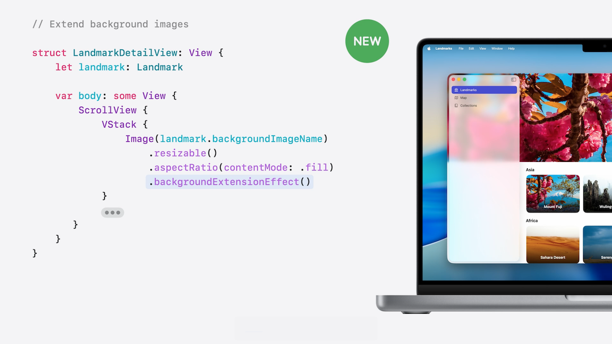

#### TabViews

* TabViews provide persistent, top-level navigation
* Optimize for switching from section to section, maintaining context within each section
* With the new design, the tab bar on iPhone floats above the content, and can be configured to minimize on scroll
* To adopt this behavior, use the `tabBarMinimizeBehavior` modifier
    * For `.tabBarMinimizeBehavior(.onScrollDown)`, the tab bar will minimize when scrolling down, and re-expand when scrolling up
* Place a view above the bar with the `tabViewBottomAccessory` modifier
    * This takes advantage of the extra space provided by the tab bar’s collapsing behavior
    * Inside your accessory view, read the tabViewBottomAccessoryPlacement from the environment
    * Then, adjust the content of your accessory when it collapses into the tab bar area

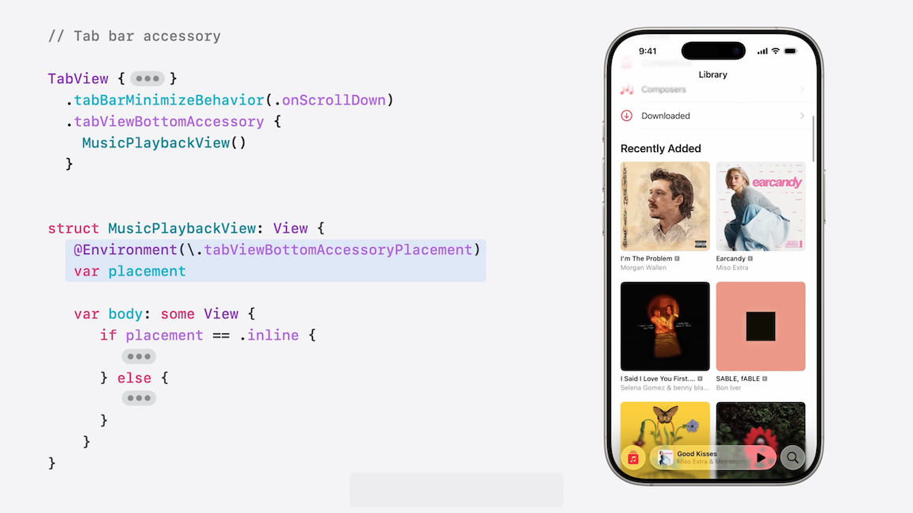

#### Sheets

* On iOS 26, partial height sheets are inset by default with a Liquid Glass background
* At smaller heights, the bottom edges pull in, nesting in the curved edges of the display
* When transitioning to a full height sheet, the glass background gradually transitions, becoming opaque and anchoring to the edge of the screen
* If you’ve used the `presentationBackground` modifier to apply a custom background to your sheets, consider removing that
* Sheets can also directly morph out of buttons that present them
    * Other presentations such as menus, alerts, and popovers flow smoothly out of liquid glass controls
    * Dialogs also automatically morph out of the buttons that present them

### **Toolbars**

* Toolbar items are placed in Liquid Glass
* Appear above the app's content
* Automatically adapts to what's beneath it
* Toolbar items are automatically grouped
* Custom toolbar items are grouped separately from the system-provided back button
* The new ToolbarSpacer API with fixed spacings to split them into their own group
    * This provides visual clarity that the grouped actions are related, while the separated actions have distinct behavior
    * ToolbarSpacer can also be used to create a flexible space that expands between toolbar items

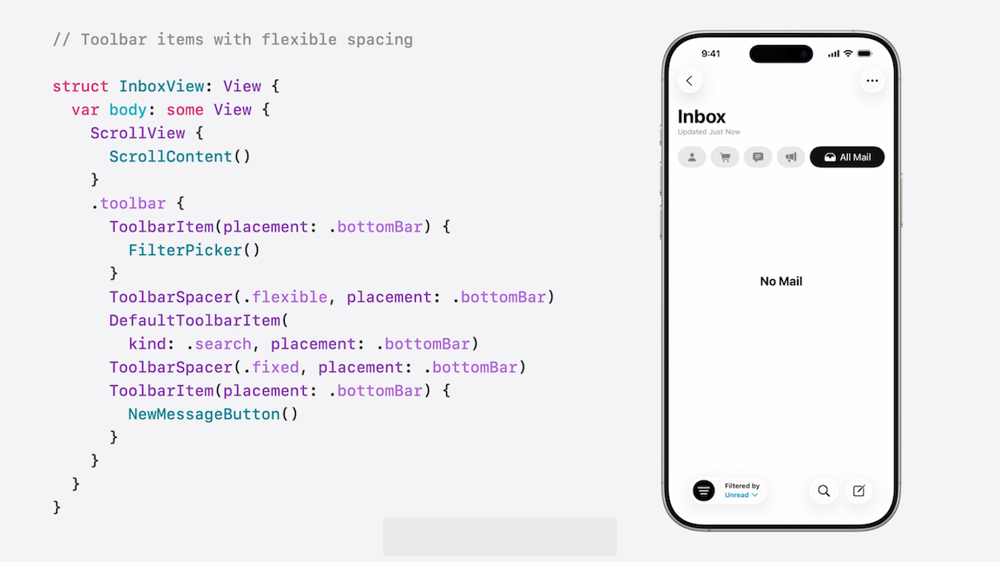

* Use the `sharedBackgroundVisibility(.hidden)` modifier to separate an item into its own group without a background
* Apply the badge modifier to a toolbar item’s content to display a notification indicator

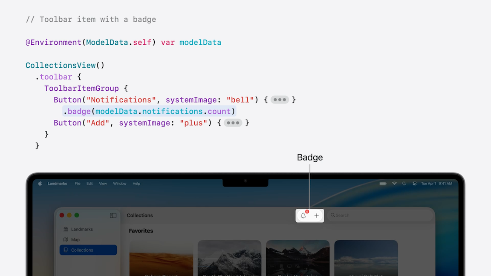

* Icons use monochrome rendering in more places, including in toolbars
    * The monochrome palette reduces visual noise, emphasizes your app’s content, and maintains legibility
* Can still tint icons with a tint modifier
    * Use this to convey meaning, like a call to action or next step, but not just for visual effect
* In the new design, an automatic scroll edge effect keeps controls legible
    * A subtle blur and fade effect applied to content under system toolbars
    * If your app has any extra backgrounds or darkening effects behind the bar items, make sure to remove them, as these will interfere with the effect
    * For denser UIs with a lot of floating elements, like in the calendar app, tune the sharpness of the effect on your content with the `scrollEdgeEffectStyle` modifier
        * e.g. `.scrollEdgeEffectStyle(.hard, for: .top)`

### **Search**

* Search is in the toolbar
    * Places the field at the bottom of the screen on iPhone
    * On iPad and Mac, it appears in the top-trailing position of the toolbar
* Treat search as a dedicated page in a multi-tab app
    * The search field appears on its own Liquid Glass surface
    * A tap activates it and shows the keyboard
    * When applying the searchable modifier on the NavigationSplitView, it indicates that search applies to the entire NavigationSplitView, not just one of the columns
        * On iPhone, this variant automatically adapts to bring the search field at the bottom of the display
        * Depending on device size, number of toolbar buttons, and other factors, the system may choose to minimize the search field into a toolbar button
        * When tapping on the button, a full-width search field appears above the keyboard
        * If you want to explicitly opt-in to the minimized behavior, say because search isn’t a main part of your app’s experience, use the new searchToolbarBehavior modifier

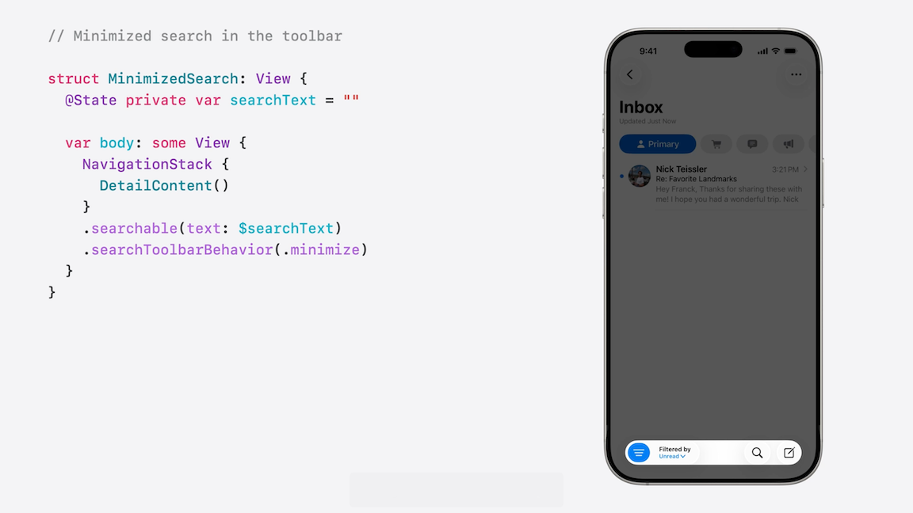

* Searching in multi-tab apps is often done in a dedicated search page
    * The pattern is used by apps across Apple's platforms
    * To do this in your app, set a search role on one of your tabs and place a searchable modifier on your TabView
        * When someone selects this tab, a search field takes the place of the tab bar, and the content of the tab is shown
        * People can interact with your browsing suggestions, or tap on the search field to bring up the keyboard and continue with specific search terms

Tab Bar With Search Role | Search Selected
-------------------------|----------------
 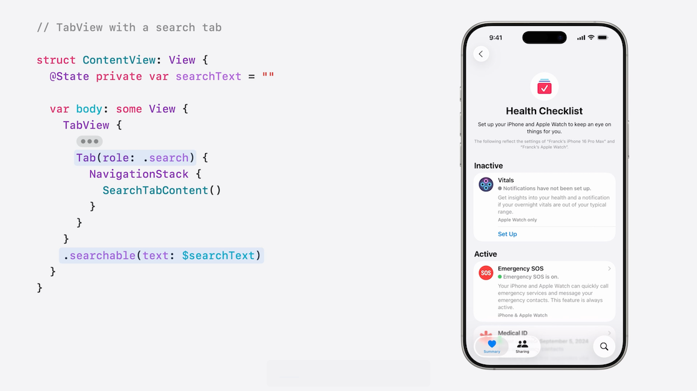 | 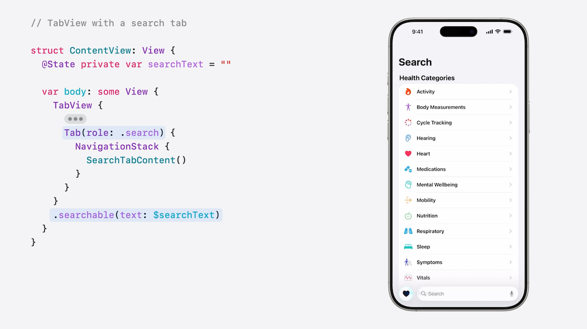

* On iPad and Mac, when someone selects the search tab, the search field appears centered above your apps browsing suggestions

iPad Search | iPad Search Selected
-------------------------|----------------
 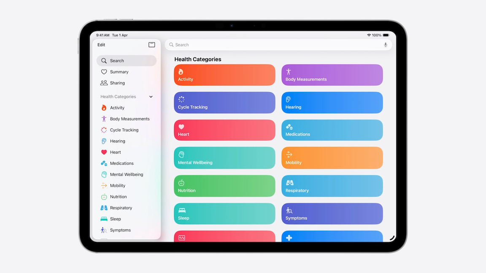 | 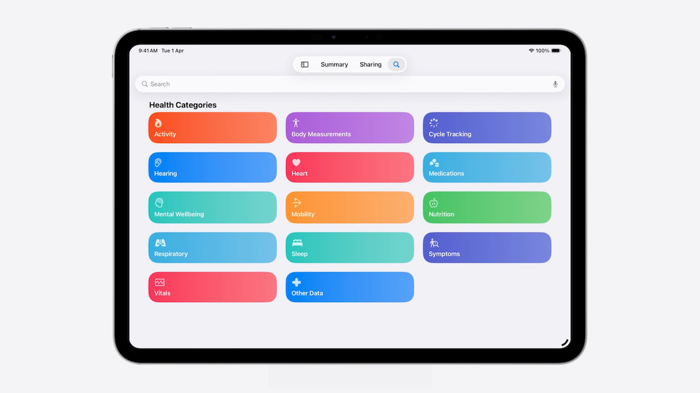

### **Controls**

#### Buttons

* Bordered buttons now have a capsule shape by default
* Mini, small, and medium size controls on macOS retain a rounded-rectangle shape, which preserves horizontal density
* The existing button border shape modifier enables you to specify the shape for any size
    * `.buttonBorderShape(.roundedRectangle)` or `.buttonBorderShape(.capsule)`, etc.
* Control heights are updated for the new design
    * Most controls on macOS are slightly taller, providing a little more breathing room around the control label, and enhancing the size of the click targets

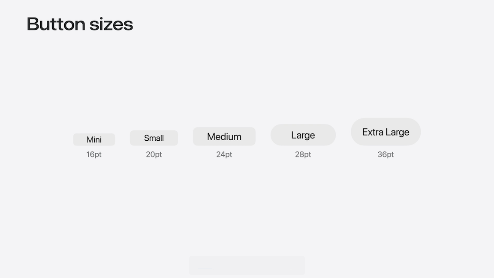

* For compatibility with existing high-density layouts, like complex inspectors and popovers, the existing controlSize modifier can be applied to a single control or across an entire set of controls

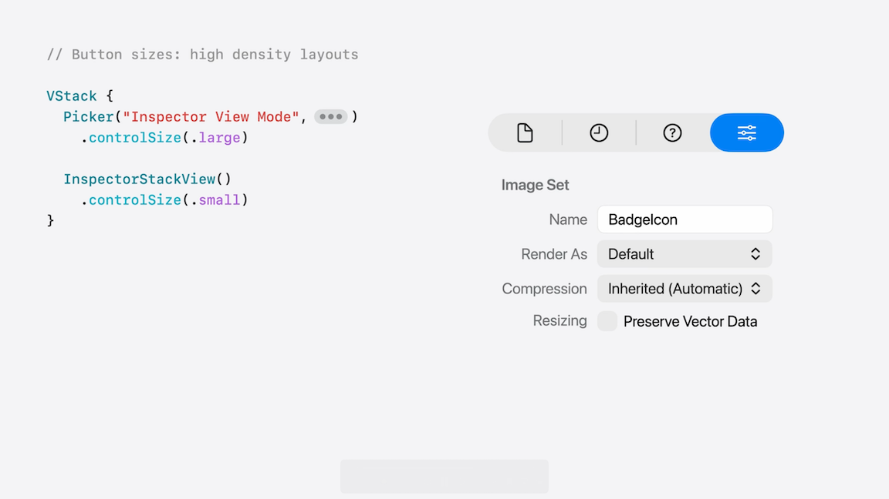

* Now support for extra large sized buttons
* The new glass and glass prominent button styles bring Liquid Glass to any button in your app
    * `.buttonStyle(.glass)` and `.buttonStyle(.glassProminent)`

#### Sliders

* Sliders now support tick marks
    * The tick marks appear automatically when initializing a slider with a step parameter (e.g. `Slider(value: $sliderValue, step: 0.2))`)
    * Can even manually place individual ticks (image below)

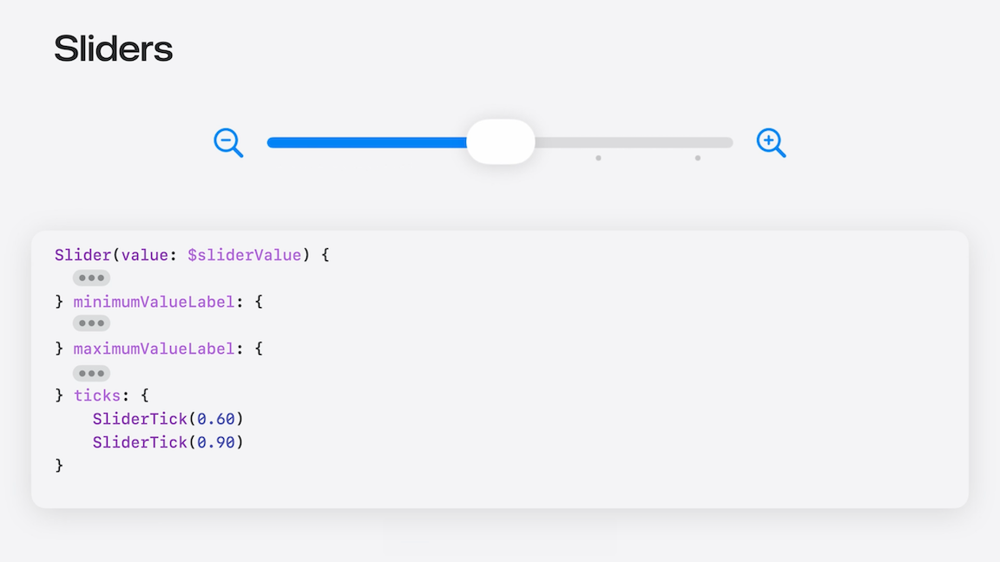

* Sliders also let you start their track fill at a particular place
    * Useful for values that may adjust left or right from a non-leading default value
    * Specify the starting point with the `neutralValue` parameter.

#### Menus

* Menus across platforms have a new design and more consistent layout
    * Icons are consistently on the leading edge and are now used on macOS too
    * The same API using Label or standard control initializers now create the same result on both platforms

#### Custom Controls

* There are new APIs to update your controls for the new design
* To build views that automatically maintain concentricity with their container, use the concentric rectangle shape
    * `CustomControl().background(.tint, in: .rect(corner: .containerConcentric))`
    * Pass the containerConcentric configuration to the corner parameter of a rectangle and the shape will automatically match its container across different displays and window shapes

### **Liquid Glass effects**

* To add glass to custom views, use a `.glassEffect()` modifier
    * By default, a glass effect will be applied within a capsule shape behind your content
    * SwiftUI automatically uses a vibrant text color that adapts to maintain legibility against colorful backgrounds
* Customize the shape of the glass effect by providing a shape to the modifier
    * `.glassEffect(in: .rect(cornerRadius: 16))`
* For especially important views, use a tint modifier
    * `.glassEffect(.regular.tint(.green))`
* On iOS, for custom controls or for containers with interactive elements, add the interactive modifier to the glass effect
    * `.glassEffect(.regular.interactive())`
    * Glass reacts to user interaction by scaling, bouncing, and shimmering, matching the effect provided by toolbar buttons and sliders
* To combine multiple glass elements, use the `GlassEffectContainer`
    * This grouping is essential for visual correctness
    * The glass material reflects and refracts lights, picking colors from nearby content
    * Achieved by sampling content from an area larger than itself
        * However, glass can not sample other glass, so having nearby glass elements in different containers will result in inconsistent behavior
    * Using a glass container allows these elements to share their sampling region, providing a consistent visual result
    * To configure a GlassEffectContainer:
        * Declare a local namespace
        * Associate the namespace with each of the glassEffect elements and with the toolbar button

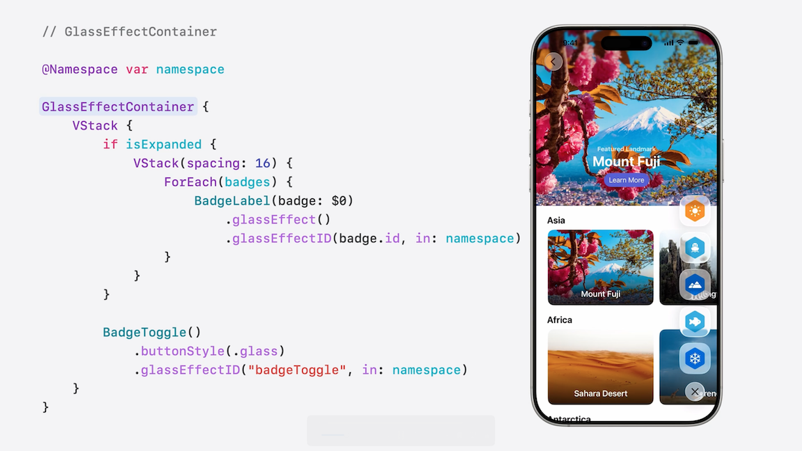
