# [**Create icons with Icon Composer**](https://developer.apple.com/videos/play/wwdc2025/361)

---

* Watch the [Say hello to the new look of app icons](./Say%20hello%20to%20the%20new%20look%20of%20app%20icons.md) Session first

### **Overview**

* For many years, Mac app icons were created at all sorts of sizes so that each artwork could be optimized for every place it showed up
    * Before retina screens, when it was important that elements snap to the pixel grid to maximize contrast and legibility
* Then came along iOS and watchOS, and 2X displays with double the pixel density, and then 3X, and that made for a lot of icons to create
* A few years back, with all the advancements in screen resolution and auto scaling, we added the option to deliver just one image per platform and let our system handle the rest
* With dark and tinted modes expanding even more this year on iOS, plus macOS also adopting these appearances and Watch getting the new look, we are back to providing multiple icons
* Now all this can be achieved in one single file using Icon Composer
    * You might still prefer to upload individual images to Xcode, and without doing anything more on your part, they'll still get the new edge treatment on device
* Icon Composer pairs with your existing design tools, giving you full control over our materials
* From one artwork, from today, you can produce designs for iPhone, iPad, Mac, and Watch, giving your app a consistent identity wherever it shows up
* Take full advantage of all the exclusive dynamic glass properties, previewing how it’ll look realtime, and testing all six of our new appearances:
    * Default, Dark, Clear light, Clear dark, Tinted light, and Tinted dark
* Can even export out the images for any marketing or other needs you might have
* No need to worry about creating all those different sizes anymore, the materials are designed to adapt and scale to your icon

### **Design**

* If you’re working with flat graphics it’s best to use a tool that can draw in vectors since having the ability to export SVGs will give you the most scalability later down the line
* Once you have that open, we want to set up the right canvas size
    * The simplest way to do this I find is by using one of our app icon templates; available for Figma, Sketch, Photoshop, and Illustrator, all found on the Apple Design Resources website
* If designing for iPhone, iPad or Mac, these now use the same 1024px canvas, and have a new grid, and rounded-rectangle shape
* Watch is now 1088px so it overshoots our rounded rectangle and uses the same grid

#### Designing with layers

* If you’re familiar with making app icons for tvOS or visionOS, you already have a good understanding of layering
* Each layer represents a step in Z depth, where the bottom is the background and the other stack on top
    * For a lot of cases, this is as simple as one foreground and one background, like Messages
    * In other instances, your artwork might look a little more layered, like Home

Background and One Layer | Background and Multiple Layers
-------------------------|-------------------------------
 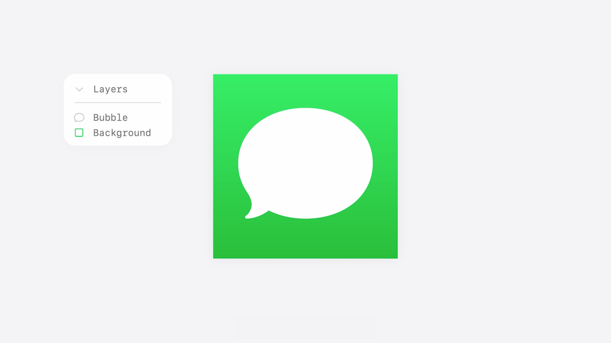 | 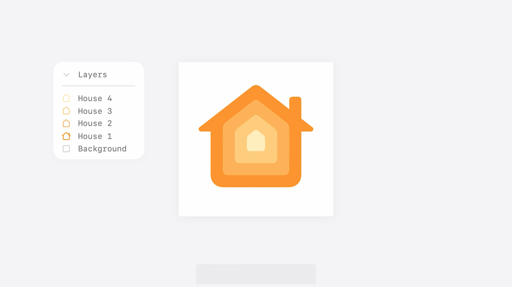

* Alongside layering by Z, splitting different colors out by layers will give you the most control later in Icon Composer, like with the Translate app icon
    * The speech bubbles use two separate layers, use two separate layers
    * Separate the type from the bubbles, this is going to give me even more control
    * When making the dark mode variant in Icon Composer, only had to change one fill

Translate Light Icon | Translate Dark Icon
---------------------|--------------------
 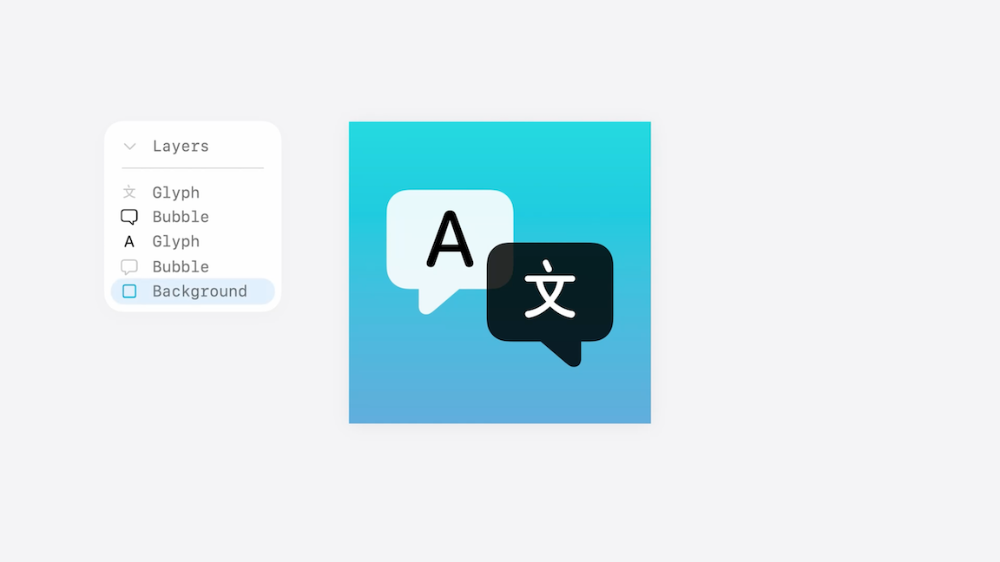 | 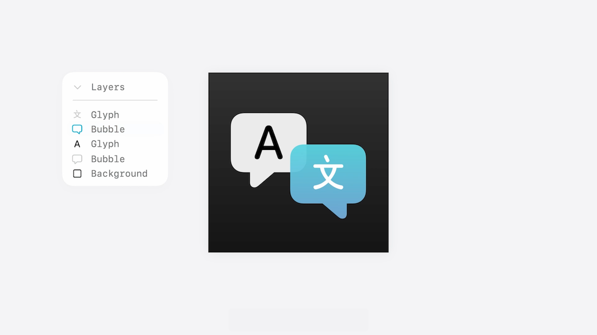

* Icon Composer makes layers out of liquid glass, so several properties can be added directly in Icon Composer
    * Blur, shadow, specular, opacity, translucency
    * Instead of baking these into the file, keep the source art flat and opaque, so it's easier to control in Icon Composer

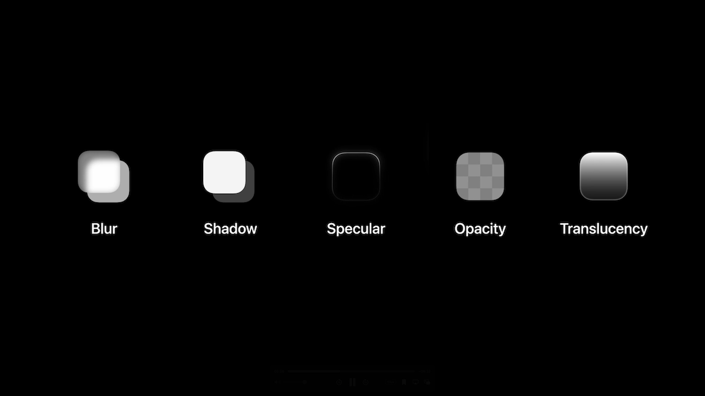

### **Export Layers**

* Once your artwork is ready, export the layers as SVGs
    * For Illustrator, Apple created a layer to SVG script that will automate this for you, which you can download
* Exporting out the canvas size ensures everything drops right into position in Icon Composer
* Number them in order of Z, and it’ll automatically follow that same order
    * Otherwise, you can always reorder them later
* Simple background colors and gradients get added directly in Icon Composer, so don’t need to be exported
* If using any text, since the SVG format doesn’t preserve fonts, it will need converting to outlines before exporting
* Whenever using custom gradients, raster images, or any elements or software that can’t be expressed through SVG, export these layers as PNG
* Never include the rounded rectangle or circle mask in exports

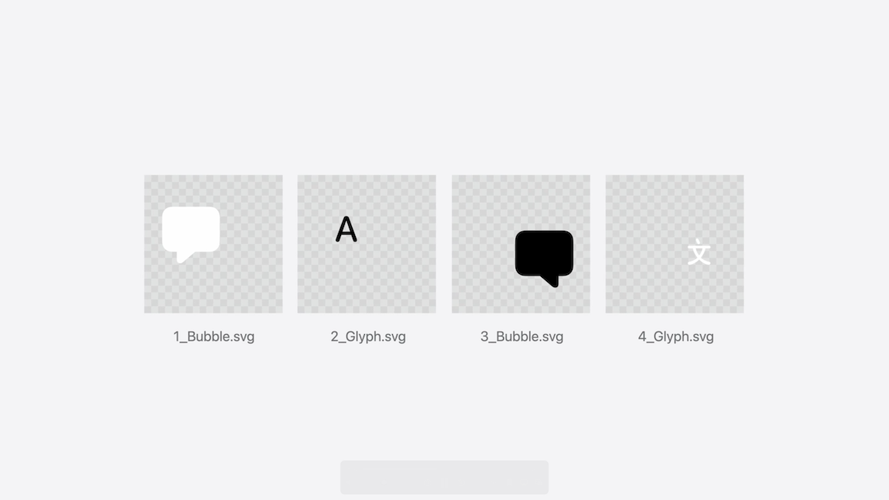

### **Icon Composer**

* Icon Composer has three main parts to its layout
    * On the left, the sidebar with the canvas, groups and layers
    * Centered, the preview panel with all the different artworks and preview controls
    * Right, the inspector, where the appearance properties and document options are
* When you first open Icon Composer, it will open with just the canvas on show

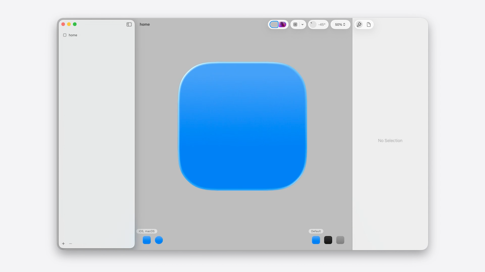

* To change the initial background color
    * Select the canvas (`home` on the image above) in the sidebar
    * Pick a color or gradient from the inspector
        * Can also select system presets
* You can drag and drop your layers into the sidebar and they will be alphabetically organized
* In Icon Composer, groups control how elements stack and receive glass properties
    * By default, it’ll always be one, but you can go all the way up to four

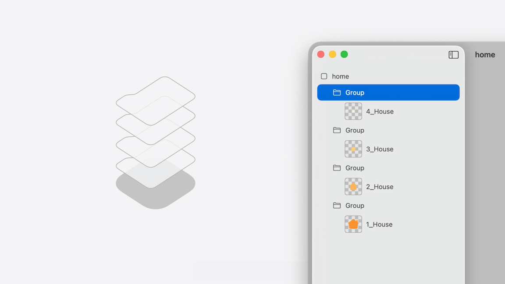

* At the bottom, we have our platforms and appearance modes: light, dark, and tinted
    * This year Apple renamed these to default, dark, and mono
        * Mono produces all the appearances for clear and for tinted
        * All these previewable with a click of the thumbnail

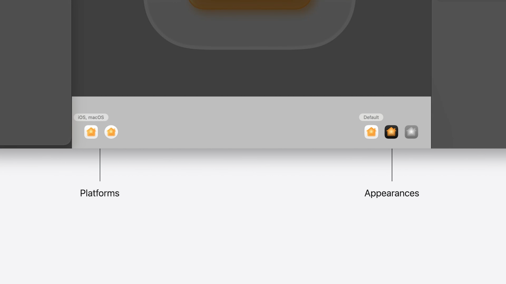

* In the inspector are all the controls for appearance properties and our document settings
    * Helpful for choosing which platforms to design for
* When you drag a layer into Icon Composer you’ll see it will automatically get liquid glass
    * On the layer level, you can choose whether to toggle this off or on
* There are a number of other useful controls you'll recognize from design tools:
    * Color controls for creating variants for dark and mono mode
    * Composition controls for reworking artwork for different platforms
* At the group level:
    * All the options for Liquid Glass
        * Some are set automatically, but recommended you continue to dial these in to get the look you want
    * Color and composition controls as well

Layer Inspector | Group Inspector
----------------|----------------
 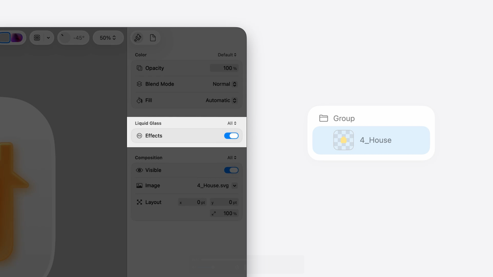 | 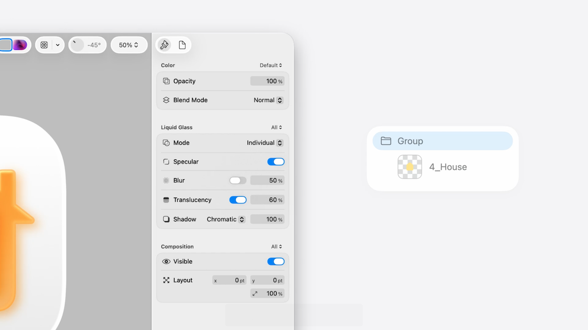

* Some properties are pre-configured to apply per appearance, like opacity, blend mode, and fill
    * Others to all, since the attributes are more commonly consistent across modes
* If you want more control over a property, you can hover over the the property and click the `+` to create an individual variant of a property

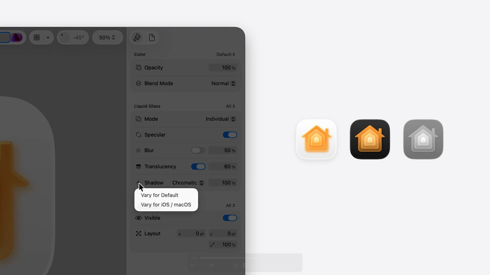

* For layers that get complex and/or pillowy in the narrow areas, either solve this by switching off the specular on the group or switching off liquid glass entirely on the layer
* Neutral shadows are the preset shadows: they're nuanced, versatile, work well on any background
    * When using color against white though, this is a great opportunity to test out chromatic shadows
    * The color from the artwork spills onto the background, creating a nice look that emphasizes the lighting and physicality of the material
        * Can still keep our neutral shadows for dark and mono by creating a variant
* Common considerations for dark appearances:
    * Always use fills to help optimize artworks - change the fill when a color gets lost in a dark background
        * Can also apply to other color related properties like opacity and blend mode
    * When importing a PNG though, and can’t use a fill, the same principle can be achieved by creating another image in our design software and importing it as a variant
* Legibility is also key for mono appearances
    * Setting at least one element of your icon to be white, usually the most prominent or recognizable part, make sure it shows up strong
    * The other colors can be mapped to tones of gray
    * Icon Composer will do an automatic conversion for this, but it’s important to tune it to get the best contrast
* Designing between rounded rectangle and circle platforms, for a lot of cases, you won’t have to do anything since the new watch canvas is optically larger and built on the same grid
    * One thing to look out for though is the composition - consider optical adjustments for the circle shape
        * If you have any elements touching the edge of the canvas, Scale them up so they touch the edges again for Watch
    * Alternatively, you can integrate bleed into your source art
* In the preview panel:
    * The controls at the top right allow you to change the background while offering your icon
        * Great for seeing it in a different context, and trying out some wallpapers or images behind the new modes, to test legibility
    * Can overlay icon grids, see how light moves, as well as zoom in and out

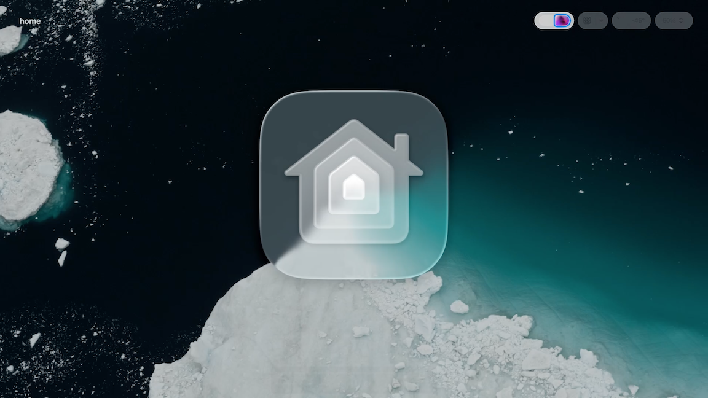

### **Deliver**

* To deliver, all you have to do is save the `.icon` file out, drag it into Xcode, and choose your icon in the Project Editor
* When you build and run your app, you’ll be able to see how it adjusts to platforms and appearances
