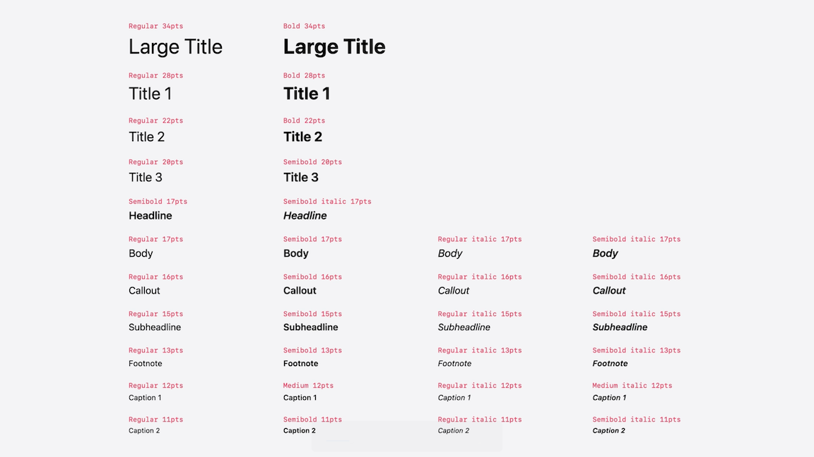

# [**Design foundations from idea to interface**](https://developer.apple.com/videos/play/wwdc2025/359)

---

### **Structure**

#### Supporting discoverability

* The app should make clear where the user is right away
* The user shouldn't have to guess what they can do
    * Actions should be clear and easy to understand
* A clear sense of next steps keeps the flow going

#### Clear information architecture

* Information architecture is the process of organizing. and prioritizing information so users can find what they need without friction
* Start by listing everything the app does: features, workflows, etc.
* Next, imagine how someone else might use the app
    * When and where would it be used
    * How does it fit into their routine
    * What helps them, and what gets in the way
* Combining those steps, start cleaning things up
    * Removing features that aren't essential
    * Renaming things that aren't clear
    * Grouping things that naturally belong together

### **Navigation**

#### Tab bar

* Simplifying the tab bar matters because each extra tab means one more decision users have to make
    * Might present the app as much more complex than what it really is
* What's truly essential? What deserves a tab?
* Tabs are for navigation, not for taking action
* The labels and icons should help users get a sense of what each tab is for, so they don't have to interact just to find out
    * Using SF Symbols can help with recognizability

#### Toolbar

* Helps solve the "where am I" and "what can I do" questions
    * Includes a title with the name of the screen, which sets expectations about the content of the screen
    * Offers a great place for screen-specific actions that users are most likely to want, instead of using the tab bar

### **Content**

#### Organization

* The content of your app should be organized to guide people to what matters most and what they expect to find first
* Progressive disclosure is the practice of showing only what’s necessary upfront — just enough to help people get started then revealing more as they interact
    * The rest of the content is just behind a tap on the disclosure control next to the title
    * When that screen opens, the content should be arranged in the same way, making it feel connected to the previous screen
* Every screen should provide orientation (title, back button, actions related to the screen)

#### Layout

* Sometimes lists works better than grids when it takes up too much space per item, and doesn't handle long text well
    * Can show more information in less vertical space
* Think about how content should be grouped to be the most organized and useful
    * Organized by time/recently used
    * Grouped by progress - like picking up an ongoing activity
    * Grouping by patterns - surfacing relationships in things that belong together
* Collections are ideal for showing groups of items like photos, videos, or products that can be scrolled on and off the screen

### **Visual design**

#### Supports function

* Visual design communicates the personality of the app and shapes how people feel
* It’s the thoughtful use of hierarchy, typography, images and color, all while supporting function
* Visual hierarchy is about guiding the eye through the screen, so it notices the different design elements in order of importance
    * Make what's most important larger or higher in contrast, so it naturally draws attention first

#### Use text styles

* Make it easy to create clear hierarchy and strong legibility even under different screen conditions
* Offer a consistent way to style everything from titles to captions, without needing to eyeball text sizes or creating custom styles from scratch
* Support dynamic type, allowing users to choose a text size that’s comfortable for them making the app more inclusive and easier for everyone to use

* When text overlays an image, legibility can quickly become a problem especially with busy or high-contrast visuals; in those cases, clarity has to come first
    * One simple way to fix this is by adding a subtle background behind the text like a gradient or blur

#### Use images and color intentionally

* Adding images to list rows to represent each group and make the list easier to scan
* Sometimes images don't all work together, and instead you can choose a color palette for a cohesive visual style
    * Create a palette with simple rules to use it
* When creating a color palette, these don't apply to all parts of the UI
    * Items like the background, text, or tint colors on icons in a tab bar get their colors from semantic colors (e.g. secondarySystemBackground)
    * Are named after their purpose, not their appearance
    * They automatically change according to contrast settings, screen environments and modes like dark and light
    * Can use an accent color here and there — on buttons, controls, maybe to show what’s selected, but be careful it doesn’t get in the way of dynamic changes, overall legibility, or people’s comfort

* [Get to know the new design system](./Get%20to%20know%20the%20new%20design%20system.md) Session
* [Explore navigation design for iOS](../2022/Explore%20navigation%20design%20for%20iOS.md) Session from WWDC 2022
* [Discoverable design](https://developer.apple.com/videos/play/wwdc2021/10126/) Session from WWDC 2021
