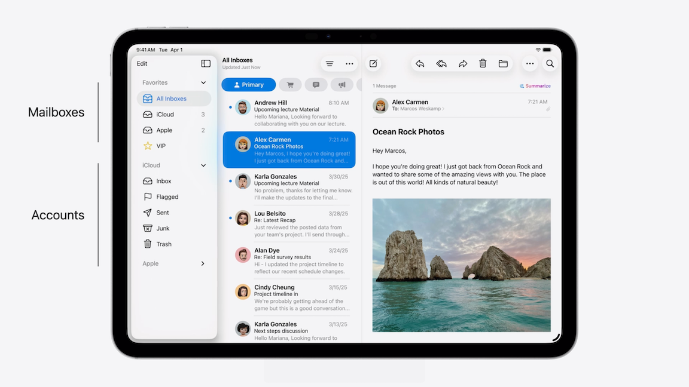
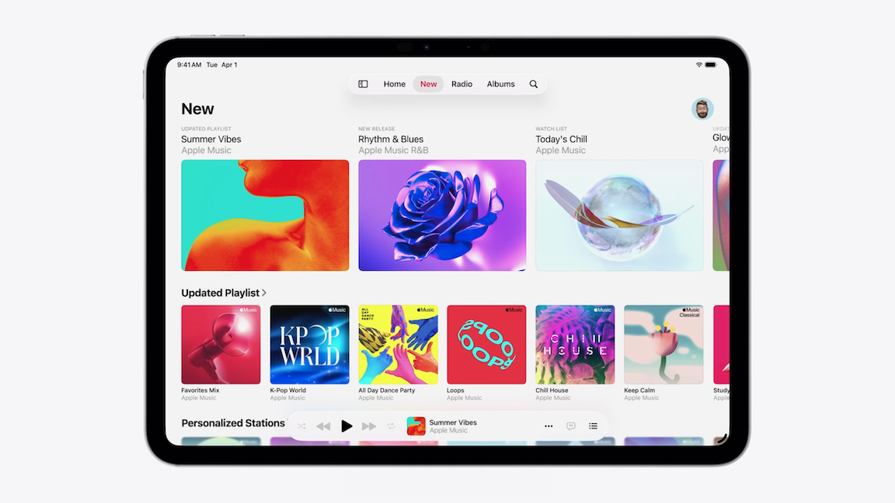
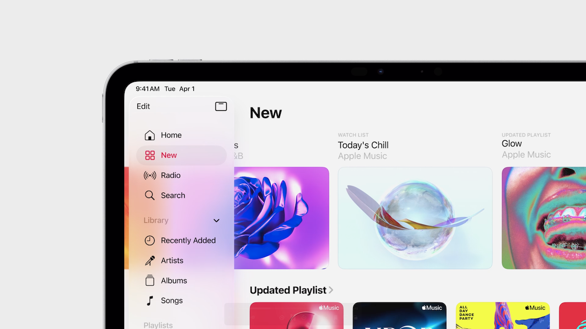
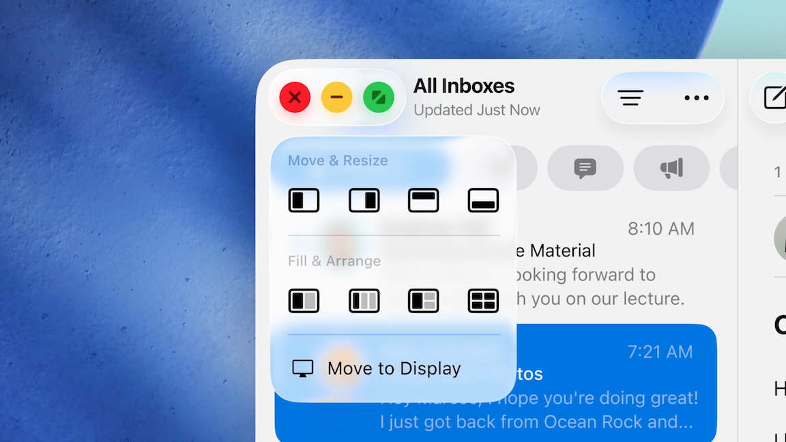
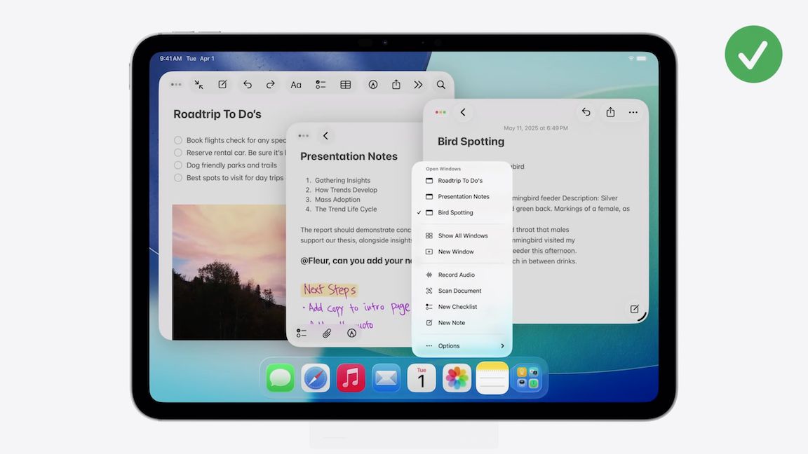
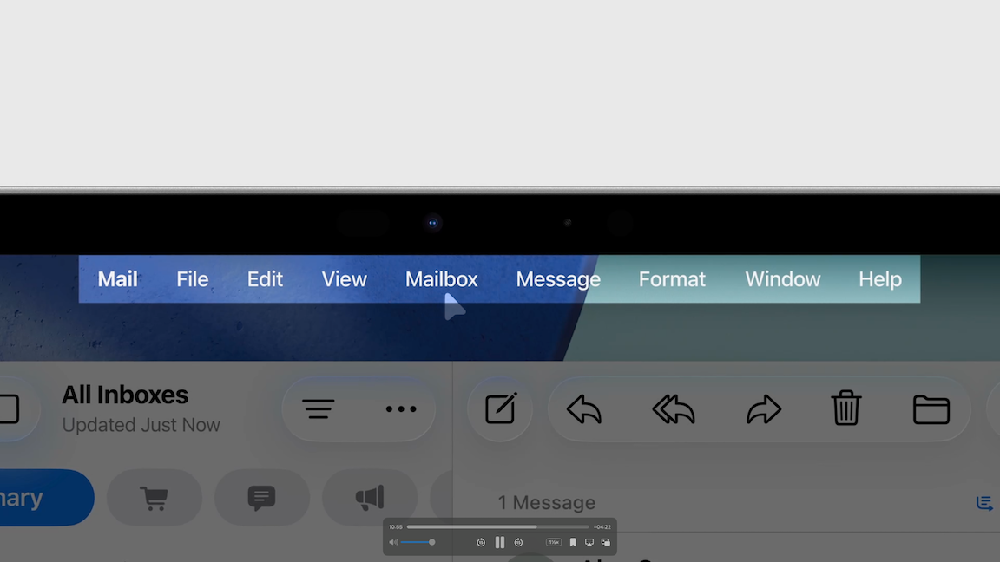
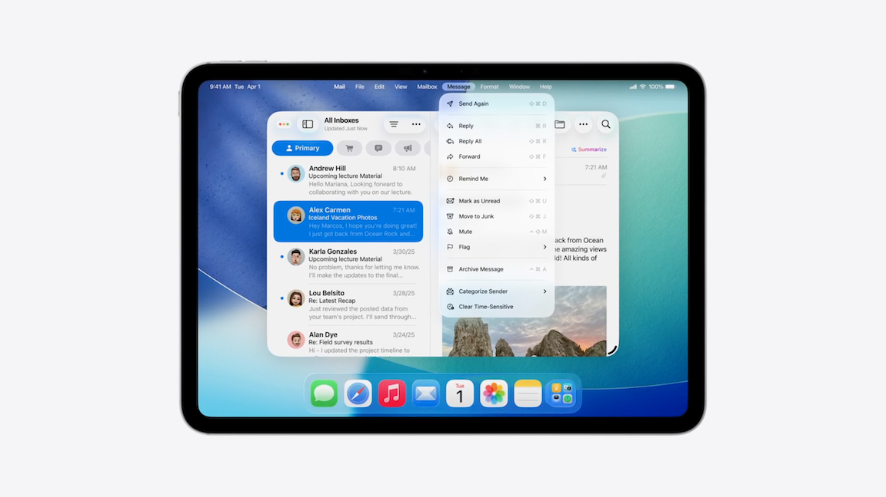
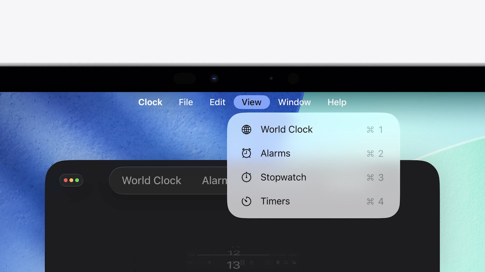
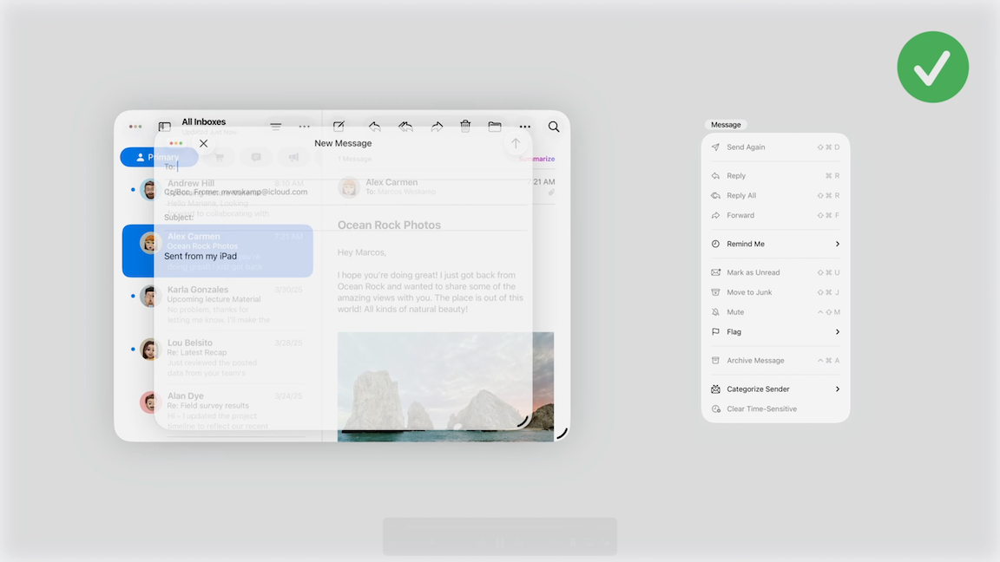

# [**Elevate the design of your iPad app**](https://developer.apple.com/videos/play/wwdc2025/208)

---

### **Navigation**

* Sidebar - ideal for apps that have numerous sub-views or deeply nested content (e.g. Mail)
    * The button on the top right of the sidebar will morph the sidebar into a top-aligned tab bar

* Tab bar
    * Much more compact that the sidebar, allowing more content to be visible
    * Can morph back into the sidebar
    * Start with tab bar, morph to sidebar as the app scales

* When an iPad is rotated to portrait, a sidebar can respond by morphing back into a tab bar
    * From a layout standpoint, the orientation change simply means that your app must adapt to a change in width
    * You can extend this adaptivity to floating windows too, since they also result in a smaller width
* Apps that don't use a tab bar can adapt its navigation by collapsing its columns down
    * When adapting to size changes, make sure that any change in layout is non-destructive
        * Resizing an app should not permanently alter its layout
        * Be opportunistic about reverting back to the starting state whenever possible

* Extend content around navigation
    * Draw content below the toolbar using the new Scroll Edge Effect
    * You can also extend content behind the sidebar

### **Windows**

* Every app that supports multitasking now shows a handle in the bottom right corner
    * Dragging this will start resizing the app into a window that floats above your wallpaper
* On the top left of every window are the new window controls
    * They become larger on tap, revealing their functionality
    * They become larger on tap, revealing their functionality. If you press and hold, they expand even further, showing a set of shortcuts that quickly create various window layouts
    * Window controls will appear on the leading edge of your app toolbar - any existing controls will shift to the right to make room and avoid occlusion
        * For apps that haven’t been updated to iPadOS 26, the system will increase the safe area above the toolbar and place the window controls on its leading edge

* Change in how apps should handle opening new documents
    * If you open a document, its default app will launch above and open it in its window
    * Prior to multitasking-oriented workflows, if an app is then asked to open a different document, it would proceed to open the file in its one and only window, clearing any prior context in the process.
    * This type of ‘Open in Place’ behavior is no longer recommended for apps that participate in multitasking
        * Going forward, apps should create a new window for each document
    * To help find open windows in an app, there is a new section in the app menu with a list of open windows
        * Provide descriptive names for your windows for this menu

### **Pointer**

* New pointer is now an arrow instead of a circle
* New highlight effect when hovering
    * When you hover over a liquid glass control that has more than one button, the highlight effect will appear to indicate which button you’re about to press with your pointer
    * As you move across the cluster, the highlight will quickly catch up with your pointer, whenever its target changes
    * The new highlight effect replaces the original hover effect where the pointer would morph into the highlight
* The new pointer will no longer magnetize or rubber band to any target and always track your input directly

### **The menu bar**

* On iPad, you can reveal the menu bar by moving your pointer to the top edge
    * You can also swipe down with your finger
* In every menu bar, you’ll find:
    * The app menu
    * Default menus that the system provides (File, Edit, View, Format, Window)
    * Custom menus provided by the app

* Organize menu items
    * Populate the menu with every action that relates to it's name (e.g. `Archive Message` in a `Messages` menu)
    * Order by frequency of use, and not alphabetically
    * Group related actions into their own sections, to create further separation
    * If the menu starts becoming too long, you can move secondary actions into a submenu
    * Assign each item a symbol — ideally one that matches how they appear in your app
    * Assign keyboard shortcuts to the most commonly performed actions

* The View menu
    * The system provides the View menu
    * Up to the app to populate it with useful actions
    * If the app is organized by tabs, include them in the View menu
    * Any button that shows or hides the sidebar goes here as well

* Never hide any menus or items depending on the context of your app
    * Menu items should always remain in the same place, even when inactive
    * They become fully opaque when they're actionable and dimmed when they're not
    * Even if all items in a menu are inactive, avoid hiding menus in their entirety

* [Meet Liquid Glass](./Meet%20Liquid%20Glass.md) Session
* [Get to know the new design system](./Get%20to%20know%20the%20new%20design%20system.md) Session
