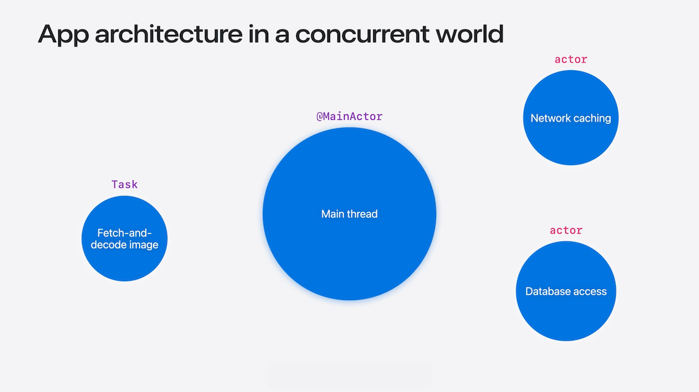
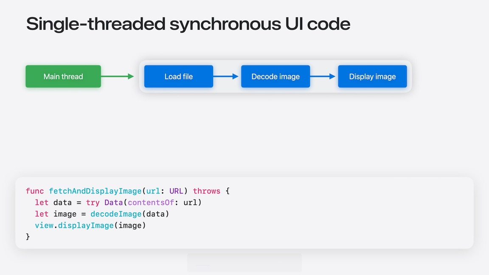
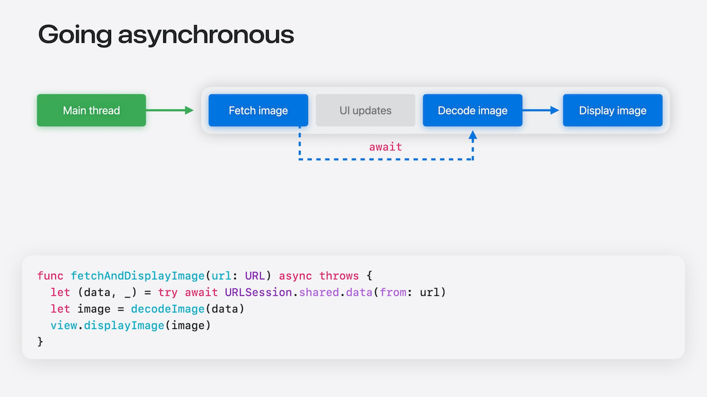
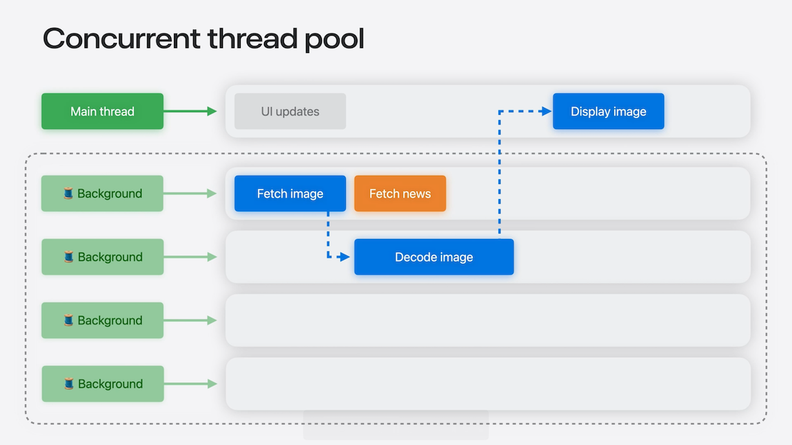
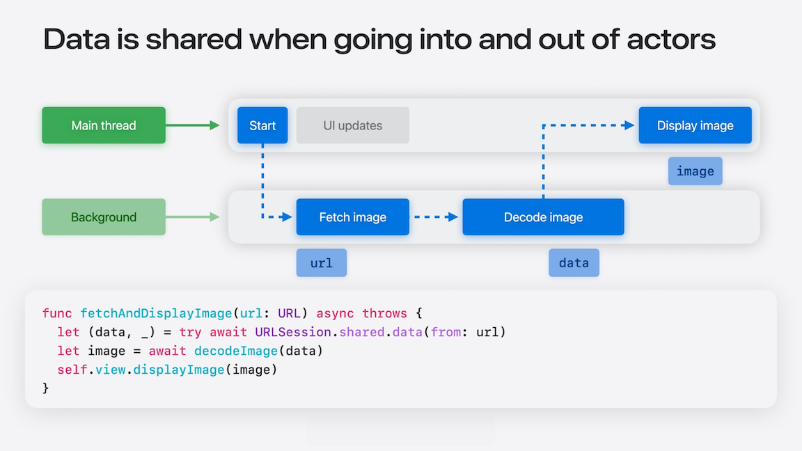
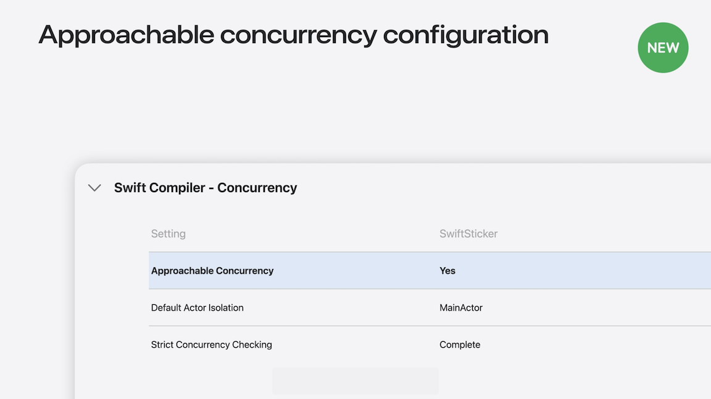

# [**Embracing Swift Concurrency**](https://developer.apple.com/videos/play/wwdc2025/268)

---

* Make concurrent code easier to write correctly
* Identify where concurrency is introduced and what data is shared
* Protect against data races at compile time



#### Single-threaded code

* When you run a program, code starts running on the main thread
* Any code that you add stays on the main thread, until you explicitly introduce concurrency to run code somewhere else
* Single-threaded code is easier to write and maintain, because the code is only doing one thing at a time
* The main thread and all of its data is represented by the main actor
    * There is no concurrency on the main actor, because there is only one main thread that can run it
    * Can specify that data or code is on the main actor using the `@MainActor` notation
* Swift will ensure that main-actor code only ever runs on the main thread, and main-actor data is only ever accessed from there
* Swift protects your main thread code using the main actor by default
* Swift 6.2 allows a module to default to main-actor isolation
    * Suitable for modules that primarily stay on the main actor
    * Enabled by default for new app projects created with Xcode 26
    * `Default Actor Isolation` set to `MainActor`
    * *This talk assumes main actor mode is enabled throughout the code samples*



* In the image above, all the code is running on the main thread
* Fine as long as every operation in here is fast enough
* Only able to read files locally. If we want to allow our app to fetch an image over the network, we need to use a different API (code below)
    * The URLSession API fetches data over the network given a URL, but running this method on the main thread would freeze the UI until the data has been downloaded from the network

```swift
func fetchAndDisplayImage(url: URL) throws {
    let (data, _) = try URLSession.shared.data(from: url)
    let image = decodeImage(data)
    view.displayImage(image)
}
```

#### Asynchronous tasks

* To prevent hangs, we need to make the code asynchronous using `async`
    * We call the URL session API with `await`
    * The await indicates where the function might suspend, meaning that it stops running on the current thread until the event it’s waiting for happens; then, it can resume execution
    * Many library APIs, like URLSession, will offload work to the background for you
    * We still have not introduced concurrency into our own code, because we didn't need to

```swift
func fetchAndDisplayImage(url: URL) async throws {
    let (data, _) = try await URLSession.shared.data(from: url)
    let image = decodeImage(data)
    view.displayImage(image)
}
```



* An async function runs in a task
* A `Task` executes independently of other code, and should be created to perform a specific operation end-to-end
* Use tasks to create asynchronous work in response to a synchronous event
* Multiple tasks can run at the same time
    * Each task will complete its operations in order from start to finish
    * Fetching happens in the background, but the other operations in each task will all run on the main thread, and only one operation can run at a time
    * Tasks are independent from each other, so each task can take turns on the main thread
    * The main thread will run the pieces of each task as they become ready to run

```swift
func onTapEvent() {
    Task {
        do {
            try await fetchAndDisplayImage(url: url)
        } catch let error {
            displayError(error)
        }
    }
}
```

* A single thread alternating between multiple tasks is called 'interleaving'
    * This improves overall performance by making the most efficient use of system resources
    * A thread can start making progress on any of the tasks as soon as possible, rather than leaving the thread idle while waiting for a single operation
* When you need to perform work in a specific order, you should run that work in a single task

#### Introducing concurrency

* In the code below, if `decodeImage` takes too long, our UI will hang
    * `fetchAndDisplayImage` and `decodeImage` are both isolated to the main actor

```swift
func fetchAndDisplayImage(url: URL) async throws {
    let (data, _) = try await URLSession.shared.data(from: url)
    let image = decodeImage(data, at: url)
    view.displayImage(image)
}

func decodeImage(_ data: Data, at url: URL) -> Image {
    Image()
}
```

* If we want to offload the call to decodeImage, we can apply the `@concurrent` attribute to the `decodeImage` function
    * `@concurrent` tells Swift to runt eh function in the background

```swift
func fetchAndDisplayImage(url: URL) async throws {
    let (data, _) = try await URLSession.shared.data(from: url)
    let image = await decodeImage(data, at: url)
    view.displayImage(image)
}

@concurrent
func decodeImage(_ data: Data, at url: URL) async -> Image {
    Image()
}
```

* Changing where decodeImage runs also changes our assumptions about what state decodeImage can access
    * In this code below, calling `cachedImage` will throw an error, because it can only be accessed on the main thread

```swift
@concurrent
  func decodeImage(_ data: Data, at url: URL) async -> Image {
    if let image = cachedImage[url] {
        return image
    }

    // decode image
    let image = Image()
    cachedImage[url] = image
    return image
}
```

* Breaking ties to the main actor
    * Move main actor code to `@MainActor` functions
        * This method was used below to fix the error with `cachedImage`
    * Use `await` to access the main actor asynchronously
    * Add `nonisolated` to code that does not need the main actor

```swift
func fetchAndDisplayImage(url: URL) async throws {
    if let image = cachedImage[url] {
        view.displayImage(image)
        return
    }

    let (data, _) = try await URLSession.shared.data(from: url)
    let image = await decodeImage(data)
    view.displayImage(image)
}

@concurrent
func decodeImage(_ data: Data) async -> Image {
    // decode image
    Image()
}
```

* Use `@concurrent` to always run in the background
* Use `nonisolated` to allow clients to choose where to run
* [Beyond the basics of structured concurrency](https://developer.apple.com/videos/play/wwdc2023/10170/) Session from WWDC 2023
* For libraries, it's best to provide a nonisolated API and let clients decide whether to offload work (see code below)
    * `Default Actor Isolation` set to `nonisolated`
* Nonisolated code is very flexible, because you can call it from anywhere
    * If you call it from the main actor, it will stay on the main actor
    * If you call it from a background thread, it will stay on a background thread

```swift
// Foundation
import Foundation

nonisolated
public class JSONDecoder {
  public func decode<T: Decodable>(_ type: T.Type, from data: Data) -> T {
    fatalError("not implemented")
  }
}
```

* The concurrent thread pool contains all of the system's background threads, which can involve any number of threads
* It doesn't matter which background thread a task runs on, and you can rely on the system to make the best use of resources
    * When a task suspends, the original thread will start running other tasks that are ready
    * When the task resumes, it can start running on any available thread in the concurrent pool, which might be different from the background thread it started on



#### Sharing data

* Sharing mutable state in concurrent code is notoriously prone to mistakes that lead to hard-to-fix runtime bugs
* Swift helps you catch these mistakes at compile time
* When fetching an image in our code, the following occurs:
    * When we get the URL from the UI, it’s passed from the main actor out the background thread to fetch the image
    * Fetching the image returns data, which is passed along to image decoding
    * Then, after we’ve decoded the image, the image is passed back into the main actor, along with self



* URL is a value type - so a copy of it is sent to the background thread
    * Main thread is free to use/modify it, and it will have no effect on the value the background thread is using
* It is safe to share value types, because it's copying, not actually sharing
    * Collections of value types are also value types
    * Same for structs and enums that store value types in them

* Types that are always safe to share concurrently are `Sendable` types
    * Any type that conforms to `Sendable` are safe to share
    * Structs and enums are allowed to be marked Sendable when all of their instance data is Sendable
    * Main actor types are implicitly Sendable, so you don’t have to say so explicitly

```swift
import Foundation

// Value types are Sendable
extension URL: Sendable {}

// Collections of Sendable elements
extension Array: Sendable where Element: Sendable {}

// Structs and enums with Sendable storage
struct ImageRequest: Sendable {
  var url: URL
}

// Main-actor types are implicitly Sendable
@MainActor class ImageModel {}
```

* Actors protect non-Sendable state
    * Value crossing into or out of an actor are checked for `Sendable` type
    * Non-Sendable values are only allowed if they're never used again
    * In the call to `decodeImage` below, we have two values passed into the method (`self` is implicitly passed, along with `data`), and a result sent back into the main actor
        * `self` is the image model class, which is main actor isolated - so it's safe to pass a reference because the main actor protects the mutable state
        * Data is a value type, so it's safe to pass `data`
        * Image is a reference type, which is not sendable
            * Because `fetchAndDisplayImaged` does not use the image value concurrently, and `decodeImage` creates a new instance of an image from given data, the image is safe to send over to the main actor

```swift
func fetchAndDisplayImage(url: URL) async throws {
    let (data, _) = try await URLSession.shared.data(from: url)
    let image = await self.decodeImage(data, at: url)
    view.displayImage(image)
}
```

* In the code below, we introduce concurrency
    * `scaleAndDisplay` method loads a new image on the main thread
    * Then, the function creates a task running on the concurrent pool, and that gets a copy of the image
    * Finally, the main thread moves on to display the image
* This flow creates a problem, because the background thread is changing the image
    * Creates a data race, and likely a crash
    * The compiler would present an error that `Sending 'image' to concurrent task risks causing data races with uses on the main actor`
    * We can correct the error by moving all the code into the `Task`
        * We use `await` to call `view.displayImage(image)` because it runs on the main actor
    * The code can be simplified further by using `@concurrent` to remove the `Task` entirely
    * If we try to change the image after it's displayed in the UI, we'll get a compiler error about unsafe concurrent access
        * Can be corrected by making any changes to the image *before* sending it to the main actor

```swift
// Incorrect code
func scaleAndDisplay(imageName: String) {
    let image = loadImage(imageName)
    Task { @concurrent in
        image.scaleImage(by: 0.5)
    }

    view.displayImage(image)
}

// Valid code
func scaleAndDisplay(imageName: String) {
    Task { @concurrent in
        let image = loadImage(imageName)
        image.scaleImage(by: 0.5)
        await view.displayImage(image)
    }
}

// Simplified code
@concurrent
func scaleAndDisplay(imageName: String) async {
    let image = loadImage(imageName)
    image.scaleImage(by: 0.5)
    await view.displayImage(image)
    // image.applyAnotherEffect() <-- Would create another compiler error
}
```

* Non-Sendable classes are OK
    * Model classes can stay on the main actor
    * Model classes are rarely `Sendable`
    * If you eventually decide that you need to work with them on a background thread, make them `nonisolated`, not `Sendable`
        * You don’t want to be in a position where some of the model is being updated on the main thread and other parts of the model are being updated on the background thread
    * In the code below:
        * `scaleAndDisplay` creates an image object
        * Then, it calls `perform(afterDelay:)`, providing it with a closure that scales the image object
            * This closure contains another reference to the same image, called a capture
        * Just like non-Sendable classes, a closure with shared state is still safe as long as it isn't called concurrently
    * Only make a function type Sendable if you need to share it concurrently

```swift
@concurrent
func scaleAndDisplay(imageName: String) async throws {
    let image = loadImage(imageName)
    try await perform(afterDelay: 0.1) {
        image.scale(by: 0.5)
    }
    await view.displayImage(image)
 }

nonisolated
func perform(afterDelay delay: Double, body: () -> Void) async throws {
    try await Task.sleep(for: .seconds(delay))
    body()
}
```

* Sendable checking eliminates data races
    * Share `Sendable` types in concurrent code
    * Use mutable classes and closures in one task at a time
    * Change mutable state before sending to another task

#### Actors

* If you find that you have a lot of data on the main actor that is causing those asynchronous tasks to “check in” with the main thread too often, you might want to introduce actors
* As your app grows over time, you may find that the amount of state on the main actor also grows
    * This can lead to a lot of state living on the main actor
* When we start using more systems on the main thread, this can lead to contention, where many tasks are trying to run code on the main actor at the same time
    * The individual operations might be quick, but if you have a lot of tasks doing this, it can add up to UI glitches
* Actors isolate their data, so you can only access that data when running on that actor
    * An actor type is similar to a main-actor class, it will isolate its data so that only one thread can touch the data at a time
    * An actor type is also `Sendable`, so you can freely share actor objects
    * There can be many actor objects in a program, each of which is independent
    * Moving some state from the main actor over to an actor object will allow more code to execute on a background thread, leaving the main thread open to keep the UI responsive
* When to use actors:
    * When you find that storing data on the main actor is causing too much code to run on the main thread
    * You need to coordinate access to data across many tasks
* Most classes are not actors
    * UI-facing classes should stay `@MainActor`
    * Model classes should be `@MainActor` or non-Sendable

* Approachable concurrency configuration
    * The Approachable Concurrency setting enables a suite of upcoming features that make easier to work with concurrency
    * For Swift modules that are primarily interacting with the UI, such as your main app module, we also recommend setting the default actor isolation to 'MainActor'
        * Puts code on the main actor unless you’ve said otherwise


