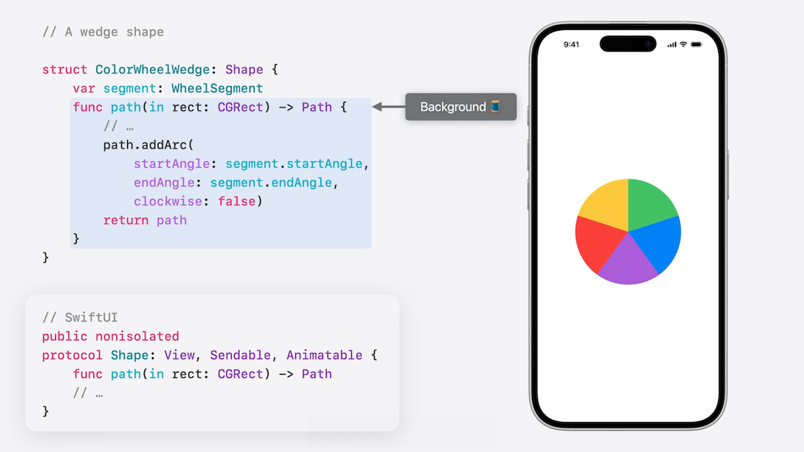
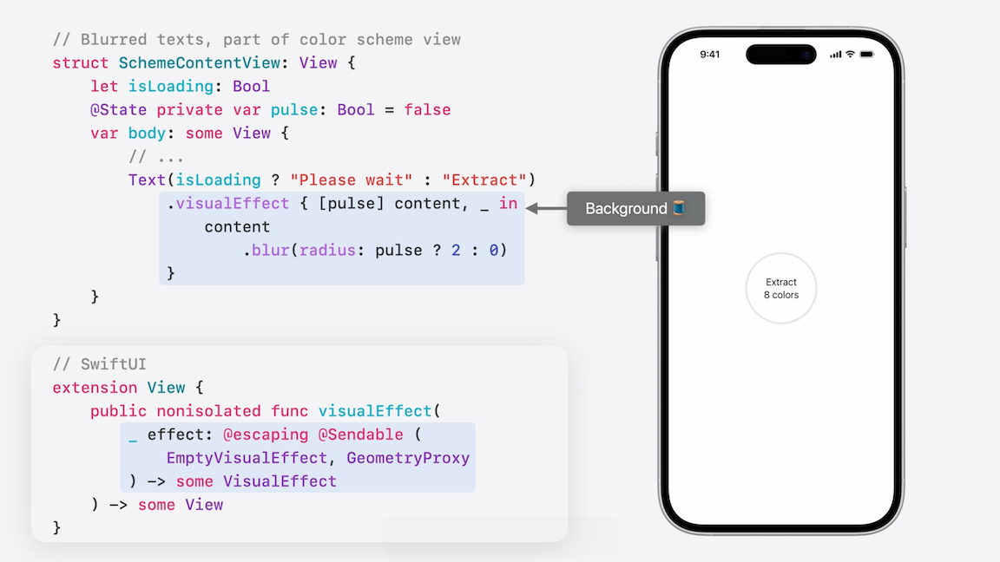
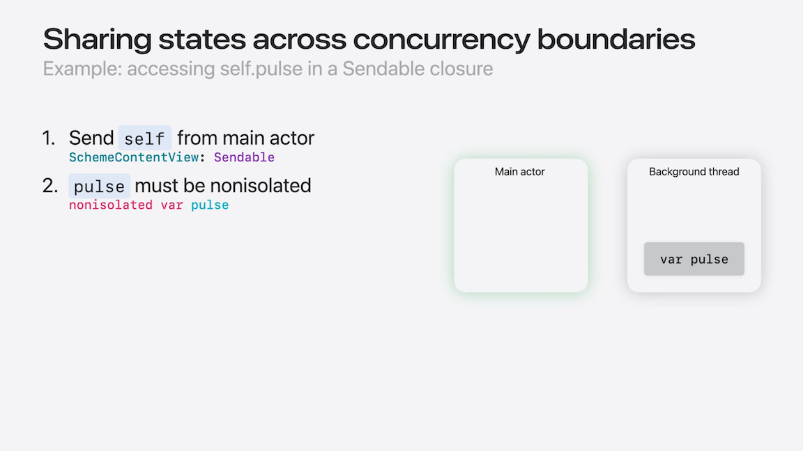

# [**Explore concurrency in SwiftUI**](https://developer.apple.com/videos/play/wwdc2025/266)

---

* Swift 6.2 introduces a new language mode, which marks all types in a module with the @MainActor annotation implicitly
* Everything in this talk applies with or without this new mode

### **Main-actor Meadows**

* App will collect nature-inspired color schemes
    * After taking a photo, can pick how many colors you want, and press the Extract button
    * The app will pick out complimentary colors from the photo, and show them on screen
    * Can scroll down to see all the color schemes that were extracted, and choose a favorite to export
* Watch [Embracing Swift Concurrency](./Embracing%20Swift%20Concurrency.md) Session first if new to Swift Concurrency

* In SwiftUI, `View` is isolated on the `@MainActor`
    * Therefore, in the code below, `ColorExtractorView` becomes `@MainActor` isolated
* The overall type being isolated on the `@MainActor` means all of its members are implicitly isolated as well
* Includes the body property that implements the requirement from View, such as the @State variable
* Referring to other member properties, such as model’s scheme, or a binding to model’s colorCount is allowed by the compiler because the shared `@MainActor` isolation guarantees that these accesses are safe
* Data model’s types don’t need any `@MainActor` annotations
    * Because the model is instantiated inside the view’s declaration, Swift will make sure that the model instance is properly isolated
* The `onTapGesture` closure will also run on the main thread by default
    * Because the `extractColorScheme()` method is asynchronous, it is enclosed in a `Task` to switch to an async context to call it

```swift
// UI for extracting colors

struct ColorScheme: Identifiable, Hashable {
    var id = UUID()
    let imageName: String
    var colors: [Color]
}

@Observable
final class ColorExtractor {
    var imageName: String
    var scheme: ColorScheme?
    var isExtracting: Bool = false
    var colorCount: Float = 5

    func extractColorScheme() async {}
}

struct ColorExtractorView: View {
    @State private var model = ColorExtractor()

    var body: some View {
        ImageView(
            imageName: model.imageName,
            isLoading: model.isExtracting
        )
        EqualWidthVStack {
            ColorSchemeView(
                isLoading: model.isExtracting,
                colorScheme: model.scheme,
                extractCount: Int(model.colorCount)
            )
            .onTapGesture {
                guard !model.isExtracting else { return }
                withAnimation { model.isExtracting = true }
                Task {
                    await model.extractColorScheme()
                    withAnimation { model.isExtracting = false }
                }
            }
            Slider(value: $model.colorCount, in: 3...10, step: 1)
                .disabled(model.isExtracting)
        }
    }
}
```

* APIs from AppKit and UIKit, are exclusively @MainActor isolated. SwiftUI seamlessly interoperates with these frameworks
    * For example, the protocol `UIViewRepresentable` refines the `View` protocol
    * Similar to a struct, this isolates UIViewRepresentable on `@MainActor`
* A type that conforms to `UIViewRepresentable` is also a `View`
    * Therefore, it's `@MainActor` isolated. `UILabel`’s initializer requires `@MainActor` isolation
    * That works in `makeUIView`, because `makeUIView` is a member of my `@MainActor` isolated representable type

```swift
// AppKit and UIKit require @MainActor
// Example: UIViewRepresentable

struct FancyUILabel: UIViewRepresentable {
    func makeUIView(context: Context) -> UILabel {
        let label = UILabel()
        // customize the label...
        return label
    }
}
```

### **Concurrency Cliffs**

* If the main thread has too much work to do, the app may start to have frame drops or hitches
* You can use tasks and structured concurrency to offload your compute from the main thread
* [Elevate an app with Swift Concurrency](https://developer.apple.com/videos/play/wwdc2025/270) Session
* The focus of this talk is how SwiftUI leverages Swift concurrency, to give your apps better performance
    * In the past, the SwiftUI team has revealed that built-in animations use a background thread to calculate their intermediary states
    * [Explore SwiftUI animation](../2023/Explore%20SwiftUI%20animation.md) Session from WWDC 2023
* In the code below, as the color extraction job begins and ends, the circle grows larger, and shrinks back down to its original size with animation
    * Using a `scaleEffect` that reacts to the property `isLoading`
    * Every frame of this animation requires a different scale value between 1 and 1.5
    * SwiftUI performs this calculation on a background thread, so that the main thread has more capacity for other stuff
    * This applies to custom code as well - sometimes, SwiftUI runs your code off the main thread

```swift
// Part of color scheme view

struct SchemeContentView: View {
    let isLoading: Bool
    @State private var pulse: Bool = false

    var body: some View {
        ZStack {
            // Color wheel …

            Circle()
                .scaleEffect(isLoading ? 1.5 : 1)

            VStack {
                Text(isLoading ? "Please wait" : "Extract")

                if !isLoading {
                    Text("^[\(extractCount) color](inflect: true)")
                }
            }
            .visualEffect { [pulse] content, _ in
                content
                    .blur(radius: pulse ? 2 : 0)
            }
            .onChange(of: isLoading) { _, newValue in
                withAnimation(newValue ? kPulseAnimation : nil) {
                    pulse = newValue
                }
            }
        }
    }
}
```

* The struct that conforms to the `View` protocol, is not an object that has to occupy a fixed location in memory
    * At runtime, SwiftUI creates a separate representation for the `View`
    * This representation provides opportunities for many types of optimizations
        * An important one is to evaluate parts of the view representation on a background thread
* SwiftUI reserves this technique for occasions where a lot of compute is done on your behalf
* Most of the time, it involves some high-frequency geometry calculations
    * The Shape protocol is an example of that



```swift
// UI for extracting colors

struct ColorExtractorView: View {
    @State private var model = ColorExtractor()

    var body: some View {
        ImageView(
            imageName: model.imageName,
            isLoading: model.isExtracting
        )
        EqualWidthVStack {
            ColorSchemeView(
                isLoading: model.isExtracting,
                colorScheme: model.scheme,
                extractCount: Int(model.colorCount)
            )
            .onTapGesture {
                guard !model.isExtracting else { return }
                withAnimation { model.isExtracting = true }
                Task {
                    await model.extractColorScheme()
                    withAnimation { model.isExtracting = false }
                }
            }
            Slider(value: $model.colorCount, in: 3...10, step: 1)
                .disabled(model.isExtracting)
        }
    }
}
```

* Another kind of custom logic SwiftUI runs on your behalf is a closure argument
* In the image below, visual effects can get expensive to render, so SwiftUI can choose to call this closure from a background thread



* The `Layout` protocol may call its requirement methods off the main thread
* Similar to `visualEffect`, the first argument of `onGeometryChange` is a closure that may get called from the background thread as well
* SwiftUI can express this runtime behavior, or semantics, to the compiler, and you, with the `Sendable` annotation
    * `Sendable` reminds you about potential data-race conditions when you need to share data from the `@MainActor`

```swift
// SwiftUI may call parts of these from a background thread
public nonisolated protocol Shape: View, Sendable, Animatable {
public protocol Layout: Animatable, Sendable { ••• }

extension View {
    public nonisolated func visualEffect(
        _ effect: @escaping @Sendable (
            EmptyVisualEffect, GeometryProxy
        ) -> some VisualEffect
    ) -> some View

    public nonisolated func onGeometryChange<T>(
        of value: @escaping @Sendable (GeometryProxy) -> T,
        do action: @escaping (T) -> Void
    ) -> some View
}
```

* In the code below, EqualWidthVStack is a custom layout
    * It is able to do all these sophisticated calculations with the argument SwiftUI passes in, without touching any external variables

```swift
// Custom VStack that gives each subview equal width
struct EqualWidthVStack: Layout {
    func sizeThatFits(proposal: ProposedViewSize, subviews: Subviews, cache: inout Void) -> CGSize {
        guard !subviews.isEmpty else { return .zero }
    
        let sizes = subviews.map {
            $0.sizeThatFits(.unspecified)
        }

        let maxSize = calculateMaxSize(from: sizes)
        let spacing = calculateSpacing(subviews: subviews)
        let totalSpacing = spacing.reduce(0) { $0 + $1 }
        let totalHeight = totalSpacing + sizes.reduce(0) {
            $0 + $1.height
        }
        return CGSize(width: maxSize.width, height: totalHeight)
    }
    // ...
}
```

* In the code below, `.blur(radius: pulse ? 2 : 0)` throws an error that `Main actor-isolated property 'pulse' cannot be referenced from a Sendable closure`
    * The `pulse` variable is short for `self.pulse`
    * Self is a view, isolated on the main actor
    * The value `self` must cross the boundary from main actor to the background threads code region
        * This requires the type of `self` to be `Sendable`
    * Because `self` is a `View`, it’s protected by the `@MainActor`, so the compiler considers it `Sendable`
        * Because of that, Swift is fine with the fact that this reference to self crosses from its `@MainActor` isolation into the `Sendable` closure
    * So really, Swift is warning us about the attempt to access the pulse property
        * Even though you can send `self` in here, accessing the `@MainActor` isolated property `pulse` is unsafe

```swift
// Part of color scheme view

struct SchemeContentView: View {
    let isLoading: Bool
    @State private var pulse: Bool = false

    var body: some View {
        ZStack {
            // Color wheel …

            Circle()
                .scaleEffect(isLoading ? 1.5 : 1)

            VStack {
                Text(isLoading ? "Please wait" : "Extract")

                if !isLoading {
                    Text("^[\(extractCount) color](inflect: true)")
                }
            }
            .visualEffect { content, _ in
                content
                    .blur(radius: pulse ? 2 : 0)
            }
            .onChange(of: isLoading) { _, newValue in
                withAnimation(newValue ? kPulseAnimation : nil) {
                    pulse = newValue
                }
            }
        }
    }
}
```



* To fix this compile error, you can avoid reading the property through a reference to the View
    * The visual effect doesn’t need the whole value of this view, it just wants to know if pulse is true or false
    * Make a copy of the `pulse` variable in the closure’s capture list, and refer to the copy instead
        * Sending a copy of `pulse`, which is sendable because Bool is a simple value type

```swift
.visualEffect { [pulse] content, _ in
    content
        .blur(radius: pulse ? 2 : 0)
}
```

* Another strategy would be to make the properties that are being read `nonisolated`

### **Code Camp**

* Most SwiftUI's APIs, such as button’s action callback, are synchronous
    * To call your concurrent code, you first need to switch to an async context with a Task
* SwiftUI's action callbacks (e.g. Button actions) are synchronous
    * Before kicking off a long-running task with an async function, it’s important to update your UI to indicate the task is in progress
        * This update should be synchronous, especially if it needs to trigger some time-sensitive animation
    * The code below triggers loading states before and after a long-running operation

```swift
.onTapGesture {
    guard !model.isExtracting else { return }
    withAnimation { model.isExtracting = true }
    Task {
        await model.extractColorScheme()
        withAnimation { model.isExtracting = false }
    }
}
Slider(value: $model.colorCount, in: 3...10, step: 1)
    .disabled(model.isExtracting)
```

* Async functions require extra care when working with animations
    * In the code below, the view modifier onScrollVisibilityChange gives the event when the color scheme appears on screen
        * As soon as this happens, we're setting a state variable to true to trigger the animation, which causes each color’s Y offset to update with animation

```swift
// Animate colors as they appear by scrolling

struct SchemeHistoryItemView: View {
    let scheme: ColorScheme
    @State private var isShown: Bool = false

    var body: some View {
        HStack(spacing: 0) {
            ForEach(scheme.colors) { color in
                color
                    .offset(x: 0, y: isShown ? 0 : 60)
            }
        }
        .onScrollVisibilityChange(threshold: 0.9) {
            guard !isShown else { return }
            withAnimation {
                isShown = $0
            }
        }
    }
}
```

* A task accepts an async function as an argument
* When the compiler sees an await, it splits the async function into two parts
    * After executing part one, the Swift runtime can pause this function and do some other work on the CPU
    * This can go on for an arbitrary amount of time
    * Then the runtime resumes on the original async function and execute its second half
    * This process can repeat for each occurrence of await in the function
* If your app does a lot of concurrent work, try and find the boundaries between your UI code and non-UI code
    * It’s best to separate the logic for async work from your view logic
    * You can use a piece of state as a bridge: the state decouples the UI code from the async code, and it can initiate the async tasks
    * As some async work finishes up, perform a synchronous mutation on the state, so that your UI can update as reactions to this change
        * This way, the UI logic is mostly synchronous
