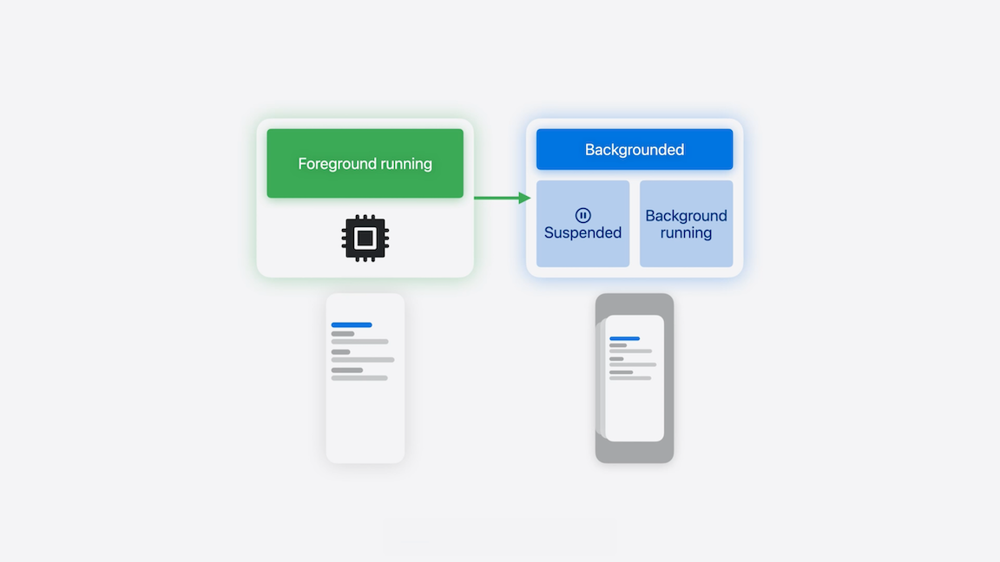
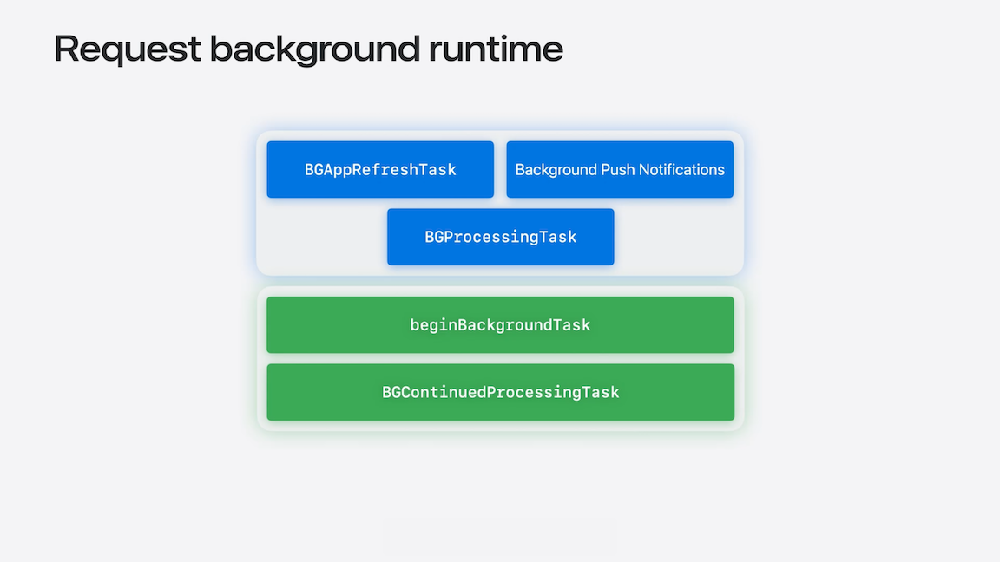

# [**Finish tasks in the background**](https://developer.apple.com/videos/play/wwdc2025/227)

---

### **Introduction**

* In the foreground, the app itself and everything it needs frameworks, assets, and more are loaded into memory
    * The app’s interface is the focus on the device, and your app is defined as foregrounded
* When someone leaves your app, but the process stays alive, it enters the background
    * By default, backgrounded apps are suspended- they don't get CPU time
        * This protects battery life, preserves privacy, and frees up resources for apps in the foreground
    * In some cases, the app can request background time to finish up in-flight work before being suspended
* When someone returns to your app through the app switcher, it’s resumed by the system as it moves to the foreground



### **Behaviors and constraints**

* Background execution is not guaranteed - it's opportunistic, discretionary, and tightly managed

#### Battery Life

* Battery life is a finite resource; to preserve it, the system coalesces work when the devices wake, cutting down on unnecessary background activity throughout the day
* iOS 26 brings incredible insights to your device's battery performance, with detailed app-specific breakdowns
* Efficiency is the best move
    * If a task doesn't need to run immediately, consider deferring it until the device is charging
    * If it does need to run, keep it lightweight and purpose-driven

#### Shared resources

* The system is also responsible for managing other shared resources things like memory, CPU time, and network bandwidth
* When someone is using their device, the foreground app is prioritized. If a backgrounded app consumes too much memory or CPU, it's not just inefficient
    * It’s also competing with the foreground experience - the system may step in by throttling, suspending, or even terminating processes that prove too costly
* Keep your background work minimal - void bloated work and prefer batch processing to minimize your memory footprint

#### Time

* Workloads must be resilient
    * Save incremental progress early and often
    * Respond to expiration signals promptly

#### Consent

* Scheduling is influenced by toggling settings like Low Power Mode, Background App Refresh, and Low Data Mode
* The system provides transparency, allowing users to make these decisions
* Background work should be courteous, stay lightweight and honor preferences while making sure your impact is proportional to the value you’re delivering

#### System Conditions

* Things like network availability, CPU load, device activity, thermal state, and battery level are all used as context to inform scheduling decisions
* The system accounts for these challenging conditions, meaning that even well designed tasks may be postponed if the conditions aren’t quite right
* Maintain adaptability - keep your work atomic and lightweight while clearly advertising your requirements
* Designing workloads to pick up where they left off allows for incremental progress as runtime opportunities arise

#### Guiding Questions

* Who initiated the task?
* How long will the work take?
* Is the work critical to app state and freshness?
* Does the work require consent or input?

### **Background task APIs**



#### `BGAppRefreshTask`

* Apps can use this to silently fetch content from servers moments before use while fully embracing the idea of courtesy
* Frequently used apps  have an increased chance of being scheduled

```swift
import BackgroundTasks
import SwiftUI

@main
struct ColorFeed: App {
    var body: some Scene {
        WindowGroup {
            // ...
        }
        .backgroundTask(.appRefresh("com.colorfeed.wwdc25.appRefresh")) {
            await self.handleAppRefreshTask()
        }
    }
}
```

#### Background Push Notifications

* When your server sends a notification about new content, the system will wake your app at an opportune time to fetch it
* Because Background Push Notifications are used to indicate new remote content, they are always considered discretionary
* Sent at a low priority and coalesced to minimize overhead and power cost
* When someone removes your app from the app switcher, the notifications are not delivered to your app until it’s launched again

#### `BGProcessingTask`

* Used for processing longer tasks
* Registering for this task takes a task identifier, callback queue, and a closure that's invoked at runtime
* You must register BackgroundTasks immediately during launch
    * The system is promptly made aware of your task if it's launched in the background, invoking its handler immediately
* Processing tasks also support additional configurations
    * For example, if the work isn’t particularly sensitive to latency, a great task may elect to only run when the device is on charger and connected to network

```swift
import BackgroundTasks
import UIKit

class AppDelegate: UIResponder, UIApplicationDelegate {
    func application(
        _ application: UIApplication,
        didFinishLaunchingWithOptions launchOptions: [UIApplication.LaunchOptionsKey: Any]?
    ) -> Bool {
        BGTaskScheduler.shared.register(
            forTaskWithIdentifier: "com.example.apple-samplecode.ColorFeed.db_cleaning",
            using: nil
        ) { task in
            self.handleAppRefresh(task: task as! BGProcessingTask)
        }
    }

    func submitProcessingTaskRequest() {
        let request = BGProcessingTaskRequest(
            identifier: "com.example.apple-samplecode.ColorFeed.db_cleaning"
        )
        request.requiresNetworkConnectivity = true
        request.requiresExternalPower = true

        BGTaskScheduler.shared.submit(request)! 
    }
}
```

#### `beginBackgroundTask`

* The begin and end background task APIs allow your app to finish work that may be irrecoverable should it be interrupted and left incomplete
* Wrapping your code in these API calls informs the system that your app is handling crucial work that should not be interrupted
* Useful when you’re cleaning up file handles or closing database connections

```swift
import UIKit

@main
class AppDelegate: UIResponder, UIApplicationDelegate {
    var backgroundTaskID: UIBackgroundTaskIdentifier = .invalid
   
    func saveState() { /*  ... */ }

    func handlePersistence() {
        let app = UIApplication.shared
        guard backgroundTaskID != .invalid else { return }
        backgroundTaskID = app.beginBackgroundTask(withName: "Finish Export") {
            app.endBackgroundTask(self.backgroundTaskID)
            self.backgroundTaskID = .invalid
        }

        self.saveState()

        app.endBackgroundTask(backgroundTaskID)
        backgroundTaskID = .invalid
    }
}
```

### **Continued processing task**

* `BGContinuedProcessingTask` - new in iOS 26
* Allows you to continue work even after the app is backgrounded, with a system providing UI to communicate progress
* Continue initiated work:
    * Start by an explicit action
    * Achieve a direct and immediate goal (e.g. export and process files, publish social media content, update accessories)
    * Make progress with a finite end
* Avoid unexpected work
    * Don't start tasks automatically
        * Routine work and maintenance
        * Backups
        * Automatic photo sync
    * Goal and progress may not be clear
    * May lead to task cancellations

* Adopt continued processing tasks
    * Update Info.plist - add new item to the `Permitted background task scheduler identifiers` array
        * In addition to static identifiers, continued processing tasks support a new wildcard notation with a dynamic suffix (e.g. `com.bluebeam.userTask.*`)
        * Wildcard identifiers always begin with your bundle ID, followed by some semantic context
    * Register a launch handler
        * Launch handlers don’t need to be registered before your app finishes launching
        * Instead, you’ll now dynamically register these handlers when the intent to use them is expressed
    * Monitor task state
        * It’s imperative that you provide timely updates about workload progression
        * If that progression is slower than expected, the system will prompt the initiator, asking if they want the work to continue
    * Report progress
        * Tasks that do not report any progress will be expired, allowing  the system to reclaim and redistribute the resources
        * The system may need to stop your task early if conditions change
            * The task must provide an expiration handler that will be called when it's time to stop
            * The handler is your chance to quickly flip a variable so that the task can stop gracefully and avoid doing extra work
        * When your task does complete its work, you must call setTaskCompleted, telling the system the task is finished
    * Receive consent and submission

```swift
import BackgroundTasks

func handleDialogConfirmation() {
    BGTaskScheduler.shared.register("com.colorfeed.wwdc25.userTask") { task in
        let task = task as! BGContinuedProcessingTask
                                                                      
        var shouldContinue = true
        task.expirationHandler = {
            shouldContinue = false
        }

        task.progress.totalUnitCount = 100
        task.progress.completedUnitCount = 0

        while shouldContinue {
            // Do some work
            task.progress.completedUnitCount += 1
        }

        task.setTaskCompleted(success: true)
    }
}
```

* Building and submitting a valid, user-initiated task request
    * Start by initializing a task request object
        * This needs three pieces of information an identifier matching one from your Info.plist, a localized title, and a localized subtitle (what the user sees in the system UI)
    * Next, you’ll need to provide a submission strategy for the system to abide by
        * By default, if the system finds it cannot immediately run your continued processing task, it will add it to the back of the queue
            * You don’t need to specify anything extra for this
        * You can also set the strategy to `.fail` to tell the system to fail the submission if it cannot start immediately
            * Gives your app instant feedback, allowing you to handle the situation appropriately
    * Finally, submit it to the scheduler and let the system manage the workload

```swift
import BackgroundTasks

func submitContinuedProcessingTaskRequest() {
    let request = BGContinuedProcessingTaskRequest(
        identifier: "com.colorfeed.wwdc25.userTask",
        title: "A succinct title",
        subtitle: "A useful and informative subtitle"
    )

    request.strategy = .fail

    BGTaskScheduler.shared.submit(request)!
}
```

* To allow continued processing tasks to benefit from background GPU access on supported devices, add the GPU usage entitlement
    * `com.apple.developer.background-tasks.continued-processing.gpu`
    * Then you can (and should) dynamically query the scheduler’s supported resources property
    * Any requests for unavailable resources will be rejected upon submission

```swift
if BGTaskScheduler.supported resources.contains(.gpu) {
    request.requiredResources = .gpu
}
```
