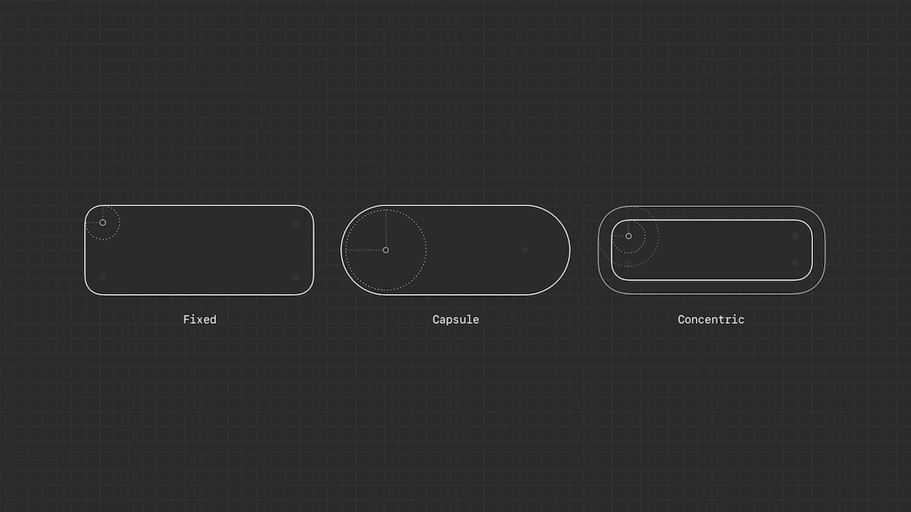
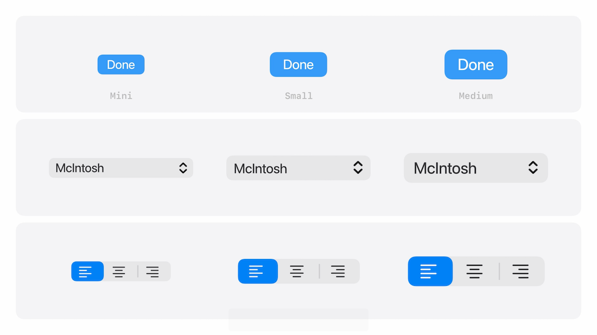
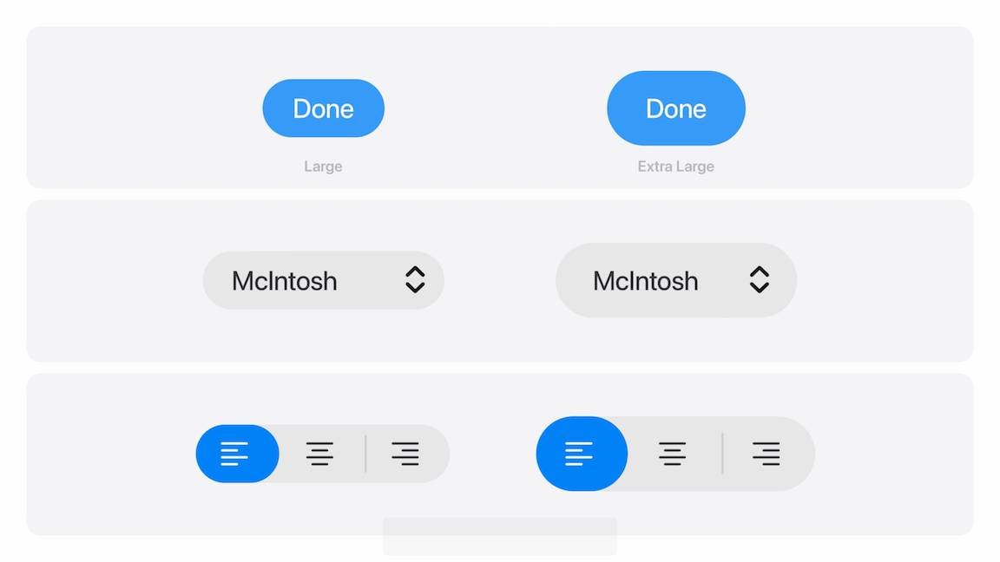
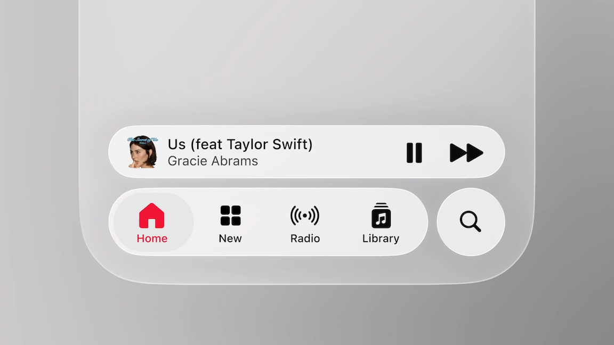
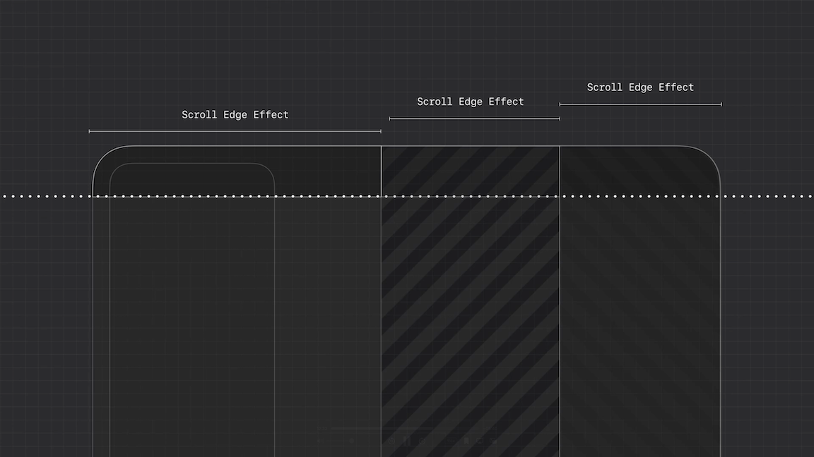
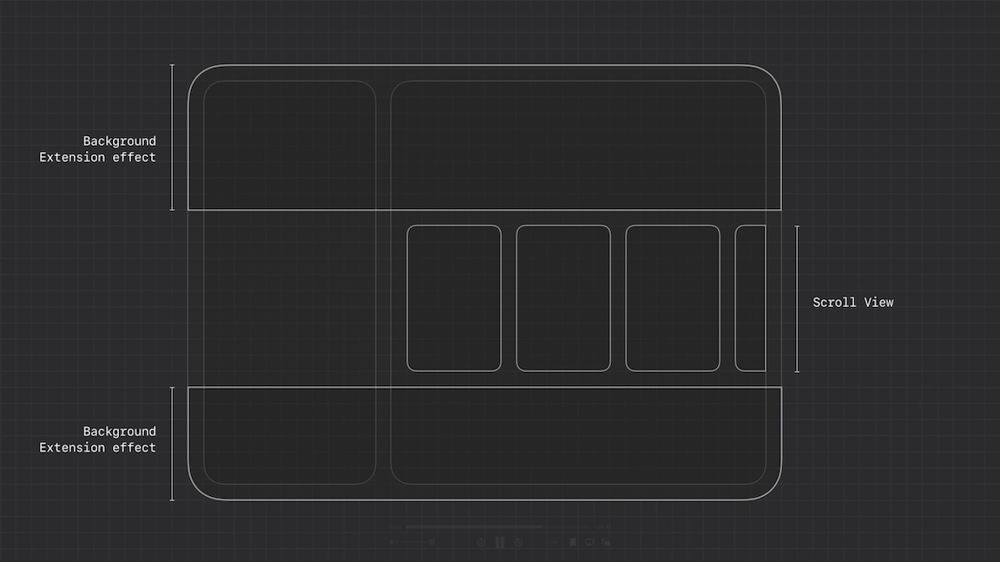
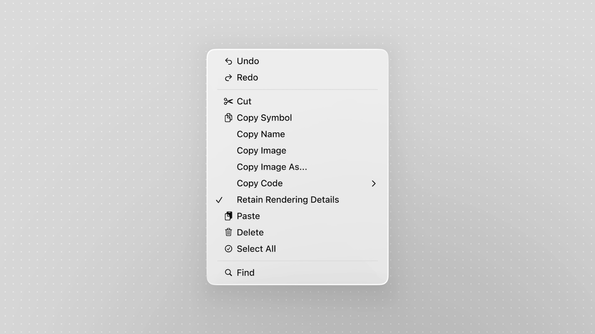
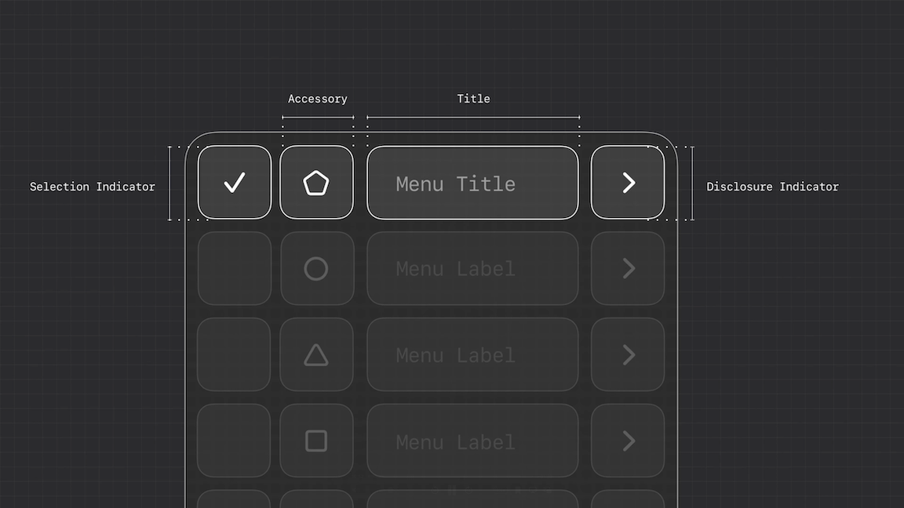
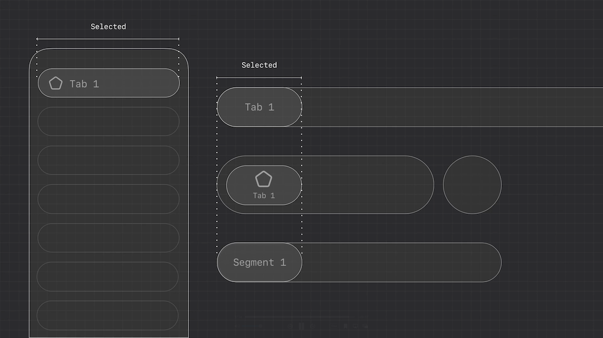

# [**Get to know the new design system**](https://developer.apple.com/videos/play/wwdc2025/356)

---

### **Design language**

* The family of system colors has been adjusted in subtle but meaningful ways across Light, Dark and Increased Contrast appearances
* Typography has been refined to strengthen clarity and structure, now bolder and left-aligned to improve readability in key moments like alerts and onboarding
* Apple’s hardware features a consistent bezel and that now guides the UI, with curvature, size, and proportion aligning to create a unified rhythm between what you hold and what you see
    * By aligning radii and margins around a shared center, shapes can comfortably nest within each other
    * To preserve optical balance, views are mathematically centered when it makes sense - and subtly offset when it doesn’t
* Three shape types to build concentric layouts
    * Fixed shapes - constant corner radius
    * Capsule shapes - use a radius that's half the height of the container
    * Concentric shapes - calculate their radius by subtracting padding from the parent's

* Capsules are best used in touch-friendly layouts, but in desktop environments, they're best used for standout actions
    * On macOS, Mini, Small, and Medium controls will continue using rounded rectangles
        * Large controls will now use capsule shapes, alongside with the new X-Large size

Mini, Small, and Medium Controls | Large and X-Large Controls
---------------------------------|---------------------------
  | 

* When updating apps, keep an eye out for corners that feel too pinched or flared
    * Often shows up in is nested containers—like artwork in a card - its shape probably needs to be concentric to allow the system to calculate the inner radii automatically
    * Near device edges
        * For phone layouts, use a capsule with extra margin to create space near the screen edge
        * For iPad and Mac, use a concentric shape that aligns with the window edge for better balance
        * Can use a concentric shape with a fallback radius
            * The concentric value adapts when nested, and the fallback kicks in when the component stands alone

### **Structure**

#### Depict relationships

* The Action Sheet. It used to appear at the bottom of the screen, no matter where the action came from
    * Now, it springs from the action itself, which serves as the source for the action sheet
* Clearly defined roles help the system understand that relationship, anchoring the interaction as it extends directly from the tapped element
* When making custom controls, use the same approach, and make sure to apply the material directly to the control, not its inner views

#### Reflect navigation focus

* Reflect navigation focus by introducing subtle material variation that reinforces intent as navigation deepens or shifts
    * Builds on familiar cues, like using a dimming layer to signal modality when a sheet appears
* When a task interrupts the main flow, pair Liquid Glass with a dimming layer to help center attention
* When a task happens in parallel, Liquid Glass creates a natural separation to help keep things clear without breaking the flow
* When focus shifts, like dragging a sheet upward, Liquid Glass subtly recedes, becoming more opaque and gently growing in size to signal a deeper level of engagement

#### Elevate controls

* Previously, controls would blend into the background when the interface was at rest
* Liquid Glass helps lift them, creating more separation from your content while reinforcing interactivity
* If you’ve customized your bars, now’s the time to clean them up
    * Instead of relying on decoration, hierarchy should be expressed through layout and grouping

#### Organize for legibility

* As you update to the new look, items grouped using the correct API will automatically update to share a background and preserve their spatial relationship
* If things aren’t grouping the way you expect:
    * If your bar is feeling too crowded, remove anything unnecessary and move secondary actions into a more menu to keep things clean and accessible
        * Group bar items by function and frequency
        * Buttons that perform related actions should generally go together
            * Don't group symbols with text, like “Select” and the share icon, since they could be perceived as a single button
            * If you have a need for text buttons, allow them to sit on their own containers
* A primary action, like Done, stays separate and appears tinted
    * Often as a blue checkmark on iOS and iPadOS
    * As a prominent text button on macOS
* iOS now includes a dedicated Search tab at the bottom
* Tab bars can also support persistent features using accessory views, like media playback controls that stay visible across your app
    * Avoid placing screen-specific actions here

#### Prioritize content

* Controls sit on top of a system material, not directly on content
* Scroll edge effects reinforce that boundary, replacing hard dividers with subtle blur to reduce clutter and keep UI legible
    * Scroll edge effects are not decorative
        * They don't block or darken like overlays
        * They clarify where UI and content meet, and shouldn’t be used where there aren’t any floating UI elements
    * Scroll views automatically show an edge effect when pinned controls overlap them
* Two styles of scroll edge effects
    * Soft - default, for most use cases, especially on iOS/iPadOS
        * Provides a subtle transition and works well for interactive elements like buttons or inputs
    * Hard
        * Mostly used on macOS
        * Creates a stronger more opaque boundary
        * Ideal for interactive text, controls without backgrounds, or pinned table headers that need extra clarity
    * Avoid mixing or stacking them on top of each other
* Apply one scroll edge effect per view
    * In Split View layouts on iPad or macOS, each pane can have its own — just keep them consistent in height to maintain alignment

#### Extend to the edge

* Sidebars are now inset and built with Liquid Glass, allowing content to flow behind them
* Background extension effects let content expand behind the sidebar, filling the full width while keeping visuals centered in the layout
    * Use it for hero images, tinted backgrounds, or any surface meant to feel expansive
    * Make sure any text and controls are layered above to avoid unwanted visual distortion
* Scroll views now extend beneath the sidebar by default, so carousels glide through naturally, supporting discovery without interruption
* You can apply background extension effects per view

### **Continuity**

* One decision, whether in layout, hierarchy, or interaction, should carry across every device your design appears on

#### Use shared content

* When content is intentionally grouped, it should stay together, even as the layout adapts
* Use the same symbols across devices to preserve meaning and build familiarity through repetition
* Not every action spells itself out. A pencil might suggest annotate, and a checkmark can look like confirm — making actions like Select or Edit easy to misread
    * When there’s no clear shorthand, a text label is always the better choice
* Bars now rely more on symbols than text, and this shift is happening across the platform, including menus
    * Apple recommends populating your menus with symbols where it helps recognition
    * When actions are closely related, such as multiple ways to copy, don’t repeat or tweak icons
    * Use the symbol once to introduce the group, and let text do the rest

* The Icons page on the Human Interface Guidelines has also been updated to include a list of preferred glyphs for common actions

#### Structure components to scale

* Similar to symbols, pieces of a component layout should persist and be reused in familiar placements
    * A popup menu on macOS and a context menu on iOS might not look the same, but both include a selection indicator, icon, label, and accessory item

* Components should always support the same set of core interactions
    * e.g. components like tab bars, segmented controls, and sidebars all signal selection, navigation, and state in consistent ways

