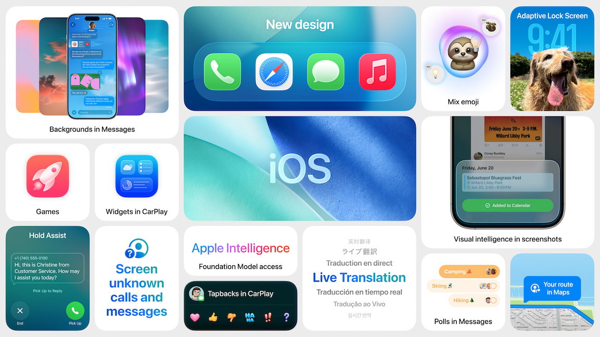
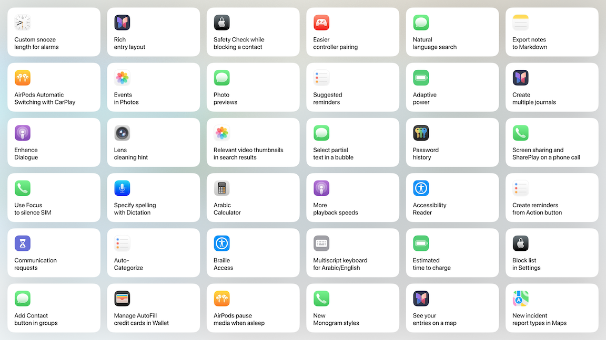
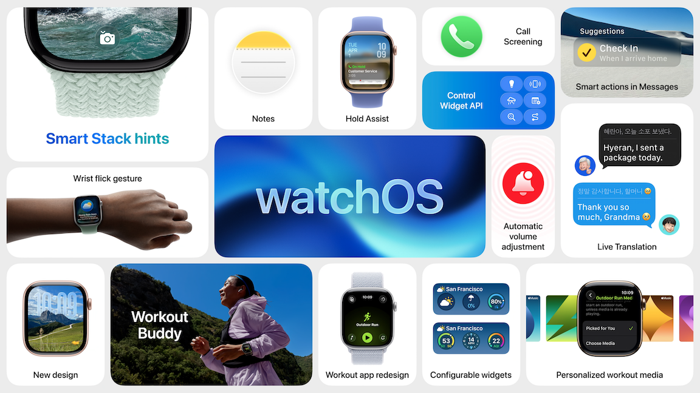
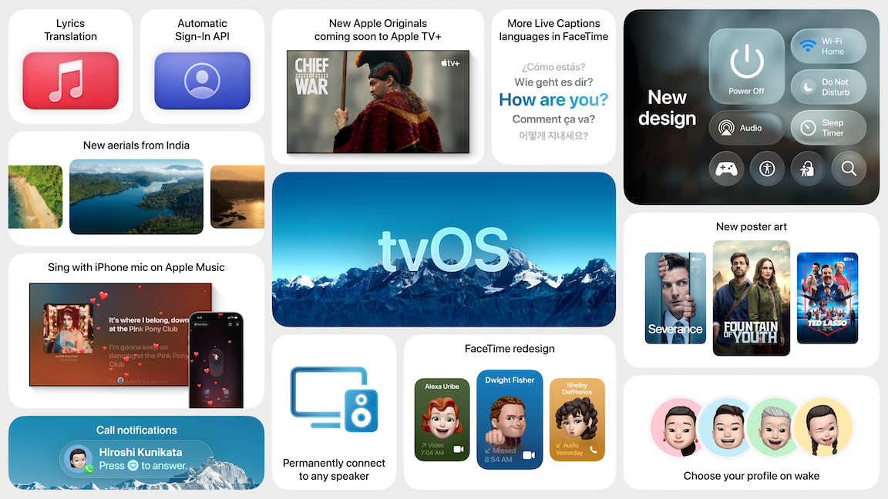
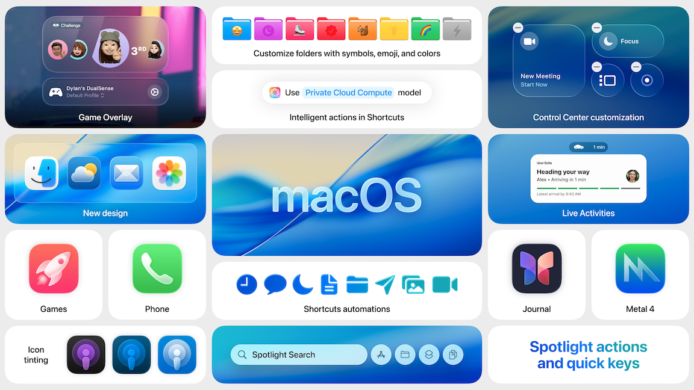
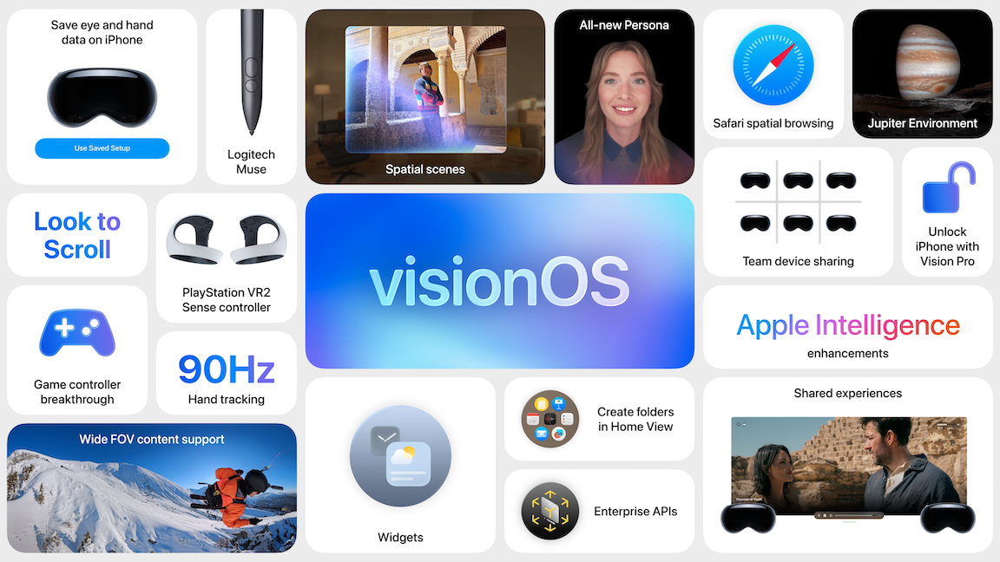
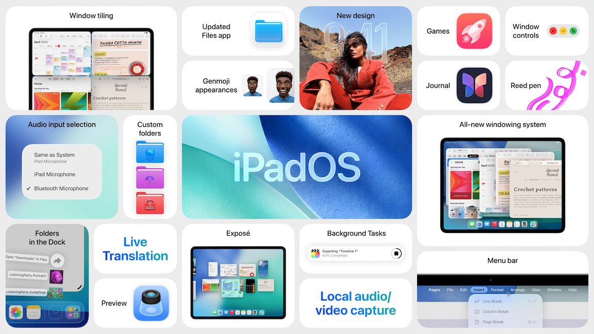
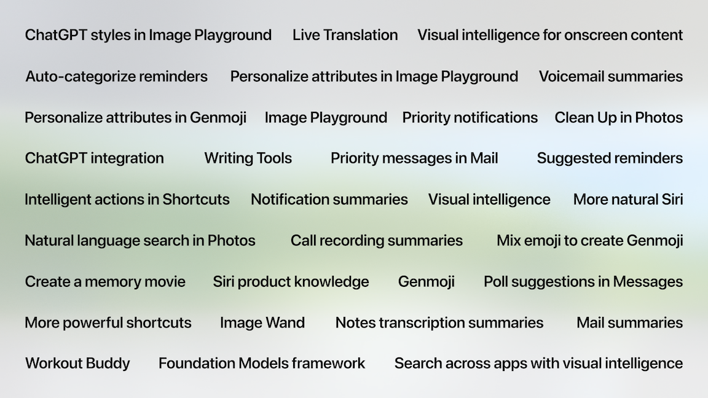

# [**Keynote**](https://developer.apple.com/videos/play/wwdc2025/101/)

---

### **Apple Intelligence**

* Some stuff announced last year... still not ready...
* Expanding languages
* Opening up access for apps to tap into on-device LLM with Foundation Models framework
    * Direct access to local models
    * Works even offline
    * Privacy focused

### **UI Redesign - Liquid Glass***

* Universal design across platforms
* Inspired by visionOS
* Flows between states like Dynamic island
* Elements (tab bars, nav bars, etc.) redesigned, freeing up space for content
* Alerts appear from where you tap
* Interaction elements move out of the way when scrolling more

### **Release version updates***

* All new releases will be version 26

### **iOS**

* Lock screen updated
    * App icons updated
        * Allows icons to adapt more
        * New all-clear look for icons
    * Time adapts to fill space based on lock screen photo
    * Background adjusts as notifications come in to better highlight pictures
    * Parallax added to background photos
    * Animated album artwork shows when music is playing
* Camera
    * Redesigned to simplify navigation between modes
    * Photos app also redesigned
        * Added tabs for `library` and `collections`
        * Parallax added to photos here as well
* Safari
    * Webpages now flow edge to edge and the bottom of the screen
    * Tab bar floats above the page
    * Tab bar shrinks as you scroll
* FaceTime
    * Controls float on bottom right, and disappear when you don't need them
    * Landing page redesigned
    * Video messages play as you scroll
* CarPlay
    * New design
        * Similar to rest of new UI design
        * Icon updates
    * Compact design when you get a call
        * Directions stay on the screen
    * Tapback/pinned conversations in messages
    * Widgets added
    * Live activities
    * Developers can use pre-existing widgets in CarPlay
    * New updates to CarPlay Ultra as well, but you have to have an Aston Martin for this right now, so only James Bond will get this
* Phone
    * Unified layout for Favorites, Recents, and Voicemails
    * New voicemail summaries show in list
    * Contacts, Keypad, and Search at the bottom
    * Call Screening builds on live voicemail automatically answers calls from unknown numbers
        * Gets users name/and reason for calling before ringing
    * Hold Assist
        * Keeps your spot in line on hold
        * Auto-detects hold music and asks if you want to be on hold
        * Stops hold music and rings you to return to call when agent comes on line
* Messages
    * New backgrounds for conversations
        * Appears for everyone in the conversation
        * Built-in backgrounds, select a photo, or generate one
    * Polls added
        * Apple Intelligence can detect when a poll can be added
        * Anyone can add options to a poll
    * Can use Apple cash in group chats
    * Typing indicators in group chats
    * New screening tools
        * Can screen new senders
        * Unknown senders appear in a dedicated area
            * Remain silent and won't appear as notifications
    * Time sensitive markers on messages
* Genmoji/Image playgrounds
    * Can now mix together multiple emoji in addition to text descriptions
    * Can change expressions, change hairstyles in genmoji
    * Can make images using ChatGPT in Image Playgrounds
        * Nothing is shared to ChatGPT without permission
    * All of this can be added to apps using the Image Playgrounds SDK
* Live Translation
    * Can translate conversations on the fly
    * Integrated into FaceTime, Messages, and Phone
    * Words translated as you talk, and spoken out loud for the recipients
    * You hear both the original and translated versions of what the other person is saying
    * New Call Translation API
* Apple Music
    * Lyrics Translation
    * Lyrics Pronunciation
    * AutoMix to transition from one song to the next
    * Music pins pin an artist/album/playlist to the top of the library
* Apple Maps
    * Now learns preferred routes
    * Updates/adapts if routines change
    * Sends notifications if an alternate route is useful because of long delays
    * Visited Places - can search places you have visited before in the Maps library
        * Places can be deleted from the list
* Wallet
    * More companies supporting CarKeys
    * Digital ID support added
    * New boarding passes
        * Access to indoor mapping
        * Find My to track baggage
        * Sharable flight status
* Pay
    * Can now redeem cash and use it to pay
    * Orders section to track purchases
* Games App
    * Updates and recommendations for games
    * Dedicated Apple Arcade tab
    * Library tab shows all games ever downloaded
    * Works with a controller
    * Play Together tab to see friends' progress
        * Challenges to compete with friends
        * Built on top of Game Center leaderboards
* Visual Intelligence
    * Can now search and take action on things that are on the screen, not just with the camera
    * Activated by taking a screenshot
        * Tap image search button
        * Add events to calendar
        * Tap `Ask` button to ask ChatGPT a question about an image
    * App Intents can be used by developers for these experiences

### **watchOS**

* Liquid Glass design on watchOS as well
* Workout
    * Workout Buddy
        * Uses Apple Intelligence
        * Gathers all data from a workout as well as workout history
        * Identifies insights in realtime
        * Provides encouragement via voice
        * Marks key moments during the workout (e.g. miles left, with statistics)
        * Give highlights of a workout at the end
        * Available starting in English across most popular workout types
    * New layout
        * Custom workouts and race route are now just one tap away
        * Can race against best/last time on a route
    * Can let Apple Music choose a playlist, or choose one yourself
* Smart Stack
    * New prediction algorithm
        * Fuses on-device data (like location) and trends
* Notifications
    * Enhancements to notifications
        * Can interpret ambient noise and adjust volume of incoming notifications
    * New wrist flick gesture
        * dismiss notification
        * stop timers
* Messages
    * Live translation
    * Conversation backgrounds
    * New message suggestions based on context
* Notes
    * New to Watch
* New API's for developers
    * Control Center

### **tvOS**

* Once again, Liquid Glass redesign comes here as well
* TV app
    * Playback controls refract the contact underneath to be less obstructive
    * Same with Control center
    * New browsing design
    * Can now set to open profiles any time the device wakes up
    * New Automatic Sign-in API
        * No more signing in across every device
* Apple Music
    * iPhone the mic for Karaoke, sent to TV
    * Can add songs to queue from any device
  

### **macOS**

* macOS Tahoe
* Includes things mentioned during iOS section (live translation, AI updates, etc.)
* You guessed it, Liquid Glass redesign
* Menubar is completely transparent
* More ways to customize menubar and control center
    * Can add third party controls
* Can add colors/symbols/emoji to folders
* Continuity
    * Live Activities coming to the mac
        * Show in the menu bar
        * App opens in iPhone mirroring when you tap on the activity
    * Phone app, synced from iPhone
        * Incoming calls show with a contact image
        * Gets all the iOS features
* Shortcuts
    * New `Intelligent Actions`
        * Dedicated actions for things like summarizing text/creating images
        * New action to tap into LLM models
            * On device
            * Private Cloud Compute
            * ChatGPT
    * Spotlight can create/run shortcuts
        * Can see relevant files, apps, and apps on iPhone
        * Can set parameters for shortcuts like email information
        * QuickKeys
            * Automatically provided for actions you've taken
            * e.g. sm => Send Message
        * Contextually aware, can suggest using the document you currently are working in
    * Developers can use App Intents API to make their apps available to Shortcuts/Spotlight
* Games
    * New gaming overlay
    * Metal 4 Framework
        * Frame interpolation
        * De-noising
        * More
    * New games coming. Now there are 11 games for the Mac.

### **visionOS**

* Experiences
    * Spatial Widgets
        * Persistent, stay where you place them between sessions
        * Customizable - frame width, color, depth
        * Clock, Weather, Music, others
        * Developers can create with WidgetKit
* Spatial Scenes
    * Uses computation depth data to create 3D/parallax effect
    * Can view in webpages and apps
* Personas
    * More realistic hair/lashes/skin
        * Still created on-device
* Can now collaborate with people in person and remote
* More enterprise SDKs
* Support for spatial accessories
    * Styluses (Logitech Muse)
    * Sony PSVR2 controllers
* Content
    * New apps and ways to create content
        * New Adobe app
    * Partnered with other companies to support better playback of 180 and 360 content on visionPro
    * Can pull items from a webpage into 3D space
    * New Environments

### **iPadOS**

* Shocker - Liquid Design!
* All the things that iOS got, and some of macOS
* Multitasking
    * New windowing system
    * Can stay in full screen
    * Or, can open windows in smaller size, and freely position
        * Windows reopen in the previous size
    * Can flick windows towards corners/sides to tile
    * New arrow pointer with trackpad
    * Tapping an app in smaller mode opens it on top of other apps
    * Expose added with trackpad gestures
    * Can also open apps in a view by themselves
    * Menubar added top of screen
    * On every iPad that works on iPadOS 26
    * Works with stage manager and external displays
* File Management
    * Files app
        * New list view in Files app
        * Same folder customizations as macOS
            * Sync across devices
        * Can choose which app to open a file with
            * Can set default app
    * Can add folders to the dock
    * Preview app
        * Dedicated app to view/edit PDFs
        * Can export as images
* Audio and Video
    * Audio input selector
        * Can choose a different one for each app
        * Works with websites as well
    * Voice isolation available for all apps
    * Can record "studio-quality" vocals with AirPods
        * Can stop/start with AirPod squeeze gesture
    * Local Capture
        * Everyone involved can record their end of the audio only
        * Then everyone can share their recordings at the end
    * Background tasks for iPad
        * Things like exports can happen in the background
            * Show in a Live activity
        * Background Tasks API

### **Apple Intelligence features**

### **Developers**

* Major additions/updates to:
    * Foundation Models framework
    * App Intents
    * Visual intelligence
    * Swift
    * SwiftUI
* New Icon Composer app to create app icons
* More generative intelligenct in Xcode
    * Better prediction
    * Swift Assist will eventually ship
        * Works with ChatGPT
