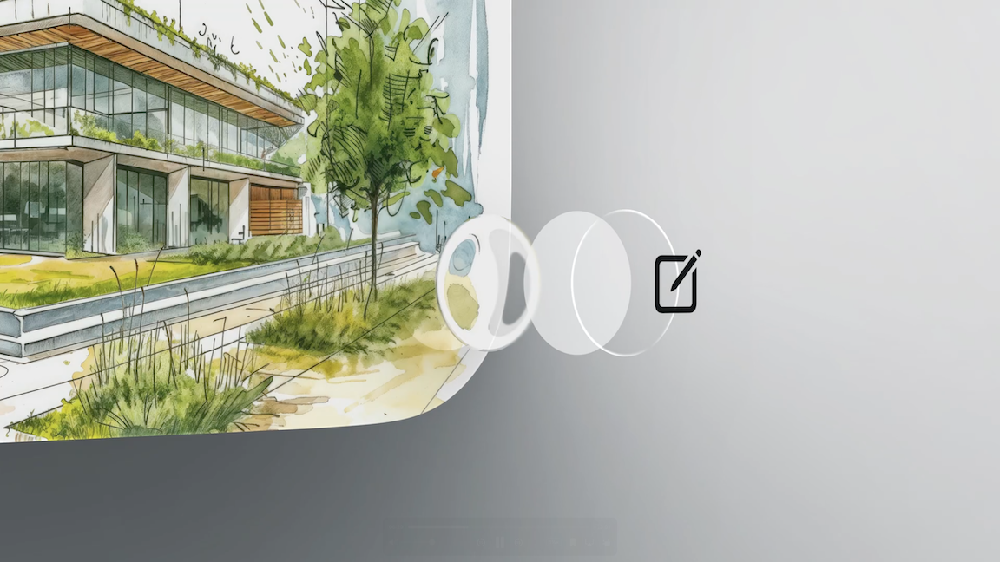
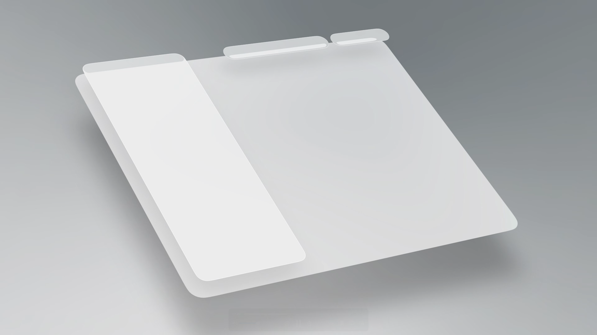
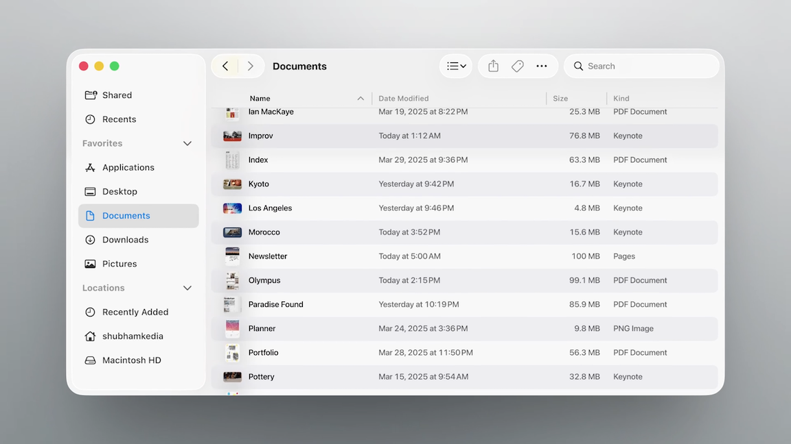
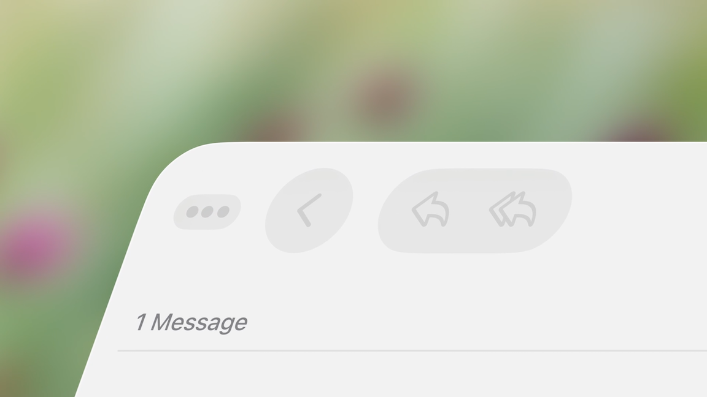
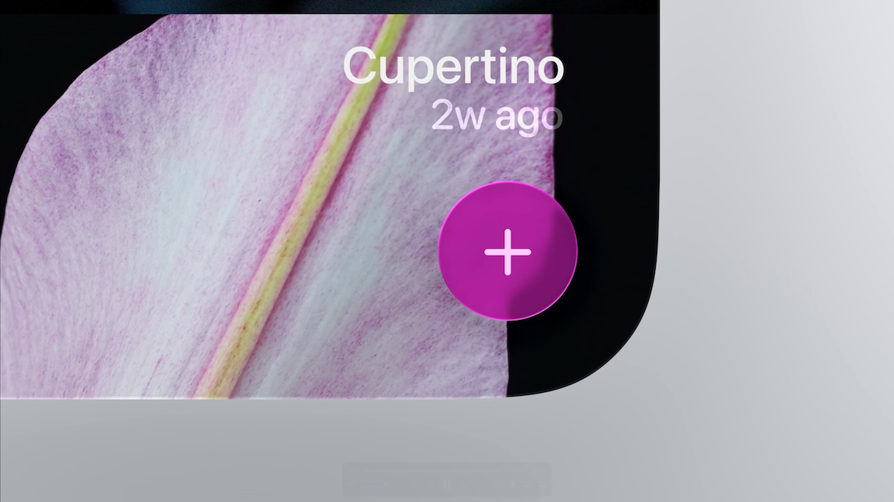

# [**Meet Liquid Glass**](https://developer.apple.com/videos/play/wwdc2025/219)

---

### **Dynamics**

* Represented in the UI in rounded, floating forms that nest neatly in the rounded curves of modern devices

* The primary way Liquid Glass visually defines itself is through something called Lensing
    * How the warping and bending of light of a transparent object communicates to us its presence, its motion, and form

* Previous materials scattered light, this new set of materials dynamically bends, shapes, and concentrates light in real time
    * Provides definition against the background content while still feeling visually grounded in our experience of the natural world

* Instead of fading, Liquid Glass objects materialize in and out by gradually modulating the light bending and lensing
    * Ensures a graceful transition that preserves the optical integrity of the material

* Liquid Glass responds to interaction by instantly flexing and energizing with light
* The UI has a gel-like flexibility to it that communicates its transient and malleable nature, as it moves in tandem with your interaction
* Elements can even lift up into Liquid Glass temporarily, such as when you interact with a component
    * Like with controls, where the transparent liquid lens can be seen through to precisely observe the value underneath it

* As you go between states in an app, Liquid Glass dynamically morphs between the controls in each context
    * Maintains the concept of having a singular floating plane that the controls live on
    * Makes transitions between different sections of an app feel fluid and seamless, as the controls continually shape shift
    * When showing a menu, the bubble simply pops open to reveal the content contained within
        * Communicates a very clear and direct relationship between the button and the content contained within

* Liquid Glass is designed to make the experience of apps feel fundamentally more organic, more immersive, and more fluid

### **Adaptivity**

* Liquid Glass is designed from the ground up to be adaptive to both its size and its environment
    * Its primary goal is to remain visually clear, deferring to the content underneath
    * It's also constantly, subtly changing to ensure legibility and to maintain clear separation from the content layer

* Liquid Glass is composed of a number of layers that work together to give it its unique look
    * Unlike previous materials that had a fixed light or dark appearance, each layer continuously adapts based on what’s behind it
    * As text scrolls underneath, shadows become more prominent to create additional separation
    * The amount of tint and the dynamic range shift to always ensure buttons remain legible, while letting as much of the content through as possible
    * When needed, it can also independently switch between light and dark

* When glass flexes and morphs to larger sizes – like when presenting a menu from a toolbar button – its material characteristics change to simulate a thicker, more substantial material
    * Casts deeper, richer shadows, has more pronounced lensing and refraction effects, and a softer scattering of light

* On iPad and Mac, just like on iPhone, Liquid Glass form a functional layer for controls and navigation
    * Floats above everything, giving a larger, more expansive canvas for content

* Glass controls nest perfectly into the rounded corners of windows, maintaining concentricity throughout the UI

* On larger elements, like sidebars, the appearance of Liquid Glass is informed by the ambient environment within the app
    * Light from colorful content nearby can subtly spill onto its surface, reinforcing the material's context and its sense of elevation within the interface
    * The effect isn't limited to the surface, the light reflects, scatters, and bleeds into the shadow as well

* Floating sidebars on iPad and Mac
    * Form a cohesive and consistent language for the core navigation of apps across all platforms
    * Can now be thought of as a single navigational element that fluidly scales as the canvas of the app grows

* Scroll edge effects
    * Work in concert with Liquid Glass to maintain that crucial separation between the UI and content layers and ensure legibility, especially with dynamically scrolling content
    * As content begins to scroll underneath a glass element, the effect gently dissolves the content into the background
    * Lifts the glass visually above the moving content, and allowing floating elements like titles to always remain clear
    * When darker content scrolls under, the effect intelligently switches to apply a subtle dimming instead
    * In some cases, like when there are pinned accessory views under a toolbar (e.g. column headers), a “hard style” effect is used instead
        * Instead of a gradual fade, the effect is applied uniformly across the height of the toolbar and the pinned accessory view
        * Use this style when you need that extra degree of visual separation between floating elements in the accessory view and the scrolling content below

### **Principles**

#### Layer Structure

* The light play, depth effects, and adaptive changes are layers inside a sophisticated system, working together to create a material that is greater than the sum of its parts
* Light sources inside of this environment layer shine on the material producing highlights that respond to geometry
* On interactions, such as locking and unlocking your phone, these lights move in space, causing light to travel around the material, defining its silhouette
* In some cases, the lighting responds to device motion, making it feel like Liquid Glass is aware of its position in the real world

* Shadows also play an important role in helping elements feel grounded and defined
    * The element is aware of what’s behind it and increases the opacity of its shadow when it is over text
    * Conversely, it lowers the opacity of its shadow when it is over a solid light background

* When you interact with Liquid Glass, the material illuminates from within as a form of feedback
    * Starting right under your fingertips, the glow spreads throughout the element and onto any Liquid Glass elements nearby

* When a window loses focus on the Mac or iPad, Liquid Glass shifts its appearance and visually recedes to guide attention
* All of these behaviors are built in

#### How and when to use Liquid Glass

* Don't use everywhere - best reserved for the navigation layer that floats above the content of your app
    * Applying Liquid Glass to content would make it compete with other elements and muddy the hierarchy
* Avoid stacking Liquid Glass elements on top of each other
    * Can quickly make the interface feel cluttered and confusing
    * When placing elements on top of Liquid Glass, avoid applying the material to both layers
        * Instead, use fills, transparency, and vibrancy for the top elements to make them feel like a thin overlay that is part of the material

#### Variants

* Regular
    * The most versatile and the one to use the most
    * Gives you all the visual and adaptive effects we’ve talked about, and provides legibility regardless of context
    * Works in any size, over any content and anything can be placed on top of it

* Clear
    * Does not have adaptive behaviors
    * Permanently more transparent, which allows the richness of the content underneath to come through and interact with the glass in beautiful ways
    * To provide enough legibility for symbols or labels, it needs a dimming layer to darken the underlying content
        * Without it, legibility gets noticeably worse
    * If Liquid Glass elements in your app have a smaller footprint, you can use localized dimming and allow the content to retain more of its original vibrancy
    * Only use when:
        * The element you’re applying it to is over media-rich content
        * Your content layer won’t be negatively affected by introducing a dimming layer
        * The content sitting above it is bold and bright

#### Legibility

* Small elements like nav bars and tab bars, constantly adapt their appearance depending on what’s behind them
    * Also flip from light to dark based on the background to make sure the material looks as good as possible and is easily discernible
* Bigger elements, like menus or sidebars also adapt based on context
    * But they don’t flip from light to dark
    * Bigger elements, like menus or sidebars also adapt based on context, but they don’t flip from light to dark. Their surface area is too big and transitions like these would be distracting
* To maintain legibility, symbols and glyphs on top of Liquid Glass flip from light to dark and vice versa, mirroring the glass’s behavior to maximize contrast
    * All content placed on the Regular Glass variant will automatically receive this treatment
* Can also use custom colors, but use them selectively
    * When items or elements serve a distinct functional purpose, you can tint them to bring attention to them

#### Tinting

* Liquid Glass introduces a new way of tinting elements that respects the principles of the material and maximizes legibility
* The technique is consistent across all Liquid Glass elements, from labels, text and fully tinted buttons
* Selecting a color generates a range of tones that are mapped to content brightness underneath the tinted element
* Changes its hue, brightness and saturation depending on whats behind without deviating too much from the intended color
* Emphasizes the physicality of the material, but also helps legibility and contrast
* Natively compatible with all the behaviors of glass
* Use tinting for emphasis to primary elements and actions in the UI
    * Avoid tinting all elements
        * If you want to imbue color into the app, do it in the content layer instead
* In steady states, such as when an app first launches, avoid intersections between content and Liquid Glass
    * Instead, reposition or scale the content to maintain separation

#### Accessibility

* Modifiers on the material that change certain layers of Liquid Glass
* Reduced Transparency, makes Liquid Glass frostier and obscures more of the content behind it
* Increased contrast, makes elements predominantly black or white and highlights them with a contrasting border
* Reduced Motion decreases the intensity of some effects and disables any elastic properties for the material
* Available automatically whenever you use the new material
    * Whenever these settings are turned on at a system-level, Liquid Glass elements will get them across the board
