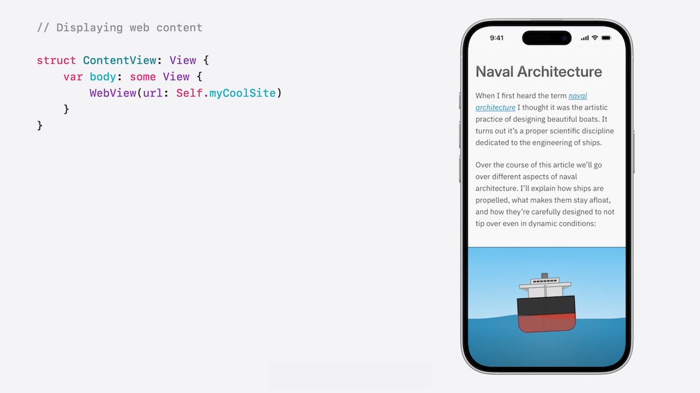
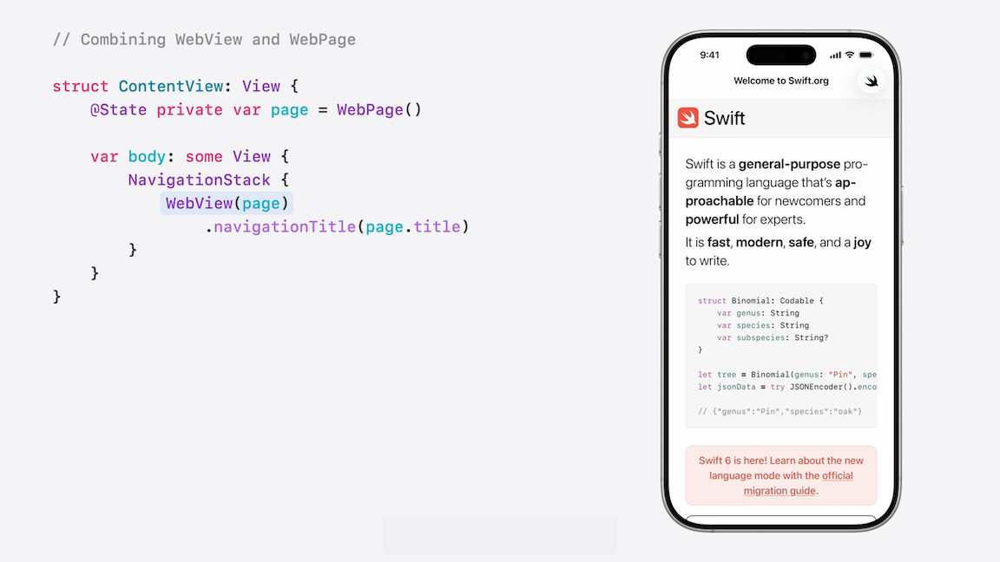
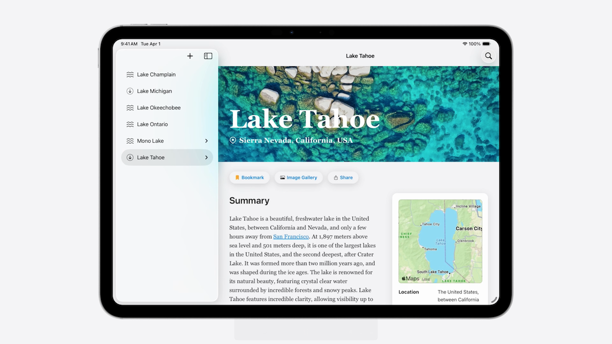
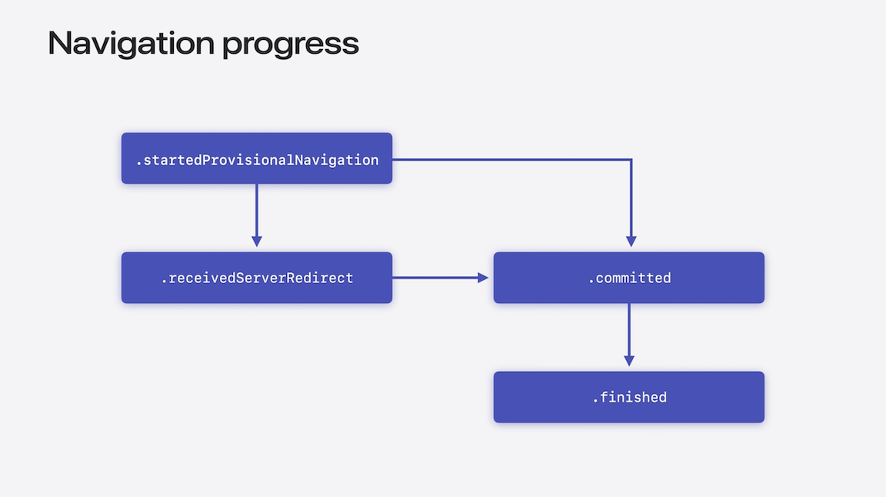
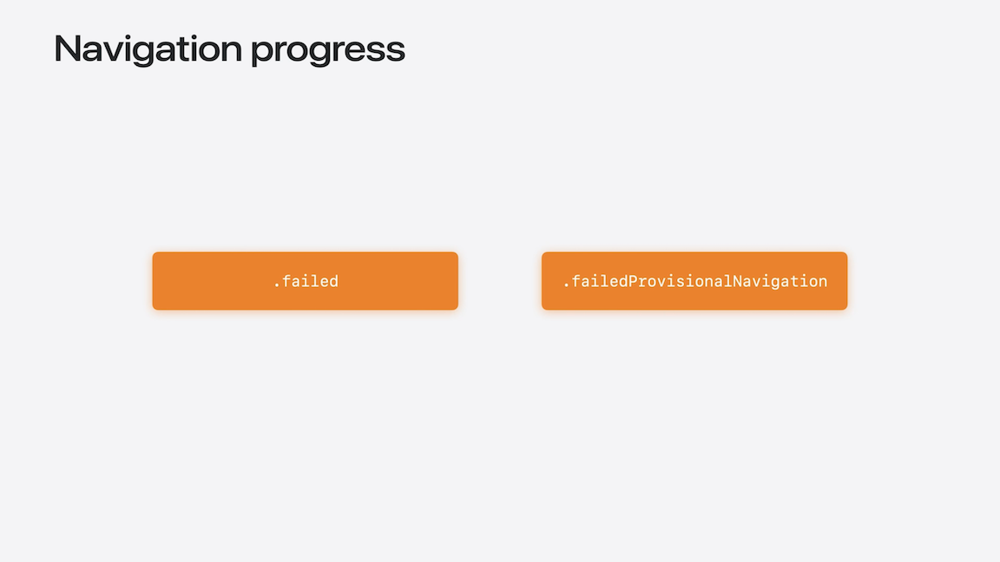
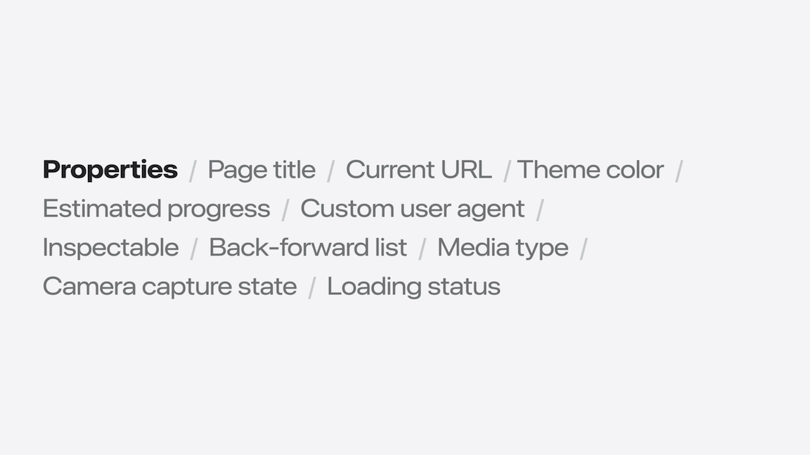
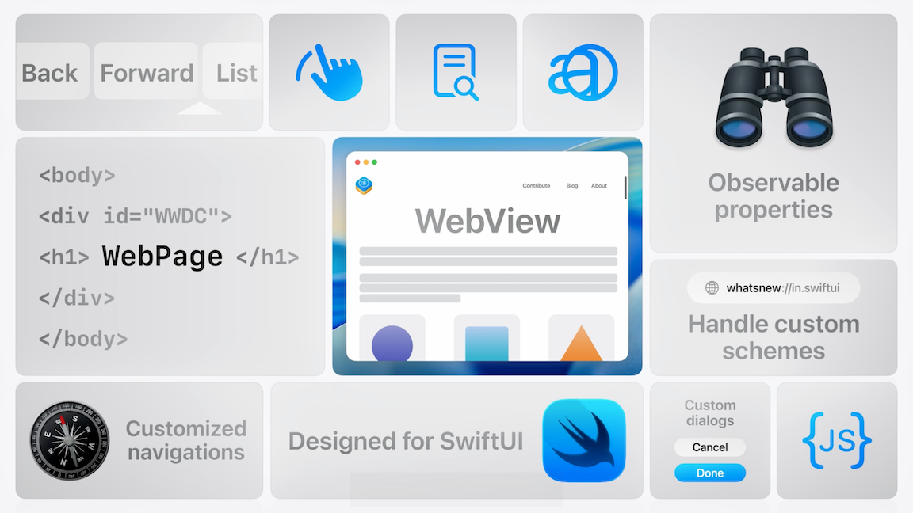

# [**Meet WebKit for SwiftUI**](https://developer.apple.com/videos/play/wwdc2025/231)

---



### **Load and display web content**

#### Displaying web content

* Use the new `WebView` API to load web content
    * Give it a URL, and it’ll automatically load and display its contents

```swift
struct ContentView: View {
    var body: some View {
        WebView(url: URL(string: "https://www.webkit.org"))
    }
}
```

* You can create a WebView that toggles between two URLs

```swift
struct ContentView: View {
    @State private var toggle = false
    var body: some View {
        WebView(url: toggle
            ? URL(string: "https://www.webkit.org")
            : URL(string: "https://www.swift.org")
        )
        .toolbar {
            Button(buttonName, systemImage: buttonIcon) {
                toggle.toggle()
            }
        }
    }
}
```

* If you want to do something more complicated, like reacting to changes to its properties
    * Use `WebPage` instead of `WebView`
    * `WebPage` is a new Observable class that represents your web content
    * Use to load, control, and communicate with web content
    * Can be used completely on its own, or combined with `WebView`



#### Loading web content

* Three ways to load web content with a `WebPage`:
    * To load a remote URL into your web page, use the load API with a URL request
    * Load HTML content directly
    * Load data (e.g. web archive data)

```swift
// Loading a URL request
let page = WebPage()
var request = URLRequest(url: item.url)
request.attribution = user

page.load(request)


// Loading an HTML string
let page = WebPage()
page.load(html: item.html, baseURL: URL(string: "about:blank")!)


// Loading Data
let page = WebPage()
let base = URL(string: "about: blank")!
let mimeType = "application/x-webarchive"

page.load(item.webArchiveData, mimeType: mimeType, characterEncoding: .utf8, baseURL: base)
```

* Below is a basic example of using `WebView` and `WebPage` together
    * With this setup, you can create an app that loads different urls in a single WebView

```swift
// Loading an article
@Observable
final class ArticleViewModel {
    var page: WebPage 
    var lake: LakeArticle

    init(lake: LakeArticle) {
        self.lake = lake
        self.page = WebPage()
    }

    func loadArticle () {
        page.load (URLRequest(url: lake.url))
    }
}

// Displaying an article
struct ArticleView: View {
    @Environment(ArticleViewModel.self) private var model

    var body: some View {
        WebView(model.page)
            .onAppear {
                model.loadArticle()
            }
            .ignoresSafeArea(.all, edges: .bottom)
    }
}
```



#### Loading local resources

* WebKit also lets you load content bundled in your app or access local files
    * Use `URLSchemeHandler`
    * WebKit will handle common schemes like `https`, `file`, and `about`
    * For custom schemes, the `URLSchemeHandler` protocol lets the application code handle loading resources for other schemes

```swift
// Creating a custom scheme handler

struct LakeResourceSchemeHandler: URLSchemeHandler {
    func reply(for request: URLRequest) -> some AsyncSequence<URLSchemeTaskResult, any Error> {
        AsyncThrowingStream { continuation in
            let resourceData = dataForLake(request.url, bundle: main)
            let response = responseForLake(request.url, contentLength: resourceData.count)

            continuation.yield(.response(response))
            continuation.yield(.data(resourceData))
            continuation.finish()
        }
    }
}
```

* While the above works for most cases, sometimes you want to asynchronously stream data
    * Can do that with the `AsyncSequence` return type

```swift
// Creating a custom scheme handler
struct LakeResourceSchemeHandler: URLSchemeHandler {
    func reply(for request: URLRequest) -> some AsyncSequence<URLSchemeTaskResult, any Error> {
        AsyncThrowingStream { continuation in
            Task {
                let response = await getResponse()
                continuation.yield(.response(response))

                for await dataChunk in getDataStream() {
                    continuation.yield(.data(dataChunk))
                }
    
                continuation.finish()
            }
        }
    }
}
```

* In order to use custom schemes, you need to register the scheme handler with the WebPage
    * Make a URLScheme using the scheme you want to handle
    * If you provide a scheme that WebKit already handles, the initializer will return `nil`
    * Create a WebPage Configuration and add the scheme handler to its urlSchemeHandlers dictionary
    * Also make sure to pass in the configuration when creating the WebPage

```swift
// Registering the lakes:// custom scheme

init(lake: LakeArticle) {
    self.lake = lake

    let scheme = URLScheme("lakes")!
    let handler = LakeResourceSchemeHandler()

    var configuration = WebPage.Configuration()
    configuration.urlSchemeHandlers[scheme] = handler

    self.page = WebPage(configuration: configuration)
}

extension LakeArticle {
    static let defaults = [
        LakeArticle(name: "Lake Tahoe", url: URL(string: "lakes://tahoe.html")!),
        LakeArticle(name: "Lake Ontario", url: URL(string: "lakes://ontario.html")!),
    ]
}
```

### **Communicate with the page**

* Use the new `currentNavigationEvent` property on `WebPage` to know when pages finish loading (and other navigation events)

```swift
// Getting the current navigation events

let page = WebPage()
guard let event = page.currentNavigationEvent else { return }

let navigationID = event.navigationID

switch event.kind { ... }
```

* Navigation progress
    * The navigation always starts with `.startedProvisionalNavigation`
    * You may get a `.receivedServerRedirect` event if the server redirects the request
    * You get a `.committed` event when the page has started to receive content for the main frame
    * The `.finish` event arrives when the navigation is complete, although this isn't always guaranteed
    * A navigation can also fail at any point, in which case the `.failed` or `.failedProvisionalNavigation` events are emitted
        * When a new navigation starts, the currentNavigationEvent property will now reflect that navigation


Navigation Progress | Navigation Failure |
--------------------|--------------------|
  |  |

* Use the new `Observations` API to continually react to any navigation that occurs
    * e.g. clicking on a link or when a load function is called

```swift
// Continuously observing navigation events

func loadArticle() async {
    let id = page.load(URLRequest(url: lake.url))
    let events = Observations { page.currentNavigationEvent }

    for await event in events where event?.navigationID == id {
        switch event?.kind {
        case let .failed(error):
            self.currentError = error
    
        case .finished:
            lake.sections = await parseSections()
        
        default:
            break
        }
    }
}
```

#### Observing page properties

```swift
// Using observable properties

struct ArticleView: View {
    @Environment(ArticleViewModel.self) private var model

    var body: some View {
        WebView(model.page)
            .navigationTitle(model.page.title)
    }
}
```



#### Evaluating JavaScript

* You can directly evaluate JavaScript to communicate with a page by using the new `callJavaScript` API
    * Write a JavaScript function like normal and then pass it in when you use `callJavaScript`
    * The return type of callJavaScript is an optional Any value, cast it to an appropriate Swift type so that it’s easier to use
    * With the code below, the app implements the `parseSections` function to get the page’s HTML and getting all the ids and titles of each section
        * The app will display the sections of the article in the sidebar as soon as it loads

```swift
// Parse the HTML headers using JavaScript 
func parseSections() async →> [LakeArticle.Section] {
    let result = try? await page.callJavaScript(
        """
        const headers = document.querySelectorA11("h2");
        return [...headers].map ((header) => ({
            "id": header.id,
            "title": header.textContent
        }));
        """
    )

    guard let result = result as? [[String : Any]] else {
        fatalError ()
    }

    return result.map(LakeArticle.Section.init(_:))
}
```


#### Navigation policies

* `WebPage` gives the option to customize navigation policies how you want them using the new `WebPage.NavigationDeciding` protocol
    * Implement custom navigation policies so that navigations within the web content behave the way you want
    * e.g. If there is a link in a page to an external site, open in the default browser instead of loading within the app

```swift
// Open non-lake URLs in the default browser

class NavigationDecider: WebPage.NavigationDeciding {
    weak var owner: ArticleViewModel?

    func decidePolicy(
        for action: WebPage.NavigationAction,
        preferences: inout WebPage.NavigationPreferences
    ) async -> WKNavigationActionPolicy {
        let url = action.source.request.url

        if url?.scheme == "lakes" || url?.host() == "lakes.apple.com" {
            return .allow
        }

        owner?.urlToOpen = url
        return .cancel
    }
}
```

* To use the navigation policy
    * Create a new navigation decider and a new urlToOpen property
    * Update the `WebPage` to take in the navigation decider so that it uses the specified policy
    * In the View, listen to changes to the urlToOpen property on the model
        * If the property is non-nil, you know that the navigation has been canceled, so use the openURL SwiftUI environment value to open the url in the default browser

```swift
// Open non-lake URLs in the default browser

private var navigationDecider = NavigationDecider()
var urlToOpen: URL? = nil

init(lake: LakeArticle) {
    // ...

    self.page = WebPage(
        configuration: configuration, 
        navigationDecider: navigationDecider
    )
    
    self.navigationDecider.owner = self
}


struct ArticleView: View {
@Environment(ArticleViewModel.self) private var model

@Environment (\.openURL) private var openURL

var body: some View {
    WebView(model.page)
        .onChange(of: model.urlToOpen) {
            if let url = model.urlToOpen {
                openURL(url)
                model.urlToOpen = nil
            }
        }
    }
}
```

### **Customize web content interaction**

#### Configuring scrolling behavior

* By default, web views bounce when scrolled past the vertical or horizontal edges, even if the content is smaller than the web view
    * The `scrollBounceBehavior` modifier lets you customize this behavior

```swift
// Restrict horizontal scroll bouncing

struct ArticleView: View {
    @Environment(ArticleViewModel.self) private var model

    var body: some View {
        WebView (model.page)
            .scrollBounceBehavior(.basedOnSize, axes: [.horizontal])
    }
}
```

* New on visionOS is look to scroll
    * Can be configured with the `webViewScrollInputBehavior(.enabled: .look)` modifier
    * Disabled by default

```swift
// Enabling Look to Scroll on visionOS

struct ArticleView: View {
    @Environment(ArticleViewModel.self)
    private var model

    var body: some View {
        WebView(model.page)
#if os(visionOS)
            .webViewScrollInputBehavior(.enabled, for: .look)
#endif
    }
}
```

#### Enabling find-in-page

* The existing `findNavigator` modifier already works with WebView
    * To get it to display, add a button (e.g. to the app's toolbar)
    * On iOS and iPadOs, the find navigator appears as part of the onscreen keyboard when visible or at the bottom of the web view
    * On macOS and visionOS, it displays at the top of the web view.

```swift
// Configuring Find in Page support

struct ArticleView: View {
    @Environment(ArticleViewModel.self) private var model

    @State private var findNavigatorIsPresented = false

    var body: some View {
        WebView(model.page)
        .findNavigator(isPresented: $findNavigatorIsPresented)
        .toolbar {
            ToolbarItemGroup {
                Button("Find", systemImage: "magnifyingglass") {
                    findNavigatorIsPresented.toggle()
                }
            }
        }
    }
}
```

#### Scrolling to a position

* To scroll to a section, you need to determine where it is using JavaScript
    * Provide it with a dictionary of arguments
        * The keys in the dictionary are represented to JavaScript as local variables
        * Their values are converted to JavaScript values
    * In your View, add state to control the scroll position and the section
        * Associate a scroll position with a WebView by using the new `webViewScrollPosition` modifier
        * Set the scroll position whenever the section changes by using scrollTo on the scroll position and giving it the computed position for the section

```swift
// Get the y-position of a section
func positionForSection(_ section: LakeArticle. Section?) async -> CGFloat? {
    guard let section else { return nil }

    let result = try? await page.callJavaScript(
        "return computeSectionOffset(sectionID)",
        arguments: [
            "sectionID": section.id
        ]
    )

    return result as? CGFloat
}


struct ArticleView {
    @Environment(ArticleViewModel.self) private var model

    @State private var scrollPosition = ScrollPosition()
    @Binding var section: LakeArticle.Section?

    var body: some View {
        WebView(model.page)
            .webViewScrollPosition($scrollPosition)
            .onChange(of: section, initial: true) {
                Task {
                    guard let position = await model.positionForSection(section) else {
                        return
                    }
                    scrollPosition.scrollTo(y: position)
                }
            }
    }
}
```

* If you want to update your View when scrolling, use the `onScrollGeometryChange` modifier
    * In the code below, whenever any part of the WebView's scroll geometry changes (e.g content offset or size), the modifier will use the transformation you give it and will call its closure if the transformed value changes
        * In the closure, compute the section nearest to the new scroll offset and update the selected section

```swift
// Updating the selected section when scrolling

struct ArticleView: View {
    @Environment(ArticleViewModel.self) private var model

    @State private var scrollPosition = ScrollPosition()
    @Binding var section: LakeArticle.Section?
    
    var body: some View {
        WebView(viewModel.page)
            .webViewOnScrollGeometryChange(
                for: CGFloat.self,
                of: \.contentOffset.y
            ) { _, newValue in
                section = computeSectionAtOffset(newValue)
            }
    }
}
```


