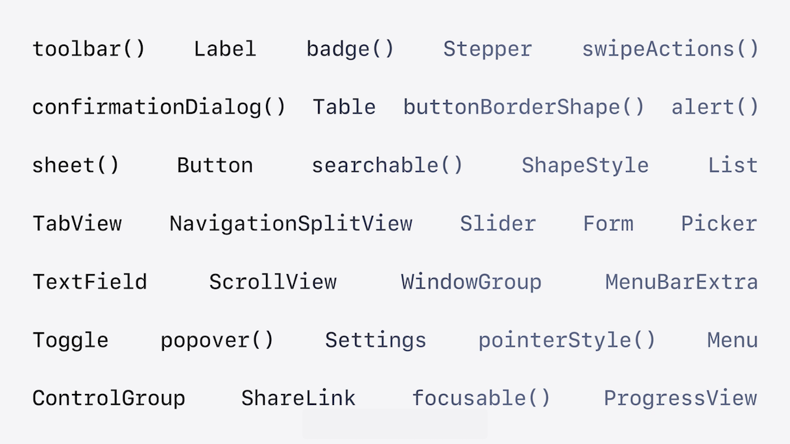
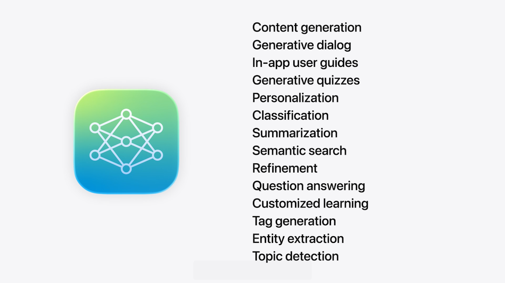
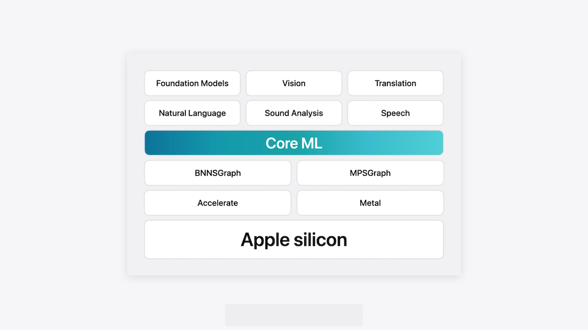
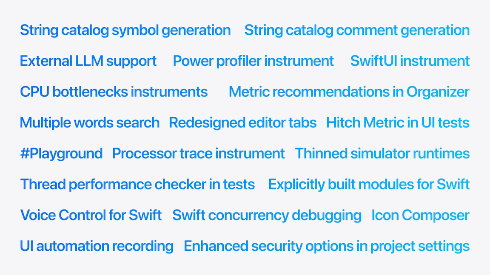
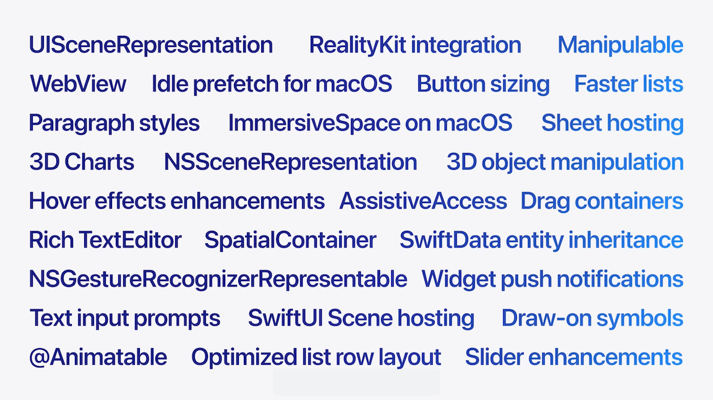
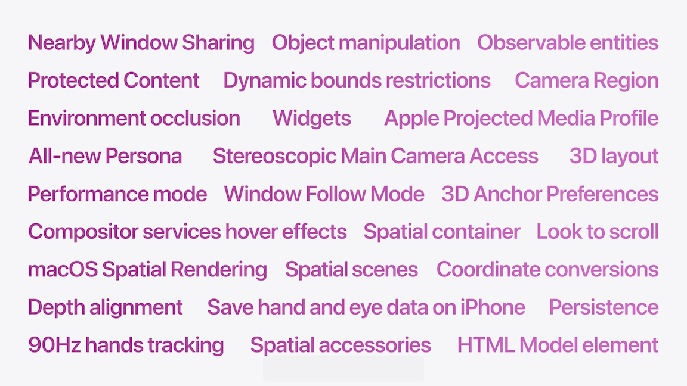
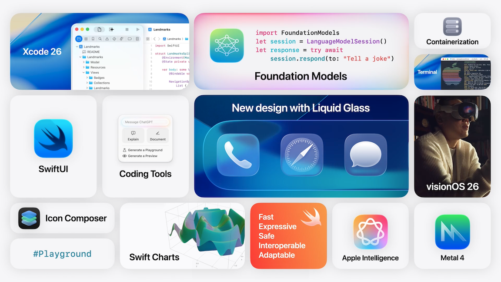

# [**Platforms State of the Union**](https://developer.apple.com/videos/play/wwdc2025/102/)

---

### **New Design**

* Goal is to elevate content and establish continuity across platforms
* Designed to refract content behind and reflect content around elements
* Guiding principles
    * Establish hierarchy
        * Controls and navigation float as layers above the app
        * Elements redesigned to respect rounded corners of the hardware
        * Allows content to flow to the edge of the window
        * Can apply custom colors to floating liquid glass layers
        * Controls morph to recede in prominence, and re-expand when needed again
    * Create harmony
        * Rounded forms are built to align with screen edges/corners and other elements on the screen
    * Maintaining consistency
        * Universal design across all platforms
        * iPadOS shares many layout considerations as macOS
        * adopt inset Liquid Glass controls to create consistency across platforms and screen sizes

* Adopting the new design
    * Recompile
        * Recompiling with the latest Xcode will apply new effects
        * TabViews automatically get new design
        * NavigationSplitView gets new sidebar
            * iPad app can resize columns
        * Inspector columns updated
        * Apps toolbar items are now placed within glass
            * Sit on top of new scroll edge effect
        * Navigation stacks include fluid morphing of the toolbar
        * Menus/popovers morph directly into those presentations
    * Refine and tailor
        * New Toolbar APIs
            * ControlGroup
            * Menu
            * ToolbarSpacing (allows you to create additional groupings)
        * Content is monochrome by default
            * Can apply color with `tint(_:)` and `buttonStyle(.borderedProminent)`
        * TabView
            * `tabBarBottomAccessory(_:)` sits above tabView
            * `tabBarCollapsesOnScroll(_:)` to hide tabView on scroll
        * `searchable(text:)` now floats at the bottom of the screen on iPhone
            * Toolbar search pattern brought from macOS to iPadOS
    * Liquid Glass effects
        * Can use `glassEffect(in:)` and `glassEffectId(_:, in:)` to add glass effects to custom elements
* App icons
    * Tint mode has a more colorful light variant and more translucent dark variant
    * Clear mode added
    * Mac now supports tint and clear modes, and adopts iOS rounded rect
    * New Icon Composer tool to design icons
        * Can add layers, preview icons in different color modes
        * Exports single source artifacts to import into Xcode
            * Can also export high-res icon images
        * Included in Xcode
* Can opt out of new design with `UIDesignRequiresCompatibility` in `Info.plist`
    * Will be removed in iOS 27

### Apple Intelligence

* Writing Tools
    * Using standard text tools provides this for free
* Genmoji
    * Supported when using system text controls
    * Supported as stickers via `NSAdaptiveImageGlyph` and `AttributedString`
* Image Playgrounds
    * Can use `ImageCreator` and `ImagePlayground`
* Foundation Models Framework
    * Allows using on-device foundation model specialized for everyday tasks
        * Text extraction, summarization, more
    * Can choose to display answer as one response, or stream incrementally
    * Can add content tagging for specific models
    * Guided generation with `@Generable` macro
        * Supports structured data output in addition to natural language
    * Support Tool calling, like fetching content from a website
        * Model decides which tool to use and when
    * Data stays private
    * Readily available, works offline without accounts
    * No cost
  
  |  |

### App Intents

* Can provide visibility to app features in and out of the app
* Can define actions app can perform and also content the app can handle and produce
* Works with action button, widgets, shortcuts, control center, and spotlight
* New App Intents Schema for `VisualIntelligence`

### Xcode

* Updates to predictive code completion
    * Better uses more of your code
* ChatGPT integration
    * Shows code changes inline
    * Xcode makes code changes for you
    * Xcode sends context to ChatGPT (other files, errors, etc.)
    * Links to files used in the context
    * Can add sketches/images to help build out the UI
* Coding Tools and Quick Actions
    * Like Writing Tools, but specifically for code
    * New `@Playground` macro to test out code like a Preview, but works for any code
        * Can generate automatically, appears in the file
    * Can generate DocC comments
    * Can generate fixes for compilation errors
    * Can scroll back through history to previous points in time in the generated updates
* Uses free ChatGPT account with a daily request limit
    * Subscribers get a higher limit
* Can add API keys for other models (e.g. Claude) to use their coding models instead of ChatGPT
* Can run models locally as well
* New tab experience
    * Can pin tabs to stay focused on a file in a tab
* New accessibility features

### Swift

* Swift 6.2
* Inline arrays
    * Fixed size arrays that can be stored in stack or in another type
* New `Span` type
    * Safe alternative to pointers, for fast direct access to contiguous memory
    * Part of another feature that improves communication with unsafe languages like C
* C++ Interop improvements
* Cross-language support expanded
    * Java, JavaScript, and WebAssembly
* Concurrency
    * Can configure modules or files as running on the main actor by default without additional annotations
    * Easier to make async calls from the MainActor
    * New `@concurrent` attribute makes it easier to offload tasks to the background
* New `Containerization` framework
    * Allows creation, downloading, and run Linux container images on the Mac
    * Provides isolation between images

### SwiftUI

* Web APIs
    * `EnvironmentValues.openURL` allows showing a simple in-app browser
    * New SwiftUI `WebView` and `WebPage` APIs
* Rich Text
    * TextEditor now has rich text editing, change Binding from `String` to `AttributedString`
* 3D Charts
    * New support for 3D charts with RealityKit
    * Works on visionOS
* Performance
    * SwiftUI brings idle prefetch to the Mac
    * Improvements to scrolling in large lists and tables
    * New performance instrument to optimize code
* More flexible SwiftData

### visionOS

* Layouts are now aware of visual effects like rotation
* Can align views within volumes
* Align overlapping content in same 3D space with spatial container
* Anchor content to specific locations with 3D anchor preferences
* Dynamic bounds restrictions allow drawing outside the app's bounds
* New suite of APIs in the integration between SwiftUI, RealityKit, and ARKit
    * Coordinate conversion
    * Observable entities and animations
    * Apply gestures on entities
    * Present and animate 3D content with Model3D
* Nearby window sharing to build shared spatial experiences for users in the same room
    * Bring in remote participants with FaceTime and spatial personas
    * Can precisely anchor shared content to the room
* Apps/QuickLook content/Widgets persist/reappear in the same place, even after a restart
    * Can specify widget texture and react to user proximity
* RealityKit's image presentation component to present 2D images in 3D spatial scenes can be used in apps
* New support for playing/distributing immersive content types through Apple Projected Media Profile
* New enterprise improvements and entitlements
    * Protected Content
    * Window Follow Mode
    * Stereoscopic Main Camera
    * Camera regions

### Gaming

* Graphics
    * Metal 4
        * Can run inference networks in shaders, materials, and geometry
        * Upscaling
        * Frame Interpolation
        * De-noising
* Developer tools
    * Updated game porting toolkit
        * Evaluation environment
        * Metal shader converter
        * Asset conversion tools
        * Human interface guidelines
        * Code samples
    * Mac Remote Developer Tools for Windows
* System Experience
    * Immersive graphics and audio
    * Responsive info
    * Seamless gaming experience
    * Controller updates
        * Easier pairing
        * Touch controller API
        * PS VR2 Sense controllers
        * Faster hand tracking
    * Low Power Mode for gaming in macOS Tahoe
    * New Game Center Challenges API

Note: macOS Tahoe will be the last release to support Intel Macs

