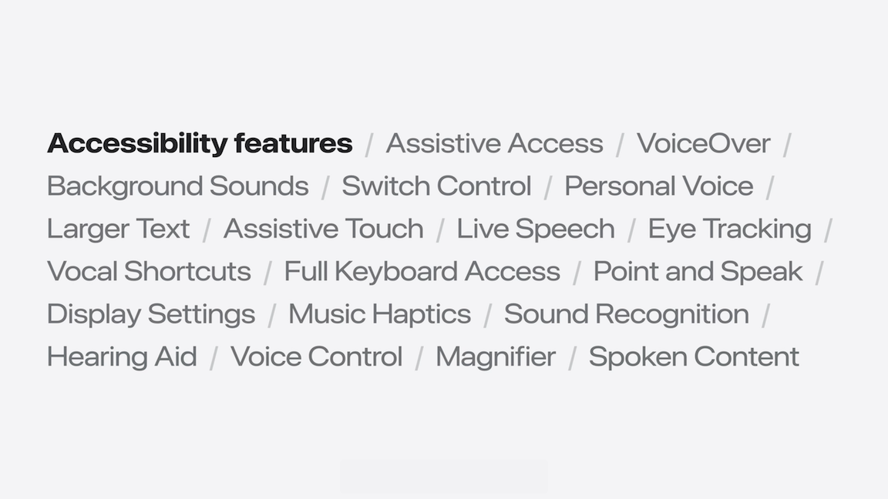
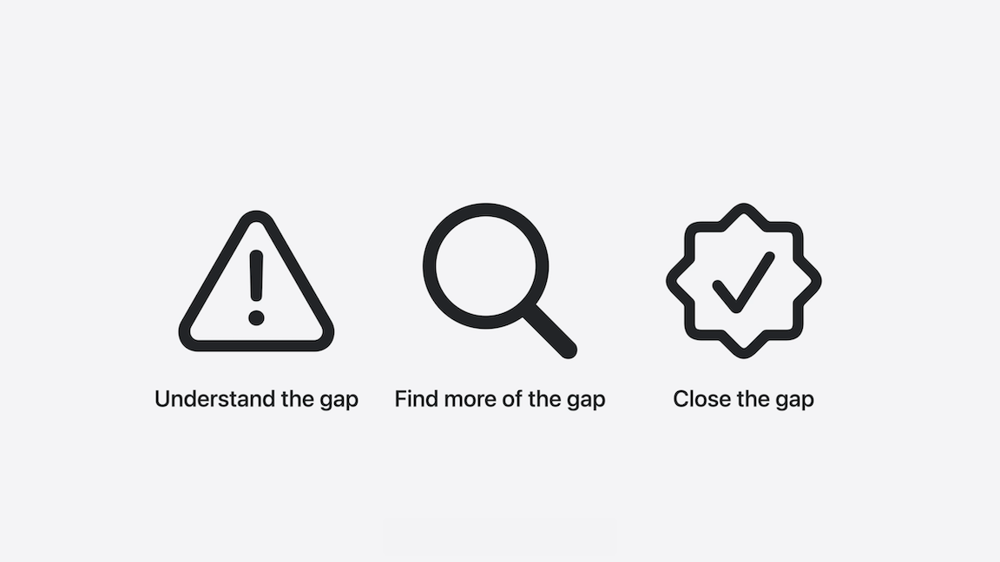

# [**Principles of inclusive app design**](https://developer.apple.com/videos/play/wwdc2025/316)

---

* Inclusion has many aspects
    * This talk focuses on disability

* Five categories of disability:
    * Vision
    * Hearing
    * Motor
    * Speech
    * Cognitive
* All of these senses are a spectrum
    * e.g. vision is not just blind or not blind - can have ranges and categories (like color blindness)

#### The inclusion gap

* A disability depends a lot on the environment, and many limitations only exist when there’s a gap between what a body can do and what society expects
* When there’s a difference between what a person can actually do and what society expects, that is where disability is really born
    * This gap is called the **inclusion gap**
* An example of the environment impacting ability is a building with two floors:
    * If there are stairs but no elevator, someone in a wheel chair would be unable to get to the second floor
    * If there were an elevator, there would not be a problem
    * If the was not an elevator, and the stairs were under construction, even someone who can walk with two legs would be impacted
* Curb cuts are an example of inclusive design benefitting everyone
    * They were invented to close the gap between wheelchair wheels and the step down to the crosswalk
    * In doing so, they also brought benefits to cyclists, parents pushing strollers, delivery people pushing dollies, etc.
* **"Nothing about us without us"**
    * Coined by disability rights activists who fought to have no policies created without the full participation of those who it affects
    * It's important to not make decisions that impact people with disabilities without them being a part of it
    * And as a developer, when you involve members of the disability community, you will gain new insights that will help you design your app to be more inclusive
* It’s also unlikely that you’ll always have someone with every disability working with you all the time. So here are four practical things you can do to make your app more inclusive, while you look for people with disabilities to collaborate with:
    * Support multiple senses
    * Provide customization
    * Adopt Accessibility API
    * Track inclusion debt

#### Support multiple senses

* Captions for videos are an example of inclusive design - they provide additional ways for people to access information that have hearing difficulties
    * Also has the side effect of making content accessible to people that can hear, but are in a place where they need to be quiet
* Making it possible to get information and input information in a variety of ways is the first step to closing the inclusion gap within your app
    * Imagine if a person is deaf, hard of hearing, or they’re in a quiet place like a library
        * Will they be able to experience what your app has to offer
        * Is there a visual way of getting the information
    * Imagine a person who is blind or someone goes into a situation where they can't look at their device
        * Is there an audible way to experience your app?
* New **Accessibility Reader** feature makes it possible to customize the reading experience of any content on screen
    * It supports a variety of reading styles that make it so you can always read in the way that works best for you
    * It has visual text, which is how society typically expects people to read
    * Can just press play and listen to the content without looking at the phone at all
    * Can also take advantage of both sight and hearing - words are being highlighted as they are read aloud
        * Great for people who have a cognitive disability and do better reading when they can visually follow along with what's being spoken
* Crouton is an example of an app with good inclusive design
    * Allows importing recipes from images and the camera for someone who can't type
    * Also allows importing from text, for someone who might not be able to see but can type
    * There is a hands free mode that allows you to go through a recipe without touching the device
        * Benefits people who have difficulty using their hands, and anyone who might have situations where it's convenient not to (sticky hands while making food)

#### Provide customization

* Important to make sure that people can personalize the UI and interactions that go with each of the senses
* For example, Accessibility Reader:
    * It has options for personalizing the visuals, the audio, and the read-along experience
    * When it comes to the visuals, for example, you can adjust the text size, change the colors, choose “high-legibility” characters in the San Francisco font, or choose a different font all together
* Carrot Weather is an example of a third-party app that makes it easy to view information in any way you want
    * Can customize all the different visuals and charts
        * Great for people who want to see every detail in a dense interface, as well as people who have a cognitive disability and need minimal information on the screen
    * Every layout makes it really easy to change the customization options

#### Adopt Accessibility API

* VoiceOver makes it so you can use a screen-based product without having to see the screen at all
    * Can support it by adding things like accessibility labels and actions through the Accessibility API
* The same API that makes VoiceOver possible also enables other features like Switch Control and Voice Control
    * Both make it possible to use touchscreen products without having to touch the screen at all
* Larger Text makes text up to three times larger, and with some layout adjustments, you can make your app look beautiful and highly legible
* Check out [developer.apple.com/accessibility](developer.apple.com/accessibility) to learn more about adopting the Accessibility APIs
* Since Accessibility Reader integrates Accessibility API, it also works with Switch Control
    * That means you can also use it without ever touching the screen
    * With Switch Control, you can assign actions to a variety of buttons that you can pair with iPhone
        * These physical buttons are called switches, and they can be configured in a variety of ways
            * One common configuration is to have one button go to the next item and another one to select; and on screen, a square outline moves from item to item
* Blackbox is an example of an app using Accessibility APIs
    * You solve challenges using the different sensors on your iPhone
    * The game supports the VoiceOver API so that players who are blind or have low vision can still navigate and solve challenges
        * Every puzzle has audio labels like: “Clue. 360 dashes in a circle”
        * In addition to rich audio and haptic design, the VoiceOver labels provide players with just enough hints to solve the puzzles even if they can’t see the screen

#### Track inclusion debt

* Even as you strive to make your app inclusive, you will most likely continue to notice the inclusion gap
* Inclusion is a journey, it's not a one-time thing
    * The most important thing is to be aware of the gap that exists in your app so that you can make plans for closing it and make conscious decisions as you design
* For example, there’s still room for Accessibility Reader to grow in formatting for enhanced readability and options for different reading styles
    * And since those things are known, it’s so much easier to plan and design what comes next
* Discovering the inclusion gap leads to creativity and innovation

* [Catch up on accessibility in SwiftUI](../2024/Catch%20up%20on%20accessibility%20in%20SwiftUI.md) Session from WWDC 2024
* [Evaluate your app for Accessibility Nutrition Labels](https://developer.apple.com/videos/play/wwdc2025/224) Session
