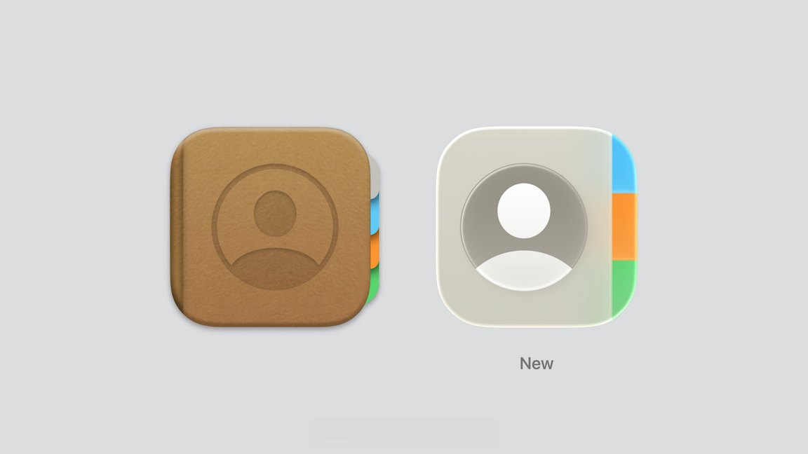
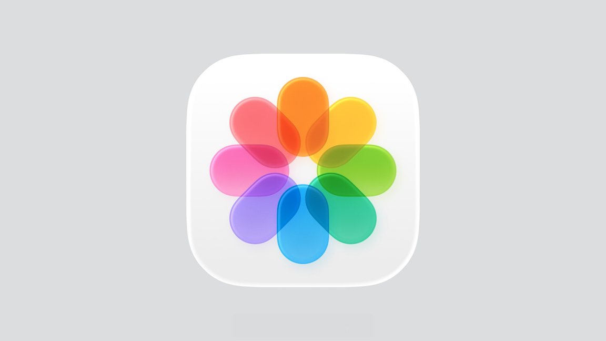

# [**Say hello to the new look of app icons**](https://developer.apple.com/videos/play/wwdc2025/220)

---

### **Overview**

* Drew inspiration from the layered icons on visionOS and researched real glass properties to then combine that into this liquid glass material specifically for app icons
* The material layers different elements like edge highlights, frostiness, and translucency to not only add a sense of depth, but it really makes it seem as if the icons are lit from within
* Based on gyro input, you can see light moving on the edge of the icon
* This new material treatment works on light and dark mode
    * Also introduced a range of new translucent appearance modes using liquid glass
        * A monochrome glass that comes in a light or dark version
        * Two different tint modes: a dark tint that adds color to the foreground, and a light tint where the color gets directly infused into the glass
* All appearance modes are available on iPhone, iPad and Mac
    * Even on Apple Watch, you see your light mode icons in the updated look
* You will also see the updated version of your icon reflected on the App Store product page

### **Design system**

* Previously, designs were made per device, so some icons had slightly different artworks depending on the platform
* With the new unified iconography language, it's now easier to design across our devices for both rounded rectangle and circle formats

#### Rounded rectangle shape

* Updated the design grid to a simpler and more evenly spaced structure
* The new grid also features a rounder corner radius, which makes the icons sit more concentric with our UI and even within our hardware
* Still using the 1024 pixel canvas, circular-shaped artworks have a designated frame in our grid and more breathing room
* On macOS:
    * So far, some macOS icons had secondary elements that could extend the compounded shape
        * Like in the previous Contacts icon, where the divider tabs extend past the shape of the book
    * In order to avoid irregular shapes, the canvas shape now acts as a mask to designs

* For existing Mac icons that are similarly shaped as our rounded rectangle, they automatically get masked or extended to fit into the template, while receiving the new material appearance

* When the icon has a very unique shape, the system removes any drop shadows and then auto-scales the artwork into our rounded rectangle canvas
    * However, it’s better to redraw your icon to fully utilize the icon canvas, like Photo Booth in the image below

#### Round shape

* Closely aligned the circular grid for watchOS with the updated rounded rectangle one
* The 1088 pixel canvas overshoots the rounded rectangle, which helps to create easier translations between platforms and to achieve visual consistency
* Updated templates based on new design system
    * Available for Figma, Sketch, Photoshop, and Illustrator

### **Drawing icons**

#### Layering

* At its simplest, icons have a background and one foreground layer
    * Even with a single foreground layer, the material effects already give the icon a lot of extra detail
    * For the Messages icon, the message bubble has translucency to it and a subtle shadow
* Can only have one background, but foregrounds can be expressed through multiple layers
    * stacking shapes on top of each other to creates a dimensional design

* Realistic 3D objects and perspectives like in the previous Chess icon can compete with the material qualities
* The redesigned icon uses a frontal view and a more flat appearance

* Dimensional shapes should be used consciously and it's helpful to design them in a way that complements the glass materiality
* New Preview icon works better with the material effects and the chosen perspective has a clear purpose as it emphasizes the focus area of the magnifying glass

#### Translucency

* Using translucency in blur with the new material can bring nuances, lightness, and add more depth to your design
* Translucency works on light and dark mode and translates to the transparent modes
    * With the background being glass, you can see the wallpaper through all of the translucent layers

#### Simplifying

* The old Photos app icon design was already using transparency to emphasize the overlapping petals and add some dimension to the whole shape
* By reducing the amount of overlapping, it now allows for the intersections and reflective edges of our material to shine
* Also updated the colors to feel more vibrant and reminiscent of tinted glass, while still preserving the color palette unique to the Photos icon
* The new design also uses the updated grid, which gives the icon more breathing room, and the chromatic shadows add even more depth to the glass material

Old Photos Icon | New Photos Icon
----------------|----------------
  | 

* As many dynamic effects are available in the material recipe, it's also recommend to pair back any built-in static effects in your source artwork
* You can see a range of the baked-in effects in the previous Home icon, like drop shadows or bevelled edges
    * Similar to Photos, the new artwork for Home is a simplified version of the previous design
    * Reduced the amount of layers, made the shapes rounder, and removed any additional material effects

* Ideally, sharp edges and thin lines should be avoided
    * Instead, using rounder corners makes it easier for the light to seamlessly travel on the edges of an element, like in the rounder gear wheels of the Settings icon
* While not all elements have to receive the material treatment, for the ones that do, it helps to use bolder line weights as it will preserve details at a smaller scale

#### Backgrounds

* With actual lighting effects being so fundamental to this new look, softer light-to-dark gradients harmonize best with the direction of light
* System Light and System Dark gradients available that should be used instead of pure white or black backgrounds
    * Designed to ensure contrast and they provide the ideal canvas for our material effects
* With the success of dark mode, it's recommended to lean more into colored backgrounds, so that there is a nicer distinction when switching between modes

Light-To-Dark Gradients | System Light and Dark Gradients
------------------------|--------------------------------
  | 
