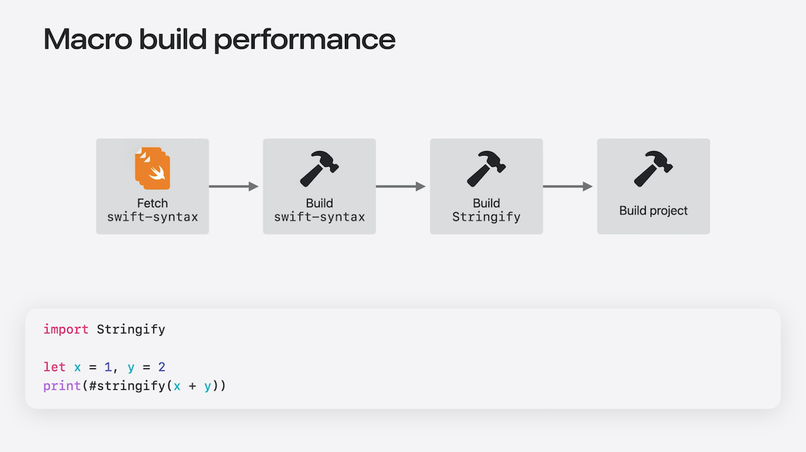
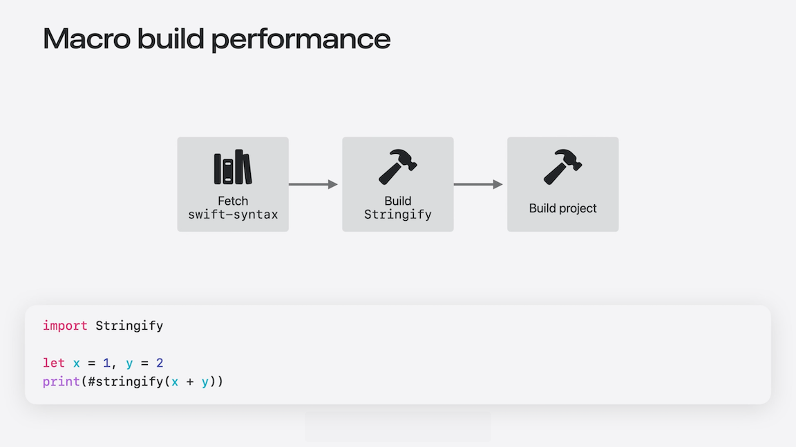
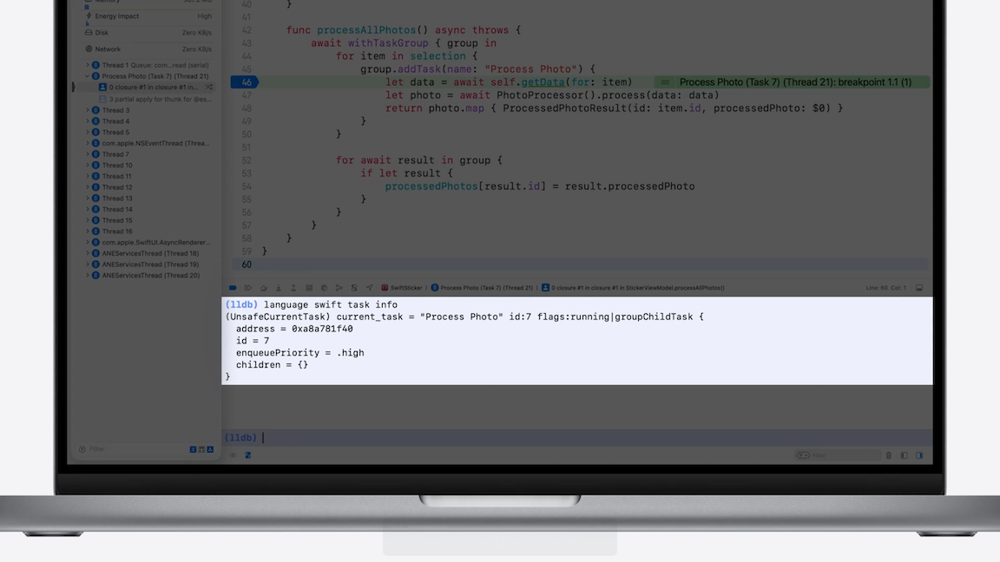
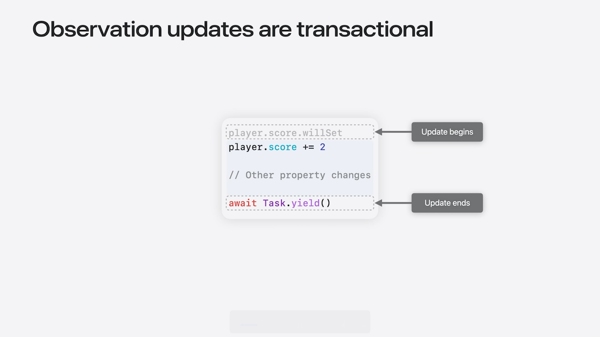
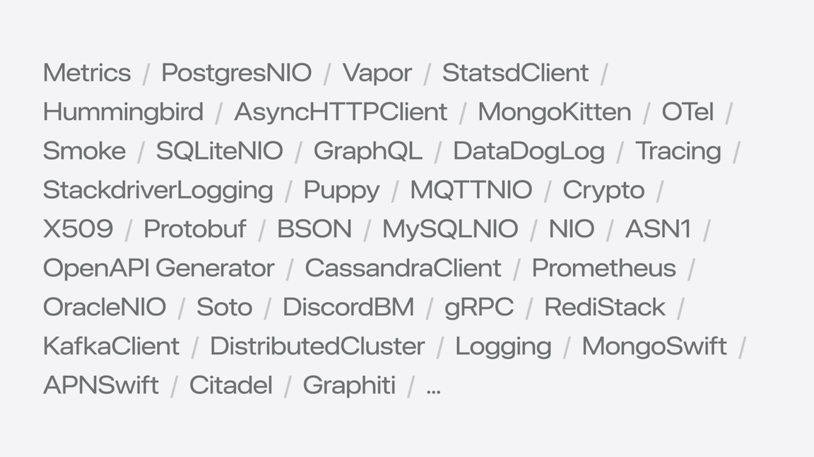
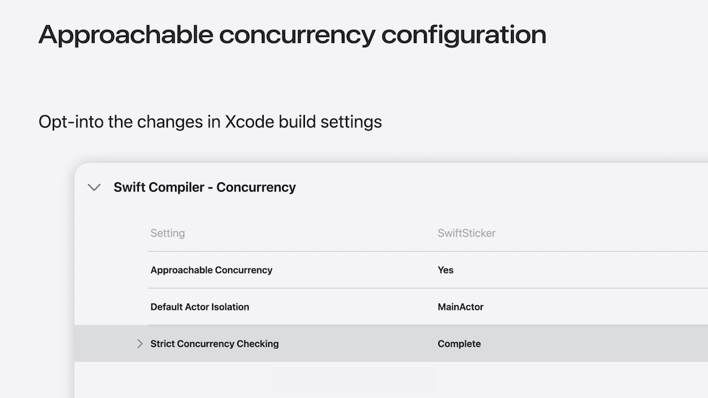

# [**What's new in Swift**](https://developer.apple.com/videos/play/wwdc2025/245)

---

* The swiftlang organization on GitHub has grown to over 50 projects, including:
    * The compiler
    * The Swift.org website
    * The foundation and testing libraries
    * Other key components underpinning the broader ecosystem
* Open sourced Xcode’s build system called Swift Build
    * Supports the build process for Apple’s operating systems
    * Active open source effort to adopt Swift Build as the Swift Package Manager’s low-level build system
        * This will unify the build engine between Xcode and the Swift.org toolchains
        * [The Next Chapter in Swift Build Technologies](https://www.swift.org/blog/the-next-chapter-in-swift-build-technologies/) blog post
* Swiftly
    * Originally developed by the open source community for streamlining Swift toolchain management on Linux
    * Now supports macOS, and the 1.0 release is available on swift.org
    * Use to install the latest Swift toolchain
        * `swiftly install 6.1.3`
        * Can install nightly snapshot from a GitHub branch with `swiftly install main-snapshot`
    * In Xcode, toolchains installed by swiftly are available in the `Xcode -> Toolchains` menu
    * In VSCode, you can select toolchains installed by swiftly from the Toolchain command
    * [Introducing swiftly 1.0](https://www.swift.org/blog/introducing-swiftly_10/) blog post

### **Development Workflow**

#### Writing code

* Using VSCode
    * The Swift extension in the VS Code marketplace is now officially verified and distributed by Swift.org
    * Gained a number of new features over the past year
        * Background indexing
        * Context-sensitive code completion
        * Built-in debugging
            * LLDB support is now included automatically when you install the Swift extension
        * The latest version of the extension also includes a new project panel
            * Makes it easy to find your package’s dependencies, targets, and tasks
        * VS Code Swift extension also has a new way to view your project’s documentation
            * You can bring up a DocC preview side-by-side with your code, and it will update live as you type

#### Building

* Swift 6.2 significantly improves clean build times for projects that use macro-based APIs
    * Previously, in order to build your projects, Swift PM first had to fetch the sources of swift-syntax
    * The latest releases of Swift PM and Xcode support pre-built swift-syntax dependencies
        * Completely eliminates an expensive build step, and for some projects, it reduces clean build times by minutes
    * If you own a package that provides macros, your clients will be able to take advantage of this optimization as long as the package depends on a tagged release of swift-syntax

Previous Macro Build Process | New Macro Build Process |
-----------------------------|-------------------------|
  |  |

* Diagnostics
    * Expansion of the documentation available for many categories of diagnostics
        * Extended explanations of common warnings and errors help you understand the problem and give you concrete solutions
        * You can access the documentation from your IDE and online at swift.org
    * Swift 6.2 gives you the flexibility to decide which warnings to treat as errors
        * You could decide to treat all warnings as errors by default, but make an exception for deprecated declarations
        * If you’re only interested in preventing some categories of warnings, you can just promote those warnings to errors instead

```swift
// swift-tools-version: 6.2

import PackageDescription

let package = Package (
    name: "PackageExample",
    // ...
    targets: [
        .target(
            name: "PackageExample", 
            swiftSettings: [
                .treatWarning ("StrictMemorySafety", as: .error),
            ]
        )
    ]
)
```

#### Debugging

* Improved the experience of debugging asynchronous code
    * As you step through code running in a Swift task, LLDB now follows execution into asynchronous functions, even if that requires switching between threads
    * The debugger's understanding of Swift’s task-centric model allows it to show you which task is executing
        * You can even name a task to make it easier to identify
        * Task names will also appear in Instruments profiles that are recorded with the Swift Concurrency template
    * You can also use new commands like swift task info to get more information about the currently executing task



* Explicitly built modules
    * Build system integrated discovery and preparation of module dependencies
    * Increases parallelization and module reuse
    * The debugger is able to reuse the modules from the build
        * That means that the first time you run p or po in the debugger, the command will evaluate much faster because type information is immediately available
    * Enabled by default in Xcode 26
    * [Demystify explicitly built modules](../2024/Demystify%20explicitly%20built%20modules.md) Session from WWDC 2024

### **Libraries**

#### Subprocess

* To improve the experience of using Swift for scripting tasks, the Foundation Workgroup introduced a new package with APIs for launching a subprocess
    * Start by adding and importing the new `Subprocess` package
    * Launch a subprocess by calling the run function and awaiting the result
    * If you provide a string with the process name, the run method will look up the executable based on the $PATH environment variable

```swift
import Subprocess

let result = try await run(
  .name("pwd")
)
```

* In most cases, you’ll launch a subprocess using a FilePath to specify the full path to an executable

```swift
import Subprocess

let swiftPath = FilePath("/usr/bin/swift")
let result = try await run(
  .path(swiftPath),
  arguments: ["--version"]
)

let swiftVersion = result.standardOutput
```

* The subprocess library has many more capabilities that give you fine grained control over process execution, platform specific configuration options, and more
    * Explore the full API surface in the swift-subprocess repository at `swiftlang/swift-subprocess`
    * The package is in version 0.1, and feedback from your adoption will inform the API that is released in version 1.0

#### Foundation

* Updates to responding to notifications from UIKit, as the previous implementations had pitfalls:
    * You have to be careful to register for a notification name that the object supports posting. If you make a mistake, your notification callback will never run
    * Information about the notification is stored in an untyped dictionary, which requires you to manually subscript using the right key and dynamic cast the result to the correct type
    * Even when the notification is guaranteed to be posted on the main thread, you’d still get concurrency errors when accessing main actor APIs

```swift
// Previous Notification Response Implementation
import UIKit

@MainActor 
class KeyboardObserver {
 func registerObserver(screen: UIScreen) {
    let center = NotificationCenter.default
    let token = center.addObserver(
      forName: UIResponder.keyboardWillShowNotification,
      object: screen,
      queue: .main
    ) { notification in
      guard let userInfo = notification.userInfo else { return }
      let startFrame = userInfo[UIResponder.keyboardFrameBeginUserInfoKey] as? CGRect
      let endFrame = userInfo[UIResponder.keyboardFrameEndUserInfoKey] as? CGRect

      guard let startFrame, let endFrame else { return }

      self.keyboardWillShow(startFrame: startFrame, endFrame: endFrame)
    }
  }
  
  func keyboardWillShow(startFrame: CGRect, endFrame: CGRect) {}
}
```

* With the updated Notification response implementation:
    * Notification names and payloads now support concrete types
    * Eliminate boilerplate when working with the notification payload
    * You can freely access main actor APIs if the notification is posted on the main actor

```swift
// Updated Notification Response Implementation
import UIKit

@MainActor
class KeyboardObserver {
  func registerObserver(screen: UIScreen) {
    let center = NotificationCenter.default
    let token = center.addObserver(
      of: screen,
      for: .keyboardWillShow
    ) { keyboardState in
      let startFrame = keyboardState.startFrame
      let endFrame = keyboardState.endFrame

      self.keyboardWillShow(startFrame: startFrame, endFrame: endFrame) 
    }
  }
  
  func keyboardWillShow(startFrame: CGRect, endFrame: CGRect) {}
}
```

* A conformance to `MainActorMessage` guarantees that the notification is always posted synchronously on the main thread
* A conformance to `AsyncMessage` means the notification is posted asynchronously on an arbitrary thread
* Concrete notification types are available in the SDK for the notifications posted by frameworks like UIKit and Foundation
    * You can also add concrete notification types for your own notifications

```swift
extension UIResponder { 
  public struct KeyboardWillShowMessage: NotificationCenter.MainActorMessage
}

extension HTTPCookieStorage {
  public struct CookiesChangedMessage: NotificationCenter.AsyncMessage
}
```

#### Observation

* The Observation Library provides general-purpose APIs for automatically tracking state changes in an object graph
* You can opt a class into observation tracking using the `@Observable` macro
* Swift 6.2 introduces a way to stream state changes with an `AsyncSequence` from an observable type
    * Start by creating an instance of the new Observations type with a closure
        * In the closure, you compute the value that you want to observe changes to
        * You’ll get an updated value based on the observable properties that are used in the closure
    * Updates happen transactionally
        * The tracking for an update begins when any of the observable properties in the closure have their willSet called
        * Ends at the next await where the code suspends
        * The updated value will include all synchronous changes to other properties between these two points of the code
        * Ensures that synchronous updates to multiple properties don’t lead to observation updates with the object in an inconsistent state
        * In the code below, when the score and the item are synchronously updated, you only get one updated value that contains both changes
    * The observations type conforms to `AsyncSequence`, so you can iterate over updated values using a for-await loop.

```swift
import Observation

enum Item {
  case none
  case banana
  case star
}

@Observable
class Player {
  let name: String
  var score: Int = 0
  var item: Item = .none

  init(name: String) {
    self.name = name
  }
}

let player = Player(name: "Holly")
let values = Observations {
  let score = "\(player.score) points"
  let item =
    switch player.item {
    case .none: "no item"
    case .banana: "a banana"
    case .star: "a star"
    }
  return "\(score) and \(item)"
}

player.score += 2
player.item = .banana

for await value in values { print(value) }
```



#### Testing

* Swift Testing is a cross platform library that provides macros for describing and organizing your tests
    * @Test attribute for declaring a test function
    * You use the expect and require macros to validate your assumptions, and Swift Testing gives you actionable information when an expectation or requirement fails

* Swift 6.2 introduces custom attachments to help diagnose test failures
    * Add an attachment to a test by calling the `Attachment.record` method
    * Can attach library types like Data and String
    * Can implement attachment support for your own types by conforming to the `Attachable` protocol

```swift
import Testing
import Foundation
import EvolutionMetadataModel

@Test
func validateProposalID() async throws {
  let (data, _) = try await URLSession.shared.data(from: evolutionJSONMetadataURL) 
  Attachment.record(data, named: "evolution-metadata.json")

  let jsonDecoder = JSONDecoder()
  let metadata = try jsonDecoder.decode(EvolutionMetadata.self, from: data)
  for proposal in metadata.proposals {
    #expect(proposal.id.starts(with: "SE"))
  }
}
```

* Swift 6.2 supports exit tests, allowing testing of code that you expect to terminate under certain conditions
    * If you write a function that validates assumptions about input parameters through preconditions, you can write a test case that will succeed when the precondition fails
    * You write an exit test by passing the p`rocessExitsWith` argument to `.expect` or `.require`
    * Swift Testing will launch a new process to run your test and you can validate that the process exits successfully with a specific exit code or signal or with any failure status

```swift
extension Proposal {
  public var number: Int {
    let components = id.split(separator: "-")
    precondition(
      components.count == 2 && components[1].allSatisfy(\.isNumber),
      "Invalid proposal ID format \(id); expected SE-<Number>"
    )

    return Int(components[1])!
  }
}


import Testing
import EvolutionMetadataModel

@Test
func invalidProposalPrefix() async throws {
  await #expect(processExitsWith: .failure) {
    let proposal = Proposal(id: "SE-NNNN")
    _ = proposal.number 
  }
}
```

### **Swift throughout the stack**

#### Embedded Swift

* Brings Swift's ergonomics and safety to:
    * Embedded devices
    * Kernel-level code
    * Low-level library code
* It’s a compilation mode that supports core Swift features like value and reference types, closures, optionals, error handling, generics, and more
* [Go small with Embedded Swift](https://developer.apple.com/videos/play/wwdc2024/10197/) Session from WWDC 2024
* Expanded language support
    * Strings and interpolation
    * Class constrained `any` types
* New standard library types for efficiently working with regions of memory
    * `InlineArray`
    * `Span`
* View the repo on GitHub in the `swiftlang/swift-embedded-examples` repository

#### Security

* New opt-in feature in Swift 6.2 called `-strict-memory-safety`
    * This mode requires that all uses of unsafe APIs be acknowledged explicitly in source code
    * The annotations the mode requires help you identify which parts of your code need extra attention from a security perspective
* Swift 6.2 also supports new annotations for C and C++ headers that cause APIs to be imported into Swift using safe, ergonomic types like `Span`
    * [Safely mix C, C++, and Swift](https://developer.apple.com/videos/play/wwdc2025/311) Session

#### Server

* Passwords rewrite
    * Java service rewritten in Swift
    * Throughput increased 40%
    * Hardware requirements down 50%
    * [Swift at Apple: Migrating the Password Monitoring service from Java](https://www.swift.org/blog/swift-at-apple-migrating-the-password-monitoring-service-from-java/) blog post
* Swift has a growing package ecosystem that covers a wide range of essential use cases
    * Swift has a growing package ecosystem that covers a wide range of essential use cases
    * There are libraries for networking, database drivers, observability, message streaming, and more
    * One notable update this year was the release of gRPC Swift version 2
    * [Introducing gRPC Swift 2](https://www.swift.org/blog/grpc-swift-2/) blog post



* Last year Apple announced a new open source project called swift-java, which aims to make the languages interoperate seamlessly
    * You can create bindings that allow Swift code to call Java code and vice versa
    * These bindings are designed to wrap the native representations of values from each language without excessive overhead
    * Java bindings for Swift code can leverage Java’s next-generation foreign interface technology, or fall back to JNI if necessary
    * [Explore Swift and Java interoperability](https://developer.apple.com/videos/play/wwdc2025/307) Session

* Containerization library
    * Open-source library for container-based tools
    * Implemented in Swift
    * [Meet Containerization](https://developer.apple.com/videos/play/wwdc2025/346) Session
    * Repository on GitHub at `apple/containerization`

#### Platforms

* Swift 6.2 adds official support for FreeBSD
* Swift is gaining support for WebAssembly (Wasm)
    * Developers can build both client and server applications for Wasm and then deploy them to the browser or other runtimes

### **Language Evolution**

#### Performance

* `InlineArray`
    * A new fixed-size array type with inline storage for its elements
    * The size is part of the type: `InlineArray<3, Int>`
    * Instead of storing a reference to a buffer containing the elements, the elements of an InlineArray are stored directly
        * This means the elements can be stored on the stack, or directly within other types without additional heap allocation
    * InlineArrays can store copyable and non-copyable types
    * When storing copyable types, the InlineArray itself can be copied, and the element values are copied eagerly
    * Writing the size as part of the type is achieved using a new generics feature to allow integers as type parameters
        * `public struct InlineArray<let count: Int, Element: ~Copyable>: ~Copyable`
    * The size of an `InlineArray` can be inferred: `let array: InlineArray = [1, 2. 3]`
    * Knowing the size of an InlineArray at compile time also enables more optimizations, like eliminating bounds checking when the index is less than the size

* `Span<Element>`
    * An abstraction that provides fast, direct access to contiguous memory without compromising memory safety
    * The standard library provides a span property for all container types that have contiguous storage for their elements, including `Array`, `ArraySlice`, `InlineArray`, and more
    * Span maintains memory safety by ensuring that the contiguous memory remains valid while you’re using the Span
        * These guarantees define away the memory safety problems inherent to pointers, including use-after-free and overlapping modification
    * Checked at compile time with no runtime overhead
    * Modifying the original container will prevent access to the span afterward
        * After the modification, you can’t access the span variable again
    * A span also can’t outlive the original container
        * This is called a lifetime dependency, and it prevents the underlying storage from being destroyed while it can still be accessed through the span

* [Improve memory usage and performance with Swift](https://developer.apple.com/videos/play/wwdc2025/312) Session
* [Explore Swift performance](../2024/Explore%20Swift%20performance.md) Session from WWDC 2024

#### Concurrency

* Data-race safety in Swift 6 prevents mistakes sharing memory between multiple tasks at compile time
* A class with mutable state, like the PhotoProcessor class below, is safe as long as you don’t access it concurrently
    * If you try to call `extractSticker`, though, you get an error: `Sending 'self.photoProcessor' risks causing data races`
    * This is because there are several places in the language that offload work to the background implicitly

```swift
class PhotoProcessor {
  func extractSticker(data: Data, with id: String?) async -> Sticker? {     }
}

@MainActor
final class StickerModel {
  let photoProcessor = PhotoProcessor()

  func extractSticker(_ item: PhotosPickerItem) async throws -> Sticker? {
    guard let data = try await item.loadTransferable(type: Data.self) else {
      return nil
    }

    return await photoProcessor.extractSticker(data: data, with: item.itemIdentifier)
  }
}
```

* Swift 6.2 changes this philosophy to stay single threaded by default until you choose to introduce concurrency
    * Instead of eagerly offloading async functions that aren't tied to a specific actor, the function will continue to run on the actor it was called from
    * This eliminates data races because the values passed into the async function are never sent outside the actor
    * Async functions can still offload work in their implementation, but clients don’t have to worry about their mutable state

* Easier to implement conformances on main actor types
    * Swift 6.2 allows `@MainActor` conformance
    * A conformance that needs main actor state is called an *isolated* conformance
    * Safe because the compiler ensures a main actor conformance is only used on the main actor
    * In the code below, if `ImageExporter` is changed from `@MainActor` to `nonisolated`, then it will throw a compiler error, as `StickerModel` is Main actor-isolated

```swift
// Isolated conformances

protocol Exportable {
  func export()
}


extension StickerModel: @MainActor Exportable {
  func export() {
    photoProcessor.exportAsPNG()
  }
}

@MainActor
struct ImageExporter {
  var items: [any Exportable]

  mutating func add(_ item: StickerModel) {
    items.append(item)
  }

  func exportAll() {
    for item in items {
      item.export()
    }
  }
}
```

* Global and static variables are prone to data races because they allow mutable state to be accessed from anywhere
    * The most common way to protect global state is with the main actor
    * Common to annotate an entire class with the main actor to protect all of its mutable state

```swift
// No isolation
final class StickerLibrary {
  static let shared: StickerLibrary = .init() // error: Static property 'shared' is not concurrency-safe because non-'Sendable' type 'StickerLibrary' may have shared mutable state
}

// isolating the shared property
final class StickerLibrary {
  @MainActor
  static let shared: StickerLibrary = .init()
}

// isolating the entire class
@MainActor
final class StickerLibrary {
  static let shared: StickerLibrary = .init()
}

@MainActor
final class StickerModel {
  let photoProcessor: PhotoProcessor

  var selection: [PhotosPickerItem]
}

extension StickerModel: @MainActor Exportable {
  func export() {
    photoProcessor.exportAsPNG()
  }
}
```

* Rather than typing `@MainActor` everywhere in the code, a new mode is introduced
    * Eliminates data-race safety errors about unsafe global and static variables, calls to other main actor functions like ones from the SDK, and more
        * Because the main actor protects all mutable state by default
    * Reduces concurrency annotations in code that’s mostly single-threaded
    * The mode is opt-in
    * Recommended for apps, scripts, and other executable targets

```swift
// Mode to infer main actor by default

final class StickerLibrary {
  static let shared: StickerLibrary = .init()
}

final class StickerModel {
  let photoProcessor: PhotoProcessor

  var selection: [PhotosPickerItem]
}

extension StickerModel: Exportable {
  func export() {
    photoProcessor.exportAsPNG()
  }
}
```

* Offloading work to the background is still important for performance
    * Use the new `@concurrent` attribute
    * Ensures that a function always runs on the concurrent thread pool, freeing up the actor to run other tasks at the same time

```swift
// Explicitly offloading async work

class PhotoProcessor {
  var cachedStickers: [String: Sticker]

  func extractSticker(data: Data, with id: String) async -> Sticker {
      if let sticker = cachedStickers[id] {
        return sticker
      }

      let sticker = await Self.extractSubject(from: data)
      cachedStickers[id] = sticker
      return sticker
  }

  @concurrent
  static func extractSubject(from data: Data) async -> Sticker {}
}
```

* Approachable concurrency
    * Start on the main actor
    * Write asynchronous code
    * Introduce parallelism to improve performance
    * [Code along: Elevate an app with Swift concurrency](https://developer.apple.com/videos/play/wwdc2025/270) Session
    * [Embracing Swift Concurrency](./Embracing%20Swift%20Concurrency.md) Session

* Some of these language changes are opt-in because they require changes in your project to adopt
    * You can find and enable all of the approachable concurrency language changes under the `Swift Compiler - Concurrency` section of Xcode build settings
    * Can also enable these features in a Swift package manifest file using the SwiftSettings API



* Swift 6.2 includes migration tooling to help you make the necessary code changes automatically
    * You can learn more about migration tooling at [swift.org/migration](https://swift.org/migration)
