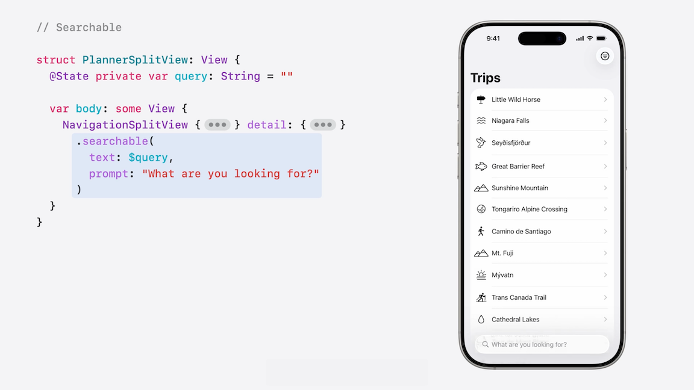
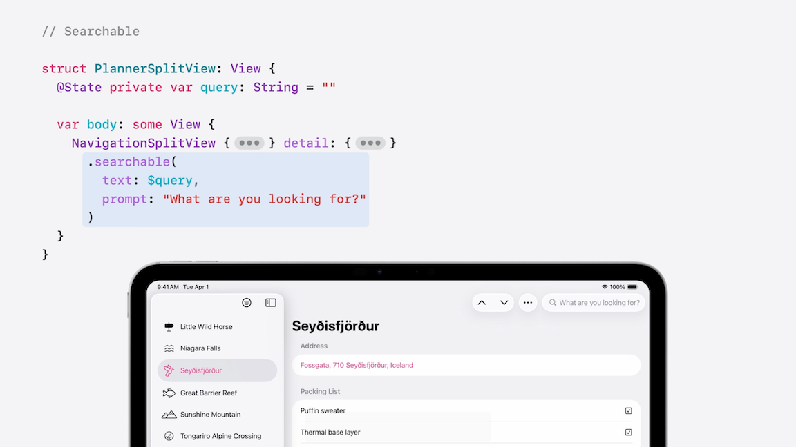
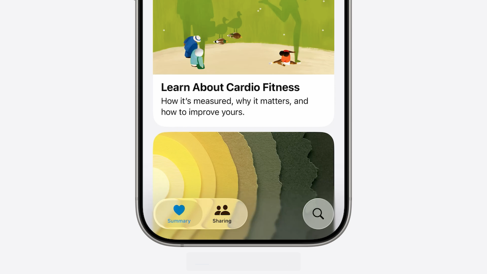
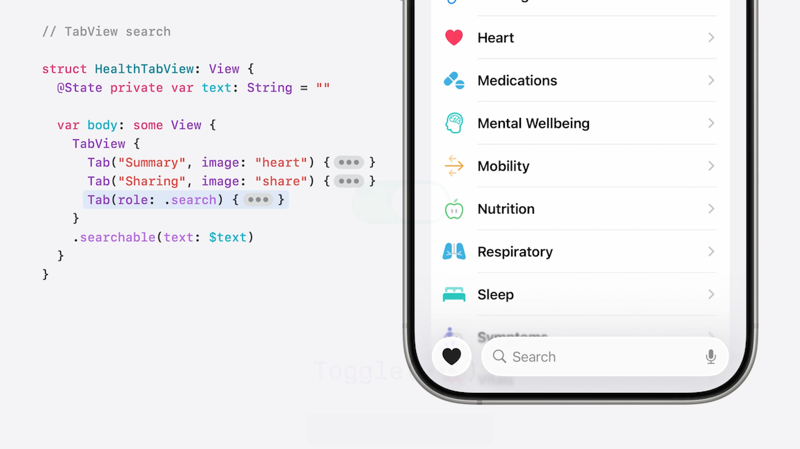
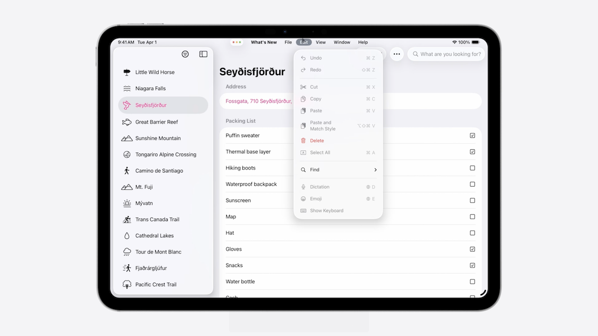
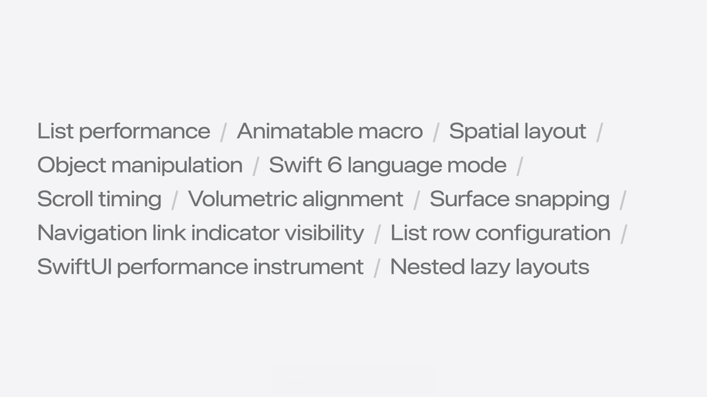
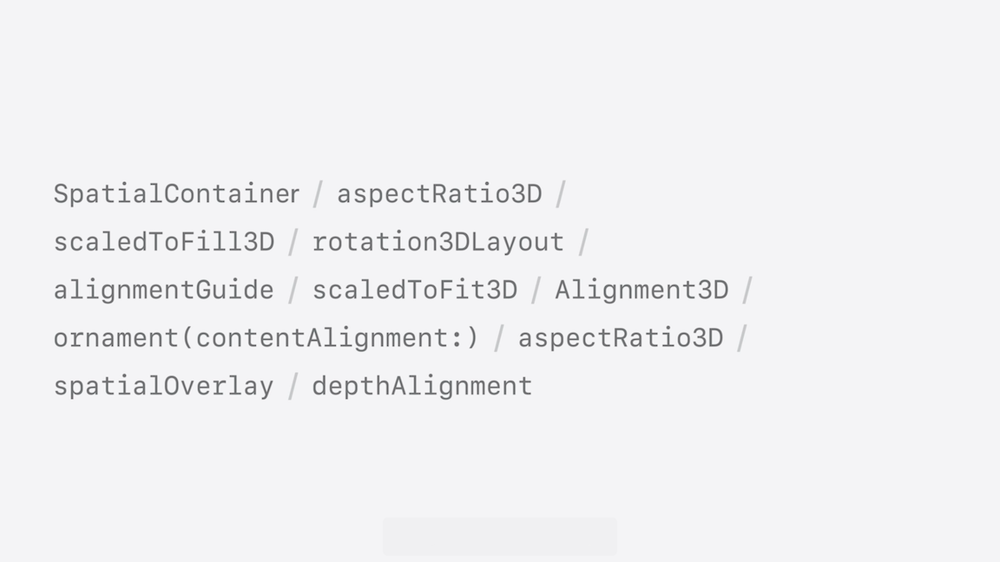
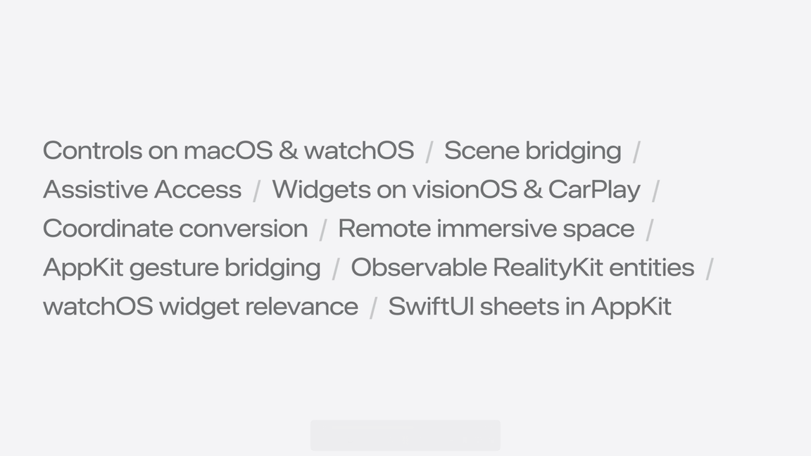

# [**What's new in SwiftUI**](https://developer.apple.com/videos/play/wwdc2025/256)

---

### **Make the new design shine**

* The structure of an app hasn't changed, but navigation containers have been updated for the new design
    * The app sidebar has a glassy appearance that reflects the content around it
    * Tab bars have also been updated
        * On iPhone, they have a new, more compact appearance
    * Most toolbar items now appear in Liquid Glass
        * During navigation transitions, these items can even morph

* New toolbar spacer API adjusts the sections of toolbar items

```swift
import SwiftUI

struct TripDetailView: View {
    var body: some View {
        NavigationStack {
            TripList()
                .toolbar {
                    ToolbarItemGroup(placement: .primaryAction) {
                        UpButton()
                        DownButton()
                    }

                    ToolbarSpacer(.fixed, placement: .primaryAction)

                    ToolbarItem(placement: .primaryAction) {
                        SettingsButton()
                    }
                }
        }
    }
}
```

* To make toolbar items more prominent, Liquid Glass in toolbars supports tinting
    * `.buttonStyle(.borderedProminent)` and `.tint(.pink)`

```swift
import SwiftUI

struct InspectorView: View {
    var body: some View {
        NavigationStack {
            InspectorMap()
                .toolbar {
                    ToolbarItem(placement: .primaryAction) {
                        SaveLocationButton()
                            .buttonStyle(.borderedProminent)
                            .tint(.pink)
                    }
                }
        }
    }
}
```

* When scrolling down in an app, the toolbar now applies a blur effect to the bar content on the edge that’s being scrolled
    * This scroll edge effect ensures the bar content remains legible regardless of whatever is underneath

* `.searchable(...)` is now bottom aligned on iPhone
    * When searchable is placed outside of a NavigationSplitView, iPad places it in the top trailing corner


iPhone search | iPad Search |
--------------|-------------|
  |  |

* For tab-based apps where search is a destination, the Search tab now appears separated from the rest of the tabs in the tab bar and morphs into the search field
    * Set your tab as having a search role to get the updated appearance

Tab bar inactive | Tab bar active |
--------------|-------------|
  |  |


* Controls have also changed throughout the system
    * Sliders, segmented controls, and sliders all have updated designs
* There are APIs for custom views
    * `glassEffect()` reflect the content around it

```swift
import SwiftUI

struct ToTopButton: View {
    var body: some View {
        Button("To Top", systemImage: "chevron.up") {
            scrollToTop()
        }
        .padding()
        .glassEffect()
    }

    func scrollToTop() {
        // Scroll to top of view
    }
}
```

* For adoption best practices and custom elements, watch the [Build a SwiftUI app with the new design](./Build%20a%20SwiftUI%20app%20with%20the%20new%20design.md) Session

* On iPadOS, When you swipe down from the top of the screen, a menubar is displayed
    * Provides faster access to common actions
    * The commands API used to construct the menu bar on macOS now creates the same result on iPad

```swift
import SwiftUI

@main
struct TravelPhotographyApp: App {
    var body: some Scene {
        WindowGroup {
            RootView()
        }
        .commands {
            TextEditingCommands()
        }
    }
}
```



* For apps that use split view navigation, the system automatically shows and hides columns based on the available space.
    * Migrate away from fixed screen APIs like `UIRequiresFullscreen` (now deprecated)
    * [Elevate the design of your iPad app](./Elevate%20the%20design%20of%20your%20iPad%20app.md) Session

* On macOS, for resizes that are caused by changes in the content view size, SwiftUI now synchronizes the animation between that content and the window
    * Adopt the new `windowResizeAnchor(...)` API to tailor where the animation originates from

```swift
import SwiftUI

struct SettingsTabView: View {
    @State private var selection: SectionTab = .general
    var body: some View {
        TabView(selection: $selection.animation()) {
            Tab("General", systemImage: "gear", value: .general) {
                Text("General")
            }
            Tab("Sections", systemImage: "list.bullet", value: .sections) {
                Text("Sections")
            }
        }
        .windowResizeAnchor(.top)
    }
}
```

### **Framework foundations**



* SwiftUI performance updates
    * Lists
        * On macOS, large lists load up to 6x faster, and update up to 16x faster
        * Improvements on all platforms
    * Scrolling
        * Improved scheduling of user interface updates on iOS and macOS
            * Improves responsiveness and does more to prepare for upcoming frames
            * Reduces the chance of dropped frames while scrolling at high frame rates
        * Contained views (e.g. LazyVStack) inside of a ScrollView delay loading until they are about ot appear
            * Nested ScrollViews with lazy stacks get this same behavior (e.g. horizontal ScrollView inside a vertical one)
    * Profiling and debugging
        * New SwiftUI Performance Instrument has a variety of lanes to inspect different performance problem areas
            * Long view body updates
            * Platform view updates
        * [Optimize SwiftUI performance with instruments](./Optimize%20SwiftUI%20performance%20with%20Instruments.md) Sessions

* Concurrency
    * [Embracing Swift concurrency](./Embracing%20Swift%20Concurrency.md) Session
    * [Explore concurrency in SwiftUI](./Explore%20concurrency%20in%20SwiftUI.md) Session

* `@Animatable` macro
    * SwiftUI synthesizes animation code, removing need for boilerplate `AnimatableData` code
    * Use `@AnimatableIgnored` to exclude properties that you don't want animated

```swift
// Old Animatable data code
struct LoadingArc: Shape {
    var center: CGPoint
    var radius: CGFloat
    var startAngle: Angle
    var endAngle: Angle
    var drawPathClockwise: Bool
    
    typealias AnimatableData = AnimatablePair<CGPoint.AnimatableData,
        AnimatablePair<CGFloat, AnimatablePair<Angle.AnimatableData,
        Angle.AnimatableData>>>

    var animatableData: AnimatableData {
        get {
            AnimatablePair(center.animatableData, AnimatablePair(radius, AnimatablePair(startAngle.animatableData, endAngle.animatableData)))
        }
        set { ... }
    }
}

// New @Animatable code
@Animatable
struct LoadingArc: Shape {
    var center: CGPoint
    var radius: CGFloat
    var startAngle: Angle
    var endAngle: Angle
    @AnimatableIgnored var drawPathClockwise: Bool

    func path(in rect: CGRect) -> Path {
        // Creates a `Path` arc using properties
        return Path()
    }
}
```

* SwiftUI has new depth based variants of familiar modifiers
    * Makes it possible to do more volumetric layout directly in SwiftUI
    * Used within the `.spatialOverlay` modifier
    * [Meet SwiftUI spatial layout](https://developer.apple.com/videos/play/wwdc2025/273) Session

```swift
import RealityKit
import SwiftUI

struct Map: View {
    @Binding var timeAlignment: Alignment3D

    var body: some View {
        Model3D(named: "Map")
            .spatialOverlay(
                alignment: timeAlignment
            ) {
                Sun()
            }
    }
}

struct Sun: View {
    var body: some View {
        Model3D(named: "Sun")
    }
}
```



* New `.manipulable()` modifier allows people to interact with the objects in an app
* Use the new scene snapping APIs to read information out of the environment


```swift
import ARKit
import RealityKit
import SwiftUI

struct BackpackWaterBottle: View {
    @Environment(\.surfaceSnappingInfo) var snappingInfo: SurfaceSnappingInfo

    var body: some View {
        VStackLayout().depthAlignment(.center) {
            waterBottleView
                .manipulable()

            Pedestal()
                .opacity(
                    snappingInfo.classification == .table ? 1.0 : 0.0)
        }
    }

    var waterBottleView: some View {
        Model3D(named: "waterBottle")
    }
}
```

* More SwiftUI enhancements to windows, volumes, and scenes on visionOS
    * Window restoration
    * New scene types
    * [Set the scene with SwiftUI in visionOS](https://developer.apple.com/videos/play/wwdc2025/290) Session
    * [What's new in visionOS](https://developer.apple.com/videos/play/wwdc2025/317) Session

### **SwiftUI across the system**



* Scene bridging
    * Scenes are the root containers for views in your app, representing discrete parts of your interface
    * You can get access to scenes by declaring them in your app’s body (e.g. WindowGroup)
    * Can now request scenes form your UIKit/AppKit lifecycle apps to interoperate with SwiftUI scenes
        * Can use to open SwiftUI only scene types
        * Use SwiftUI exclusive features right from UIKit/AppKit (e.g. `MenuBarExtra` or `ImmersiveSpace`)
    * Also works with modifiers, like `.windowStyle` and `immersiveEnvironmentBehavior`

* Remote Immersive Space
    * Mac app can render stereo content on Apple Vision Pro using a new scene
    * RemoteImmersiveSpace with CompositorServices
    * Mac app can use hover effects and input events
    * [What’s new in Metal rendering for immersive apps](https://developer.apple.com/videos/play/wwdc2025/294) Session

* Assistive Access
    * A special mode for users with cognitive disabilities
    * App can show UI when someone as their iPhone in this mode by adopting the new `AssistiveAccess` scene type
    * [Customize your app for Assistive Access](https://developer.apple.com/videos/play/wwdc2025/238) Session

```swift
import SwiftUI

@main
struct PhotoWalk: App {
  var body: some Scene {
    WindowGroup {
      ContentView()
    }

    AssistiveAccess {
      AssistiveAccessContentView()
    }
  }
}
```

* SwiftUI enhancements to working with AppKit
    * Scene bridging
    * `NSWindow` sheet with `View` in it
    * AppKit Gestures bridged to SwiftUI with `NSGestureRecognizerRepresentable`
    * Use `NSHostingView` in Interface Builder

* SwiftUI enhancements with RealityKit
    * RealityKit Entities now conform to Observable
    * Improved coordinate conversion API
    * Enhanced support for presentations right from RealityKit
        * Present SwiftUI popover directly from a RealityKit entity (code below)
    * Attachment component
    * Synchronizing animations
    * Component bindings
    * Sizing behaviors
    * [Better Together: SwiftUI & RealityKit](https://developer.apple.com/videos/play/wwdc2025/274) Session

```swift
// Presentation Component
import RealityKit
import SwiftUI

struct PopoverComponentView: View {
    @State private var popoverPresented: Bool = false
    var body: some View {
        RealityView { c in
            let mapEntity = Entity()

            let popover = Entity()
            mapEntity.addChild(popover)
            popover.components[PresentationComponent.self] = PresentationComponent(
                isPresented: $popoverPresented,
                configuration: .popover(arrowEdge: .bottom),
                content: DetailsView()
            )
        }
    }
}
```

* Control Center
    * Custom controls now available on watchOS and macOS

* Widgets
    * New to visionOS and CarPlay
    * On visionOS, can customize the appearance of widgets in the shared space
        * `levelOfDetail` environment value changes appearance as you get closer to the widget
    * Controls on watchOS and macOS
    * Live Activities on CarPlay
    * Push-based updating
    * watchOS relevance
    * [What's new in widgets](https://developer.apple.com/videos/play/wwdc2025/278) Session

```swift
import SwiftUI
import WidgetKit

struct PhotoCountdownView: View {
    @Environment(\.levelOfDetail) var levelOfDetail: LevelOfDetail
    var body: some View {
        switch levelOfDetail {
        case .default:
            RecentPhotosView()
        case .simplified:
            CountdownView()
        default:
            Text("Unknown level of detail")
        }
    }
}
```

### **Expand SwiftUI views**

* `WebView`
    * New SwiftUI view for showing web content
    * Powered by WebKit, just like Safari
    * Show URLs by initializing a `WebView`
    * To customize and interact with the page, WebViews can also show a `WebPage`
        * New observable model type, enabling rich interaction with the web
        * Can programmatically navigate on the page and access page properties
    * Custom user agents
    * Calling JavaScript
    * Custom URL schemes
    * [Meet WebKit for SwiftUI](./Meet%20WebKit%20for%20SwiftUI.md) Session

```swift
import SwiftUI
import WebKit

struct HikeGuideWebView: View {
    var body: some View {
        WebView(url: sunshineMountainURL)
    }

    var sunshineMountainURL: URL {
        URL(string: "sunshineMountainURL")!
    }
}

struct InAppBrowser: View {
    @State private var page = WebPage()

    var body: some View {
        WebView(page)
            .ignoresSafeArea()
            .onAppear {
                page.load(URLRequest(url: sunshineMountainURL))
            }
    }

    var sunshineMountainURL: URL {
        URL(string: "sunshineMountainURL")!
    }
}
```

* 3D in Swift Charts
    * To show 3D charts, we declare a `Chart3D`
    * Shows plots in three dimensions
    * Use the new Z-specific modifiers to specify scales in 3D space
    * [Bring Swift Charts to the third dimension](https://developer.apple.com/videos/play/wwdc2025/313) Session


```swift
import Charts
import SwiftUI

struct HikePlotView: View {
    var body: some View {
        Chart3D {
            SurfacePlot(
                x: "x", y: "y", z: "z") { x, y in
                    sin(x) * cos(y)
                }
                .foregroundStyle(Gradient(colors: [.orange, .pink]))
        }
        .chartXScale(domain: -3 ... 3)
        .chartYScale(domain: -3 ... 3)
        .chartZScale(domain: -3 ... 3)
    }
}
```

* Drag and Drop
    * Can drag around multiple items using the new variant of the `draggable` modifier, along with the new `dragContainer` modifier
    * Makes the view a container for drag items
    * SwiftUI requests drag items lazily when a drop occurs
    * New `DragConfiguration` API allows customization of the supported operations for drags from an app
    * Use the new `onDragSessionUpdated` modifier to observe events
        * On macOS, with the code below, you can drag items to the trash in the dock to delete them
    * Use the `.dragPreviewsFormation(...)` modifier to customize how drag previews look

```swift
import SwiftUI

struct DragDropExample: View {
    @State private var selectedPhotos: [Photo.ID] = []
    var body: some View {
        ScrollView {
            LazyVGrid(columns: gridColumns) {
                ForEach(model.photos) { photo in
                    view(photo: photo)
                        .draggable(containerItemID: photo.id)
                }
            }
        }
        .dragContainer(for: Photo.self, selection: selectedPhotos) { draggedIDs in
            photos(ids: draggedIDs)
        }
        .dragConfiguration(DragConfiguration(allowMove: false, allowDelete: true))
            .onDragSessionUpdated { session in
                let ids = session.draggedItemIDs(for: Photo.ID.self)
                    if session.phase == .ended(.delete) {
                        trash(ids)
                        deletePhotos(ids)
                    }
            }
        .dragPreviewsFormation(.stack)
    }
}
```

* Rich Text editing support
    * By passing a binding to `AttributedString` instead of `String` to a TextEditor, you gain rich text editing support
    * Paragraph styles
    * Attribute transformation
    * Constrain text inputs
    * [Code-along: Cook up a rich text experience in SwiftUI with AttributedString](https://developer.apple.com/videos/play/wwdc2025/280) Session
    * [Code-along: Explore localization with Xcode](https://developer.apple.com/videos/play/wwdc2025/225) Session

```swift
import SwiftUI

struct CommentEditor: View {
    @Binding var commentText: AttributedString

    var body: some View {
        TextEditor(text: $commentText)
    }
}
```
