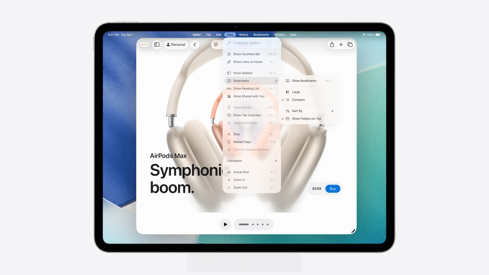
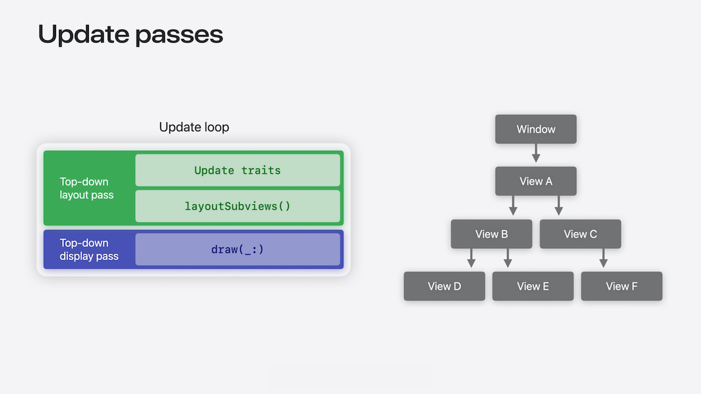
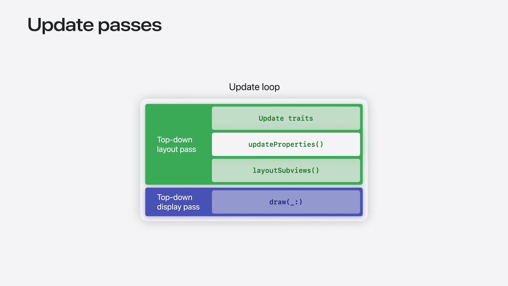

# [**What's new in UIKit**](https://developer.apple.com/videos/play/wwdc2025/243)

---

### **New design system**

* Navigation transitions are now fluid and interruptible
* Users can start interacting with content without waiting for the animation to finish
* New background extension view, which allows content to surface under the sidebar’s large glass platter, preserving visual continuity
* New glass material for custom components and the new scroll edge effect for content to gracefully fade as it scrolls under the glass platters
    * Enhances legibility of bar buttons and other controls
* [Build a UIKit app with the new design](./Build%20a%20UIKit%20app%20with%20the%20new%20design.md) Session
* [Get to know the new design system](./Get%20to%20know%20the%20new%20design%20system.md) Session

### **Containers and adaptivity**

* `UISplitViewController` gains first class support for inspectors
    * An inspector provides additional details of the selected content
    * Can now also resize columns by dragging the split view controller’s separators
* [Make your UIKit app more flexible](./Make%20your%20UIKit%20app%20more%20flexible.md)

### **The menu bar**

* iOS 26 brings the menu bar from macOS to iPad
    * A swipe from the top reveals your app’s full menu even without a hardware keyboard
    * Supports all menu features
    * Should show all commands from the app, even those without keyboard shortcuts
    * Keeps unavailable commands visible, but disabled, so users can still discover everything the app is capable of



* Apps still use UIMenuBuilder to customize their main menus
* iOS 26 introduces several new APIs to build better menu bars
* Main Menu configuration
    * Configures the initial menu provided to your app
    * Declares support for specific groups of system commands
    * Styles existing commands for common use cases
    * Provides a build handler
        * Allows Share extensions to customize the main menu
    * Can optionally provide a build handler, which will be called instead of buildMenuWithBuilder
        * Provides access to a UIMenuBuilder, which has been upgraded in iOS 26 with more powerful convenience methods, faster performance, and improved diagnostics
    * Setting a configuration will trigger a rebuild of the menu bar
    * Ideally, the app should set the configuration only once and as early as possible, such as in application didFinishLaunchingWithOptions

```swift
// Main menu system configuration

var config = UIMainMenuSystem.Configuration()

// Declare support for default commands, like printing
config.printingPreference = .included

// Opt out of default commands, like inspector
config.inspectorPreference = .removed

// Configure the Find commands to be a single "Search" element
config.findingConfiguration.style = .search

// Have the main menu system build using this configuration, and make custom additions.
// Call this early, e.g. in application(_:didFinishLaunchingWithOptions:), and call it once
UIMainMenuSystem.shared.setBuildConfiguration(config) { builder in
    builder.insertElements([...], afterCommand: #selector(copy(_:)))

    let deleteKeyCommand = UIKeyCommand(...)
    builder.replace(command: #selector(delete(_:)), withElements: [deleteKeyCommand])
}
```

* Additional standard menu items
    * Perform close (mapped to `Cmd-W`) closes the window scene by default, but can also close other things like tabs
    * New from clipboard
        * Allows creation of documents from the contents of the pasteboard, without triggering a paste alert
        * The `.newItem` menu is a great place to put it
    * Text alignment
    * Toggle sidebar
    * Toggle inspector

* Keyboard shortcut repeatability
    * By default, keyboard shortcuts repeat when the keys are held down
    * Can customize with the `repeatBehavior` property on `UIMenuLeaf`
        * Can also be set per-responder setting with `validateCommand(_:)`
    * For commands that can repeat, but should require explicit user input


```swift
// Keyboard shortcut repeatability

let keyCommand = UIKeyCommand(...)
keyCommand.repeatBehavior = .nonRepeatable
```

* In some cases, parts of the menu bar need to display dynamic content based on the focused item or a window scene.
    * For example, browsing apps like Safari may show history for the current browsing profile in the History menu
    * Use the new focus-based deferred menu element - `UIDeferredMenuElement` - and give it an identifier to differentiate it
    * When the deferred element needs to be fulfulled, UIKit walks the responder chain until it finds a responder that can contribute items
        * In the example below, the `BrowserViewController` overrides `providerForDeferredMenuElement` to supply history items for the current profile
        * It checks the identifier of the deferred element for the browserHistory element and returns a Provider to load history menu items

```swift
// Focus-based deferred menu elements

extension UIDeferredMenuElement.Identifier {
    static let browserHistory: Self = .init(rawValue: "com.example.deferred-element.history")
}

// Create a focus-based deferred element that will display browser history
let historyDeferredElement = UIDeferredMenuElement.usingFocus(
    identifier: .browserHistory,
    shouldCacheItems: false
)

// Insert it into the app’s custom History menu when building the main menu
builder.insertElements([historyDeferredElement], atEndOfMenu: .history)


class BrowserViewController: UIViewController {
    // ...
  
    override func provider(
        for deferredElement: UIDeferredMenuElement
    ) -> UIDeferredMenuElement.Provider? {
        if deferredElement.identifier == .browserHistory {
            return UIDeferredMenuElement.Provider { completion in
                let browserHistoryMenuElements = profile.browserHistoryElements()
                completion(browserHistoryMenuElements)
            }
        }
        return nil
    }
}
```

* New app Settings command - app gets a keyboard shortcut to open its settings in the Settings app
* For Document-based apps, the `Open Recent` menu will be populated with recent documents
* App windows and window tiling
    * The system supplements the Window menu with tiling commands
        * Includes a list of all open scenes for the app
        * Populate the `title` of each `UIScene` to help users differentiate scenes

* Menu bars in storyboards no longer supported for UIKit apps
    * Apps will not launch with menus in storyboards, so implementing them programmatically is required
* Ensure that your app’s functionality remains accessible without the menu bar, since the menu bar will not always be present
* [Elevate the design of your iPad app](./Elevate%20the%20design%20of%20your%20iPad%20app.md) Session
* [Take your iPad apps to the next level](https://developer.apple.com/videos/play/wwdc2021/10057/) Session from WWDC 2021

### **Architectural improvements**

* Automatic observation tracking
    * UIKit now integrates Swift Observation at its core
        * In update methods like layoutSubviews, it automatically tracks any Observable you reference, wires up dependencies, and invalidates the right views
        * No manual setNeedsLayout required
    * Always active in supported methods, just like automatic trait tracking
    * an back-deploy this on iOS 18
        * Set `UIObservationTrackingEnabled` key to `YES` in Info.plist
        * Enabled by default in iOS 26
    * In the code below, the statusLabel is backed by an Observable model object, and is updated in `viewWillLayoutSubviews`

```swift
// Using an Observable object and automatic observation tracking

@Observable class UnreadMessagesModel {
    var showStatus: Bool
    var statusText: String
}

class MessageListViewController: UIViewController {
    var unreadMessagesModel: UnreadMessagesModel

    var statusLabel: UILabel
    
    override func viewWillLayoutSubviews() {
        super.viewWillLayoutSubviews()

        statusLabel.alpha = unreadMessagesModel.showStatus ? 1.0 : 0.0
        statusLabel.text = unreadMessagesModel.statusText
    }
}
```

* Another example using a UICollectionView
    * Each cell is backed by an Observable model
    * Assign a `configurationUpdateHandler` to each cell
        * In the handler, populate and apply a list content configuration using the observable `ListItemModel`
        * Any change to the model’s properties while the cell is visible causes UIKit to rerun the handler and update the cell

```swift
// Configuring a UICollectionView cell with automatic observation tracking

@Observable class ListItemModel {
    var icon: UIImage
    var title: String
    var subtitle: String
}

func collectionView(
    _ collectionView: UICollectionView, cellForItemAt indexPath: IndexPath
) -> UICollectionViewCell {
    let cell = collectionView.dequeueReusableCell(withReuseIdentifier: "Cell", for: indexPath)
    let listItemModel = listItemModel(for: indexPath)
    cell.configurationUpdateHandler = { cell, state in
        var content = UIListContentConfiguration.subtitleCell()
        content.image = listItemModel.icon
        content.text = listItemModel.title
        content.secondaryText = listItemModel.subtitle
        cell.contentConfiguration = content
    }
    return cell
}
```

* New UI update method
    * Override `updateProperties()` added on UIView and UIViewController
    * Called right before `layoutSubviews()`, but fully independent
    * Use to set properties of views and controllers that don't involve layout
        * Compliments, but does not replace, `layoutSubviews()`
    * Automatically tracks any Observable you read
        * You can manually trigger it by calling setNeedsUpdateProperties
    * In the code below, by using updateProperties to configure the view instead of layoutSubviews, you avoid re-running the code on unrelated events, like resizing, cutting unnecessary work and improving performance

```swift
// Using automatic observation tracking and updateProperties()

@Observable class BadgeModel {
   var badgeCount: Int?
}

class MyViewController: UIViewController {
   var model: BadgeModel
   let folderButton: UIBarButtonItem

    override func updateProperties() {
        super.updateProperties()

        if let badgeCount = model.badgeCount {
            folderButton.badge = .count(badgeCount)
        } else {
            folderButton.badge = nil
        }
   }
}
```

* Update passes
    * The layout pass comes first
        * UIKit traverses the view hierarchy top down, updates each view’s traits, then calls layoutSubviews
        * If that pass causes other views to require layout, the layout pass repeats until everything is laid out
    * Once the layout settles, UIKit performs the display pass, calling draw method on each view and repeating until all views no longer need display
    * Once both passes finish, the next frame can be rendered and displayed on the screen
    * During the top-down layout pass, UIKit runs updateProperties right after updating traits and just before layoutSubviews
        * `layoutSubviews` is essentially being split into two stages:
            * Property updates first
            * Then the usual layout logic
    * Because the trait collection is updated before updateProperties runs, you can safely read it there
        * And since it always precedes layoutSubviews, you can invalidate layout inside it and the layout pass will run immediately afterward

Update Passes Flow | Where `updateProperties()` Fits In |
-------------------|------------------------------------|
  |  |

* To complement the new observation tracking feature and new updateProperties method, improvements have been made to how animations work in UIKit
    * In iOS 18 and earlier, you needed to to set new values and call `layoutIfNeeded()` in a `UIView.animate(options:)` closure

```swift
UIView.animate(options: .flushUpdates) {
    model.badgeColor = .red

    badgeView.layoutIfNeeded()
}
```

* iOS 26 has a new animation option for UIViews called `flushUpdates`
    * When enabled, UIKit applies pending updates just before the animation begins, and again when it ends, so you no longer need to call `layoutIfNeeded()`
    * For `flushUpdates` to work, only make invalidating state changes inside the animation closure
    * `flushUpdates` isn’t limited to animations driven by Observable
        * In the flushUpdates closure, I set a new constant to one of the existing constraints, and also activate and deactivate other constraints
        * Dependent views animate to their new positions and sizes automatically

```swift
// Automatically animate changes with Observable objects
UIView.animate(options: .flushUpdates) {
    model.badgeColor = .red
}


// Automatically animate changes to Auto Layout constraints
UIView.animate(options: .flushUpdates) {
    // Change the constant of a NSLayoutConstraint
    topSpacingConstraint.constant = 20
    
    // Change which constraints are active
    leadingEdgeConstraint.isActive = false
    trailingEdgeConstraint.isActive = true
}
```

* Scene updates
    * SwiftUI scenes are now supported in UIKit applications using a new delegate protocol `UIHostingSceneDelegate`
    * Unlocks Immersive Spaces and Volumes on visionOS
    * Using a hosting scene delegate is just like any other scene delegate
        * Set the delegate class type on the UISceneConfiguration when a new scene is connecting

```swift
// Setting up a UIHostingSceneDelegate
import UIKit
import SwiftUI

class ZenGardenSceneDelegate: UIResponder, UIHostingSceneDelegate {
    static var rootScene: some Scene {
        WindowGroup(id: "zengarden") {
            ZenGardenView()
        }

        #if os(visionOS)
        ImmersiveSpace(id: "zengardenspace") {
            ZenGardenSpace()
        }
        .immersionStyle(selection: .constant(.full),
                        in: .mixed, .progressive, .full)
        #endif 
    }
}


// Using a UIHostingSceneDelegate 
func application(_ application: UIApplication,
    configurationForConnecting connectingSceneSession: UISceneSession,
    options: UIScene.ConnectionOptions) -> UISceneConfiguration {

    let configuration = UISceneConfiguration(name: "Zen Garden Scene",
                                             sessionRole: connectingSceneSession.role)

    configuration.delegateClass = ZenGardenSceneDelegate.self
    return configuration
}


// Requesting a scene
func openZenGardenSpace() {
    let request = UISceneSessionActivationRequest(
        hostingDelegateClass: ZenGardenSceneDelegate.self,
        id: "zengardenspace")!
  
    UIApplication.shared.activateSceneSession(for: request)
}
```

### **General enhancements**

* HDR Color support
    * Accentuate interfaces or enable new experiences
    * UIColor lets you specify a base color plus an exposure value
        * Automatically adjusts its brightness to the display’s capabilities

```swift
// Create an HDR red relative to a 2.5x peak white
let hdrRed = UIColor(red: 1.0, green: 0.0, blue: 0.0, alpha: 1.0, linearExposure: 2.5)
```

* HDR color picking
    * Supported by `UIColorPickingViewController` and `UIColorWell`
    * Set a maximum supported exposure value

```swift
// Support picking HDR colors relative to a 
// maximum peak white of 2x
colorPickerController.maximumLinearExposure = 2.0
```

* In iOS 18, UIImageView intelligently falls back HDR to SDR
    * In iOS 26 this behavior is expanded to video, and your own custom content can participate as well
    * Automatically ramps down HDR usage when not in focus
    * Observe via `UITraitHDRHeadroomUsage` trait
    * [Use HDR for dynamic image experiences in your app](https://developer.apple.com/videos/play/wwdc2024/10177/) Session from WWDC 24
    * [Support HDR images in your app](https://developer.apple.com/wwdc23/10181/) Session from WWDC 23

```swift
// Mixing SDR and HDR content

registerForTraitChanges([UITraitHDRHeadroomUsageLimit.self]) { traitEnvironment, previousTraitCollection in
    let currentHeadroomLimit = traitEnvironment.traitCollection.hdrHeadroomUsageLimit
    // Update HDR usage based on currentHeadroomLimit’s value
}
```

* Swift notifications
    * Notification payloads are now strongly typed
        * Gives you a strongly typed value for registering observers and for retrieving event details
    * Improved compatibility with Swift Concurrency
    * 

```swift
// Adopting Swift notifications

override func viewDidLoad() {
    super.viewDidLoad()

    let keyboardObserver = NotificationCenter.default.addObserver(
        of: UIScreen.self
        for: .keyboardWillShow
    ) { message in
        UIView.animate(
            withDuration: message.animationDuration, delay: 0, options: .flushUpdates
        ) {
            // Use message.endFrame to animate the layout of views with the keyboard
            let keyboardOverlap = view.bounds.maxY - message.endFrame.minY
            bottomConstraint.constant = keyboardOverlap
        }
    }
}
```

* Embrace flexibility
    * Scenes are the foundation of a flexible app
    * Many legacy `UIApplication` focused APIs are deprecated
        * Legacy `UIApplicationDelegate` callbacks and `UIApplicationLaunchOptionKeys` no longer apply
        * Only the init windowScene initializer for UIWindow remains
        * Every other initializer is deprecated
    * `UIScene` life cycle will be required after iOS 26
        * App will not launch if not adopted
    * `UIRequiresFullScreen` is deprecated and will soon be ignored
    * [Migrating to the UIKit scene-based life cycle](https://developer.apple.com/documentation/technotes/tn3187-migrating-to-the-uikit-scene-based-life-cycle) Article
    * [Make your UIKit app more flexible](./Make%20your%20UIKit%20app%20more%20flexible.md) Session

* OpenURL supports file URLs
    * In iOS 26 the existing openURL method now accepts file URLs so you can now hand-off documents that are not natively supported by your app
        * `UIScene.openURL(_:options:completionHandler:)`
    * If a default app exists for the file type, the system passes the file to that app
    * If not, openURL returns false, giving you an option to handle the fallback yourself
        * e.g. use a quick look preview controller

* SF Symbols 7
    * Adds the ability to draw symbols starting with:
        * `.drawOff` uses the draw animation to hide a symbol
        * `.drawOn` use the draw animation to show a hidden symbol
    * Symbols can now support variable draw, a new mode for variable value
        * `UIImage.SymbolConfiguration(variableValueMode: .draw)`
        * Draws arbitrary values along a path, such as for this progress indicator
        * Can also use it with the Automatic symbol content transition to animate across variable values
    * Magic Replace transitions can also perform special draw animations between certain symbols
        * For example, this transition between the circle symbol and the filled checkmark symbol now fills the circle and draws the checkmark
    * UIKit has new API to easily adopt symbol content transitions in UIButton
        * Use the new `symbolContentTransition` property on UIButton.Configuration to specify a symbol content transition, such as `.replace`
        * When the button’s symbol changes, UIKit performs the transition
    * New color rendering mode option
        * Apps can specify Gradient to color their symbols using automatically-generated gradients rather than flat colors
    * [What’s new in SF Symbols 7](./What’s%20new%20in%20SF%20Symbols%207.md) Session
    * [Animate symbols in your app](../2023/Animate%20symbols%20in%20your%20app.md) Session from WWDC 2023

```swift
// Using a symbol content transition to automatically animate symbol updates

var configuration = UIButton.Configuration.plain()
configuration.symbolContentTransition = UISymbolContentTransition(.replace)
```
