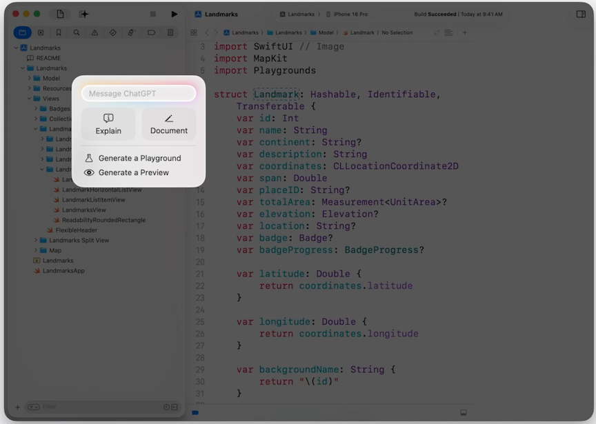

# [**What's new in Xcode**](https://developer.apple.com/videos/play/wwdc2025/247)

---

### **Optimizations**

* Xcode 26 is 24% smaller
    * Simulator runtimes no longer contain Intel support by default, and the Metal toolchain will only be downloaded if your project needs it
* Faster text input
    * Typing latency in some complex expressions improved by up to 50%
* Workspace loads up to 40% faster

### **Workspace and editing**

* Intuitive editor tabs
    * Work like in Safari
    * New start page when opening a new tab
    * Pin a tab to keep it on a file


* Multiple word search
    * New search mode that uses search engine techniques to find clusters of words in a project
    * Finds clusters of the words in proximity with each other
    * Clusters can span multiple lines and the search terms can appear in any order


* Coding by voice
    * Can use Voice Control to write Swift code
    * You can pronounce the Swift code just as you’d naturally read it aloud
    * Voice Control understands Swift syntax. It will figure out where spaces should appear, whether expressions correspond to operators or should be camel-cased, etc.
    * Initialize by saying `Start Listening` and `Swift Mode` with Voice Control active
    * Close session with `Stop Listening`

* #Playground
    * New `#Playground` macro
    * Can add a Playground inline in a document
    * The results of the code execution will appear in their own canvas tab
        * Results update immediately as code is changed
    * Can switch between current and previous versions of a Playground to view differences
    * `#Playground` macro is being open-sourced

```swift
extension String {
    func scanForFloatingPointNumbers() -> [Regex<Substring>.Match] {
        return self.matches(of: /[+-]?[0-9]*[.][0-9]+/)
    }
}

import Playgrounds

#Playground {
    let landmark = Landmark.exampleData.first
    let region = landmark?.coordinateRegion
}

#Playground {
    let string = "lon: -113.16096, lat: 36.21904"
    let longitude = string.scanForFloatingPointNumbers().first
    let latitude = string.scanForFloatingPointNumbers().last
}
```


* Icon Composer
    * New app bundled with Xcode
    * Create multilayered icons that work across multiple platform platforms and software versions
    * Can now create a single `.icon` file that handles all icon sizes and modes (e.g. dark/tinted)
    * Can take advantage of the full range of our material effects and add dynamic properties to your layers, like blur, shadow, specular highlights, and translucency
    * [Say hello to the new look of app icons](./Say%20hello%20to%20the%20new%20look%20of%20app%20icons.md) Session
    * [Create icons with Icon Composer](./Create%20icons%20with%20Icon%20Composer.md) Session

* String Catalogs
    * Type-safe Swift symbols added
        * Can define them directly in the String Catalog, which now produces Swift symbols that can be accessed in code
        * These symbols appear as auto-complete suggestions
    * String Catalogs can now automatically generate comments that describe string context
        * Uses an on-device model to generate the comments
    * [Code-along: Explore localization with Xcode](https://developer.apple.com/videos/play/wwdc2025/225)


### **Intelligence**

* Xcode can now use LLMs such as ChatGPT to provide coding assistance
    * Can ask general questions like "tell me about Swift concurrency"
    * The model can take your code into consideration and answer specific questions about your project, or even make changes on your behalf
* New light-weight menu to apply changes to selected code
    * Quick access to common actions, or you can type a custom query into the text field



* Xcode sends the project context to the model, and it will reply with an explanation that describes relevant source files and what they do 
    * The model can also ask for more information from Xcode about additional context it needs while it’s coming up with an answer
    * The “info” button in the transcript shows us the context that Xcode sent
    * The response also contains links so you can quickly navigate to any mentioned file


* The model can help build features as well
* Use the `@` character to directly reference a symbol we want the model to modify (e.g. `@LandmarkCollection`)
* Lets you reference symbols, source files, or any issues in your project
* Can even upload files for the query to reference by using the attachment button on the bottom left of the Conversation interface
    * Images are useful, as the LLM can generate code from the sketch of a user interface
* Use the binoculars control at the bottom of the Conversation interface to control whether the LLM has access to your project context
* The lighting control at the bottom of the Conversation interface controls whether or not changes are automatically applied to your code
    * Toggling this off will require manual before applying changes
* New messages in a conversation preserve the context of earlier queries and replies
* Xcode keeps a snapshot of your code with each change
    * You can examine every line of code changed during each stage of the conversation
    * You can scrub back and forth through time to apply or revert individual sets of changes (using the clock interface at the top right of the Conversation Interface)


* When you want to focus on a particular section of code, you can also use coding tools right from the source editor
    * Can use quick options like `Generate a Playground` or `Document`

Open Coding Tool | Quick Actions Window |
-----------------|----------------------|
  |  |

* Can also help fix errors
    * New option to generate a fix when viewing an error

Error Messaging | Error Fix Conversation |
-----------------|----------------------|
  |  |

* Can ask Xcode to fix deprecation warnings
* Many ways to add a model in Xcode
    * You can enable ChatGPT with just a few clicks
        * You’ll get a limited number of requests each day
        * You can bring your own ChatGPT account for even more requests
    * You can use another provider, like Anthropic
        * Enter your API key and interact with models like Claude 4 Opus and Sonnet
        * You can choose which models to show from each provider, and can mark your favorites for quick access
    * You can also use local models, running on your Mac or private network, using tools like Ollama and LM Studio
    * You can add as many providers as you want in Xcode's preferences
    * You can switch between models in the coding assistant when beginning a new conversation

Add Model Provider | Switch Between Models |
-----------------|----------------------|
  |  |

### **Debugging and performance**

* Improved Swift Concurrency Debugging
    * As you step through code running in a Swift task, Xcode now follows execution into asynchronous functions, even if that requires switching threads
    * Xcode’s debugger UI will now show task IDs
    * In the variables view you’ll see easy-to-read representations of concurrency types, such as Tasks, TaskGroups, and actors
        * Can see a Task variable's properties, such as priority and any child tasks
    * Stepping into (or out of) an await call in the debugger can now follow a task into a new thread
    * New data formatter for Swift Concurrency types
    * [What's new in Swift](./What's%20new%20in%20Swift.md) Session

* Xcode now understands when an app has stopped due to a missing usage description and explains what is missing (e.g. NSCameraUsageDescription)
    * From the annotation, you can jump directly to documentation to learn more
    * Can click a new "Add" button to go directly to the Signing & Capabilities Editor
        * This will automatically add the necessary capability, and allows adding the description here
        * Automatically updates Info.plist

* Instruments
    * Previously, Instruments used sampling-based profilers to understand CPU usage
        * Great for long running workloads
        * Only an approximation of the full workload, though
    * Recent Apple silicon devices can capture a processor trace where the CPU stores information about the code it runs
        * This includes the branches it takes, and the instructions it jumps to
        * The CPU streams this information to an area on the file system so that it can be analyzed with the `Processor Trace instrument`
    * Processor Trace captures information about every low-level branching decision the CPU makes, on all running threads, with very little runtime overhead
        * The Processor Trace timeline can present a high-fidelity visualization of execution flow
        * Reveals every branch taken and function called — including compiler-generated code, like ARC memory management in Swift
        * Processor Trace was introduced with Xcode 16.3
        * Supported by M4 and iPhone 16 devices
    * CPU Counters
        * Helps in guiding micro-architecture optimizations
        * Use preset modes that group related counters together
        * Provide a guided approach to learning about how your code is handled by the CPU
        * CPU Bottlenecks breaks down the CPU's sustainable instruction bandwidth into either useful work, or bottle-necked for one of three broad reasons
            * The CPU had to wait for execution units or memory to become available
            * The CPU couldn’t deliver instructions quickly enough
            * The CPU incorrectly predicted future work and needed to get back on track
        * Instruction Characteristics and Metrics modes offer a more traditional use of the counters to get absolute counts of consumption
            * Let you focus on tuning critical instruction sequences by analyzing branches, cache behavior, and numerical operations directly
        * CPU Counters also includes detailed documentation to help understand what the modes and counters represent
    * [Optimize CPU performance with Instruments](https://developer.apple.com/videos/play/wwdc2025/308) Session

* SwiftUI performance
    * Major SwiftUI performance improvements
        * Lists can update up to 16 times faster without any additional changes from your app
    * Next generation SwiftUI Instrument
        * The timeline gives a quick overview of when SwiftUI is doing work on the main thread, and when individual view updates take a long time and put you at risk of a hitch or hang
        * The “View Body Updates” summary tells you how many times each view in your app updated
        * If the number of updates to one of your views is much larger than you expect, open the cause-and-effect graph to help understand why
    * [What's new in SwiftUI](https://developer.apple.com/videos/play/wwdc2025/308) Session
    * [Optimize SwiftUI performance with Instruments](https://developer.apple.com/videos/play/wwdc2025/308) Session

SwiftUI Instrument Timeline | Cause and Effect Graph |
-------------------|-----------------------|
  |  |

* Power Profiler Instrument
    * Lets you profile your app and record power metrics which can then be visualized
    * The Power Profiler track shows system power usage, correlated with the thermal and charging states of the device, helping to identify unexpected power spikes
    * The process track shows the impact the application has on various device power subcomponents like CPU, GPU, Display, and Networking
    * Supports two modes of tracing
        * At-desk power profiling via Instruments
        * On-the-go power profiling via Performance Trace collection
    * [Profile and optimize power usage in your app](https://developer.apple.com/videos/play/wwdc2025/226) Session

* Xcode Organizer
    * Xcode 16 introduced Trending Insights to Disk Write diagnostics
        * Indicated with a flame icon in the source list
    * Xcode 26 introduces Trending Insights to Hang and Launch diagnostics as well
        * The flame icon calls out Hang and Launch times that are trending in the wrong direction
        * The Insights area now provides clarity about the trend by charting the increase across the last 5 app versions
    * Can share diagnostic reports using URL sharing
    * Metrics have been expanded with the addition of Recommendations
        * Compare your app’s metrics with other sources – including similar apps and your app’s historical data - to provide a reference point for understanding your app's performance
        * This year, metric recommendations are available for the Launch Time metric
            * Recommendations for other metrics will be enabled over time

### **Building**

* Xcode 26 will enable Explicitly built modules for Swift code by default
    * Improves build efficiency and reliability
    * More precise and deterministic sharing of modules
    * Improves speed of debugging Swift code
    * [Demystify explicitly built modules](../2024/Demystify%20explicitly%20built%20modules.md) Session from WWDC 2024

* Swift Build was open sourced earlier this year
    * Used by Xcode and Swift Playground, as well as the internal build process for Apple’s own operating systems
    * Apple is working to incorporate Swift Build into Swift Package Manager, to unify the build experience across Swift open source toolchains and Xcode
    * Adding support for all platforms supported by the Swift ecosystem, including Linux, Windows, Android, and more

* Enhanced Security
    * Xcode’s new Enhanced Security capability provides your apps with the same protections used in Apple’s apps, such as pointer authentication
    * Can enable by adding the `Enhanced Security` capability in the `Signing and Capabilities` editor
    * Recommended for social media, messaging, image viewing, and browsing apps

### **Testing**

* UI automation recording has been enhanced with a completely new code generation system
    * Can use the UI automation recording feature of Xcode 26 to build a UI test
    * Click the Start Recording button in the editor gutter to start a test recording
    * The file will be in read-only mode until the recording is complete
    * Interact with your device/simulator, and the test will record your actions to build a test
    * Click the Stop Recording button to end the recording session and put the file back in read/write mode

Start UI Test Recording | Recording in Progress |
-------------------|-----------------------|
  |  |

* The same code generation has been integrated into the test report’s Automation Explorer
    * The Automation Explorer contains a full video recording of the test
    * With UI testing, Xcode records attributes about every identifiable element while running a test
        * We can then inspect elements in the Automation Explorer after the fact
        * The element details will generate a correct code snippet to identify elements
* Additional device interactions on all Apple devices
    * Includes hardware keyboards, hardware button presses, and more
* [Record, replay, and review: UI automation in Xcode](https://developer.apple.com/videos/play/wwdc2025/344) Session


* In Xcode 26, the Metrics API has been expanded by adding an XCTHitchMetric to enable catching hitches in your app during testing
    * Reports multiple metrics for your app’s hitch performance, such as Hitch Time Ratio
        * The total amount of time your app was hitching over the duration of the measured portion of your test
    * [Explore UI animation hitches and the render loop](https://developer.apple.com/videos/play/tech-talks/10855/) Tech Talk

```swift
// XCTHitchMetric

func testScrollingAnimationPerformance() throws {
    // Custom performance test measure options.
    let measureOptions = XCTMeasureOptions()
    measureOptions.invocationOptions = .manuallyStop

    // App being tested.
    let app = XCUIApplication()

    // Launch app and get reference to scroll view.
    app.launch()
    let scrollView = app.scrollViews.firstMatch

    measure(metrics: [XCTHitchMetric(application: app)], options: measureOptions) {
        scrollView.swipeUp(velocity: .fast)
        stopMeasuring()
        scrollView.swipeDown(velocity: .fast)
    }
}
```

* More Runtime API Checks added to tests, configured in the Test Plan configuration editor
    * Tests can now surface framework runtime issues as well as call out threading problems using the Thread Performance Checker
        * Detects threading issues like priority inversions and non-UI work on the main thread
    * Test Plans also provide an option to fail a test if runtime API checks find any issues
