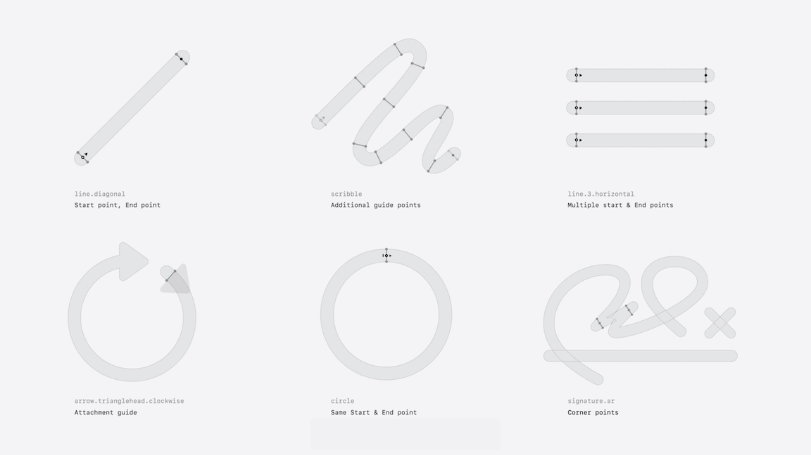
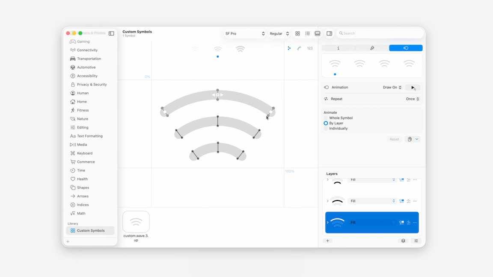
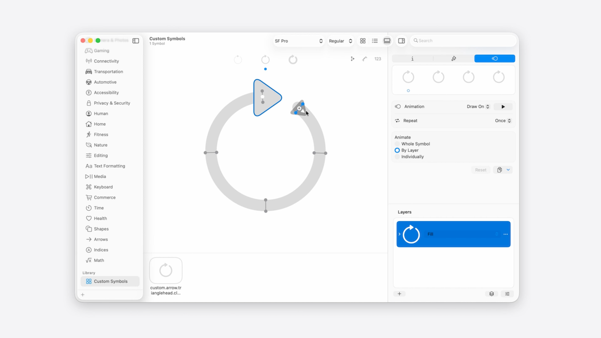
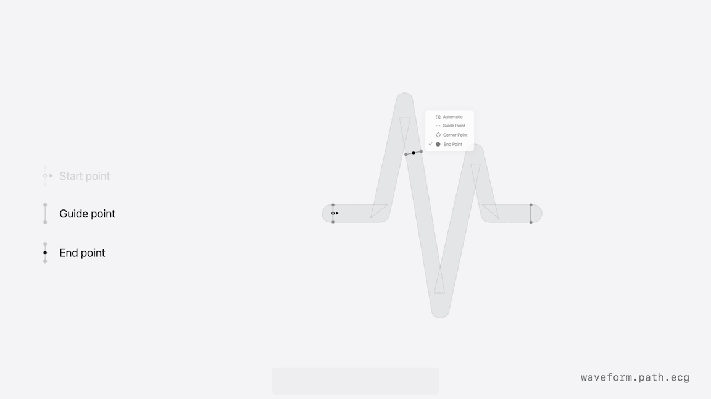
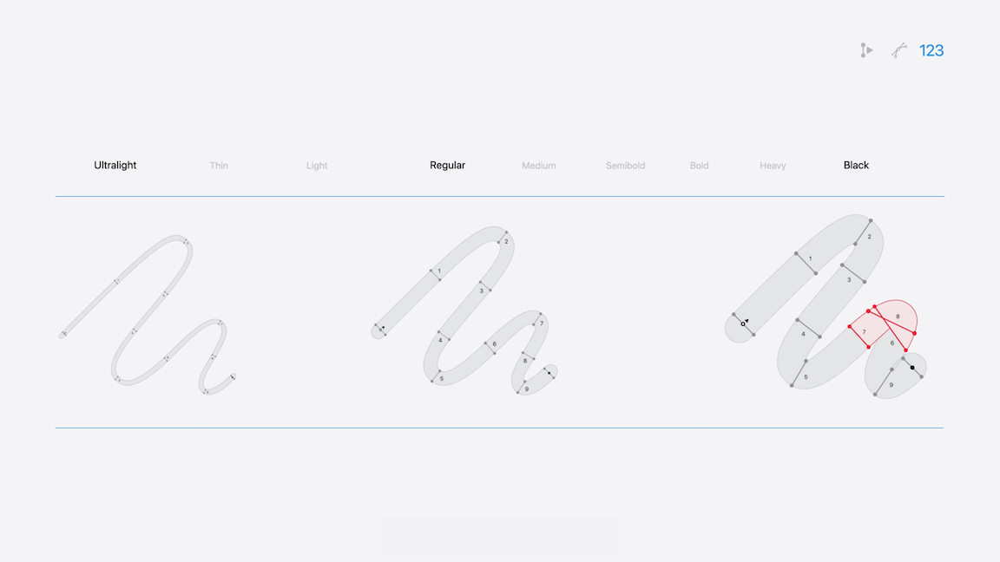
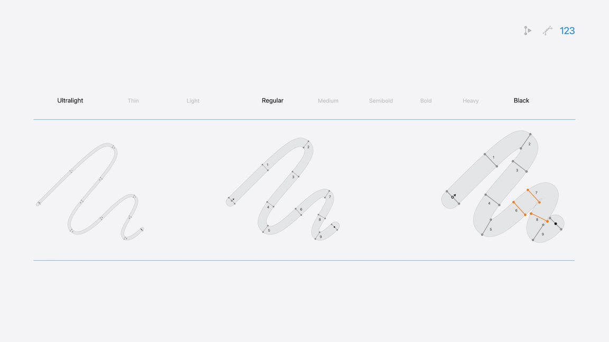

# [**What’s new in SF Symbols 7**](https://developer.apple.com/videos/play/wwdc2025/337)

---

### **Draw**

* New animation presets
    * `Draw On` animates the symbol on screen
    * `Draw Off` animates the symbol off the screen
* Both presets support the existing playback options:
    * `By Layer` (default) - each path draws with a staggered starting offset
    * `Whole Symbol` - draws all layers together, where each draw path starts and ends at the same time
    * `Individually` (new) - draws each layer one by one, waiting for the previous layer to finish before starting the next one
* Draw is flexible, allowing each symbol to define how it is drawn
    * Understanding the available draw directions will be helpful when annotating your own custom symbols
* When choosing a `Draw Off` animation, you get the option to have the animation run in reverse of, going backwards from the shape's end
* `Variable Draw` added to rendering presets
    * Leverages the new draw annotations on participating layers
    * Renders the path at a specific percentage on top of a reduced opacity version of the layer
* Symbols can opt in to support both variable color and draw, but only one can be chosen at render time
    * You can use the default option to use the system preferred variable rendering mode

### **Magic Replace**

* `Magic Replace` will now recognize matching enclosures to provide a seamless transition between two states
    * If two symbols share the same enclosure, the system will preserve them, while simultaneously replacing the differing layers
* Also brought `Draw` to `Magic Replace` for supported symbols, leveraging `Draw Off` for the outgoing symbol and `Draw On` for the incoming symbol
* The system will mix and match these new features on the participating symbols to provide the most seamless and expressive transition
* These enhancements are previewable via the existing `Magic Replace` preset in the Animation Inspector

### **Gradients**

* Gradients now available to SF Symbols
    * When applied to a symbol, the gradient helps create a sense of lighting that is not present with flat colors
    * The new gradient rendering in SF Symbols generates a smooth linear gradient from a single source color, which is available on both system and custom colors
* Available across all rendering modes, and can be applied to your own custom symbols as well
* When previewing gradients, the color gradient is applied across all rendering modes, using the selected options

### **Custom Symbols**

* Symbols are all drawn differently
    * For the heart symbol, the symbol is constructed via two separate paths
    * Scribble.variable is drawn with a variable width
* This means we can’t just stroke the paths to build an animation
* Draw animations rely on a set of guide points to be placed along the desired draw path; these points help guide the path along the defined route
    * At a minimum, a path must contain two guide points to properly compute its draw path - a start point, indicated by an open circle, and an end point, indicated by a closed circle
    * As paths get more complex, they may require additional guide points to help fill in the gaps between the start and the end, indicate multiple draw paths, or even help guide an arrowhead along a path
    * Additionally, some symbols may require specialized guide points to help the system properly compute its draw path
        * Multiple sub-paths might share a start and an end point, whereas sharp bends in a path need to be marked as corner points



* When setting guid points in SF Symbols, the first point entered will become the start point
* As more points are added, the system will determine the endpoint and the draw direction (indicated by an arrow)
* When you have a symbol with more than one path to draw, each path in a symbol can use the same set of rules to define their specific draw path and direction
* When dragging a start point across another existing guide point, the direction of the arrow flips, indicating the path now draws the opposite direction
* If you have a symbol you want to draw bi-directionally, begin by placing my start point in the center of the path and then place additional guide points on each side of the start point
    * The system automatically recognizes its bi-directionality and indicates that with arrows on each side of the start point
    * Important to make sure all my start points line up across layers to ensure a symmetrical effect
        * Can turn on snapping to help me achieve this



* By default, paths draw with a rounded end cap
    * By using the context menu on the start points, you can configure adaptive end caps, which will use the end cap style of the path during the animation
    * Adaptive end caps are only available on symbols that draw in a single direction
* Symbols that are constructed via multiple sub-paths can also be annotated for Draw, but have slightly different mechanics
    * With circle, when you place your first guide point, the system will detect that it is placed across two sub-paths and treat it as both the start and the end point, which is indicated by the capsule on the guide point's trailing edge
    * By default, the animation draws clockwise
        * Can toggle the direction via the guide point’s context menu
        * If needed, can always add additional guide points along the path for more complex shapes
    * These types of drawings only support single-direction animation and cannot be annotated to draw bidirectionally


* For symbols with both drawing and non-drawing components, the non-drawing components will appear in by default
    * For some cases, like arrows, you may need to do some additional annotation work to produce the desired result
* By dragging a non-drawing element onto an already placed guide point, you can create an attachment, a non-drawing element associated with a guide point
    * The attaching guide point indicates where the attachment will appear from, and start following the path
    * To remove it, simply drag the path off the guide point and drop it anywhere else on the canvas
    * In order to create an attachment, the non-drawing element needs to be drawn as a separate path from the base 



* When placing guide points, the system helps decide the default placement of each side of the guide point
    * In some cases, however, the default location might not be the optimal placement for your symbol
    * Hold the option key and drag one side of the guide point forward or backwards along the path, without affecting its associated point
* For symbols with lots of overlapping paths, or paths that are directly on top of each other, it can be challenging to place your guide point on the right subpath from the layer level
    * For these situations, you can always select the subpath directly in the layer list, to force a specific guide point onto that subpath
* You cna change the type of a guide point in its context menu
    * Can decide if you want a guide point to be a standard one or take on the role of an end point
    * Can set a guide point back to automatic to let the system do the heavy lifting for you



* For a path to draw around particularly sharp corners, the system needs to handle these cases in a special way, which can be done by specifying guide points as corner points
    * All other guide point types work by associating two points, one on each side of the path to draw
    * Corner points associate two points on the same side of the path and are indicated by a diamond
* Use the reset guide point option in the context menu on each layer if you need to start over
* When annotating a custom symbol, start by annotating the regular weight
    * This serves as the base annotation and is the only weight where you can add and remove guide points
    * The system will automatically interpolate the place guide points to the other two template weights; ultralight and black
        * Note that each guide point in ultralight and black is associated to its originating guide point in the regular weight
        * If I move the guide point in the regular weight, it will move the associated guide points in both ultralight and black as well
    * Because symbols can interpolate across weights using the templates, it’s crucial to make sure that associated guide points are in the same order across regular, ultralight, and black
* To fix guide points, you need to make sure they are in the correct order 
    * Can toggle on guide point numbers, which displays unique numbers next to each guide point to indicate the order the guide point should occur, based on the associated order in the regular weight
    * Overwritten guide points are indicated in orange and help ensure that symbols draw correctly across all configurations

Guide Points Out Of Order | Guide Points Reordered
--------------------------|-----------------------
  | 

* After turning on the variable rendering switch in the settings popover, you can activate a layer using the variable draw button in the layer list
    * Can always preview it with the variable rendering slider
    * Important to review each layer carefully to determine which layers should participate

### **New APIs**

* You can apply `Draw` using the symbolEffect modifier, following the existing pattern for symbol animations
    * In SwiftUI, when the value of `isHidden` updates (code below), the symbol will draw off and back on again, applying the animation
    * If you’d like to override the By Layer default, you can always set the desired playback mode directly in line (`.individually` in the code below)

```swift
// Draw Animations
// SwiftUI
struct DrawExamples: View {
    @State var isHidden: Bool = false

    var body: some View {
        HStack {
            Image (systemName: "wind")
                .symbolEffect(.drawOn.individually, isActive: isHidden)
        }
    }
}

// UIKit & AppKit
imageView.addSymbolEffect(.drawOff.individually)

// Sometime later, draw on the symbol
imageView.addSymbolEffect(.drawOn.individually)
```

* To leverage variable draw, specify the variable value mode on the relevant sections

```swift
// Variable Draw
// SwiftUI
struct VariableDrawExample: View {
    var body: some View {
        VStack {
            Image (systemName: "thermometer.high", variableValue: 0.5)
        }
        .symbolVariableValueMode(.draw)
    }
}

// UIKit
imageView.image = UIImage (systemName: "thermometer.high", variableValue: 0.5)
imageView.preferredSymbolConfiguration = UIImage.SymbolConfiguration(variableValueMode: .draw)

// AppKit
imageView.image = NSImage(systemSymbolName: "thermometer.high", variableValue: 0.5, ...)
imageView.symbolConfiguration = NSImage.SymbolConfiguration(variableValueMode: .draw)
```

* To take advantage of gradient rendering, set the color rendering mode to gradient using the SwiftUI view modifier or via the symbol configuration options for UIKit and AppKit

```swift
// Gradients
// SwiftUI
struct GradientExample: View {
    var body: some View {
        VStack {
            Image (systemName: "heart.fill")
        }
        .symbolColorRenderingMode(.gradient)
    }
}

// UIKit
view.image = UIImage(systemName: "heart.fill")
view.preferredSymbolConfiguration = UIImage.SymbolConfiguration(colorRenderingMode: .gradient)

// AppKit
view.image = NSImage(systemSymbolName: "heart.fill", accessibilityDescription: "heart symbol")
view.symbolConfiguration = NSImage.SymbolConfiguration(colorRenderingMode: .gradient)
```
