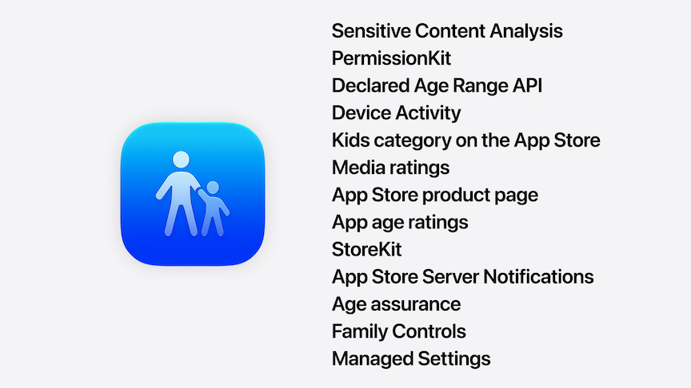
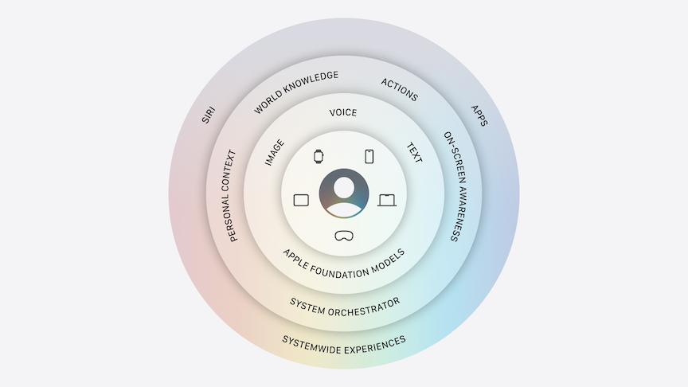
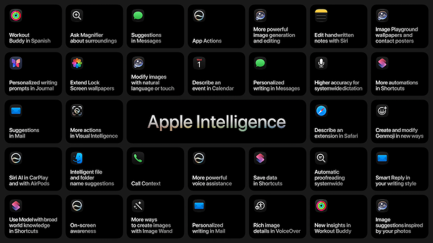

# [**Keynote**](https://developer.apple.com/videos/play/wwdc2026/101/)

---

macOS Golden Gate

### **Platform Improvements**

* Updated liquid glass foundation
    * Diffuses complex content behind liquid glass more
    * Added a slider in settings to adjust liquid glass from clear to tinted
    * In macOS
        * More uniform toolbar across the top of apps
        * Sidebars now expand to the very edge of the window
        * Sidebar icons now regain color (and easier to identify the foreground window)
        * Every window now has a tighter corner radius (even without an app update)
    * New additional layers of liquid glass within app icons
* Performance/stability/responsiveness updates across the system
    * 30% faster iPhone/iPad launch time (3rd party apps as well)
    * New photos appear in library up to 70% faster
    * Airdrop transfers up to 80% faster
    * 5x speedup browsing in Files app
* CPU Scheduler
    * On newer iPhones, further optimizations to handling performance intensive iPhones
    * Brought back to older models now back to iPhone 11 (and forward)
* More seamless Wi-fi/cell transitions
* Sending large images in messages will now no longer slow down the larger conversation
  
#### Search

* Across the board rebuilt the foundation of search
    * Spotlight, photos, and mail
    * Re-architected the index to be more stable, efficient, and more comprehensive of old and new content
    * New content added immediately to index
    * New ranking system in mail search

#### Apps and Services

* iCloud shared albums can now be joined by Android/Windows
* Health app adds perimenopause/menopause detection to cycle tracking
* Custom EQ settings for AirPods
* VisionOS can now turn panoramas to spatial scenes
* Flyover updated in Maps (better detail/rendering)

### **Trust and Safety**

* Updates to Screen Time
    * Working with the American Association of Pediatrics on a guide for parents
    * Existing accounts can be converted to child accounts

#### What Content Kids Can See

* Parents can now only have access to a focused set of apps
    * New setup assistant
    * Can be added to over time
    * Has default sets of apps, or can create custom sets
* Parents can now approve "Ask to Browse" a website
    * Works like app approvals

#### Who Kids Can Talk To

* Just like with apps, kids can ask for permission before connecting with anyone new
* Sending or receiving possible sensitive (nude) images, communication safety intervenes
    * Works in FaceTime as well
    * Now includes gore/violence

#### When Kids Have Access

* Today, parents can see how much time children are on devices.
* New time allowances
    * Apps are grouped into categories, with an allowance for each group
    * Recommended allowances, created in coordination with American Association of Pediatrics
* Apps can be setup with a schedule, allowing different apps allowed during different times of the day

#### How Parents Can Guide Kids

* Completely redesigned screen time
* Quick actions (pause access, unlimited screen time, change schedule)

#### The Role of Developers

* Large range of APIs for developers to hook into safety measures
* Declared Age Range API

New Child Safety website

### **Apple Intelligence and Siri**

#### Architecture

* Apple Foundation Models
    * Collaboration with Google on new generation of models
        * Integrated experience
        * Run on device and in private cloud compute
    * Image understanding/generation
    * Photo editing
    * Answers about visual content
    * More powerful on-device model
        * Understand/generate speech
        * Higher accuracy dictation
        * Better language understanding
        * More expressive voices
* Apple Intelligence coordinates across capabilities with a new system orchestrator
* Start with personal context understanding
    * Uses Spotlight behind the scenes
    * Works with any app that integrates
    * Uses private cloud compute to bring in "world knowledge"
* App Actions
    * Allows Apple Intelligence to use apps to use tools from apps to complete requests
* On-screen awareness can tailor itself based on what is on the screen and what you are doing
* Built on privacy
    * Data is not stored
    * Only used to execute your request
    * Can be verified by independent experts

#### Siri

* New version: Siri AI
    * Access same way as today
    * Includes personal context understanding, on-screen awareness, etc.
    * More capable
    * More conversational
    * Dedicated Siri app
    * Visual intelligence
    * Write with Siri
    * New design (dynamic island)
* New capabilities
    * Can draw on current world knowledge
    * Conversational context - conversations retain context of previous messages
    * Integrate multiple apps
    * On-screen awareness - can identify where a picture is
    * Can find info in messages (like an address) and build on that (start turn-by-turn directions)
    * Can find pictures from location/time/event/etc., then filter them by voice command
        * Then share them on command
* New voice experience with more expressive voice
    * Can customize (expressivity, pace)
* New update to system-wide transcription
    * Better punctuation, accuracy, capitalization
* Extend to CarPlay and AirPods
* More conversational
    * In-depth plans
    * Back and forth brainstorming
    * Feedback on documents
    * Can pull down from the bottom of the conversation to get more info in a new, full-screen conversational experience
    * Can scroll through/edit messages that you prompt Siri to make
    * Combines world knowledge and personal content
* macOS
    * Siri integrated into Spotlight
    * System-wide context menus can start conversations
    * Can directly ask questions to Siri in Spotlight
    * You can select multiple files and right click - then ask Siri a question about them right in the menu
    * Again, can combine contexts and create email/text drafts

##### **Siri App**

* Can start a new conversation or revisit a previous one
* Syncs across devices
    * Works on watchOS as well
        * Can get into the Siri app using the new App Grid
* visionOS has a new 3D representation of Siri
    * Can just look at it and talk

##### **Visual Intelligence**

* Integrated into the iPhone in Siri Mode in the Camera app
    * Can ask follow up questions
    * Saved to Siri App
    * Suggests relevant actions based on what the camera is looking at (nutrition, split bill, etc.)
* macOS now has dedicated keyboard shortcut
    * Select part of screen and type to Siri
    * Conversational
    * Relevant actions provided
* iPad has it integrated into screenshot experience
* visionOS recognizes what you are looking at when you ask questions
    * Can get answers about spatial questions

##### **Write with Siri**

* Describe what you want in natural language, Siri will create a draft
* In mail and messages, uses how you normally communicate with someone to help write the draft
* Select a portion of text and ask for suggestions/etc.
* Automatic proofreading (available system-wide)

Available in English to start (later available in more languages)

#### Apps

* Safari
    * New way to manage tabs
        * AI organizes tabs into topics
            * New related tabs to a topic as you browse
            * Can close an entire topic or save it as a tab group
    * Notify Me
        * Tell Safari what you are looking for
            * Safari will monitor a page and notify you when the page changes/updates
    * Describe an Extension
        * Safari can create custom extensions to adapt websites
* Passwords
    * Can auto-update eligible accounts to strong passwords with just a tap
* Messages/Mail/Calendar/Phone
    * Messages uses Apple Intelligence to offer one-tap suggestions
        * Creating reminders/notes
        * Finds requested/referenced photos
    * Mail offers more suggestions based on context
        * Includes using 3rd party apps
    * Describe events in Calendar
        * Identifies people/location/title and fills them out
        * Adjusts frequency based on things like "every other week"
    * Phone app can find confirmation codes in mail to display relevant info
        * e.g. flight confirmation number when talking to airline
* Home
    * Accessory Notifications
        * Groups related notifications to a single activity that updates with new activity
    * Home App can use clips from cameras to generate descriptions
        * Can pull up relevant clips from multiple cameras
        * Elevates most important clips to the top of the list
        * Can search for events across multiple cameras
* Shortcuts
    * Describe a Shortcut
        * Assembles steps based on natural language description
        * Can describe changes - not just "one shot"
* Image Playground
    * New image models
    * Can make photorealistic images now
    * Transform photos to other styles
    * Photos never stored/shared
    * Can circle over items to move/resize/make targeted changes
    * Can choose image dimensions (portrait/landscape/etc.)
    * All features available with Image Playground API
* Photos
    * Clean Up
        * Better quality/realistic in-fill
    * Extend
        * Expand the frame of an image
    * Reframe
        * Uses spatial reframing to adjust image after photo is taken
        * Can change perspective of a photo in 3D
            * Blur around edges shows where model will fill in edges

Supported on same devices as today, with newer features only on newer devices

### **Developers**

* App Intents are used by Siri
* Foundation Models API
    * Can use images as input as addition to text
    * Extend capabilities with custom skills
    * Use models running on servers
* Can bring other models into your app with new Core AI framework
* Xcode
    * Coding assistant can localize an entire app
    * Can interact with simulated devices
    * Can choose model/agent of choice
        * Now includes Gemini
    * Can connect to Figma and GitHub
    * All new Device Hub
        * Brings simulated and physical devices together in one place
        * Change app's appearance, resize dynamically, etc.

