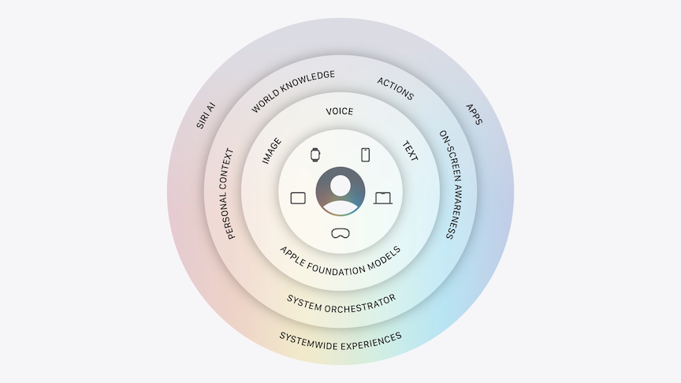
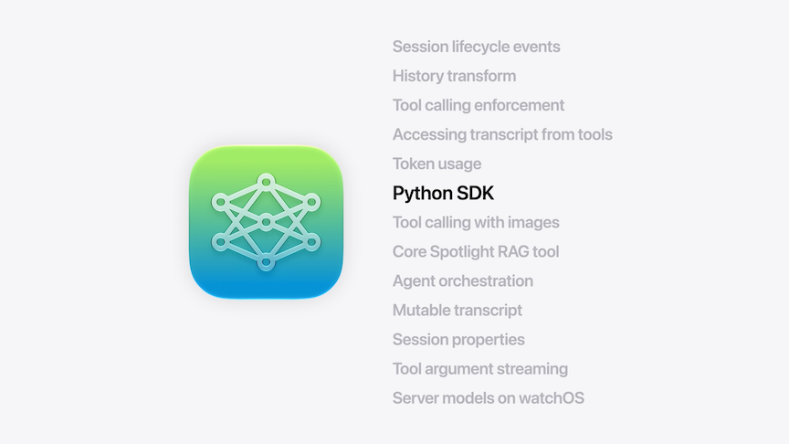
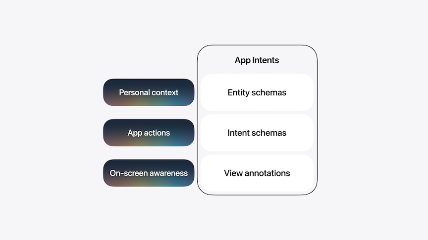
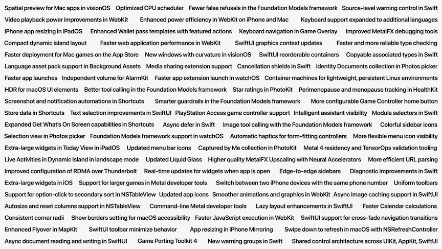
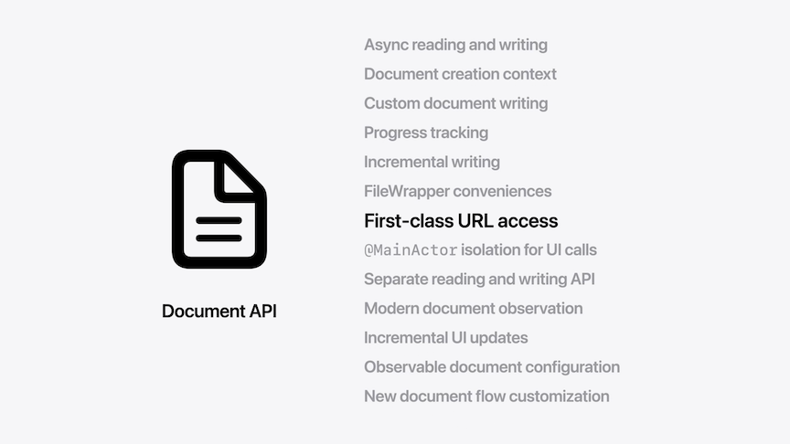
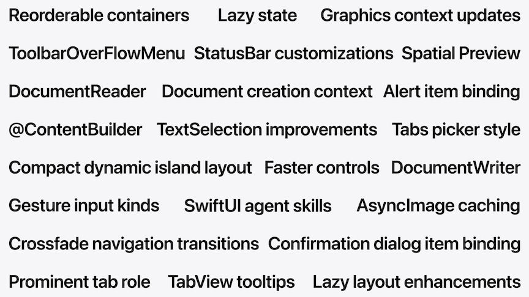
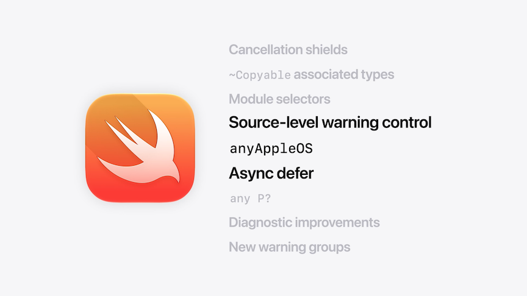
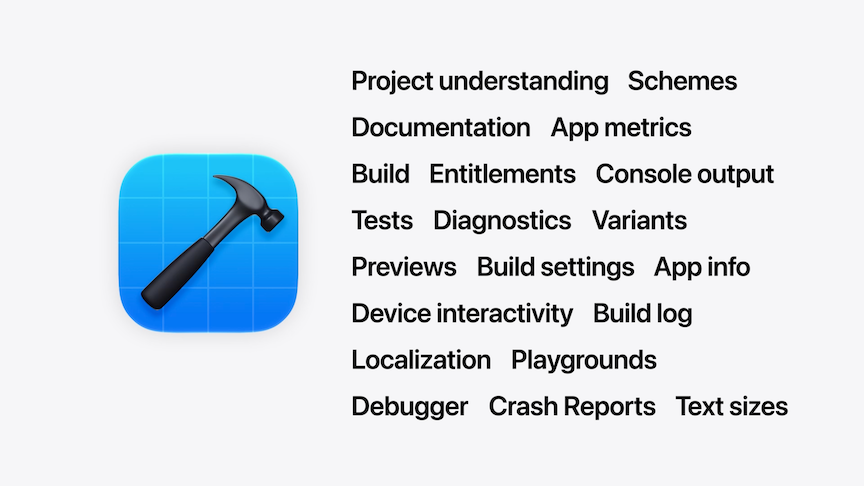
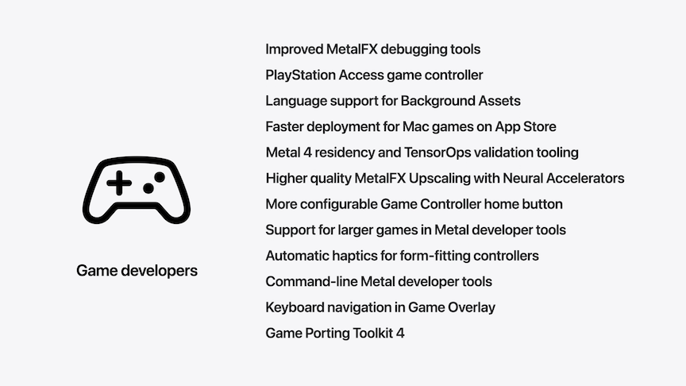
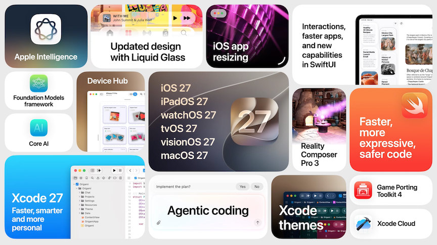

# [**Platforms State of the Union**](https://developer.apple.com/videos/play/wwdc2026/102/)

---

### **Apple Intelligence**

* Apple foundation models now available on-device and on Private Cloud Compute
    * Developers with fewer than 2 million first-time App Store downloads can use models on Private Cloud Compute with no cloud API cost
* The App Intents framework connects an app to Apple Intelligence, drawing on core operating system technologies
    * Spotlight semantic index - organizes and surfaces personal context from any supported app
    * The app toolbox, which identifies features available across apps to serve a user request
    * The system orchestrator, which coordinates it all while protecting user privacy

#### Foundation Models Framework

* New capabilities
    * Multi-modal prompts with text and images
    * The Vision framework is now integrated, providing purpose built tools the model can use
        * OCR for text extraction
        * barcode readers for scanning
    * Server models
        * Can call into Claude, Gemini, etc.
        * Any model provider can create a Swift package that conforms to the Language Model protocol
        * Opening up access to use the Apple Foundation Model running on Private Cloud Compute with no cloud API cost
        * Users will have access to features leveraging the cloud model every day, and iCloud+ subscribers will have expanded access
* Foundation Models framework utilities
    * New open source Swift package with pre-built tools
        * For getting started with concepts like skills and utilities for context management
    * Created with **Dynamic Profiles**
        * New declarative APIs in the Foundation Models framework for building truly adaptive AI experiences with less code, so you can orchestrate skills and sub-agents, swap tools in and out, and update instructions on the fly
        * Instead of creating a session with a fixed model, tools, and instructions, with Dynamic Profiles, you can continuously update your session
        * Can switch between as many Profiles as a feature needs in the same session
    * Everything shares the same continuous transcript - more contextual intelligence with less prompting
* New Evaluations framework - gives you the ability to test your prompts and validate that your intelligence-powered features work reliably
* Upgraded Foundation Models instrument helps visualize and debug model behavior
* New FM command line tool lets you prompt the model right from the terminal
* Python SDK
* Tool calling with images
* New RAG tool powered by Core Spotlight that’s private to your app

* Later this summer, the framework will be open source
    * The same Swift APIs you use in your app can now run on servers too, giving a complete end-to-end AI workflow anywhere Swift is deployed
* Core AI
    * For when you want to bring a specific model into your app and run it on device
    * Brand new framework built right into the platform, along with supporting tools and technologies
    * Python-based tools alongside the framework, so you can convert and optimize PyTorch models for the Core AI runtime
    * Backed by deep integration into a new developer toolchain, with ahead-of-time compilation, dedicated Core AI instruments, and a powerful visual debugger to trace tensor values directly back to your original Python source code
    * Zero server dependencies and token costs

#### App Intents

* How the Apple platforms understand what apps can do
* Schemas are recognizable structures that Siri understands deeply
    * Entity schemas for describing the content and concepts your app works with
    * Intent schemas for describing the actions it can perform
* Entity schemas enable personal context understanding
    * Schemas cover common app categories like task management, photo editing, and communication, and include a whole set of system-supported actions
    * Just adopt the relevant intent schemas for the actions your app can perform to make them available to your users
    * As Siri’s language understanding evolves or as we add new support for languages or regional dialects, your intents will work there too, without any changes to your code

* By combining personal context, common app actions, and on-screen awareness, your app can become part of the intelligent fabric of the system
* Through Siri, users can access it through natural language, discover it through semantic search, and integrate it into their daily workflows

### **Platform Improvements**

* Apps that have already adopted liquid glass will benefit from many of the improvements automatically
* Tuned liquid glass to more effectively diffuses complex content behind it
* Introduced a darkened edge along with brighter specular highlights to establish more depth and separation
* New slider in settings to adjust Liquid Glass anywhere from ultra clear to fully tinted
* macOS
    * macOS 27 also supports the  “show borders” environment value, just like iOS
    * Sidebars expand to the edges on Mac and iPad, providing clearer structure
    * Icons in the sidebar regain their color using your app’s accent color, making it more clear which window is key
    * List and Label APIs provide these updates automatically and support customizing the tint per item
    * Every window on macOS now also has the same tighter corner radius, ensuring greater consistency across all apps
    * When content scrolls under floating bars, a uniform toolbar appears across the top and keeps the text legible while improving contrast
        * Applied automatically for standard toolbars and can be customized using the existing scroll edge effect APIs
* Menu icons are hidden by default, there’s an API to show icons for key app actions
* Updating how Liquid Glass shows up in icons, making them sharper and more defined
    * Introducing refraction
    * Icon composer can now create icons out of multiple layers of liquid glass
        * Interactive preview of how things will look on previous releases
* App Adaptability
    * iPhone apps can be resized on iPad and with iPhone Mirroring
    * Can test with resizable previews in Xcode
    * Resizable simulator

#### SwiftUI

* Interactions
    * Reorderable containers
        * Add `.reorderable()` to `ForEach` and `reorderContainer()` to the parent (`LazyVStack`, grids, etc.)
    * Swipe Actions
        * Can now use `.swipeActions(edge:)` in more places
        * Add `.swipeActionsContainer()` to the scrollable container (`ScrollView`, etc.)
    * Text Selection
        * `textSelection(.enabled)
        * On iOS, it gains the same. full-fidelity selection already found in TextField and TextEditor
        * On macOS, it now supports custom text renderers, text vibrancy, and vertical text
* Speed
    * Improvements without any code changes
    * Gradually unifying the architectures of SwiftUI, AppKit, and UIKit - and this year, they share a common foundation across many controls
        * Menu picker on macOS is now better equipped to handle large lists of items
    * In nested stack layouts, SwiftUI used to measure each child multiple times to resolve their flexibility, it now short-circuits computations where they’re not needed, meaning layouts now resize up to twice as fast
    * SwiftUI now only initializes state objects when they're first loaded
        * `@State` is now lazy under the hood and converted from a dynamic property to a macro
    * `AsyncImage` now caches its content automatically using standard HTTP caching
* Capabilities
    * Toolbars
        * Use the new `.visibilityPriority(.high)` modifier to mark your most important items high
            * SwiftUI keeps them visible longer as space shrinks
            * Less prominent actions, like archive or delete, can be added to the new toolbars overflow menu container (`ToolbarOverflowMenu(content:)`)
            * New `.topBarPinnedTrailing` placement anchors items to the trailing edge, no matter how the toolbar reflows
        * Tabs can also be distinguished with the new `Tab(role: .prominent)` role pinning the tab to the trailing edge of the screen
    * New Document Infrastructure
        * First-class URL access for fully customizable reading and writing to disk
            * For example, with direct access to the file URL, you now have the flexibility to read just the parts of a file you need and write only the pieces that changed, not the entire file
            * You can also observe and update document attributes using the provided observable configuration
            * The new document API integrates deeply with modern Swift, with support for observation, Swift concurrency, and so much more.
    * Spatial Preview framework gives Mac apps new ways to extend in space around users wearing Apple Vision Pro

#### Swift

* Swift being used more and more throughout Apple's frameworks
    * Foundation started by moving Objective-C frameworks to move to native Swift under the hood
    * AppKit and UIKit have followed suit by using Swift and SwiftUI extensively in their implementation
    * WebKit, the open source web engine that powers Safari, is a large and security-critical C++ code base
        * WebKit is replacing core components with Swift versions incrementally
    * In the networking stack, the QUIC transport layer was rewritten in Swift
        * Later this month, the project will be open sourced and available for cross-platform use through SwiftNIO integration
    * The TrueType font rendering engine replaced decades of hand-optimized C with Swift code that’s not only memory safe, but also faster
    * At the lowest level, we’ve written hundreds of thousands of lines of Swift code across bare metal firmware, coprocessors, and drivers
    * For the 27 releases, we've started writing parts of the core operating system kernel in Swift

* Swift 6.4
    * Use `@diagnose(DeprecatedDeclaration, as: ignored)` to suppress warnings
    * Use `@diagnose(DeprecatedDeclaration, as: error)` to promote warnings to errors
    * Can now use `@available(anyAppleOS 27.0, *)` instead of listing out all platforms
    * Calling `await` inside a `defer` now works
    * `The compiler is unable to type check this expression in reasonable time.` is now better
        * Code will now compile successfully, or give you a more targeted error

### **Developer Productivity**

* Intel macs not supported on macOS 27
    * Can now ship Apple Silicon-only binaries
* Removing support for opting to use pre-liquid glass design (automatically uses Liquid Glass when compiling with Xcode 27)
* Xcode releases happening faster
* Gemini added to Xcode agents
* Xcode adds support for Agent Client Protocol, so you can bring any compatible agent into Xcode. ACP support and Gemini integration are shipping in an update to Xcode 26 available now

#### Daily Experience

* Xcode Improvements
    * Up to 30% faster loading projects
    * Top crashes and spins fixed
    * 7x more reliable debug sessions
    * Faster first print object
    * 3x more console throughput
    * 30% smaller (Apple Silicon only)
* Xcode settings auto-saved to iCloud
    * Settings and git configs
* Faster project creation
    * New Project -> App -> In the editor without needing to setup file name, bundle id, etc.
* Can customize the Xcode toolbar
* Can personalize the entire editor with themes
    * All support light and dark
    * Can set different themes for each project
* Xcode Cloud
    * More streamlined setup, doesn't require App Store Connect
    * Builds up to 2x faster
* Previews
    * Can pass enums into previews to show all states
* Device Hub
    * Replaces simulator
    * Can change device properties in a simulator (like dark mode, changing font size, etc.)
    * Can dynamically resize the simulator
    * Interact with physical devices from the same place

#### Intelligence

* Agents are woven into every layer of the Xcode experience
    * Tools like understanding your project, searching documentation, building, and testing
    * Xcode 27 adds new tools like rendering previews with variants, interacting with the simulator, localizing your app, debugging, and more

#### Plan

* When opening a "new conversation", it now opens in the editor instead of the sidebar
    * Can add a button to the nav bar by customizing it
* Starting a prompt with `/plan` it in Plan mode
* Will ask clarifying questions along the way

#### Build

* Xcode shows everything that changes
    * Including code and previews
* Agents can validate the logic of your app by:
    * Running tests
    * Try ideas in isolation using playgrounds (like experimenting with APIs) 
    * Check visual changes with Previews in light and dark mode, different orientations, text sizes, or localizations
* Now agents can interact with your app in the simulator
    * Agent can tap, swipe, and type
    * Can see all screenshots created along the way

#### Improve

* Agents in Xcode can help with all kinds of engineering tasks, like adopting new APIs, making your app more accessible, and more
* Can localize an app - adds new language, and works with agents to translate strings across the entire project
    * Looks at each string in context, the surrounding code/UI, and the action to find the best translation
* Ask Xcode to pull up the top crashes from a release
    * Xcode looks at the symbolicated crash log, figures out where in my project this happens, identifies the issue, reproduces the crash, makes the fix, and then validates it

* Xcode integrates all the skills, documentation, and tools via Plugins
    * Can contain skills, tools, and agents
    * Can install via command line or paste a git URL right into Xcode

### Everything else

* Reality Composer Pro 3 completely rebuild
    * Completely rebuilt for crafting production-ready 3D experiences using RealityKit
    * Brings support for character animations, more realistic lighting, and live previews that let you see the results of your edits as you make them using Mac Virtual Display
* Updates for Game Developers
    * Major update to Game Porting Toolkit, which dramatically cuts the time it takes to bring games to Apple platforms by adding AI skills for coding agents
    * New Metal command line tools give agents direct control during development and debugging

