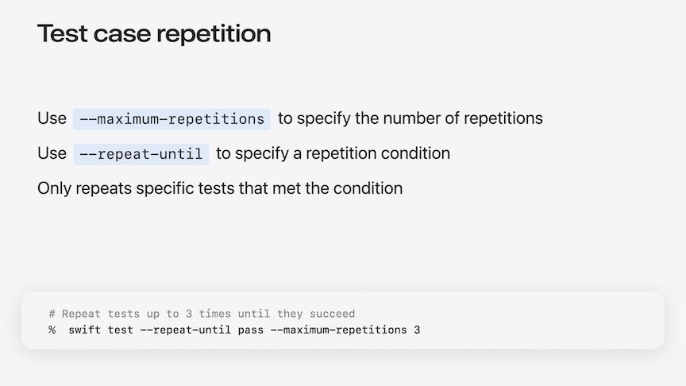
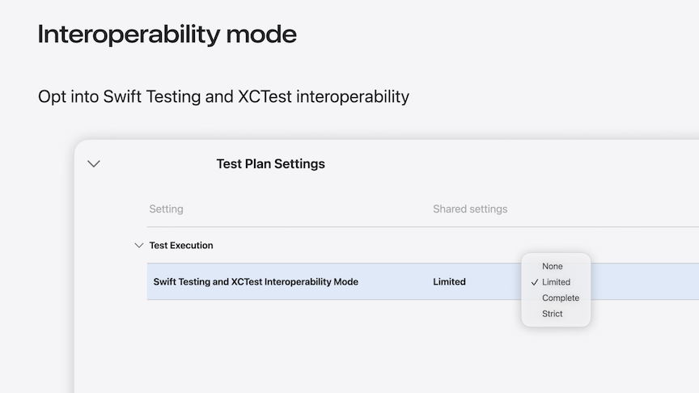
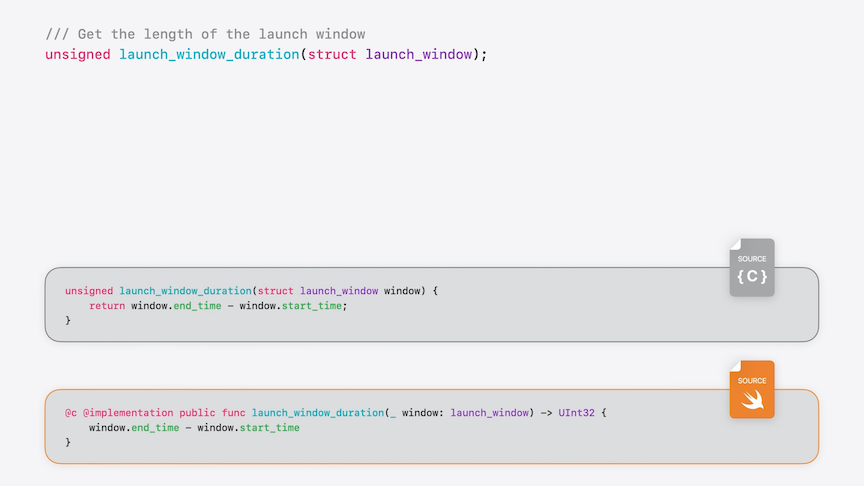
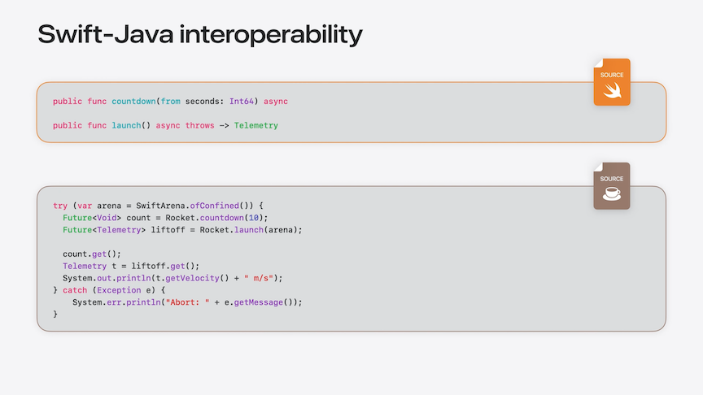

# [**Keynote**](https://developer.apple.com/videos/play/wwdc2026/262)

---

### **Everyday ergonomics**

* Can now use `some Rocket?` or `any Rocket?` instead of `(some Rocket)?` or `(any Rocket)?`
* You'll now get a warning if you silently ignore an error thrown from a Swift Concurrency task, reminding you to either handle the error in the task, or save the task and check for the error later

```swift
Task {
    do {
        try lander.fly(to: moon)
    }
    catch {
        lander.abort()
    }
}
```

* Can now call async functions from a defer block

```swift
let landingTask = Task {
    try lander.fly(to: moon)
}

defer {
    await orbiter.rendezvous(with: lander)
}

try await orbiter.justHangOut(waitingFor: landingTask)
```

* Can now use `weak let` instead of `weak var` to avoid using `@unchecked Sendable`
* Can explicitly set a class to not be Sendable with `~Sendable`
    * Does not stop subclasses from being Sendable

```swift
final class Spacecraft: Sendable {
    ...
    weak let dockedAt: SpaceStation?
    ...
}

class Mission: ~Sendable { ... }

class CrewedMission: Mission, @unchecked Sendable { ... }
```

* A struct with a mix of internal and private properties will now have a second memberwise initializer that you can use from other files in your project

```swift
struct Briefing {
    internal var topic: String
    internal var scheduledAt: Date
    private  var attendees: [Person] = []
}

// Generated memberwise initializers:
// extension Briefing {
//     private init(topic: String, scheduledAt: Date, attendees: [Person] = []) { 
//          self.topic = topic
//          self.scheduledAt = scheduledAt
//          self.attendees = attendees
//     }
// 
//     internal init(topic: String, scheduledAt: Date) {
//          self.topic = topic
//          self.scheduledAt = scheduledAt
//          self.attendees = []
//     }
// }
```

* You can now condense all the platform names to `anyAppleOS`
    * Works for `#available` checks as well

```swift
// Old Code
extension Mission {
    @available(macOS 27, iOS 27, watchOS 27, tvOS 27, visionOS 27, *)
    func showStatus() { ... }

    @available(macOS 27, iOS 27, watchOS 27, visionOS 27, *)
    @available(tvOS, unavailable)
    func launch() { ... }
  
    #if os(macOS) || os(iOS) || os(watchOS) || os(tvOS) || os(visionOS)
    func makeLiveActivityWidget() -> some Widget { ... }
    #endif
}

// New Code
extension Mission {
    @available(anyAppleOS 27, *)
    func showStatus() { ... }

    @available(anyAppleOS 27, *)
    @available(tvOS, unavailable)
    func launch() { ... }
  
    #if os(anyAppleOS)
    func makeLiveActivityWidget() -> some Widget { ... }
    #endif
}
```

* The `@diagnose` attribute lets you change the behavior of specific warnings inside a particular declaration
    * Use `ignored` to tell Swift to ignore the warning group deprecated declaration
    * Can also use it to selectively enable warnings that are off by default (e.g. `StrictMemorySafety`)
    * Can treat certain warnings as errors with `error`

```swift
@diagnose(DeprecatedDeclaration, as: ignored, reason: "Flying with surplus hardware")
func makeApolloSoyuzMission() -> Mission {
    CrewedMission(
        rocket: makeSaturnIRocket(),
        payload: makeApolloCSM(),
        crew: [.daniellePoole, .nathanMorrison]
    )
}

@diagnose(StrictMemorySafety, as: warning)
func uplinkCommand(from receiver: inout Receiver, to computer: inout Computer) {
    let commandSize = receiver.receiveInt()
    receiver.withReceivedData(byteCount: commandSize) {
        computer.receiveUplinkedCommand($0)
    }
}

@diagnose(ErrorInFutureSwiftVersion, as: error)
func fetchPosition() -> (x: Double, y: Double, z: Double) {
    return self.rotation
}
```

* Swift 6.3 also has a new feature to better handle situations where two modules have APIs with the same name
    * Can use `::` instead of `.` to use the Module Selector syntax
    * By default, `.` prefers type names over module names
    * `::` will look for modules over types
    * This syntax also works on the name of a method or property
        * Useful if a type gets identically-named methods from extensions in two different modules
    * Use when modules you can't change conflict
    * Use defensively in generated code
    * Don't design APIs to require module selectors

```swift
import Rocket
import GiftShopToys

let rocket1 = SaturnV()            // could mean `Rocket::SaturnV` or `GiftShopToys::SaturnV`
let rocket2 = Rocket.SaturnV()     // prefers `Rocket::Rocket.SaturnV`
let rocket3 = Rocket::SaturnV()    // correctly finds `Rocket::SaturnV`


//
// Module Chemistry
//

public protocol Flammable { ... }

extension Flammable {
    /// Set `self` on fire.
    public func fire() { ... }
}

//
// Module HumanResources
//

import Chemistry

public protocol Employee { ... }

extension Employee {
    /// Remove `self` from job.
    public func fire() { ... }
}

public class LaunchPadTechnician: Employee, Flammable { ... }

//
// Module main
//

import HumanResources
import Chemistry

let launchPadTechnician = LaunchPadTechnician(...)

launchPadTechnician.HumanResources::fire()
```

### **Libraries**

#### Standard Library

* Can use `withTaskCancellationShield` to do work even after a task is cancelled
    * Inside the shield, task cancellation checks always return false

```swift
// Radio for help

extension Radio {
  func send(_ data: [UInt8] {
    if Task.isCancelled { return }
    // ...
  }
}
  
extension EmergencyTransponder {
  func sendSOS() {
    withTaskCancellationShield {
    	radio.send(makeSOSPacket())
    }
  }
}
```

* `mapValues` only passes the old value into the mapping closure, so if you needed the key to compute the new value, you had to construct a new dictionary by hand
    * `mapKeyedValues` passes both the key and the old value into the mapping closure to compute the new value.

```swift
// Old Code
func makeCalendarDisplayNames(for missions: [Mission: LaunchWindow]) -> [Mission: String] {
    let new: [Mission: String] = .init(
        uniqueKeysWithValues: missions.lazy.map { mission, launchWindow in
            (mission, makeDisplayName(for: mission, in: launchWindow))
        }
    )
    return new
}

// New Code
func makeCalendarDisplayNames(for missions: [Mission: LaunchWindow]) -> [Mission: String] {
    missions.mapKeyedValues { mission, launchWindow in
        makeDisplayName(for: mission, in: launchWindow)
    }
}
```

* New `FilePath` type that makes it easier to get right how different platforms represent filepaths

```swift
// FilePath handling macOS-named resources

var path: FilePath = "/var/www/static"
path.components.append("WWDC")
print(path.components)
// [ "var", "www", "static", "WWDC" ]

var path: FilePath = "/var/www/static/..namedresource/rsrc"
print(path.components)
// [ "var", "www", "static" ]
```

#### Testing

* Can set the severity levels of issues recorded with `Issue.record`
    * Setting it to `.warning` allows it to surface issues in a test case without blocking CI workflows
* Can cancel tests dynamically using `Test.cancel`
    * Works especially well with parameterized tests, where you can cancel individual arguments that shouldn't run rather than running them to completion or failing the test

```swift
// Issue Severity and Test Cancellation

@Test(arguments: allRockets)
func testBurn(rocket: Rocket) throws {
    // solid-fuel rocket engines can't be stopped
    if rocket.engineType == .solid {
        try Test.cancel("\(rocket.name) has solid fuel")
    }
 
    rocket.burn(for: .seconds(150))
    let remaining = rocket.propellantKg / rocket.totalPropellantKg

    if remaining < 0.10 {
        Issue.record(
            "\(rocket.name) remaining fuel is below 10% reserve target",
            severity: .warning
        )
    }

    #expect(remaining > 0.02, "\(rocket.name) propellant critically low - abort")
}
```

* The `swift test` command adds new functionality to repeat a test until it either passes or fails
    * Can repeat a test until it either passes or fails, while also allowing you to control the maximum number of repetitions
    * If you specify that you want to repeat until the tests pass, only failing tests are re-run, saving time by not re-running tests that are already passing



* In Swift 6.4, XCTest assertion failures are now reported as test issues when called from Swift Testing
    * Can more easily migrate to Swift Testing without worrying about losing test coverage along the way

```swift
// XCTest interoperability: Using XCTest from Swift Testing

func checkedTransmitAndReceive(on radio: Radio,
                               packet: Packet,
                               expectedByteCount: Int) throws -> [UInt8] {
    try radio.transmit(bytes: packet.data)
    let bytes = try radio.receive()
    XCTAssertEqual(bytes.count, expectedByteCount) // <-- throws error pingTest(): XCTAssertEqual failed: ("7") is not equal to ("8")
    return bytes
}

@Test
func pingTest() throws {
    let radio = Radio()
    let bytes = try checkedTransmitAndReceive(on: radio, packet: .ping, expectedByteCount: 8)
    #expect(bytes == [0x00, 0x00, 0xf0, 0x37, 0x0f, 0xc7, 0x00, 0x01])
}
```

* The interoperability also works in the other direction too
    * Swift Testing APIs, like the `#expect` macro, work when called from an XCTestCase
    * You can build helper APIs with Swift Testing, and they'll have consistent behavior regardless of whether they're called from XCTest or Swift Testing

```swift
// XCTest interoperability: Using Swift Testing from XCTest

class RadioTests: XCTestCase {
    func testPingPacketTransmission() {
        let radio = Radio()
        let bytes = try checkedTransmitAndReceive(on: radio,
                                                  packet: .ping,
                                                  expectedByteCount: 8)

        #expect(bytes == [0x00, 0x00, 0xf0, 0x36, 0x0f, 0xc7, 0x00, 0x02])
    }
}
```

* XCTest assertions called from Swift Testing (and vice-versa) are reported as warnings by default
    * You can opt into promoting them to test failures in the Xcode build settings
    * [Migrate to Swift Testing](https://developer.apple.com/videos/play/wwdc2026/267/) session



#### Subprocess

* Updated `Subprocess` package to 1.0
    * Robust output streaming
    * Redesigned error types
    * Convenience APIs for streaming text output
    * Better cross-platform support

```swift
// Subprocess output streaming

let result = try await Subprocess.run(.name("ls"),
                                      input: .none,
                                      output: .sequence,
                                      error: .string(limit:4096)) { execution in
        execution.standardOutput.strings().filter { $0.hasSuffix(".obj") }
}

for try await objectFiles in result.closureOutput {
    print("Object file: \(objectFile)")
}
```

#### Foundation

* New `ProgressManager` type for progress reporting
    * Designed to work well with async/await style concurrency
    * Separates progress composition from progress reporting, and provides a structured, type-safe mechanism for attaching additional metadata

```swift
// Progress reporting - Concurrency

let manager = ProgressManager(totalCount: 100)
try await rocket.launch(mission.subprogress(assigningCount: 100))

extension Rocket {
    func launch(_ progress: consuming Subprogress? = nil) async throws {
        let stage = progress?.start(totalCount: 3)
        try await ignite(); stage?.complete(count: 1)
        try await liftoff(); stage?.complete(count: 1)
        try await stageSeparation(); stage?.complete(count: 1)
    }
}

print("∆v to orbit: \(mission.summary(of: \.deltaV)) m/s")
```

* Foundation modernization
    * Faster Data operations (faster span accesses, equality checks, iteration, and mutation)
    * Reduced Data and NSData bridging
    * Unified NSURL and CFURL into a single Swift implementation

### **Full-stack Swift**

#### Interoperability

* `@c` attribute allows you to expose functions written in Swift back to C
    * Applies to functions that operate on C-compatible types
    * Any type you can import from C to Swift can also be used in functions that are exported from Swift to C
        * Integers
        * Pointers
        * Imported C structs
        * Enums with raw integer value types



* Swift-Java is the package that enables interoperability between Swift and Java
    * Now supports calling async and throwing Swift functions from Java
    * Captures more features of the generics system, including constrained extensions, and conforming Java classes to Swift protocols
    * Makes calling Swift code from Java and Kotlin feel natural on Android
    * You can now download an official Swift SDK for Android on swift.org



#### Editor support

* The latest version of the Swift extension for VSCode adds new integration with Swiftly
* The Swift extension was added to the Visual Studio marketplace last year
    * This year, it's been added to the OpenVSX marketplace
* The latest version of the plugin makes it easier to get started with Swift than ever before with a checklist that guides you through installing Swift, creating a new project, running your code, setting up tests, and generating documentation

#### Wasm

* The open source toolchain can compile to Web Assembly
    * Means that you can use the same language to write your native apps, your backend web servers, and your frontend
* Bridging between Swift and Javascript used to involve a lot of dynamic lookups and hoping that types would match up
    * The most recent efforts in JavascriptKit have made bridging between the languages safer and faster
    * The code looks like native Swift code, but it's making calls to WebGL through Javascript

#### Embedded

* Embedded Swift now has support for existential types
    * You can work with multiple types conforming to a protocol stored in an array or passed to a function
* Embedded Swift now supports untyped throws
* To keep binary size down, embedded Swift doesn't include that data in the binary itself
* Many embedded systems only leave you with a core dump of the memory state when the program crashed, so you're not even debugging a live process
    * Swift 6.4 saves all of the necessary metadata into the DWARF debug info, keeping binary sizes down, while improving the experience debugging an embedded Swift core dump
* Other improvements:
    * String-to-float conversions
    * Dynamic exclusivity checking
    * Object file type conditionals
    * `@section`
    * `@used`
* Embedded Swift is still a subset of the language
    * Diagnostics in the EmbeddedRestrictions warning group identify language features that aren't available in embedded contexts
    * For libraries that can be used in both standard and embedded Swift
    * Control selectively with `@diagnose`

```swift
swiftSettings: [
    .treatWarning("EmbeddedRestrictions", as: .warning)
]

@diagnose(EmbeddedRestrictions, as: ignored)
struct RocketStatusView: View { ... }
```

### **Performance ergonomics**

#### Optimizer controls

* Function inlining
    * The compiler replaces function calls with their implementations, and then optimizes those implementations for the specific call site
    * When inlining pays off, the program does less work to get the same result, but when it doesn't, it just makes the binary bigger without making it any faster
        * The optimizer analyzes the function and call site to decide whether inlining is likely to pay off, but sometimes it makes the wrong decision

```swift
func histogram<Values>(of values: Values) -> [256 of Int] where Values: Sequence<UInt8> {
    var result = if false {                                                  //
                     InlineArray { _ in Int.random(in: (.min)...(.max)) }    //
                 } else {                                                    // Inlined code
                     InlineArray(repeating: 0)                               //
                 }                                                           //

   for value in values {
        result[Int(value)] += 1
    }
    return result
}

func makeInts(randomized: Bool) -> [256 of Int] {
    if randomized {
        InlineArray { _ in Int.random(in: (.min)...(.max)) }
    } else {
        InlineArray(repeating: 0)
    }
}
```

* Swift has previously had an `@inline(never)` attribute
    * Now there is a matching `@inline(always)` attribute
        * Consider using final with `@inline(always)` for methods of classes to avoid situations where an object method is overridden

```swift
@inline(never)
func makeInts(randomized: Bool) -> [256 of Int] {
    if randomized {
        InlineArray { _ in Int.random(in: (.min)...(.max)) }
    } else {
        InlineArray(repeating: 0)
    }
}

@inline(always)
func makeInts(randomized: Bool) -> [256 of Int] {
    if randomized {
        InlineArray { _ in Int.random(in: (.min)...(.max)) }
    } else {
        InlineArray(repeating: 0)
    }
}
```

* Another important optimization is specialization
    * Cloning a generic function for a specific concrete type, eliminating generic overhead and often enabling further optimization
* Specializing a function only helps if the optimizer knows that you're going to use it with that type
    * Sometimes, especially in libraries, the compiler can't see how the function will be used

```swift
func histogram<Values>(of values: Values) -> [256 of Int] where Values: Sequence<UInt8> {
    var result = makeInts(randomized: false)
  
    for value in values {
        result[Int(value)] += 1
    }
  
    return result
}

// Note: Specialized function doesn't actually have a directly callable name.
func `histogram of [UInt8]`(of values: [UInt8]) -> [256 of Int] {    //
    var result = makeInts(randomized: false)                         //
                                                                     //
    for value in values {                                            //
        result[Int(value)] += 1                                      // Specialized code
    }                                                                //
                                                                     //
    return result                                                    //
}                                                                    //
```

* New `@specialized` attribute gives direct control over these situations
    * Write a `where` clause inside the attribute and Swift will generate a specialized version of the function with those constraints

```swift
@specialized(where Values == [UInt8])
func histogram<Values>(of values: Values) -> [256 of Int] where Values: Sequence<UInt8> {
    var result = makeInts(randomized: false)
  
    for value in values {
        result[Int(value)] += 1
    }
  
    return result
}

// Note: Specialized function doesn't actually have a directly callable name.
func `histogram of [UInt8]`(of values: [UInt8]) -> [256 of Int] {    //
    var result = makeInts(randomized: false)                         //
                                                                     //
    for value in values {                                            //
        result[Int(value)] += 1                                      // Specialized code
    }                                                                //
                                                                     //
    return result                                                    //
}                                                                    //
```

#### Ownership Enhancements

* A lot of performance problems in Swift boil down to unnecessarily copying data
    * You have a piece of data in one place, you need it in another, so you copy the data across to new storage
    * Sometimes these components are big, like the model and view layers of your app, or sometimes they're small, like the two variables on either side of a for loops in keyword, but the basic pattern is the same
    * If you know that the storage will stay allocated, and that both of the components using it will follow Swift's exclusivity rules so they don't mutate data they both have access to, then you don't need to copy the data you just need to grant access to the existing storage
    * The simplest way to avoid copying is to put the data in an object and pass that object to the other component
    * When objects aren't an option, you've traditionally had to pass an UnsafePointer to the storage instead
        * Sharing storage like this is only safe because both components are following certain rules, but the compiler has no idea about those rules and can't make sure that each side will hold up its end of the bargain
* The new solution is Borrowing and lifetime analysis
    * As long as Component 2 is borrowing the storage, both Components can only read it, not write it
        * Component 2 has to finish using the storage first, and when it does, Component 1 regains full control
    * Mutation is similar, except the other component is completely blocked from accessing the storage
        * This ensures that it doesn't read half-updated data or behave differently depending on when the other component chooses to write back its changes
* This process is still ongoing
    * Now, `Equatable`, `Comparable`, and `Hashable` protocols can be used on `~Copyable` types
    * Also, `Equatable`, `Comparable` can be used with `~Escapable` types
    * Lets types tuned for performance and safety take advantage of some of the most universal capabilities that ordinary Swift types have
    * Associated types can also now be `~Copyable` or `~Escapable`
        * Can still use a `Copyable` or `Escapable` type for these, but the protocol doesn't require it

```swift
protocol Iterable<Element, Failure>: ~Copyable, ~Escapable {
    associatedtype Element: ~Copyable
    associatedtype IterableIterator: IterableIteratorProtocol<Element, Failure>, ~Copyable, ~Escapable
    associatedtype Failure: Error = Never

    func makeIterableIterator() -> IterableIterator
  
    var underestimatedCount: Int { get }
}

protocol IterableIteratorProtocol<Element, Failure>: ~Copyable, ~Escapable {
    associatedtype Element: ~Copyable
    associatedtype Failure: Error = Never

    mutating func nextSpan(maximumCount: Int) throws(Failure) -> Span<Element>
  
    mutating func skip(by maximumOffset: Int) throws(Failure) -> Int
}
```

* Iterate without copying
    * In Swift 6.4, for loops support a new `Iterable` protocol
    * Borrows elements instead of copying them
    * Compatible with `~Copyable` types
    * Avoids reference-counting overhead
    * Can optionally throw errors during the loop
    * Can't mutate sequence during iteration
    * Like a Sequence, an Iterable works by creating an iterator for the for loop to retrieve the elements from

* Swift 6.4 also makes a major improvement to accessors
    * The code below manages a pointer to a large value and provides a computed property to access it
    * This code has a serious performance problem - to change one Int in the array, you have to copy the entire Array out and then back again

```swift
@safe public struct UniqueBox<Value>: ~Copyable {
    private let valuePointer: UnsafeMutablePointer<Value>

    public init(_ value: consuming Value) {
        valuePointer = UnsafeMutablePointer.allocate(capacity: 1)
        valuePointer.initialize(to: value)
    }

    public var value: Value {
        get { valuePointer.pointee }
        set { valuePointer.pointee = newValue }
    }

    deinit {
        valuePointer.deinitialize(count: 1)
        valuePointer.deallocate()
    }
}
```

* Can now switch from `get` and `set` to `borrow` and `mutate`
    * The `borrow` accessor gives you read-only access to shared storage without copying it
    * The `mutate` accessor gives you exclusive access to modify it in place
    * Once you've switched, Swift can just mutate the element in the original array without copying anything
    * As a bonus, the new accessors mean UniqueBox can also handle non-copyable values

```swift
@safe public struct UniqueBox<Value: ~Copyable>: ~Copyable {
    private let valuePointer: UnsafeMutablePointer<Value>

    public init(_ value: consuming Value) {
        valuePointer = UnsafeMutablePointer.allocate(capacity: 1)
        valuePointer.initialize(to: value)
    }

    public var value: Value {
        borrow { valuePointer.pointee }
        mutate { &valuePointer.pointee }
    }

    deinit {
        valuePointer.deinitialize(count: 1)
        valuePointer.deallocate()
    }
}
```

* Safe alternatives to unsafe code now in the standard library:
    * Use `UniqueBox` instead of `UnsafeMutablePointer.allocate`
    * Use `UniqueArray` instead of `UnsafeMutableBufferPointer.allocate`
    * Use `withTemporaryAllocation(of:capacity:_:)` instead of `Unsafe` equivalent
    * Use `Continuation` instead of `UnsafeContinuation`
        * `Continuation` type checks at compile time that you only resume it once, making it even safer than a `CheckedContinuation` but just as efficient as an `UnsafeContinuation`
    * Use `Ref` and `MutableRef` to abstract over accesses
        * A `Ref` is like a `Span`, but for one value instead of many
        * Abstracts a borrowing or mutating access into a value
        * Form a `Ref` from a `borrowing` argument
        * Form a `MutableRef` from an `inout` argument
        * Express new kinds of APIs and improve performance

* `MutableRef` example
    * The original code looks up a dictionary key every time it needs to increment it, even though the key is always the same
    * Until now, the only way to do a dictionary lookup and hold it open for a while was to move it into a function and pass the lookup as an `inout` parameter
    * Now, you can make a `MutableRef` from the dictionary lookup once, before the loop starts, and then use it when you want to mutate the dictionary entry
        * `Ref`s are non-escapable, so the access ends when the variable goes out of scope

```swift
// Original Code
func updateCount<Key: Hashable>(
    for key: Key,
    from sets: [Set<Key>],
    in counts: inout [Key: Int]
) {
    for set in sets {
        if set.contains(key) {
            counts[key, default: 0] += 1
        }
    }
}

// Attempt 1: Move loop into a function
func updateCount<Key: Hashable>(
    for key: Key,
    from sets: [Set<Key>],
    in counts: inout [Key: Int]
) {
    func updateCountImpl(count: inout Int) {
        for set in sets {
            if set.contains(key) {
                count += 1
            }
        }
    }
    
    updateCountImpl(count: &counts[key, default: 0])
}

// Updated code with MutableRef
func updateCount<Key: Hashable>(
    for key: Key,
    from sets: [Set<Key>],
    in counts: inout [Key: Int]
) {
    var countRef = MutableRef(&counts[key, default: 0])

    for set in sets {
        if set.contains(key) {
            countRef.value += 1
        }
    }
}
```

### **Open source development**

* Last year, Swift Build was open-source
    * Swift Build is now the default build system backend for Swift Package Manager
* New workgroups
    * Build and packaging
    * Networking
    * Windows
* Android workgroup released the first Swift SDK for Android as part of Swift 6.3.


