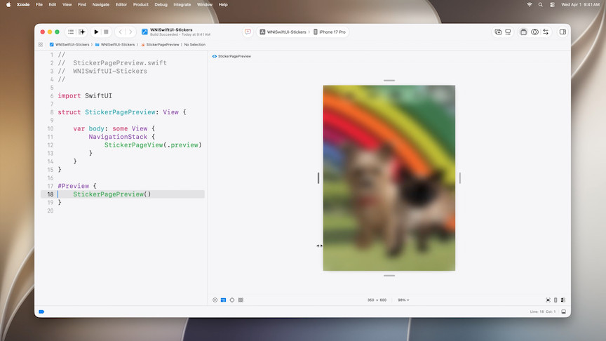
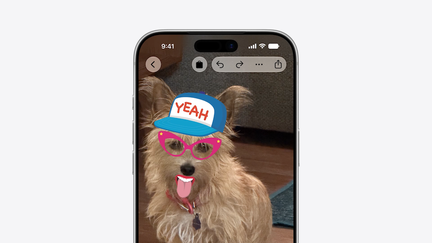
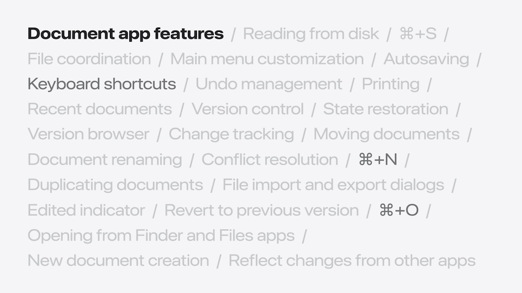
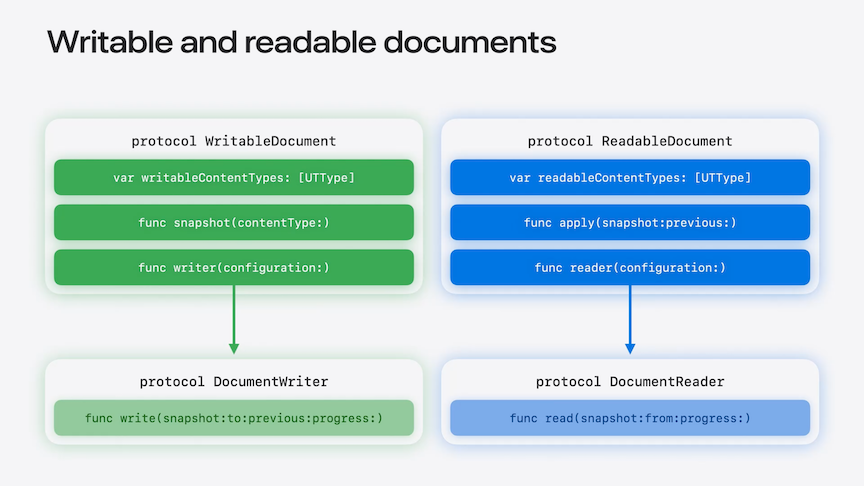
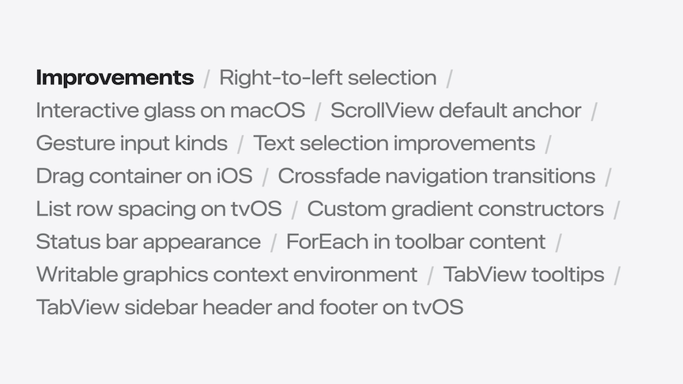
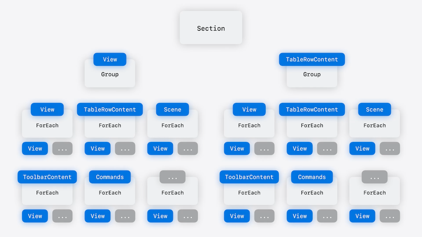

# [**What's New in SwiftUI**](https://developer.apple.com/videos/play/wwdc2026/269/)

---

### **Refreshed look and feel**

* Automatically works with new Liquid Glass opacity slider
* On macOS, like on iOS, you can mark Liquid Glass custom elements as "interactive" so they respond more fluidly to user's clicks
* iPad apps automatically take on a distinct appearance when inactive, with the icons and text dimming to reinforce which window is active
* new `appearsActive` environment variable to know when a view is in the foreground or not

```swift
struct SidebarFooterView: View {
    @Environment(\.appearsActive) private var appearsActive

    var body: some View {
        MyAccountView()
            .opacity(appearsActive ? 1 : 0.5)
    }
}
```

* iPad and Mac Menu Bars now have a minimal set of icons by default, reserving them for key actions
    * You can apply the `.labelStyle(.titleAndIcon)` modifier menu items to show its icon

```swift
CommandMenu("Stickers") {
    Button { openStore() } label: {
        Label("Store", systemImage: "bag.fill")
            .labelStyle(.titleAndIcon)
    }
    // Other menu items
}
```

* Live Previews now have resize handles, so you can view how the app responds to being interactively resized
* Resizability
    * SwiftUI apps gain a lot of resize functionality automatically
    * If the app uses UIKit and SwiftUI, you may need to make sure you are:
        * Checking screen geometry
        * Using size classes instead of idiom
        * Responding to interface orientation
    * [Modernize your UIKit app](https://developer.apple.com/videos/play/wwdc2026/278/) session



* New `.prominent` tab role displays the tab on the bottom trailing edge of the screen on iPhone

```swift
TabView {
    Tab { EventsTab() }
    Tab { HolidaysTab() }
    Tab { FunTab() }

    Tab(role: .prominent) {
        CartTab()
    }
}
```

* New toolbar button APIs for visibility priority
    * `.visibilityPriority(.high)` can be used to prioritize which buttons should be shown when space becomes constrained
    * `ToolbarOverflowMenu { ... }` can be used to *always* place items in an overflow menu
    * `.topBarPinnedTrailing` placement can be used to make sure a button is never hidden, and placed in the trailing position

```swift
// Toolbar item visibility priority

StickerPageView()
    .toolbar {
        ToolbarItemGroup {
            UndoButton()
            RedoButton()
        }
        .visibilityPriority(.high)
        ToolbarOverflowMenu {
            ChoosePhotoButton()
            ExportAsImageButton()
            ClearAllStickersButton()
        }
        ToolbarItem(placement: .topBarPinnedTrailing) {
            ShareButton()
        }
    }
```



* Use `.toolbarMinimizeBehavior(.onScrollDown, for .navigationBar)` to scroll the navigation bar out of the way when the user scrolls

```swift
// Minimize toolbar when scrolling

ScrollView {
    StickerListView()
}
.toolbarMinimizeBehavior(.onScrollDown, for: .navigationBar)
```

### **Document-based apps**

* Lots of functionality out of the box
    * Keyboard shortcuts (Command-N for new document, Command-O for open documents, etc.)
    * Editing indicator that tells you when a document has changes
    * Autosave mechanism
    * More...



#### Document creation context

* Use the new `DocumentCreationSource` API to declare sources
* Add `NewDocumentButton` for each source to the launch scene
* SwiftUI will pass the source to the document creation closure via the context parameter

```swift
// Use the context to create a document

@main
struct Stickers: App {
    var body: some Scene {
        DocumentGroupLaunchScene("Create a Sticker Page") {
            NewDocumentButton("New Sticker Page", source: .blank)
            NewDocumentButton("Sticker Page from Photo…", source: .photo)
        }
       
        DocumentGroup { document in
            StickerPageDocumentView(document)
        } { configuration, context in
            StickerPageDocument(configuration: configuration, context: context)
        }
    }
}
  
extension DocumentCreationSource {
    static let blank = Self(id: "blank")
    static let photo = Self(id: "photo")
}
```

#### Performance

* Apps are opted into the document architecture by declaring a DocumentGroup as the first Scene in the app's body
* Below, the `StickerDocument` class describes the document type
    * Provides data to the views and describes how to read data from disk and write it back
    * The Document API works in conjunction with the modern Observation framework
        * Using `@Observable` provides a performance boost - views only update when a property they depend on changes
* Conforming to the `WritableDocument` protocol allows a document to be written to. It has three requirements:
    * A list of formats the app can write
    * The snapshot method that returns the current document content for writing
        * A custom `PageSnapshot` struct is used below to represent the content
    * A `Writer`, which conforms to the `DocumentWriter` protocol, and knows how to write a document to disk in a specified format

```swift
@main
struct Stickers: App {
    var body: some Scene {
        DocumentGroup { /* ... */ }
        WindowGroup { /* ... */ }
    }
}

@Observable
final class StickerDocument: WritableDocument {
    
    static let writableDocumentTypes: [UTType] = [.stickerDocument]
  
    @MainActor
    func snapshot(contentType: UTType) async throws -> sending PageSnapshot {
        makeSnapshot()
    }
      
    func writer(configuration: sending WriteConfiguration) -> sending Writer {
        Writer(contentType: configuration.contentType)
    }
}

import UniformTypeIdentifiers

extension UTType {
    static let stickerDocument = UTType(exportedAs: "stickerdocument")
}

struct PageSnapshot {
    var background: Image
    var metadata: StickerPlacements
    var stickers: [Image]
}

struct StickerPlacements { /* ... */ }
```

* The `DocumentWriter` protocol has a notion of a `Snapshot`
    * The only requirement is a `write` method
    * The `write` method offers multiple opportunities to optimize performance
        * The `write` method is nonisolated and asynchronous, which allows expensive disk writes to happen in the background
        * By comparing the current and previous snapshots, only the parts of the package that need to be updated are written
        * The `progress` parameter allows reporting of writing progress using the Foundation `Subprogress` API

```swift
struct Writer<Snapshot>: DocumentWriter {
    typealias Snapshot = PageSnapshot
  
    let contentType: UTType
    
    nonisolated func write(
        snapshot: sending PageSnapshot, to destination: URL,
        previous: sending PageSnapshot?, progress: consuming Subprogress
    ) async throws {
        // report progress…
        // write .stickerDocument
    }
}
```

* To read from disk, conform to the `ReadableDocument` protocol
* A twin to `WritableDocument`, they compare in functionality
    * Each protocol requires a list of supported content types
    * WritableDocument provides a snapshot and ReadableDocument knows how to apply it
    * `WritableDocument` works with the `DocumentWriter` protocol, while `ReadableDocument` works with `DocumentReader` to do the disk read/write lifting

```swift
extension StickerDocument: ReadableDocument { ... }
```



#### First-class support for URL access

* For people that don't have the app, we can add support for other formats, like PNG
    * Add `.png` to the writable content types
    * In the `WritableDocument` `write` method, add content type checks
    * For .png, use CoreGraphics to flatten into a single image and write it to a URL

```swift
@Observable
final class StickerDocument: WritableDocument {
  
    static let writableContentTypes: [UTType] = [.stickerDocument, .png]
}

struct Writer<Snapshot>: DocumentWriter {
    typealias Snapshot = PageSnapshot

    let contentType: UTType

    nonisolated func write(
        snapshot: sending PageSnapshot, to destination: URL, 
        previous: sending PageSnapshot?, progress: consuming Subprogress
    ) async throws {
        if contentType.conforms(to: .stickerDocument) {  
            // write .stickerDocument
        } else if contentType.conforms(to: .png) {
            let context = CGContext(/* ... */) 
            context.draw(/* ... */)
        }
    }
}
```

### **Presentation and interaction**

* New Reorderable API
    * Add the `reorderable()` modifier to `ForEach`
    * Add `reorderContainer(for:) { ... }` to the `List`
        * Update the collection in the closure
        * The example uses the [swift-collections](https://github.com/apple/swift-collections) package to commit the ordering changes

```swift
List {
    ForEach(stickers) { sticker in
        StickerListItemView(sticker: sticker)
    }
    .reorderable()
}
.reorderContainer(for: Sticker.self) { difference in
    difference.apply(to: &stickers)
}

import OrderedCollections // from https://github.com/apple/swift-collections

extension ReorderDifference where CollectionID == ReorderableSingleCollectionIdentifier {
    func apply(to values: inout [some Identifiable<ItemID>]) {
        var dictionary = OrderedDictionary(uniqueKeys: values.map { $0.id }, values: values)
        let destinationOffset: Int? = switch destination.position {
        case .before(let destination):
            dictionary.keys.firstIndex(of: destination)
        case .end:
            nil
        }
        dictionary.move(keys: sources, to: destinationOffset ?? values.endIndex)
        values = dictionary.values.elements
    }
}
```

* You can also use the Reorderable API with grids as well
    * Works on watchOS as well
* [Code-along: Build powerful drag and drop in SwiftUI](https://developer.apple.com/videos/play/wwdc2026/271/) session

```swift
LazyVGrid {
    ForEach(stickers) { sticker in
        StickerListItemView(sticker: sticker)
    }
    .reorderable()
}
.reorderContainer(for: Sticker.self) { difference in
    difference.apply(to: &stickers)
}
```

* Swipe actions have previously worked on `List`

```swift
List {
    ForEach(stickers) { sticker in
        StickerListItemView(sticker: sticker)
            .swipeActions {
                DeleteButton(sticker: sticker)
            }
    }
}
```

* Now they can be added to any view, like `LazyVStack`
    * Add `.swipeActions` to the item view like normal
    * Add `.swipeActionsContainer()` to the ScrollView

```swift
ScrollView {
    LazyVStack {
        ForEach(stickers) { sticker in
            StickerListItemView(sticker: sticker)
                .swipeActions {
                    DeleteButton(sticker: sticker)
                }
        }
    }
}
.swipeActionsContainer()
```

* `.confirmationDialog` now supports the same item-binding pattern that sheets use

```swift
struct StickerCanvasView: View {
    var stickers: [Sticker]
    @State private var stickerToDelete: Sticker?

    var body: some View {
        ZStack {
            ForEach(stickers) { sticker in
                PlacedStickerView(sticker: sticker)
                    .contextMenu {
                        Button(role: .destructive) {
                            stickerToDelete = sticker
                        } label: {
                            Label("Delete", systemImage: "trash")
                        }
                    }
            }
        }
        .confirmationDialog(
            "Delete?", item: $stickerToDelete
        ) { sticker in
            DeleteStickerButton(sticker)
        }   
    }
}
```



### **Data flow and performance**

* Improvements to AsyncImage
    * In 27 releases, `AsyncImage` now supports standard HTTP caching, so images are cached by default
    * Respects the server's cache headers
    * No code changes required, enabled automatically for every app
    * Can construct your own `URLRequest` and pass it to `AsyncImage`
    * Can also instantiate your own custom URLSession and configure a URLCache with whatever capacity you need and then use my session by passing it to the `asyncImageURLSession` modifier

```swift
@Observable class StickerStore {
    static let imageSession: URLSession = {
        let config = URLSessionConfiguration.default
        config.urlCache = URLCache(
            memoryCapacity: 64 * 1024 * 1024,
            diskCapacity: 256 * 1024 * 1024)
        return URLSession(configuration: config)
    }()
}

ForEach(pets) { pet in
    AsyncImage(request: URLRequest(
        url: pet.imageURL,
        cachePolicy: .returnCacheDataElseLoad)
    )
}
.asyncImageURLSession(StickerStore.imageSession)
```

* In prior iOS releases, new instances of `StickerStore` would be created every time the view is recreated (when the parent view is updated)
    * The initial one was still being stored in the state variable, and the new one is just discarded
* With iOS 27, `@State` vars are now lazy, and will only be initialized once
    * `@State` is now a macro instead of a dynamic property
    * This has been backported to iOS 17 and aligned releases

```swift
@Observable class StickerStore { }

struct StickerStoreView: View {
    // store is now lazily initialized, only
    // created once for the lifetime of the view
    @State private var store = StickerStore()

    var body: some View {
        // ...
    }
}
```

* The new `@State` macro is a breaking change in code like the following
    * Error shown in the init when trying to re-create `page`
    * Resolved by removing the unnecessary default value assignment
    * For additional details about how the State macro may impact your code, check out the [documentation](https://developer.apple.com/documentation/swiftui/state())

```swift
// Original code
struct StickerPageView: View {
    @State private var page = StickerPage()
    let title: String
    
    init(title: String) {
        self.page = StickerPage(title: title) // Variable 'self.title' used before being initialized
        self.title = title
    }
    
    var body: some View {
        // ...
    }

// Updated code
struct StickerPageView: View {
    @State private var page: StickerPage // Removed default value to fix error
    let title: String
    
    init(title: String) {
        self.page = StickerPage(title: title)
        self.title = title
    }
    
    var body: some View {
        // ...
    }
}
```

* Improvements to the `The compiler is unable to type-check this expression in reasonable time` error
* An example of why this error happens:
    * Start with a `View` that has a `Section`, a `Group`, and a `ForEach` wrapping its content
    * To type check this expression, first the compiler has to select which overload of Section to use
    * `Section` can be initialized with a builder that produces either a `View`, or `TableRowContent`
        * To know which one to use, the compiler has to try both options
    * For this example, the `Section` builder returns a `Group`
    * The compiler can't know what type of content section produces until it figures out the type of the nested group's content
    * This time, there are even more options, and for the nested `ForEach` the compiler will have to try each one
    * Then, ForEach's builder has its own set of options that will also need to be checked
    * As things get more complicated, the check to assess the correct path on the decision tree gets more complicated



* In the 27 releases, the most common set of builders now share a single initializer, leaving just one straightforward path
* `ContentBuilder` makes this possible
    * A step towards enabling unified builders across all of SwiftUI's APIs
    * Can be used with any minimum deployment target - it's an evolution on `ViewBuilder`

```swift
@ContentBuilder
func stickerLibraryView() -> some View {
  // ...
}
```

* New Agentic coding skills
    * SwiftUI Specialist Skill
    * What's New in SwiftUI Skill
    * Both available in Xcode 27
    * Use `xcrun agent skills export` command to export these skills into markdown files for use in other agents
    * 