# [**What's New in Xcode 27**](https://developer.apple.com/videos/play/wwdc2026/258)

---

### **Workspace**

#### Toolbar

* Some controls that were previously in the jump bar, like history navigation and editor controls, have moved up into the Toolbar
* Activity information, like build progress, appears under the window title
* In the center is the new entry point for working with coding agents, and the scheme and destination picker
* In the top right, controls for adding tabs and editor panes, customizing your editor's settings, and a 3-way chooser for swapping between editor modes
    * The first option displays previews & playgrounds in the canvas
    * The second reveals related content in the Assistant Editor
    * The last enters a mode to review source control changes

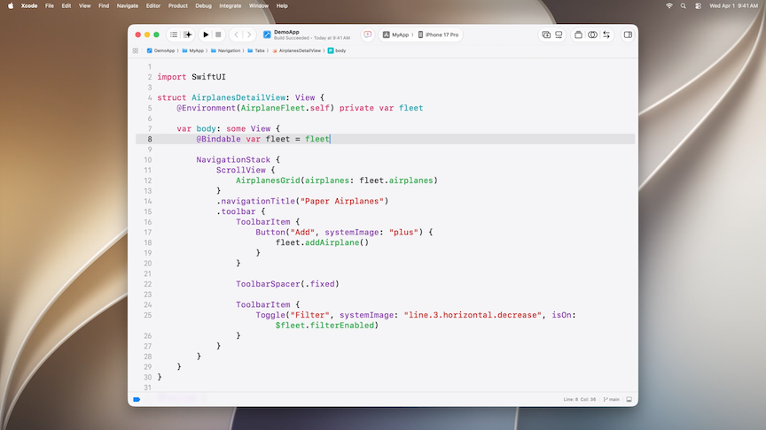

* The branch picker has moved to the bottom bar where it can more easily fit long branch names

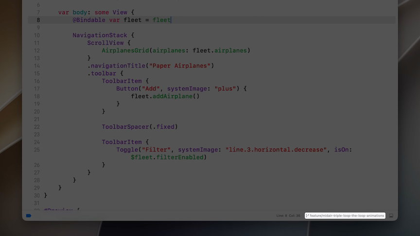

* The toolbar is now fully customizable
    * Can add/remove, and reorder items

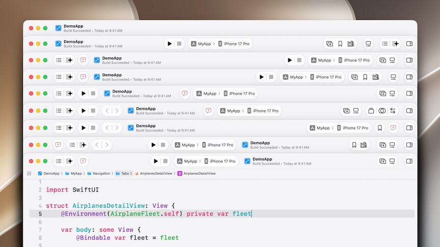

#### Themes

* Xcode 27's new themes have presets, but you can also tune a theme
    * New `Appearance` panel in Xcode's setting window
    * The standard theme has been revamped to be brighter and more colorful
    * Can use sliders to adjust intensity of text and background colors
        * Background color turns into a gradient at full
    * Can change tints as well
    * Can browse a list of presets, as well as import themes
    * Fonts are customizable as well
    * Can pick separate themes per workspace

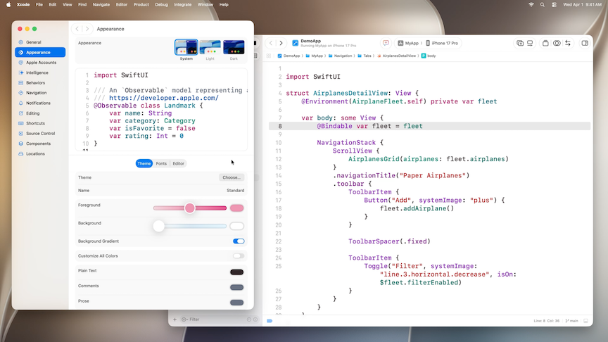

#### Issues

* Warnings and errors have also been revamped to work with the new themes
    * Predictive or "live" issues have a new subtle look to them to reduce distractions while you type. And to differentiate them from warnings and errors you get when you build
    * As you make changes, code will automatically predict issues as if you were going to kick off a new build
        * These predictions use a subtle background that blends in with your theme so you can keep your focus primarily on what you're typing
        * When you build, the subtle predictions will either turn into build warnings and errors with a full intensity color or they will be dismissed if they were resolved

### **Projects and files**

* File -> New -> Project process has been simplified
    * Only step is to choose from a list of starting points, depending on the kind of project:
        * App (SwiftUI for iPhone, iPad, and Mac)
        * Command Line Tool
        * Package
        * Playground
        * Other Templates (other apps, libraries, games, etc.)
    * From there, the project is created with no other questions asked
    * When ready, you can give it a name and choose where to save it, or just discard it

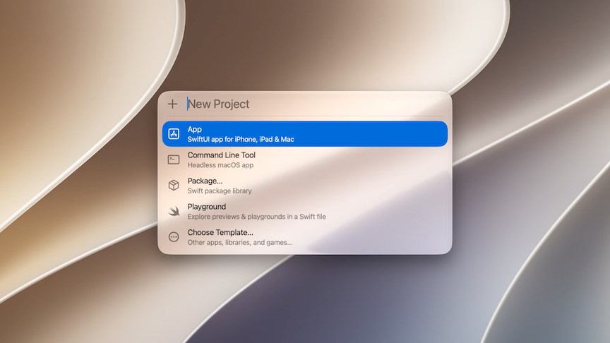

* Opening just a Swift file opens the file up in a new workspace window, even if it's not part of a project
    * Can display playground results and UI previews in the canvas

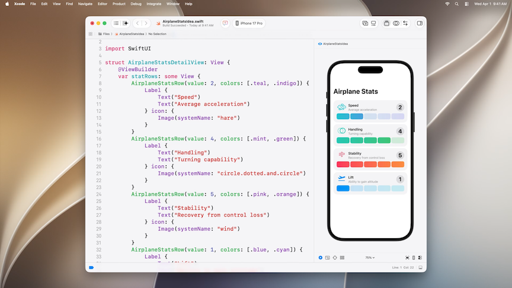

### **Intelligence**

* The transcript has moved into the editor pane, so you can compose it with other editors with tabs or splits
* The editor also includes an easy way to see what the agent changed and any artifacts that got produced
* New "new conversation" button in the toolbar
    * The conversation appears as an editor, so it can be organized within your workspace (instead of only in the sidebar)

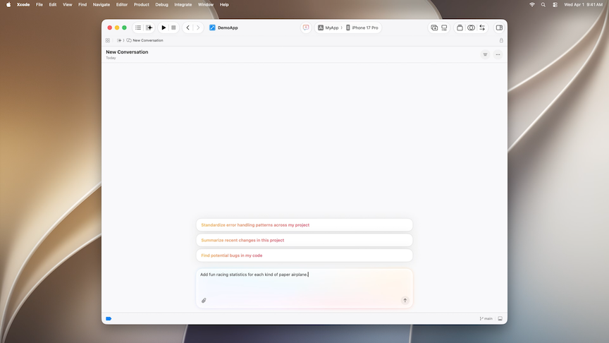

* Use `/plan` to use the plan tool when starting a conversation
    * The agent will gather necessary context for the plan without making changes
    * It can also kick off sub-agents to work in parallel
    * The agent can ask questions to allow you to provide guidance
    * Once the plan is ready, you can read it over, give inline feedback, or have the agent go ahead with implementation
* As the agent works, any changes it makes to the codebase appear on the right-hand side
    * Any produced files, artifacts, or screenshots will appear here as well
    * The agent can interact with the app in the simulator and in previews

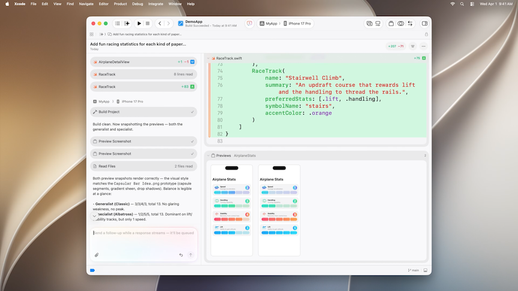

* Coding Assistant sidebar still exists
    * Contains a list of my other agent conversations and tasks that may be happening in parallel
        * Can check in on conversations and see if they need any input or have unread messages
* [Xcode, agents, and you](https://developer.apple.com/videos/play/wwdc2026/259/) session

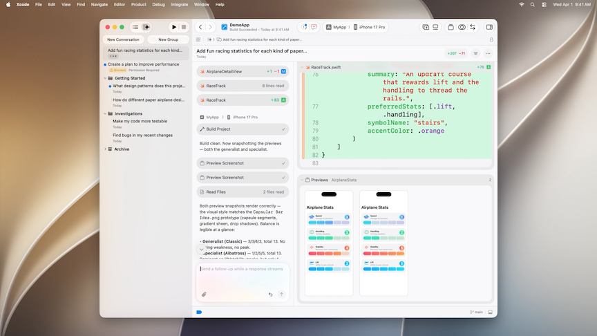

### **Running apps**

* When launching an app on a simulator, it will open as a new window in Device Hub
    * Device Hub lets you explore and evaluate your app across simulators and physical devices
* Device hub will open by default in a compact
* Can use the double arrow button on the top right to enter expanded mode
    * Gives more space and access to more controls

Compact Mode                               | Expanded Mode
-------------------------------------------|--------------
 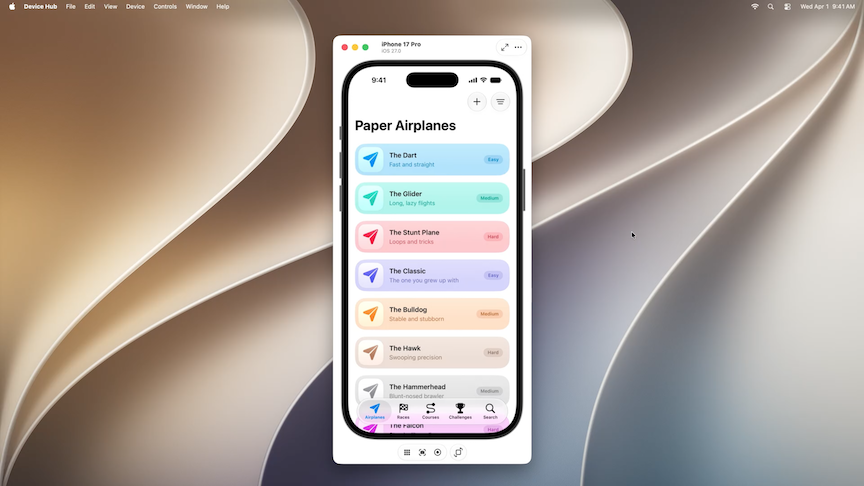 | 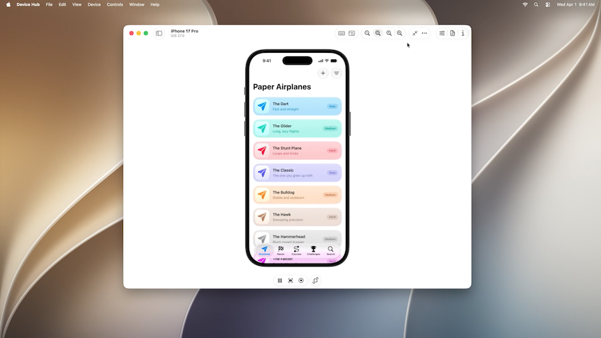

* Quick actions on the bottom for going home, taking a screenshot, or rotating the device
* Can open the Inspector to change many app settings
    * Appearance (light/dark mode)
    * Liquid glass slider
    * Text size and other accessibility options
    * And more

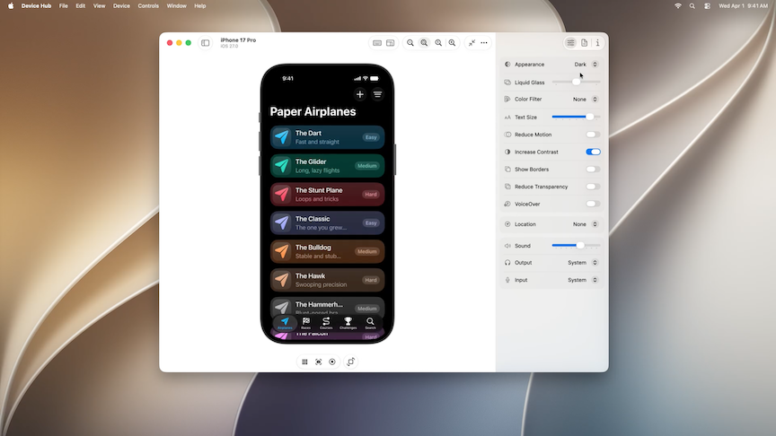

* New resize mode to resize for custom device sizes (like in iPhone Mirroring, or more likely - a folding iPhone)
    * Can try out different aspect ratios and content sizes

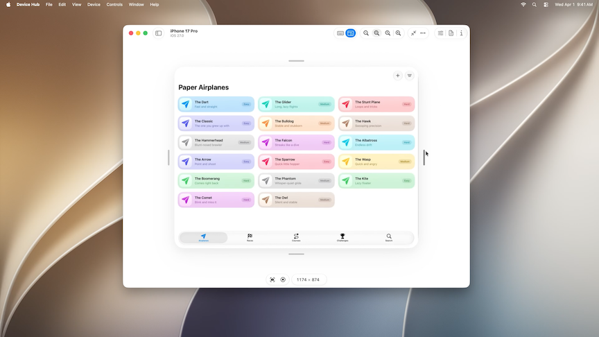

* Everything shown so far also works with physical devices
    * Can see and control devices in Device Hub, just like iPhone Mirroring
    * The left side panel shows a combined list of physical devices and simulators
* [Get the most out of Device Hub](https://developer.apple.com/videos/play/wwdc2026/260/) session

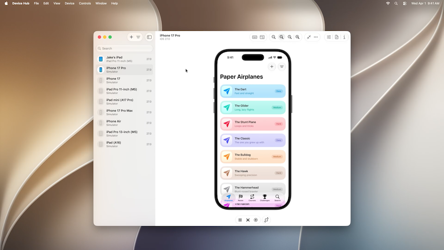

### **Refining apps**

#### Localization

* Agent can setup localization
    * The agent reads through code, ensures string literals are ready for localizable references, and creates a String Catalog containing every UI string
    * Can also provide translations based on app content
* Can add languages using the plus button on the bottom left of the Strings catalog
    * New `Generate Translations` button in Xcode 27 uses the agent to add new localizations

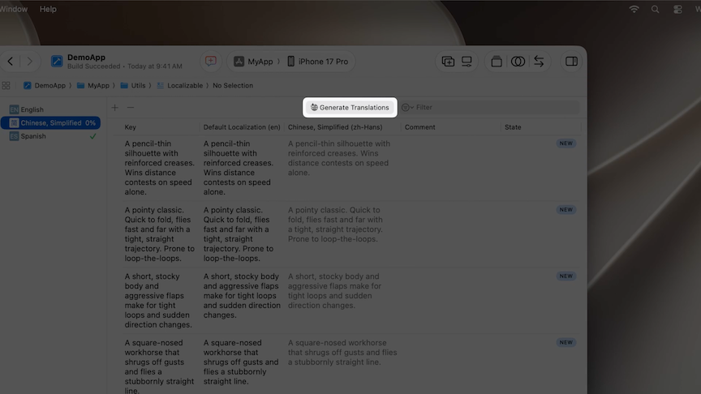

* Users can provide translation feedback in TestFlight
* Localization tips
    * Ask agent to ensure strings are localizable
    * Start with one or two languages
    * Test the app and get feedback
* [Translate your app using agents in Xcode](https://developer.apple.com/videos/play/wwdc2026/213/) session
* [Code-along: Explore localization with Xcode](https://developer.apple.com/videos/play/wwdc2025/225/) session from WWDC 2025

#### Organizer

* Insights overview redesigned
    * The Overview page puts diagnostics and metrics in the same view
        * The spike in the metric chart shows something needs attention, the diagnostics below show where in the code to start looking; one screen, instead of jumping between two

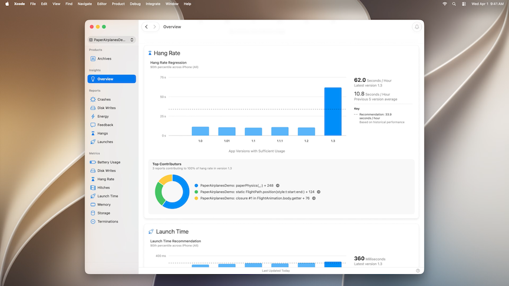

* New metrics for storage and hitches
    * New storage metric to show how much space an app and an app's data have been taking up
        * The metric breaks down documents, data, and binary size
    * New hitches metric surfaces issues in more places than scrolling, like understanding how apps use Liquid Glass and SwiftUI views
        * The updated metric gives me a more complete picture, including animations the old one missed

Storage                                      | Hitches
---------------------------------------------|--------------
 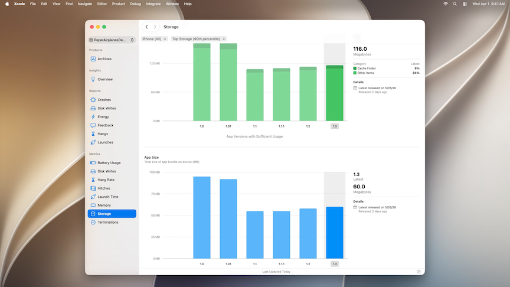 | 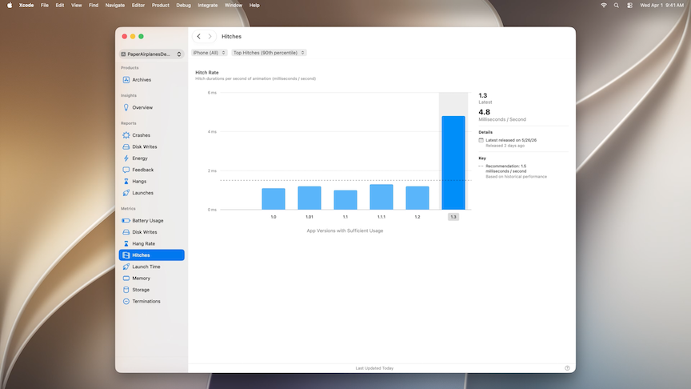

* Improved Metric Goals
    * Xcode 26 introduced app recommendations, these have been expanded to Metric Goals
    * Expanded to new metrics
        * Hang rate, disk writes, battery, storage, hitches
    * Goals are calibrated to your app, compared with similar apps based on what the app actually does
        * Comparisons include app's own historical baselines
* Guided Performance Analysis
    * From the Organizer, click Generate Recommendations, and the agent will work through diagnostic data with you

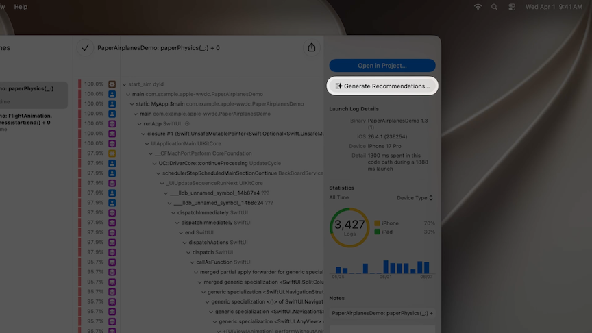

#### Instruments

* Top functions makes the patterns jump out faster
    * Once you have an Instruments recording, you can use the Top Functions button to see what functions are being called the most
    * Helps find performance problems that arise due to expensive operations that are performed many times

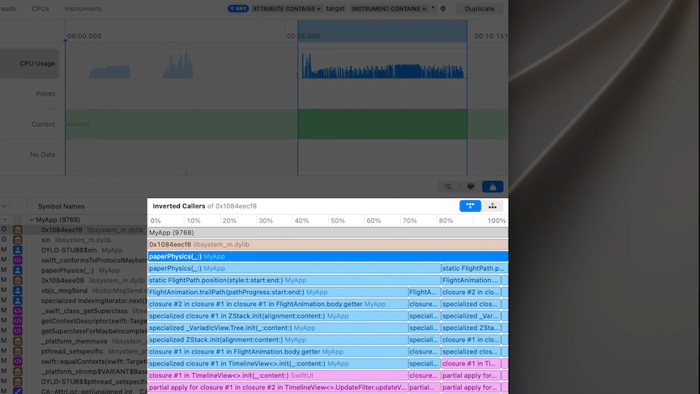

* [Debug and profile agentic app experiences with Instruments](https://developer.apple.com/videos/play/wwdc2026/243/) session
* [Profile, fix, and verify: Improve app responsiveness with Instruments](https://developer.apple.com/videos/play/wwdc2026/268/) session

#### Xcode Cloud

* Simplified setup
    * Only have to verify app and developer team, then connect to remote source code repository
* [Build, deliver, and automate with Xcode Cloud](https://developer.apple.com/videos/play/wwdc2026/261/) session
* [Extend your Xcode Cloud workflows](https://developer.apple.com/videos/play/wwdc2024/10200/) session from WWDC 24
